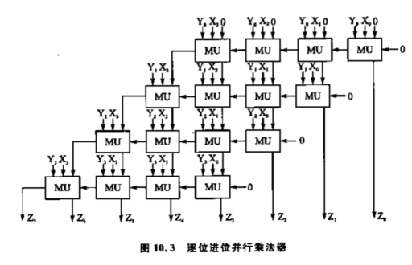
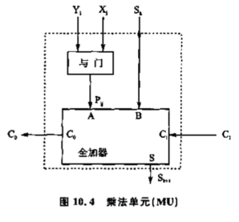
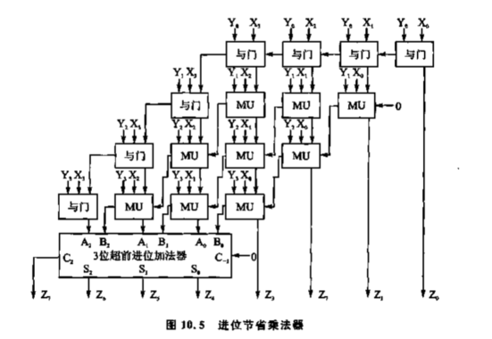

## bin2bcd

### 原理

16进制逢16进1,10进制逢10进1

为了节省空间，移位加三法采用逢5进3

将二进制`11111111`(0xff)转为bcd的过程

```
0000 0000 0000 | 1111 1111
0000 0000 0001 | 1111 1110		移位
0000 0000 0011 | 1111 1100		移位
0000 0000 0111 | 1111 1000		移位，此时0111大于等于5，需进3
0000 0000 1010 | 1111 1000
0000 0001 0101 | 1111 0000		移位，此时0101大于等于5，需进3
0000 0001 1000 | 1111 0000
0000 0011 0001 | 1110 0000		移位
0000 0110 0011 | 1100 0000		移位，此时0110大于等于5，需进3
0000 1001 0011 | 1100 0000
0001 0010 0111 | 1000 0000		移位，此时0111大于等于5，需进3
0001 0010 1010 | 1000 0000
0010 0101 0101 | 0000 0000		移位，最后一次移位不做加3判断
```

实际上相当于模拟了十进制的进位方法计算了二进制数的值，因为每次移位相当于乘2，实际上如果用逢10进6的思想转换应该是这样的

```
0000 0000 0000 | 1111 1111
0000 0000 0001 | 1111 1110		移位
0000 0000 0011 | 1111 1100		移位
0000 0000 0111 | 1111 1000		移位
0000 0000 1111 | 1111 0000		移位，此时1111大于等于10，需进6
0000 0001 0101 | 1111 0000
0000 0010 1011 | 1110 0000		移位，此时1011大于等于10，需进6
0000 0011 0001 | 1110 0000
0000 0110 0011 | 1100 0000		移位
0000 1100 0111 | 1000 0000		移位，此时1100大于等于10，需进6
0001 0010 0111 | 1000 0000
0010 0100 1111 | 0000 0000		移位，此时1111大于等于10，需进6
0010 0101 0101 | 0000 0000
```

有个很明显的区别就是最后一次移位也执行了进位，这是因为对于逢5进3来说，能进行这种优化是因为每次逢5进3后下一步操作（移位）都是相当于乘了2，而对于最后一次移位没有下次的乘2步骤，因此不进位

总的来说，逢5进3的方法节省了一位加法器

### 实现

#### 1

有一个很强很简洁（但资源耗费较多）的[实现](https://github.com/AmeerAbdelhadi/Binary-to-BCD-Converter/blob/master/bin2bcd.v)

```verilog
////////////////////////////////////////////////////////////////////////////////////
//                                 18-bit Example                                 //
//                                                                                //
//                     B  B  B  B  B  B  B  B  B  B  B  B  B  B  B  B  B  B       //
//                     I  I  I  I  I  I  I  I  I  I  I  I  I  I  I  I  I  I       //
//                     N  N  N  N  N  N  N  N  N  N  N  N  N  N  N  N  N  N       //
//                     1  1  1  1  1  1  1  1  9  8  7  6  5  4  3  2  1  0       //
//     '0 '0 '0 '0 '0  7  6  5  4  3  2  1  0  |  |  |  |  |  |  |  |  |  |       //
//      |  |  |  |  |  |  |  |  |  |  |  |  |  |  |  |  |  |  |  |  |  |  |       //
//      |  |  |  |  V__V__V__V  |  |  |  |  |  |  |  |  |  |  |  |  |  |  |       //
//      |  |  |  | /IF>4THEN+3\ |  |  |  |  |  |  |  |  |  |  |  |  |  |  |       //
//      |  |  |  | \__________/ |  |  |  |  |  |  |  |  |  |  |  |  |  |  |       //
//      |  |  |  |  |  |  |  |  |  |  |  |  |  |  |  |  |  |  |  |  |  |  |       //
//      |  |  |  |  |  V__V__V__V  |  |  |  |  |  |  |  |  |  |  |  |  |  |       //
//      |  |  |  |  | /IF>4THEN+3\ |  |  |  |  |  |  |  |  |  |  |  |  |  |       //
//      |  |  |  |  | \__________/ |  |  |  |  |  |  |  |  |  |  |  |  |  |       //
//      |  |  |  |  |  |  |  |  |  |  |  |  |  |  |  |  |  |  |  |  |  |  |       //
//      |  |  |  |  |  |  V__V__V__V  |  |  |  |  |  |  |  |  |  |  |  |  |       //
//      |  |  |  |  |  | /IF>4THEN+3\ |  |  |  |  |  |  |  |  |  |  |  |  |       //
//      |  |  |  |  |  | \__________/ |  |  |  |  |  |  |  |  |  |  |  |  |       //
//      |  |  |  |  |  |  |  |  |  |  |  |  |  |  |  |  |  |  |  |  |  |  |       //
//      |  |  |  V__V__V__V  V__V__V__V  |  |  |  |  |  |  |  |  |  |  |  |       //
//      |  |  | /IF>4THEN+3\/IF>4THEN+3\ |  |  |  |  |  |  |  |  |  |  |  |       //
//      |  |  | \__________/\__________/ |  |  |  |  |  |  |  |  |  |  |  |       //
//      |  |  |  |  |  |  |  |  |  |  |  |  |  |  |  |  |  |  |  |  |  |  |       //
//      |  |  |  |  V__V__V__V  V__V__V__V  |  |  |  |  |  |  |  |  |  |  |       //
//      |  |  |  | /IF>4THEN+3\/IF>4THEN+3\ |  |  |  |  |  |  |  |  |  |  |       //
//      |  |  |  | \__________/\__________/ |  |  |  |  |  |  |  |  |  |  |       //
//      |  |  |  |  |  |  |  |  |  |  |  |  |  |  |  |  |  |  |  |  |  |  |       //
//      |  |  |  |  |  V__V__V__V  V__V__V__V  |  |  |  |  |  |  |  |  |  |       //
//      |  |  |  |  | /IF>4THEN+3\/IF>4THEN+3\ |  |  |  |  |  |  |  |  |  |       //
//      |  |  |  |  | \__________/\__________/ |  |  |  |  |  |  |  |  |  |       //
//      |  |  |  |  |  |  |  |  |  |  |  |  |  |  |  |  |  |  |  |  |  |  |       //
//      |  |  V__V__V__V  V__V__V__V  V__V__V__V  |  |  |  |  |  |  |  |  |       //
//      |  | /IF>4THEN+3\/IF>4THEN+3\/IF>4THEN+3\ |  |  |  |  |  |  |  |  |       //
//      |  | \__________/\__________/\__________/ |  |  |  |  |  |  |  |  |       //
//      |  |  |  |  |  |  |  |  |  |  |  |  |  |  |  |  |  |  |  |  |  |  |       //
//      |  |  |  V__V__V__V  V__V__V__V  V__V__V__V  |  |  |  |  |  |  |  |       //
//      |  |  | /IF>4THEN+3\/IF>4THEN+3\/IF>4THEN+3\ |  |  |  |  |  |  |  |       //
//      |  |  | \__________/\__________/\__________/ |  |  |  |  |  |  |  |       //
//      |  |  |  |  |  |  |  |  |  |  |  |  |  |  |  |  |  |  |  |  |  |  |       //
//      |  |  |  |  V__V__V__V  V__V__V__V  V__V__V__V  |  |  |  |  |  |  |       //
//      |  |  |  | /IF>4THEN+3\/IF>4THEN+3\/IF>4THEN+3\ |  |  |  |  |  |  |       //
//      |  |  |  | \__________/\__________/\__________/ |  |  |  |  |  |  |       //
//      |  |  |  |  |  |  |  |  |  |  |  |  |  |  |  |  |  |  |  |  |  |  |       //
//      |  V__V__V__V  V__V__V__V  V__V__V__V  V__V__V__V  |  |  |  |  |  |       //
//      | /IF>4THEN+3\/IF>4THEN+3\/IF>4THEN+3\/IF>4THEN+3\ |  |  |  |  |  |       //
//      | \__________/\__________/\__________/\__________/ |  |  |  |  |  |       //
//      |  |  |  |  |  |  |  |  |  |  |  |  |  |  |  |  |  |  |  |  |  |  |       //
//      |  |  V__V__V__V  V__V__V__V  V__V__V__V  V__V__V__V  |  |  |  |  |       //
//      |  | /IF>4THEN+3\/IF>4THEN+3\/IF>4THEN+3\/IF>4THEN+3\ |  |  |  |  |       //
//      |  | \__________/\__________/\__________/\__________/ |  |  |  |  |       //
//      |  |  |  |  |  |  |  |  |  |  |  |  |  |  |  |  |  |  |  |  |  |  |       //
//      |  |  |  V__V__V__V  V__V__V__V  V__V__V__V  V__V__V__V  |  |  |  |       //
//      |  |  | /IF>4THEN+3\/IF>4THEN+3\/IF>4THEN+3\/IF>4THEN+3\ |  |  |  |       //
//      |  |  | \__________/\__________/\__________/\__________/ |  |  |  |       //
//      |  |  |  |  |  |  |  |  |  |  |  |  |  |  |  |  |  |  |  |  |  |  |       //
//      V__V__V__V  V__V__V__V  V__V__V__V  V__V__V__V  V__V__V__V  |  |  |       //
//     /IF>4THEN+3\/IF>4THEN+3\/IF>4THEN+3\/IF>4THEN+3\/IF>4THEN+3\ |  |  |       //
//     \__________/\__________/\__________/\__________/\__________/ |  |  |       //
//      |  |  |  |  |  |  |  |  |  |  |  |  |  |  |  |  |  |  |  |  |  |  |       //
//      |  V__V__V__V  V__V__V__V  V__V__V__V  V__V__V__V  V__V__V__V  |  |       //
//      | /IF>4THEN+3\/IF>4THEN+3\/IF>4THEN+3\/IF>4THEN+3\/IF>4THEN+3\ |  |       //
//      | \__________/\__________/\__________/\__________/\__________/ |  |       //
//      |  |  |  |  |  |  |  |  |  |  |  |  |  |  |  |  |  |  |  |  |  |  |       //
//      |  |  V__V__V__V  V__V__V__V  V__V__V__V  V__V__V__V  V__V__V__V  |       //
//      |  | /IF>4THEN+3\/IF>4THEN+3\/IF>4THEN+3\/IF>4THEN+3\/IF>4THEN+3\ |       //
//      |  | \__________/\__________/\__________/\__________/\__________/ |       //
//      |  |  |  |  |  |  |  |  |  |  |  |  |  |  |  |  |  |  |  |  |  |  |       //
//      B  B  B  B  B  B  B  B  B  B  B  B  B  B  B  B  B  B  B  B  B  B  B       //
//      C  C  C  C  C  C  C  C  C  C  C  C  C  C  C  C  C  C  C  C  C  C  C       //
//      D  D  D  D  D  D  D  D  D  D  D  D  D  D  D  D  D  D  D  D  D  D  D       //
//      2  2  2  1  1  1  1  1  1  1  1  1  1  9  8  7  6  5  4  3  2  1  0       //
//      2  1  0  9  8  7  6  5  4  3  2  1  0                                     //
//     \_______/\__________/\__________/\__________/\__________/\__________/      //
//     100,000's  10,000's     1000's      100's        10's         1's          //
//                                                                                //
////////////////////////////////////////////////////////////////////////////////////

module bin2bcd
 #( parameter                W = 18)  // input width
  ( input      [W-1      :0] bin   ,  // binary
    output reg [W+(W-4)/3:0] bcd   ); // bcd {...,thousands,hundreds,tens,ones}

  integer i,j;

  always @(bin) begin
    for(i = 0; i <= W+(W-4)/3; i = i+1) bcd[i] = 0;     // initialize with zeros
    bcd[W-1:0] = bin;                                   // initialize with input vector
    for(i = 0; i <= W-4; i = i+1)                       // iterate on structure depth
      for(j = 0; j <= i/3; j = j+1)                     // iterate on structure width
        if (bcd[W-i+4*j -: 4] > 4)                      // if > 4
          bcd[W-i+4*j -: 4] = bcd[W-i+4*j -: 4] + 4'd3; // add 3
  end

endmodule
```

#### 2

```verilog
/////////////////////////////////////////////////////////////////////////////////////////////////////
// bin2bcd20
//   _______        _______        _______        _______        _______        _______        
// / BIN2BCD \ -- / BIN2BCD \ -- / BIN2BCD \ -- / BIN2BCD \ -- / BIN2BCD \ -- / BIN2BCD \ --num[0:19]
// \ _______ /    \ _______ /    \ _______ /    \ _______ /    \ _______ /    \ _______ /
//    ||||           ||||           ||||           ||||           ||||            ||||
//
// BIN2BCD
//            __________
//  cout -- / reg[     ] \ -- cin
//         |  if > 4      |
//          \    adder   /
/////////////////////////////////////////////////////////////////////////////////////////////////////

//bin2bcd.v
module bin2bcd(clk, reset_n, c_in, c_out, num_out);
parameter bitwise = 4;

input clk;
input reset_n;
input c_in;
output c_out;
output reg [0:bitwise-1] num_out;

wire [0:bitwise-1] shift;

assign shift = {num_out[1:bitwise-1], c_in};
assign c_out = num_out[0];


always@(posedge clk, negedge reset_n)
begin
	if(~reset_n)
		begin
			num_out <= 0;
		end
	else
		begin
				if( shift < 5 )
					num_out <= shift;
				else
					num_out <= shift + 4'd3;
		end
end
endmodule


//bin2bcd20.v
module bcd2bin20(clk, reset_n, num_in, ready, num_out);
input clk;
input reset_n;
input [0:19] num_in;
output reg ready;
output reg [0:23] num_out;

wire ci1;
wire ci2;
wire ci3;
wire ci4;
wire ci5;
wire ci6;
wire counter_clk;
wire [0:18] shift;
wire [0:24] num_wire;

reg bin2bcd_reset;
reg [0:2] state;
reg [0:5] i;
reg [0:19] num;

assign shift = num[1:19];
assign ci1 = num[0];
assign num_wire[24] = num[0];
bin2bcd b1(.clk(clk), .reset_n(bin2bcd_reset), .c_in(ci1), .c_out(ci2), .num_out(num_wire[20:23]));
bin2bcd b2(.clk(clk), .reset_n(bin2bcd_reset), .c_in(ci2), .c_out(ci3), .num_out(num_wire[16:19]));
bin2bcd b3(.clk(clk), .reset_n(bin2bcd_reset), .c_in(ci3), .c_out(ci4), .num_out(num_wire[12:15]));
bin2bcd b4(.clk(clk), .reset_n(bin2bcd_reset), .c_in(ci4), .c_out(ci5), .num_out(num_wire[8:11]));
bin2bcd b5(.clk(clk), .reset_n(bin2bcd_reset), .c_in(ci5), .c_out(ci6), .num_out(num_wire[4:7]));
bin2bcd b6(.clk(clk), .reset_n(bin2bcd_reset), .c_in(ci6), .c_out(   ), .num_out(num_wire[0:3]));

always@(posedge clk)
begin
	if(~reset_n)
		begin
			num <= 0;
			num_out <= 0;
			ready <= 0;
			i <= 18;
			bin2bcd_reset <= 0;
		end
	else
		begin
			case(state)
				2'b00:
					begin
						ready <= 0;
						num <= num_in;
						i <= 18;
						bin2bcd_reset <= 1;
					end
				2'b01:								//shift 19 rounds
					begin
						i <= i - 5'b1;
						num <= {shift, 1'b0};
					end
				2'b10:
					begin
						ready <= 1;
						num_out <= num_wire[1:24];
						bin2bcd_reset <= 0;
					end
			endcase
		end
end

always@(posedge clk)
begin
	if(~reset_n)
		state <= 0;
	else
		begin
			case(state)
				2'b00: state <= 2'b01;
				2'b01:
					begin
						if(i==0)
							state <= 2'b10;
						else
							state <= 2'b01;
					end
				2'b10: state <= 0;
			endcase
		end
end
endmodule

```

## 加法器

https://www.pianshen.com/article/338251058/

### 串行加法器

```
对于第i位全加器，输入Ai，Bi，输出Fi，Ci（进位），则
Fi = Ai ^ Bi ^ Ci-1
Ci+1 = (Ai & Bi) + (Ai & Ci)  + (Bi & Ci)

令Pi = Ai ^ Bi， Gi = Ai & Bi，则因为
Ci+1 = AiBiCi + AiBi~Ci + AiBiCi + Ai~BiCi + AiBiCi + ~AiBiCi
     = AiBiCi + AiBi~Ci + Ai~BiCi + ~AiBiCi
Gi = AiBiCi + AiBi~Ci
Pi = Ai~BiCi + Ai~Bi~Ci + ~AiBiCi + ~AiBi~Ci
则
Ai~BiCi + ~AiBiCi = Pi & Ci   (~Ci & Ci = 0)
所以
Ci+1 = Gi + PiCi
```

设一次逻辑运算的时延为1，则对于2位全加器，有

```
C1 = G0 + P0C0   #3   1: G0 P0   2: T0 = P0&C0   3: C1 = G0+T0
C2 = G1 + P1C1   #3+#3  因为只有上一次结果正确后C2的输出才正确
```

因此时延为n*3

### 超前进位加法器

```
因为 Ci+1 = Gi + PiCi
而   Ci = Gi-1 + Pi-1Ci-1
所以 Ci+1 = Gi + Pi(Gi-1 + Pi-1Ci-1) = Gi + PiGi-1 + PiPi-1Ci-1
以此类推
```

举例：4位超前进位加法器

```
C1 = G0 + P0C0
C2 = G1 + P1G0 + P1P0C0
C3 = G2 + P2G1 + P2P1G0 + P2P1P0C0
C4 = G3 + P3G2 + P3P2G1 + P3P2P1G0 + P3P2P1P0C0
```

若有多输入与/或门，计算的时延便不会随位数增加而累加


### verilog实现

简单的+

## 乘法器

### 快速乘法器

```
			      X3    X2    X1    X0
			      Y3    Y2    Y1    Y0
                  Y0X3  Y0X2  Y0X1  Y0X0
            Y0X3  Y0X2  Y0X1  Y0X0
      Y0X3  Y0X2  Y0X1  Y0X0
Y0X3  Y0X2  Y0X1  Y0X0
```



每个MU为一个全加器和一个与门



最大时延为 8个全加器+1个与门

### 进位节省乘法器

因为最外围的几次运算其实根本不需要进位，所以直接用与门代替

直接向下一级的前一位加法器进位与向同级的前一位加法器进位是等价的（因为同级的前一个加法器最后一样要加到下一级的前一位加法器），且该设计有利于使用超前进位加法器



最大时延为 1与门+3全加器+超前进位加法器

### booth乘法器

#### 二进制乘法的特点

注意到在二进制乘法运算中有这样的事实

```
      11010
      10001
--------------
      11010
  11010
--------------
  110111010
```

乘数当前位为1时，产生一个部分积，当前位为0时，不产生部分积，且下一个部分积是原本当前部分积左移一位

因此乘数的1个数越少，产生的部分积越少，需要的运算也越少

#### 部分积由多到少的转换

当存在连续的1时，有

```
0111110 = 1000000 - 0000010
0111001 = 1000001 - 0001000
```

可以将连续的长串1转化为1较少的串

#### booth与补码

##### 关于补码

```
对于正数
y = 2^n-1 * yn-1 + 2^n-2 * yn-2 + ... + 2^1 * y1 + y0
对于负数
y = - ( 2^n-1 * yn-1 + 2^n-2 * yn-2 + ... + 2^1 * y1 + y0 )
在补码的设计中，若有 x = -y，则必有 x+y = 0， 所以
x+y = (2^n-1 * xn-1 + 2^n-2 * xn-2 + ... + 2^1 * x1 + x0) + 
      (2^n-1 * yn-1 + 2^n-2 * yn-2 + ... + 2^1 * y1 + y0)
    = 1000...000
其中1在第n+1位出现（如果从1开始计位数）
注意到若yi=~xi，结果为1111...111，因此转换方法为取反+1
```

##### booth编码

``` 
对于补码，其实可以看做如下形式
y = -2^n-1*yn-1 + 2^n-2 * yn-2 + 2^n-3 * yn-3 + ... + 2^1 * y1 + y0
注意这里的n-1位是符号位，若符号位为1（负数）则减去2^n-1，若为0则为普通的正数，也就是说，与其他位的权值不同，第k位的权值为2^k-1，而符号位的权值为-2^k-1（若第k位为符号位）
有如下的等价形式
y = 2^n-1(-yn-1 + yn-2) + 2^n-2(-yn-2 + yn-3) + ... + 2^2(-y2 + y1) + 2^1(-y1 + y0) + 2^0(-y0)
和另一种等价形式
y = 2^n-2(-2yn-1 + yn-2 + yn-3) + 2^n-4(-2yn-3 + yn-4 + yn-5) + ... + 2^1(-2y2 + y1 + y0)
```

## state machine

### 状态机设计

#### 普通


注意这里的K1和K2在转换时只会置位一周期，此后便置0

```verilog
module fsm(clk, reset, A, K1, K2);
    input clk, reset, A;
    output reg K1, K2;
	
    reg [0:1] state;
    parameter idle = 2'b00, start = 2'b01, stop = 2'b10, clear = 2'b11;
    
    always@(posedge clk)
	begin
        if(!reset)
            state <= idle;
        	K1 <= 0;
        	K2 <= 0;
        else
            begin
                case(state)
                	idle:
                        if(A) begin
                            state <= start;
                        	K1 <= 0;
                        end
                    	else begin
                        	state <= idle;
                            K1 <= 0;
                            K2 <= 0;
                        end
                    start:
                        if(~A) begin
                        	state <= stop;
                        end
                    	else begin
                        	state <= start;
                        end
                    stop:
                        if(A) begin
                        	state <= clear;
                            K2 <= 1;
                        end
                    	else begin
                            state <= stop;
                            K1 <= 0;
                            K2 <= 0;
                        end
                    clear:
                        if(~A) begin
                           state <= idle;
                            K1 <= 1;
                            K2 <= 0;
                        end
                    	else begin
                           state <= clear;
                            K1 <= 0;
                            K2 <= 0;
                        end
                    default:
                        state <= idle;
                endcase
            end
    end
endmodule
```

#### 由状态码表示输出

用于高速设计，可以节省资源，但是开关维持的时间必须与状态维持时间一致，且在状态切换时需要有一个单独的状态（因为一些状态在切换时，K1和或K2会置高一周期，此后又会置低）。

这里的例子中，使用state[0]和state[1]作为输出

```verilog
module fsm(clk, reset, A, K1, K2);
    input clk, reset, A;
    output K1, K2;

    reg [0:4] state;
    parameter idle = 5'b00000,
    		start = 5'b00001,
    		stop = 5'b00010,
    		stop2clear = 5'b01011,
    		clear = 5'b00100,
    		clear2idle = 5'b10101;
    
    assign K1 = state[0];
    assign K2 = state[1];
    
    always@(posedge clk)
        begin
            if(~reset)
                begin
                	state <= idle;
                end
            else
                begin
                    case(state)
                        idle:
                            if(A) begin
                        		state <= start;
                        	end
                       		else begin
                            	state <= idle;
                            end
                        start:
                            if(~A) begin
                            	state <= stop;
                            end
                        	else begin
                            	state <= start;
                            end
                        stop:
                            if(A) begin
                            	state <= stop2clear;
                            end
                        	else begin
                               	state <= stop; 
                            end
                        stop2clear:
                            state <= clear;
                        clear:
                            if(~A) begin
                            	state <= clear2idle
                            end
                        	else begin
                            	state <= clear;
                            end
                        clear2idle:
                            state <= idle;
                        default:
                            state <= idle;
                    endcase
                end
        end
    
endmodule
```

#### 多段式状态机设计风格

此处一个always块专门用于状态切换，K1和K2分别对应一个独立的always块

```verilog
module fsm(clk, reset, A, K1, K2);
	input clk, reset, A;
    output K1, K2;
    
    reg [0:1] state, nextstate;
    parameter idle = 2'b00, start = 2'b01, stop = 2'b10, clear = 2'b11;
    
    always@(posedge clk)
        begin
            if(~reset)
                state <= idle;
            else
                state <= nextstate;
        end
    
    always@(state, A)
        begin
            case(state)
            	idle:
                    if(A)
                        nextstate = start;
                	else
                        nextstate = idle;
                start:
                    if(~A)
                        nextstate = stop;
                	else
                        nextstate = start;
                stop:
                    if(A)
                        nextstate = clear;
                	else
                        nextstate = stop;
                clear:
                    if(~A)
                        nextstate = idle;
                	else
                        nextstate = clear;
                default:
                    	nextstate = 2'bxx;
            endcase
        end
    
    always@(reset, A, state)
        begin
            if(~reset)
                K1 = 0;
            else
                begin
                    if(state == clear && !A)
                        K1 = 1;
                    else
                        K1 = 0;
                end
        end
    
    always@(reset, A, state)
        begin
            if(~reset) 
                K2 = 0;
            else
                begin
                    if(state == stop && A)
                        K2 = 1;
                    else
                        K2 = 0;
                end
        end
        
endmodule
```

### 状态编码

#### 普通

#### 独热码

如0001 0010 0100 1000表示4种状态，缺点是需要消耗多余的寄存器，但fpga寄存器资源多，而独热码译码逻辑简单，所以经常使用

## 8位带进位加法器

```verilog
module adder_8(cout, sum, a, b, cin);
	output cout;
    output [0:7] sum;
    input cin;
    input [0:7] a, b;
    
    assign {cout, sum} = a + b + cin;
endmodule
```

## 指令译码电路

```verilog
`define plus	3'd0
`define minus	3'd1
`define band	3'd2
`define bor		3'd3
`define unegate	3'd4

module alu(out, opcode, a, b);
    input [2:0] opcode;
    input [7:0] a, b;
    output reg [7:0] out;
    
    always@(opcode, a, b)
        begin
            case(opcode)
                `plus: 		out = a + b;
                `minus: 	out = a - b;
                `band:		out = a & b;
                `bor:		out = a | b;
                `unegate:	out = ~a;
                default:	out = 8'hx;
            endcase
        end
endmodule
```

##排序电路 使用task

```verilog
module sort4(ra, rb, rc, rd, a, b, c, d);
    parameter t = 3;
    input [t:0] a, b, c, d;
    output reg [t:0] ra, rb, rc, rd;
    
    always@(a, b, c, d)
        begin: local
            reg [t:0] va, vb, vc, vd;
            {va, vb, vc, vd} = {a, b, c ,d};
            sort2(va, vc);
            sort2(vb, vd);
            sort2(va, vb);
            sort2(vb, vc);
            sort2(vc, vd);
            {ra, rb, rc, rd} = {va, vb, vc, vd};
        end
    
    task sort2:
        inout [t:0] x, y;
        reg [t:0] tmp;
        if(x<y)
            begin
                tmp = x;
                x = y;
                y = tmp;
            end
    endtask
endmodule
```

### 13.6 8-3编码器 使用for

```verilog
module encoder(none_on, out ,in)
    input [7:0] in;
    output reg none_on;
    output reg [2:0] out;
    
    integer i;
    
    always@(*)
        begin
            out = 0;
            none_on = 1;
            for(i=0; i<8; i=i+1)
                begin
                    if(in[i])
                        begin
                        	out = i;
                        	none_on = 0;
                        end
                end
        end
    
endmodule
```

### 13.9 三态输出驱动器

#### 描述实现

```verilog
module trist1(out, in, enable);
    input in, enable;
    output out;
    
    always@(*)
        begin
           	out = enable? in: 1'bz; 
        end
endmodule
```

#### 原语实现

```verilog
module trist2(out, in, enable);
   	input in, enable;
    output out;
    
    bufifl mybuf(out, in, enable);
endmodule
```

### 13.10 三态双向驱动器

```verilog
module bidir(tri_inout, out, in, en, b);
    inout tri_inout;
    input in, en, b;
    output out;
    
    assign tri_inout = en? in : 1'bz;	//注意这里的in是给三态门的输出端赋的值
    assign out = tri_inout ^ b;			//这是三态门读入外部值的端口
    								//这里的b似乎是用于控制三态门是否反向输出
endmodule
```

