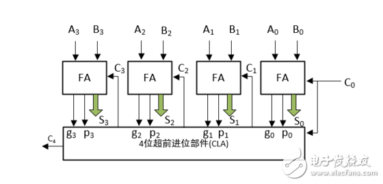
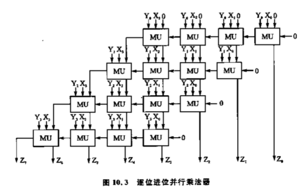
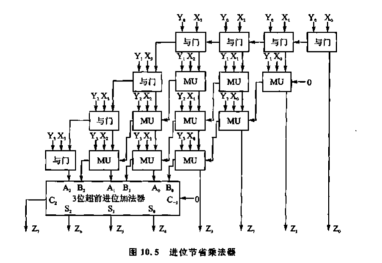
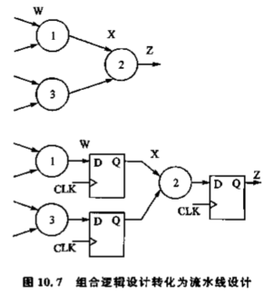
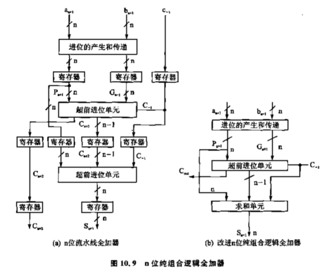
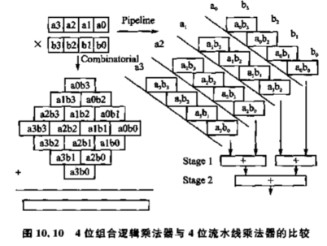
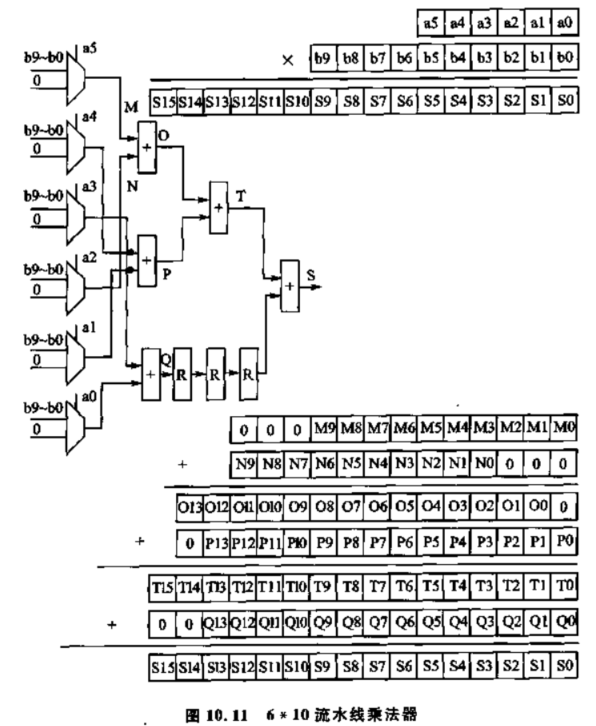
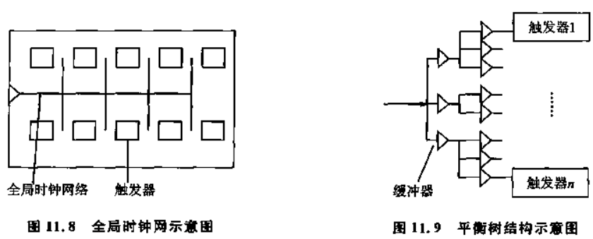
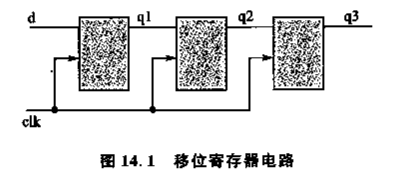

# Verilog数字系统设计教程

## Verilog语法

### 模块

```verilog
module xxx(
	a,
    b,
    c,
    d
);			//声明模块
    input a;
    input [15:0] b;
    output c;
    inout d;

    wire wa;	//信号线
    wire wb;
    reg ra;		//寄存器
	tri ta;		//三态信号线
    
endmodule
```

### 常量和变量

#### 数字

这里的n位都是指2^n，默认为32位

* n'b00000  n位二进制数
* n'd00000  n位十进制数
* n'h00000  n位16进制数
* n'o00000  n位8进制数

x和z

* x  不定值
* z  高阻值，也可以写作?

负数，-写在最前面

* -8'd5

_ 可以分隔数字增加可读性

#### 参数

##### parameter

parameter a=1,b=2;

假设module有参数，可以在实例化时指定参数

```verilog
module test(a,b);
    parameter A=1,B=2;
...
endmodule

//实例化
test #(3,4) t1;
```

##### defparam

```verilog
module Test;
    Top T();
endmodule

module Top;
    Block B1();
    Block B2();
endmodule

module Block;
    Parameter P=0;
endmodule

module Annotate;
    defparam
    	Test.T.B1.P = 1;
    	Test.T.B2.P = 2;
endmodule
```

### 变量

#### wire/tri

* wire 单驱动源
* tri  多驱动源

当两个信号冲突时的真值表

| wire/tri | 0    | 1    | x    | z    |
| -------- | ---- | ---- | ---- | ---- |
| 0        | 0    | x    | x    | 0    |
| 1        | x    | 1    | x    | 1    |
| x        | x    | x    | x    | x    |
| z        | 0    | 1    | x    | z    |

#### reg

注意：reg型只表示被定义的信号将用在always块内，不一定对应触发器

**注意字节顺序**

```verilog
reg [0:15] mem;
```

**这里的LSB是mem[15]，MSB是mem[0]**

#### memory

```verilog
reg [x:0] mem[y:0];	//定义
mem[n] <= x'b0000;	//赋值
```

### 端口

#### input

#### output

#### inout

inout多驱动源时的真值表

| 驱动源 | 0    | 1    | X    | Z    |
| ------ | ---- | ---- | ---- | ---- |
| 0      | 0    | X    | X    | 0    |
| 1      | X    | 1    | X    | 1    |
| X      | X    | X    | X    | X    |
| Z      | 0    | 1    | X    | Z    |

**可以看出，若要将inout端口作为输入口，应给其赋值Z**

### 运算符

#### 算术

* +
* -
* *
* /
* %

#### 位运算

* ~
* &
* |
* ^
* ^~  同或（异或非）

| ~    | res  |
| ---- | ---- |
| 1    | 0    |
| 0    | 1    |
| x    | x    |

| &    | 0    | 1    | x    |
| ---- | ---- | ---- | ---- |
| 0    | 0    | 0    | 0    |
| 1    | 0    | 1    | x    |
| x    | 0    | x    | x    |

| \|   | 0    | 1    | x    |
| ---- | ---- | ---- | ---- |
| 0    | 0    | 1    | x    |
| 1    | 1    | 1    | 1    |
| x    | x    | 1    | x    |

| ^    | 0    | 1    | x    |
| ---- | ---- | ---- | ---- |
| 0    | 0    | 1    | x    |
| 1    | 1    | 0    | x    |
| x    | x    | x    | x    |

| ^~   | 0    | 1    | x    |
| ---- | ---- | ---- | ---- |
| 0    | 1    | 0    | x    |
| 1    | 0    | 1    | x    |
| x    | x    | x    | x    |

#### 逻辑

* &&
* ||
* ！

#### 关系

* <
* \>
* <=
* \>=
* ==
* !=
* ===  对x和z也进行比较
* !==

#### 移位

* <<
* \>\>

#### 位拼接

```verilog
{a,b[3],b[2],b[1],b[0],w,1'b1,1'b0,1'b1}
//等同于
{a,b[3:0],w,3'b101}

//重复法
{4{w}}  //等同于 {w,w,w,w}
//嵌套法
{b,{3{a,b}}} //等同于{b,a,b,a,b,a,b}
```

#### 缩减运算

```verilog
reg [3:0] B;
reg c;

c = &B;	//等同于
c = B[3] & B[2] & B[1] & B[0];
```

### 赋值

#### 非阻塞

<=

#### 阻塞

=

### 块语句

#### 顺序块

语句按顺序执行

```verilog
begin:label
   ...
end
```

#### 并行块

语句同时执行

```verilog
fork:label
    ...
join
```

**注意，命名的块可以被其他模块调用，包括被disable**

#### disable

```verilog
begin:block1
    while(i<16)
    begin
        if(flag[i])
        begin
            $display("A");
            disable block1;
        end
        i = i+1
    end
end
```

### 条件语句

#### if

```verilog
if()
    ...
else if()
    ...
else
    ...
```

#### case

```verilog
case(x)
    x'b00: ...;
    x'b01: ...;
    x'b10: ...;
    x'b11: ...;
    default: ...;
endcase
```

**注意，存在casex和casez，真值表如下**

| case | 0    | 1    | x    | z    |
| ---- | ---- | ---- | ---- | ---- |
| 0    | 1    | 0    | 0    | 0    |
| 1    | 0    | 1    | 0    | 0    |
| x    | 0    | 0    | 1    | 0    |
| z    | 0    | 0    | 0    | 1    |

| casez | 0    | 1    | x    | z    |
| ----- | ---- | ---- | ---- | ---- |
| 0     | 1    | 0    | 0    | 1    |
| 1     | 0    | 1    | 0    | 1    |
| x     | 0    | 0    | 1    | 1    |
| z     | 1    | 1    | 1    | 1    |

| casex | 0    | 1    | x    | z    |
| ----- | ---- | ---- | ---- | ---- |
| 0     | 1    | 0    | 1    | 1    |
| 1     | 0    | 1    | 1    | 1    |
| x     | 1    | 1    | 1    | 1    |
| z     | 1    | 1    | 1    | 1    |

### 循环语句

#### forever

用于产生testbench波形，**必须写在initial块中**

#### repeat

计数循环

```verilog
repeat(n)
begin
    ...
end
```

#### while

条件循环

```verilog
while(expr)
begin
    ...
end
```

#### for

与C语言for相同

```verilog
for(;;)
```

### 生成块

#### 循环生成

```verilog
module bitwise_xor(out,i0,i1);
parameter N=32;
    
    output [N-1:0] out;
    input [N-1:0] i0,i1;
    
    genvar j;		//该变量只用于生成块的循环计算，不会被实例化
    
    generate
        for(j=0;j<N;j=j+1)
            begin
                xor g1(out[j],i0[j],i1[j]);
            end
    endgenerate
    
//或
    generate
        for(j=0;j<N;j=j+1)
            begin
                always@(i0[j] or i1[j]) out[j] = i0[j]^i1[j];
            end
    endgenerate
```

#### 条件生成

使用case和if生成，具体见书86页

### 结构语句

#### initial

仿真开始时对各变量初始化，不需要仿真时间

注意，若initial块中有延时且修改了下面always块信号列表中的信号，一样会触发always块执行

#### always

```verilog
always@(信号列表)
    begin
        ...
    end
```

##### 信号列表

* 信号列表可以用**posedge**和**negedge**指定上升沿和下降沿
* 可以用or或,表示或的关系
* @*表示对后面语句块中所有输入变量的变化都敏感
* 仿真时除了使用always+信号列表检测信号，还可以用wait(信号名)来监测信号变化

**注意：若使用诸如always clk=~clk;将导致仿真器死锁，应使用always #1 clk=~clk**

###### always块对不同电路的建模

```verilog
always@(posedge clk)
	begin
    	...
	end
```

一般用于建模**时序电路**，对应的，一般块内使用`<=`非阻塞赋值语句

```verilog
always@(*)
    begin
        ...
    end
```

一般用于建模逻辑电路，对应的，一般块内使用`=`阻塞赋值语句

#### task

```verilog
//定义，类似于模块，有输入输出信号
task my_task;
    input a,b
    output c;
    
    ...
    c = 1'b1;
endtask
//实例化
my_task(port1,port2,port3);
```

**注意：嵌套的task只有在所有task执行完后才会返回**

##### 延时tip

```verilog
repeat(tics)
    @(posedge clock);
```

#### function

```verilog
function [7:0] getbyte;
    input [15:0] address;
    begin
        ...
        getbyte = result;
    end
endfunction
```

* 函数必须有返回值，并且返回值在函数内名称与函数名相同

##### 函数的规则

* 不能包含时间控制语句，即# @ wait
* 不能启动任务
* 至少有一个输入
* 必须有输出

##### 关于递归

声明时使用automatic关键字指定的函数可以递归

### 系统任务

```
//输出
$display		//使用格式化字符串控制（有点类似C），其中%m可以显示当前的层次（那个模块下的哪个实例）
$strobe			//与display的差别仅在于，strobe会等待当前时钟沿的所有赋值结束后才输出
$write

//文件
$fopen
$fdisplay
$fmonitor
$fwrite
$fstrobe
$fclose

//转储为VCD文件
$dumpfile
$dumpvars		//指定转储的信号，如 $dumpvars(1, top);  转储top中和其下一层的所有信号
$dumpall		//转储所有
$dumpon
$dumpoff

//监控 注意，任何时候只能有一个模块的monitor起作用
$monitor(列表)  //每次值发生变化时都会显示参数列表的内容，可以与$time一起使用以显示时间
$monitoron
$monitoroff
    $monitor($time, "set = ", set);

//时间 注意，所有的仿真时间精度都与timescale设置的精度相匹配
$time		//当前仿真时刻，取整
$realtime	//实数

//控制
$finish		//退出仿真
$stop		//暂停仿真

//读取  $readmemb("数据文件名", <存储器名>, [起始地址], [结束地址])， readmemh类似
readmemb
readmemh	//从文件中读取数据到存储器（例子见104）
	存在定义reg[0:7] memory[0:7]时 $readmemb("init.dat", memory);
	数据文件格式：		地址：@hhhhhh  h为16进制数，标识地址值
					按照使用的函数是h或b确定应该用二进制或是16进制写值
//随机数
$random

//条件执行
$test$plusargs
	if($test$plusargs("VAR"))
	仅在指定了 +VAR 标志运行时才执行
$value$plusargs
	if($value$plusargs("VAR = %d", var))
	在指定了 +VAR=xx （xx为数字）时，将xx赋给var
```


### 预编译

* \`define    与C语言类似，唯一不同点就是在引用宏的时候应该加上\`，即\`expression
* \`include "filename"  这个操作会使被包含文件整个复制到include处
* \`timescale 单位/精度    \`timescale 1ns/1ps   时间单位1ns，时间可打印为3位小数的实型，因为精度为1ps
* `ifdef
* `else
* `endif

## testbench

#### event

用于定义事件，可以作为敏感信号

在仿真时使用

```verilog
# time -> event_name
```

触发

#### 一个简单的实例

```verilog
event my_event;
initial
	begin
		reset = 1;
        clk = 0;
        #3
        reset = 0;
        #5
        reset = 1;
        #200 -> my_event;
	end

always #5 clk = ~clk;
always@(my_event)
    begin
        $display("event raise"); 
    end
```

## Verilog HDL模型的不同抽象级

* 开关级  涉及模电
* 门级
* RTL级
* 算法级
* 系统级

后三者属于行为级，门级属于结构级

### 用户定义原语

User Defined Primitives

在仿真时直接查表

#### 定义

```verilog
primitive test(out, in1, in2)
    input in1, in2;
    output out;
    //reg out;
    
    initial
        begin
            
        end
    table
        
    endtable
```

* **只能有一个输出端**
* 最多有10个输入端
* 所有端口变量必须只有**1位**
* 真值表只允许**1,0,X**
* **只有输出端能作为reg变量**
* initial用于赋初值

## 编写和验证简单的纯组合逻辑模块

### 加法器

#### 串行加法器

```
对于第i位全加器，输入Ai，Bi，输出Fi，Ci（进位），则
Fi = Ai ^ Bi ^ Ci-1
Ci+1 = (Ai & Bi) + (Ai & Ci)  + (Bi & Ci)

令Pi = Ai ^ Bi， Gi = Ai & Bi，则因为
Ci+1 = AiBiCi + AiBi~Ci + AiBiCi + Ai~BiCi + AiBiCi + ~AiBiCi
     = AiBiCi + AiBi~Ci + Ai~BiCi + ~AiBiCi
Gi = AiBiCi + AiBi~Ci
Pi = Ai~BiCi + Ai~Bi~Ci + ~AiBiCi + ~AiBi~Ci
则
Ai~BiCi + ~AiBiCi = Pi & Ci   (~Ci & Ci = 0)
所以
Ci+1 = Gi + PiCi
```

设一次逻辑运算的时延为1，则对于2位全加器，有

```
C1 = G0 + P0C0   #3   1: G0 P0   2: T0 = P0&C0   3: C1 = G0+T0
C2 = G1 + P1C1   #3+#3  因为只有上一次结果正确后C2的输出才正确
```

因此时延为n*3

#### 超前进位加法器

```
因为 Ci+1 = Gi + PiCi
而   Ci = Gi-1 + Pi-1Ci-1
所以 Ci+1 = Gi + Pi(Gi-1 + Pi-1Ci-1) = Gi + PiGi-1 + PiPi-1Ci-1
以此类推
```

举例：4位超前进位加法器

```
C1 = G0 + P0C0
C2 = G1 + P1G0 + P1P0C0
C3 = G2 + P2G1 + P2P1G0 + P2P1P0C0
C4 = G3 + P3G2 + P3P2G1 + P3P2P1G0 + P3P2P1P0C0
```

若有多输入与/或门，计算的时延便不会随位数增加而累加



#### verilog实现

简单的+

### 乘法器

#### 快速乘法器

```
			      X3    X2    X1    X0
			      Y3    Y2    Y1    Y0
                  Y0X3  Y0X2  Y0X1  Y0X0
            Y0X3  Y0X2  Y0X1  Y0X0
      Y0X3  Y0X2  Y0X1  Y0X0
Y0X3  Y0X2  Y0X1  Y0X0
```



每个MU为一个全加器和一个与门


最大时延为 8个全加器+1个与门

#### 进位节省乘法器

因为最外围的几次运算其实根本不需要进位，所以直接用与门代替

直接向下一级的前一位加法器进位与向同级的前一位加法器进位是等价的（因为同级的前一个加法器最后一样要加到下一级的前一位加法器），且该设计有利于使用超前进位加法器



最大时延为 1与门+3全加器+超前进位加法器

#### verilog实现

简单的*

### 比较器

```verilog
always@(X,Y)
    begin
        if(X == Y)
            E = 1;
        else
            E = 0;
        if(X > Y)
            G = 1;
        else
            G = 0;
        if(X < Y)
            L = 1;
        else
            L = 0;
    end
```

### 多路器

case实现

### 总线

```verilog
module bus(data, read, write);
    inout [0:3] data;		//注意是inout
    input read;
    input write;
    
    reg [0:3] inreg, outreg;
    
    assign data = read ? outreg : 4'bzzzz;	//注意，zzzz可以用于读取
    
    always@(write)
        begin
            inreg <= data;
        end
```

### 流水线

把层次较多的组合逻辑分为几个级，每级插入寄存器暂存中间数据，上一级输出是下一级输入



对于上半部分的组合逻辑，总时延是 max(T1, T3) +T2，对于下半部分的流水线逻辑，总时延是 max( max(T1,T3)+Tco, (T2+Tco) )

因此只有在T1/T2/T3远大于 Tco+寄存器建立时间 时，流水线才能提高效率

设T1=T2=T3=Tp，则对于上半部分，T = 2Tp，对于下半部分，T = Tp+Tco，注意第一次传入数据时T = 2(Tp+Tco)

使用流水线时，最好是前级操作时间与后级接近，则前级输出可以直接作为后级输入

#### 流水线加法器

左图疑似有误，超前进位单元应改为求和单元



其中进位产生单元产生 Pi = Ai ^ Bi， Gi = Ai & Bi，超前进位单元产生C1~Ci-1，共n+1位，C0从外部输入。求和单元产生 Si = Pi ^ Ci-1

#### 流水线乘法器

##### 部分积乘法器



##### 流水线乘法器

$$
G(j,0) = \{000,M(i,0)\} \quad and \quad \{N(i,0),000\}
\\
P(j,0) = \{000,M(i,0)\} \quad xor \quad \{N(i,0),000\}
\\
C_j = G_j \quad or \quad G_{j-1}P_j \quad or \quad G_{j-2}P_{j-1}P_j \quad or \quad ... \quad or\quad G_0P_1P_2P_3...P_j
\\
S_k = P_k \quad xor \quad C_{k-1}
$$




## 复杂数字系统的构成

### 数据在寄存器中的暂时保存

由于逻辑门和布线有延迟，没办法使实际电路输出与理想布尔方程一致，因此实际组合逻辑电路输出瞬间的不确定性无法避免。而当稳定时间大于最长路径延迟，就可以获得理想的输出。若能多开输出不稳定阶段而在稳定输出时把输出值存入寄存器，则可以避免这个问题。

针对此可以编写带复位的同步寄存器

```verilog
module register8(clk, rst, ena, data, out);
input clk, rst, ena;
input [0:7] data;
output reg [0:7] out;

always@(posedge clk)
begin
    if(!rst)
        out <= 0;
    else if(ena)
        out <= data;
end
    
endmodule
```

### 在verilog设计中使用同步时序逻辑

因为异步逻辑有多个触发信号，极易导致输出不稳定。而同步逻辑中上一个状态到下一个状态有一个时钟周期的差值来使电路的状态稳定。

一般来说，**同步逻辑电路的触发器输入输出应由两个时钟完成，若在输入的同时输出将导致不稳定**，当然主要做的前提是输入与输出间的逻辑电路时延在一个时钟周期内。

后仿真时，若逻辑与预期不一样，可以降低时钟频率来消除由于时钟过快而引起的触发器竞争冒险导致的输出不稳定。



fpga通过全局时钟网和平衡树来减少同步不同触发器的时钟信号

### 数据接口的同步方法

#### 前级输出延时随机或有可能变动

可以使数据通过RAM或者FIFO缓存再读取。将前级芯片时钟作为基本时钟写入RAM或FIFO，使用后级时钟产生读信号。这种情况下需要有缓冲器空或满的信号线来通知模块及时读写，防止数据丢失。

#### 数据固定帧格式的识别

通信系统中数据一般以帧组织

* 增加一条表示数据帧开始传送的信号线
* 对于异步系统，常在数据中插入一段同步码（同步头）来实现同步

#### 级联的两个模块是异步时钟域时的同步

##### 同频

用本级芯片主时钟对输入数据寄存器采样

##### 不同频

* 本级芯片对输入数据做两次以上的采样寄存
* 使用双口RAM或FIFO缓存，用前级时钟写，本级时钟读

## 同步状态机的原理、结构和设计

主要内容见note_during_designing的状态机

### 同步状态机结构类型

#### 普通

即状态切换和操作写在一个always块中

#### 由状态码表示输出

如输出为K1、K2，则将状态码中的一些位assign到K1、K2，即直接以状态码的一部分作为输出。

这种设计方式占用资源少，速度快，但可能需要较多的状态数

#### 多段式状态机

状态切换和信号赋值在不同的always块

### 状态编码

#### 普通

#### 独热码

每个状态只有一个位为一。即若有4个状态则为 0001 0010 0100 1000

## 设计可综合的状态机的指导原则

### 状态机设计指导原则

* 建议采用case casex casez建立状态机模型
* case语句要加上default，且最好为`default: state = 'bx`，因为这样是在告知综合器，case已经指定了所有状态，使综合器删除不需要的译码电路
* 若写成`default: state = state_x;`效果相同，但可能导致前仿真和后仿真结果不一致。因为前仿真时，默认先进入default状态，而实际电路中，可能是任何一种状态，因此'bx的写法更贴近实际
* 在有多余状态的情况下可以通过综合指令将默认状态设为某一确定的有效状态
* 状态机应有一个异步复位端

### 语言指导原则

#### always

* 带有posedge或negedge的always块表示沿触发的时序逻辑，没有的表示组合逻辑或电平敏感的锁存器
* 使用always表示组合逻辑时，在always块的敏感信号列表应该列出所有**在赋值表达式右端参与赋值的信号**，否则将会为该信号生成一个锁存器，因为从语义上来说，当x不是敏感信号而用于always块赋值时，x的改变立即不会引起always块的执行，因此需要一个锁存器暂存x的结果

### 状态机的置位和复位

#### 同步

```verilog
always@(posedge clk)
    begin
        if(!reset)
            ...
        else
            begin
                if(set)
                    begin
                        ...
                    end
                else
                    begin
                        ...
                    end
            end
    end
```

#### 异步

```verilog
always@(posedge clk, posedge set, negedge reset)
    begin
        if(!reset)
            begin
                ...
            end
        else
            begin
                if(set)
                    begin
                        ...
                    end
                else
                    begin
                        ...
                    end
            end
    end
```


## 阻塞赋值与非阻塞赋值

### 阻塞赋值和非阻塞赋值的异同

#### 阻塞赋值

阻塞赋值不允许有延迟，且阻塞赋值在多个always块**使用一个触发信号时可能写出冒险竞争**

```verilog
always@(posedge clk, negedge rst)
    begin
        if(~rst)
            y1 = 0;
        else
            y1 = y2;
    end

always@(posedge clk, negedge rst)
    begin
        if(~rst)
            y2 = 1;
        else
            y2 = y1;
    end
```

#### 非阻塞赋值

与阻塞赋值相反，这种情况下非阻塞赋值不会发生冒险竞争

```verilog
always@(posedge clk, negedge rst)
    begin
        if(~rst)
            y1 <= 0;
        else
            y1 <= y2;
    end

always@(posedge clk, negedge rst)
    begin
        if(~rst)
            y2 <= 1;
        else
            y2 <= y1;
    end
```

### verilog模块编程要点

* 建模**时序电路**使用非阻塞
* 建模**锁存器电路**使用非阻塞
* 建模**组合逻辑电路**采用阻塞
* 同一个always块建模**时序和组合逻辑电路**用非阻塞
* 同一个always不要同时使用阻塞和非阻塞赋值
* 不要在不同always块中给同一个变量赋值
* 赋值时不要使用#0延迟

注意，可以用$strobe显示非阻塞赋值的变量值

### verilog的层次化事件队列

仿真器仿真时的事件分类为不同的事件队列

* 动态事件队列
  * 阻塞赋值
  * 计算非阻塞赋值语句右边的表达式
  * 连续赋值
  * 执行$display命令
  * 计算原语的输入和输出
* 停止运行的事件队列：
  * `#0` 延时阻塞赋值
* 非阻塞事件队列：
  * 更新非阻塞赋值语句LHS的值
* 监控事件队列
  * 执行$monitor命令
  * 执行$strobe命令
* 其他指定的PLI命令队列
  * 其他PLI命令

### 自触发always块

这里的两个例子可以通过上面的层次化事件队列解释

```verilog
module osc1(clk);
    output clk;
    reg clk;
    
    initial #10 clk = 0;
    always@(clk) #10 clk = ~clk;
endmodule
```

* 10单位延迟后，clk赋值为0
* clk从x变为0时，@(clk)事件被触发
* 10单位延迟后，计算RHS ~clk得到1，并立即更新LHS，clk为1
* 由于在此期间不允许其他语句执行，@(clk)无法感知clk从0到1的变化，因此无法触发下一次循环

```verilog
module osc1(clk);
    output clk;
    reg clk;
    
    initial #10 clk = 0;
    always@(clk) #10 clk <= ~clk;
endmodule
```

* @(clk)第一次触发后，非阻塞赋值的RHS立即被计算，并把赋给LHS的时间放在更新事件队列中
* 10单位延迟后，非阻塞赋值的LHS赋值事件被触发
* @(clk)也被触发，并计算新的RHS值放入更新事件队列

### 使用非阻塞和阻塞赋值建立移位寄存器的例子

综合目标为下列电路



#### 模块定义

```verilog
module pipebl(q3, d, clk);
    output [7:0] q3;
    input clk;
    input [7:0] d;
    reg [7:0] q3, q2, q1;
endmodule
```

#### 阻塞实现1

错误的实现，综合后只生成一个寄存器q3，最后执行效果与`q3 = d;`

```verilog
always@(posedge clk)
    begin
        q1 = d;
        q2 = q1;
        q3 = q2;
    end
```

####阻塞实现2

可以被正确综合与仿真，但不建议这样实现

```verilog
always@(posedge clk)
    begin
        q3 = q2;
        q2 = q1;
        q1 = d;
    end
```

#### 阻塞实现3

综合结果正确，但仿真结果错误，因为有竞争冒险现象

```verilog
always@(clk) q1 = d;
always@(clk) q2 = q1;
always@(clk) q3 = q2;
```

#### 非阻塞实现1

可以正确综合与仿真

```verilog
always@(posedge clk)
    begin
       	q1 <= d;
        q2 <= q1;
        q3 <= q2;
    end
```

#### 非阻塞实现2

也可以正确综合与仿真

```verilog
always@(posedge clk)
    begin
       	q3 <= q2;
        q2 <= q1;
        q1 <= d;
    end
```

#### 非阻塞实现3

也可以正确综合与仿真

```verilog
always@(posedge clk) q3 <= q2;
always@(posedge clk) q2 <= q1;
always@(posedge clk) q1 <= d;
```

#### 总结

时序电路虽然用阻塞赋值优势也有正确结果，但建议使用非阻塞

## 可综合的语句

* module  endmodule
* input output inout
* wire reg tri
* parameter
* 除===和!==以外的运算符
* if...else  case(casex,casez)...default...endcase
* assign  ?:
* always
* begin end
* task...endtask
* for
* =  <=

## 复位设计

### 异步复位与同步复位

#### 异步复位

复位信号与clk独立

```verilog
always @(posedge clk or negedge rst_n)
    if(!rst_n) b <= 1'b0;
	else b <= a;
```

#### 同步复位

```verilog
always @(posedge clk)
    if(!rst_n) b <= 1'b0;
	else b <= a;
```

#### 差别

异步复位综合后，rst_n会被接入锁存器的rst脚。同步复位综合后，锁存器的rst脚不会被连接，rst_n作为输入脚的使能端，即rst_n与输入相与后接入锁存器

### 亚稳态

* setup time  建立时间，指触发器时钟信号上升沿**到来前**数据稳定不变的时间。若建立时间不够数据将不能在这个上升沿稳定输入锁存器
* hold time  保持时间，是指在触发器的时钟信号上升沿**到来后**，数据稳定不变的时间，如果保持时间不够，数据同样不能被稳定的输入触发器

