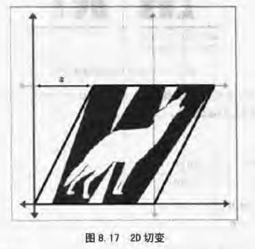
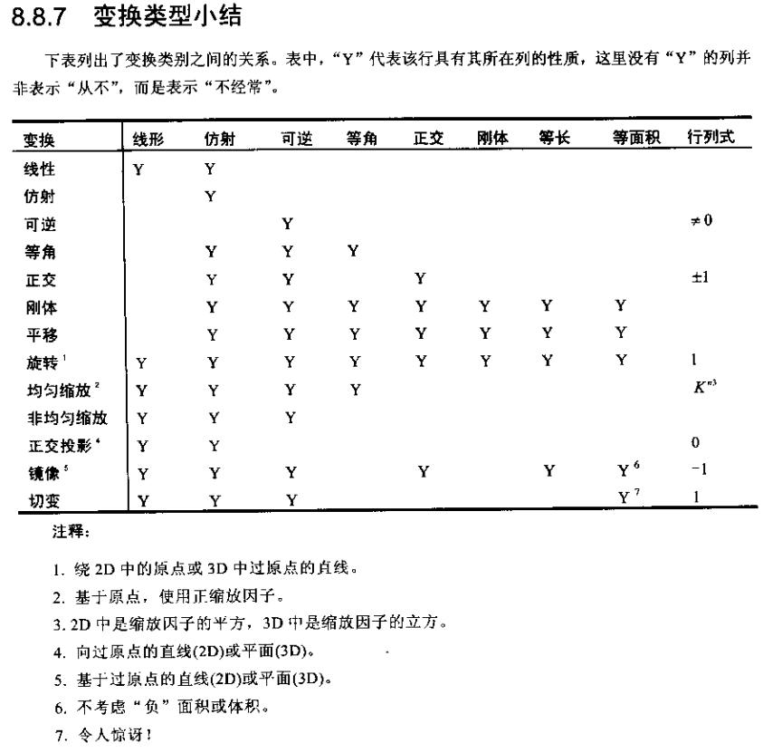
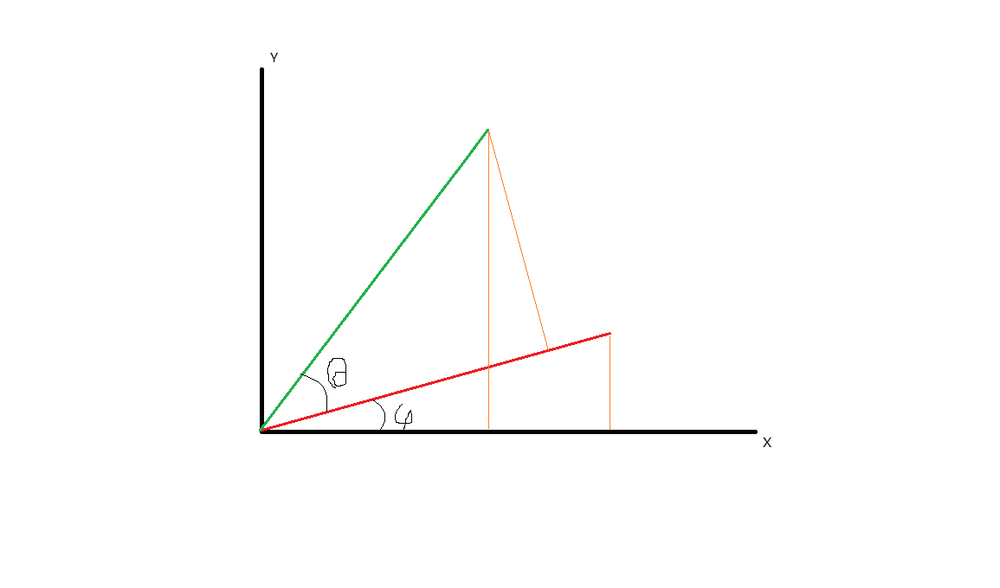
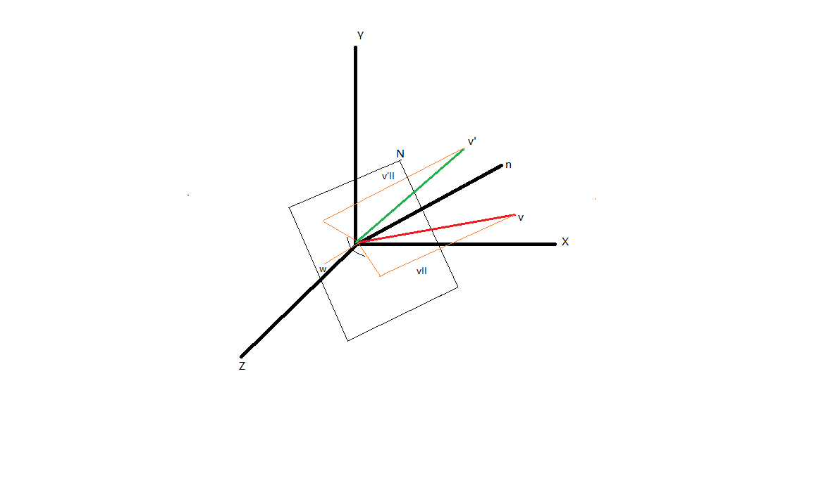

## 第三章 多坐标系

### 一些有用的坐标系

#### 世界坐标系

表示全局的坐标

#### 物体坐标系

以一个物体为原点，物体的某三个方向为轴的坐标系

#### 摄像机坐标系

特殊的物体坐标系，表示摄像机的方向

#### 惯性坐标系

与物体坐标系原点重合，但轴的方向与世界坐标系相同

主要作为一个过渡的坐标系，即惯性坐标系可以由世界坐标系平移得到，物体坐标系可以由惯性坐标系旋转得到

## 第五章 向量

#### 向量点乘

$$
\begin{aligned}

a \cdot b &= \sum_{i=1}^{n} a_i b_i
\\
&= \left \| a \right \| \left \| b \right \| cos \theta
\\
&= x_1x_2 + y_1y_2 + z_1z_2
\\
~
\\

\theta &= arccos(\frac{a \cdot b}{ \left \| a \right \| \left \| b \right \| })

\end{aligned}
$$

#### 向量投影

求向量v到向量n的投影，可以先求投影的向量
$$
\begin{aligned}

\vec v_{||} &= \frac{ \vec n }{ \left \| \vec n \right \| } \left \| \vec v \right \| cos \theta
\\
&= \frac{ \vec n }{ \left \| \vec n \right \| } \left \| \vec v \right \| \frac{\vec v \cdot \vec n}{\left \| \vec v \right \| \left \| \vec n \right \|}
\\
&= \vec n \frac{\vec v \cdot \vec n}{\left \| \vec n \right \| ^2}
\end{aligned}
$$
特殊的，当n为单位向量
$$
\vec v_{\parallel} = \vec n (\vec v \cdot \vec n)
$$

#### 向量叉乘

$$
\begin{bmatrix}
x_1 \\
y_1 \\
z_1
\end{bmatrix}
\times
\begin{bmatrix}
x_2 \\
y_2 \\
z_2
\end{bmatrix}
=
\begin{bmatrix}
y_1 z_2 - z_1 y_2 \\
z_1 x_2 - x_1 z_2 \\
x_1 y_2 - y_1 x_2
\end{bmatrix}
$$

（记忆方法：其实跟之前学的写成3*3矩阵类似，结果的每个元素都是由两个被乘数的两行构成的，最后的结果与被乘数所在的两行行号一定不同。如第一个元素y1z2-z1y2是由被乘数的二三行组合的。此外一样是交叉相乘，左上到右下是加，右上到左下是减）

## 第六章 3D向量类

Vector3类定义在68页，定义了基础的向量运算

由于在后续的矩阵运算中点与向量是相同的，因此这里认为没有必要写一个Point3类

有个临时变量优化方法（类似于变量池），在77页

## 第八章 矩阵和线性变换

### 旋转

#### 2D旋转

假设要旋转的是x和y的单位向量，逆时针旋转角度为$\theta$，则有
$$
\begin{bmatrix}
\vec x' \\
\vec y'
\end{bmatrix}
=
M
\begin{bmatrix}
\vec x \\
\vec y
\end{bmatrix}
=
\begin{bmatrix}
cos \theta & sin \theta \\
-sin \theta & cos \theta
\end{bmatrix}
$$
所以
$$
M
\begin{bmatrix}
1 & 0 \\
0 & 1
\end{bmatrix}
=
\begin{bmatrix}
cos \theta & sin \theta \\
-sin \theta & cos \theta
\end{bmatrix}
\\
\therefore \ \ 
M = \begin{bmatrix}
cos \theta & sin \theta \\
-sin \theta & cos \theta
\end{bmatrix}
$$

#### 3D旋转

因为绕某个轴说明某个轴的分量不变，因此只是2D旋转的简单拓展

##### 绕x轴

$$
\begin{bmatrix}
1 & 0 & 0 \\
0 & cos \theta & sin \theta \\
0 & -sin \theta & cos \theta
\end{bmatrix}
$$

##### 绕y轴

$$
\begin{bmatrix}
cos \theta & 0 & -sin \theta \\
0 & 1 & 0 \\
sin \theta & 0 & cos \theta
\end{bmatrix}
$$

##### 绕z轴

$$
\begin{bmatrix}
cos \theta & sin \theta & 0 \\
-sin \theta & cos \theta & 0 \\
0 & 0 & 1
\end{bmatrix}
$$

#### 绕任意轴

向量v绕n轴旋转为v’
$$
\begin{bmatrix}
v_x' \\
v_y' \\
v_z'
\end{bmatrix}
=
\begin{bmatrix}
n_x^2(1-cos \theta)+cos \theta & n_xn_y(1-cos \theta) + n_z sin \theta & n_xn_z(1-cos \theta) - n_y sin \theta \\
n_xn_y(1-cos \theta) - n_zsin \theta & n_y^2(1-cos \theta) + cos \theta & n_yn_z(1-cos \theta) + n_x sin \theta \\
n_xn_z(1-cos \theta)+n_y sin \theta & n_yn_z(1-cos \theta) - n_x sin \theta & n_z^2(1-cos \theta) + cos \theta
\end{bmatrix}
\begin{bmatrix}
v_x \\
v_y \\
v_z
\end{bmatrix}
$$

### 缩放

#### 沿坐标轴

k为缩放系数，若缩放系数都相同则称为均匀缩放
$$
S(k_x, k_y, k_z) =
\begin{bmatrix}
k_x & 0 & 0 \\
0 & k_y &0 \\
0 & 0 & k_z
\end{bmatrix}
$$

#### 任意方向

$$
\begin{bmatrix}
v'_x \\
v'_y \\
v'_z
\end{bmatrix}
=
\begin{bmatrix}
n_x^2(k_n-1) + 1 & n_xn_y(k_n-1) & n_xn_z(k_n-1) \\
n_xn_y(k_n-1) & n_y^2(k_n-1) + 1 & n_yn_z(k_n-1) \\
n_xn_z(k_n-1) & n_yn_z(k_n-1) & n_z^2(k_n-1) + 1
\end{bmatrix}
\begin{bmatrix}
v_x \\
v_y \\
v_z
\end{bmatrix}
$$

显然，将坐标轴单位向量代入上式可以得到沿坐标轴的缩放公式

### 正交投影

向任意一个法向量为n的面投影

相当于在沿n向量缩放系数为0的缩放
$$
\begin{bmatrix}
v'_x \\
v'_y \\
v'_z
\end{bmatrix}
=
\begin{bmatrix}
1 - n_x^2 & -n_xn_y & -n_xn_z \\
-n_xn_y & 1 - n_y^2 & -n_yn_z \\
-n_xn_z & -n_yn_z & 1-n_z^2
\end{bmatrix}
\begin{bmatrix}
v_x \\
v_y \\
v_z
\end{bmatrix}
$$

### 镜像

任意一个法向量为n的面镜像

相当于沿n向量缩放系数为-1的缩放
$$
\begin{bmatrix}
v'_x \\
v'_y \\
v'_z
\end{bmatrix}
=
\begin{bmatrix}
1 - 2 n_x^2 & -2 n_xn_y & -2 n_xn_z \\
-2 n_xn_y & 1 -2 n_y^2 & -2 n_yn_z \\
-2 n_xn_z & -2 n_yn_z & 1 -2 n_z^2
\end{bmatrix}
\begin{bmatrix}
v_x \\
v_y \\
v_z
\end{bmatrix}
$$

### 切变

有点类似平行四边形式的拉伸，切变变换后图形面积不变

#### 2D

实现方式是将某个坐标的乘积加到另一个上，如
$$
\begin{aligned}
x' &= x + sy
\\
y' &= y
\end{aligned}
$$
2D变换矩阵为
$$
\begin{bmatrix}
x' \\
y'
\end{bmatrix}
=
\begin{bmatrix}
1 & s \\
0 & 1
\end{bmatrix}
\begin{bmatrix}
x \\
y
\end{bmatrix}
$$

#### 3D

3D切变是将两个坐标的成绩加到另一个上，如
$$
\begin{aligned}
x' &= x + sy + tz
\\
y' &= y
\\
z' &= z
\end{aligned}
$$
2D变换矩阵为
$$
\begin{bmatrix}
x' \\
y' \\
z'
\end{bmatrix}
=
\begin{bmatrix}
1 & s & t \\
0 & 1 & 0 \\
0 & 0 & 1
\end{bmatrix}
\begin{bmatrix}
x \\
y \\
z
\end{bmatrix}
$$

### 变换的分类

#### 线性变换

满足下列两式的映射F
$$
\begin{aligned}
F(a+b) &= F(a) + F(b) \\
F(ka)  &= kF(a)
\end{aligned}
$$
上面讨论的所有变换都是线性的，这是因为对于方阵M，若变换$F(a) = \boldsymbol M \boldsymbol a$，则
$$
\begin{aligned}
F(\boldsymbol a+ \boldsymbol b) &= \boldsymbol M(\boldsymbol a+ \boldsymbol b) = \boldsymbol M \boldsymbol a + \boldsymbol M  \boldsymbol b
\\
F(k \boldsymbol a) &= \boldsymbol M (k \boldsymbol a) = k \boldsymbol M \boldsymbol a
\end{aligned}
$$
而上述所有的变换都可以写成方阵

#### 仿射变换

具有线性变换后加上一个向量的变换，即具有形式
$$
v' = v \boldsymbol M + b
$$
线性变换一定是仿射变换，反之不一定

#### 可逆变换

对于线性变换，若能求出逆矩阵，则可逆。若矩阵是奇异矩阵，则不可逆

除了投影变换以外都有逆变换

#### 等角变换

变换前后夹角大小方向不变

只有平移 旋转和均匀缩放是等角变换

镜像会改变夹角方向

#### 正交变换

轴保持垂直，且不缩放

平移 旋转和镜像

对应了正交矩阵

#### 刚体变换（正规变换）

仅改变物体位置和方向

平移和旋转

#### 性质总结

## 第九章 矩阵的更多知识

### 行列式

## 一些问题的解释

### 第五章

#### 点乘公式证明

https://www.cnblogs.com/vive/p/4563803.html

设有三角形OAB，则由定义
$$
\vec{OA} \cdot \vec{OB} = | \vec{OA}| |\vec{OB}| cos \theta
$$
又因为余弦定理得
$$
|\vec{BA}|^2 = |\vec{OA}|^2 + |\vec{OB}|^2 - 2 |\vec{OA}| |\vec{OB}| cos \theta
$$
所以
$$
\begin{aligned}
2 |\vec{OA}| |\vec{OB}| cos \theta =& |\vec{OA}|^2 + |\vec{OB}|^2 - |\vec{BA}|^2
\\
=& |(x_1,y_1,z_1)|^2 + |(x_2,y_2,z_2)|^2 - |(x_2-x_1, y_2-y_1, z_2-z_1)|^2
\\
=& x_1^2 + y_1^2 + z_1^2 + x_2^2 + y_2^2 + z_2^2 - (x_2-x_1)^2 - (y_2-y_1)^2 - (z_2-z_1)^2
\\
=& 2x_1x_2 + 2y_1y_2 + 2z_1z_2
\end{aligned}
$$
即
$$
\vec{OA} \cdot \vec{OB} = |\vec{OA}| |\vec{OB}| cos \theta = x_1x_2 + y_1y_2 + z_1z_2
$$

#### 叉乘公式证明

https://www.cnblogs.com/vive/p/4565282.html

由计算式出发，其实一开始应该是希望定义一个由两个向量计算出正交向量的法则
$$
\begin{aligned}
\vec c &= \vec a \times \vec b
\\
= & (x_1 \vec i + y_1 \vec j + z_1 \vec k) \times (x_2 \vec i + y_2 \vec j + z_2 \vec k)
\\
= & x_1 x_2 (\vec i \times \vec i) + y_1 x_2 (\vec j \times \vec i) + z_1 x_2 (\vec k \times \vec i)
\\ & + x_1 y_2 (\vec i \times \vec j) + y_1 y_2 (\vec j \times \vec j) + z_1 y_2 (\vec k \times \vec j)
\\ & + x_1 z_2 (\vec i \times \vec k) + y_1 z_2 (\vec j \times \vec k) + z_1 z_2 (\vec k \times \vec k)
\\
= & (y_1 z_2 - z_1 y_2) \vec i + (z_1 x_2 - x_1 z_2) \vec j + (x_1 y_2 - y_1 x_2) \vec k
\\
= &
\begin{bmatrix}
y_1 z_2 - z_1 y_2 \\
z_1 x_2 - x_1 z_2 \\
x_1 y_2 - y_1 x_2
\end{bmatrix}
\end{aligned}
$$
此时可以证明计算出的向量方向

要证明值为 $\vec a \times \vec b = \left \| a \right \| \left \| b \right \| sin \theta $
$$
\begin{aligned}
\left \| c \right \|^2 =& (y_1 z_2 - z_1 y_2)^2 + (z_1x_2 - x_1z_2)^2 + (x_1y_2 - y_1x_2)^2
\\
=& (y_1z_2)^2 + (z_1y_2)^2 + (z_1x_2)^2 + (x_1z_2)^2 + (x_1y_2)^2 + (y_1x_2)^2
\\
& - 2z_1z_2y_1y_2 - 2x_1x_2z_1z_2 - 2x_1x_2y_1y_2
\end{aligned}
$$
而
$$
\begin{aligned}
\left \| \vec c \right \| ^2 &= (\left \| \vec a \right \| \left \| \vec b \right \| sin \theta)^2
\\
=& \left \| \vec a \right \|^2 \left \| \vec b \right \|^2 (1-cos^2\theta)
\\
=& \left \| \vec a \right \|^2 \left \| \vec b \right \|^2 (1 - \frac{(\vec a \cdot \vec b)^2}{ \left \| \vec a \right \|^2 \left \| \vec b \right \|^2})
\\
=& \left \| \vec a \right \|^2 \left \| \vec b \right \|^2 - (\vec a \cdot \vec b)^2
\\
=& (x_1^2 + y_1^2 + z_1^2)(x_2^2 + y_2^2 + z_2^2) - (x_1x_2 + y_1y_2 + z_1z_2)^2
\\
=&  (x_1x_2)^2 + (y_1x_2)^2 + (z_1x_2)^2 + (y_1x_2)^2 + (y_1y_2)^2
\\
& + (y_1z_2)^2 + (z_1x_2)^2 + (z_1y_2)^2 + (z_1z_2)^2
\\
& - [(x_1x_2)^2 + (y_1y_2)^2 + (z_1z_2)^2 + 2x_1x_2y_1y_2 + 2x_1x_2z_1z_2 + 2y_1y_2z_1z_2]
\\
=& (y_1x_2)^2 + (z_1x_2)^2 + (y_1x_2)^2 + (y_1z_2)^2 + (z_1x_2)^2 + (z_1y_2)^2
\\
& - 2x_1x_2y_1y_2 - 2x_1x_2z_1z_2 - 2y_1y_2z_1z_2
\end{aligned}
$$
与上式一致，所以得证

### 第八章

#### 2D旋转的证明

由正弦定理
$$
\begin{aligned}
& \frac{v_x}{sin(\frac{\pi}{2} - \varphi)} = \frac{v_y}{sin(\varphi)} = \frac{|v|}{sin(\frac{\pi}{2})}
\\
& \frac{v'_x}{sin(\frac{\pi}{2} - \varphi - \theta)} = \frac{v'_y}{sin(\varphi + \theta)} = \frac{|v'|}{sin(\frac{\pi}{2})}
\end{aligned}
$$
由于|v| = |v'|，则设比值等于k，有
$$
\left \{
\begin{aligned}
v_x &= k \ cos \varphi \\
v_y &= k \ sin \varphi \\
v'_x &= k \ cos(\varphi + \theta) \\
v'_y &= k \ sin(\varphi + \theta)
\end{aligned}
\right .
$$
则
$$
\begin{aligned}
v'_x &= k(cos \varphi cos \theta - sin \varphi sin \theta)
\\   &= k(\frac{v_x}{k} cos \theta - \frac{v_y}{k} sin \theta)
\\   &= v_x cos \theta - v_y sin \theta
\\
~
\\
v'_y &= k(sin \varphi cos \theta + cos \varphi sin \theta)
\\   &= k(\frac{v_y}{k} cos \theta + \frac{v_x}{k} sin \theta)
\\   &= v_y cos \theta + v_x sin \theta
\end{aligned}
$$
所以写成矩阵形式为
$$
\begin{aligned}
\begin{bmatrix}
v_x' \\
v_y
\end{bmatrix}
= 
\begin{bmatrix}
cos \theta & -sin \theta \\
sin \theta & cos \theta
\end{bmatrix}
\begin{bmatrix}
v_x \\
v_y
\end{bmatrix}
\end{aligned}
$$

#### 绕任意轴旋转的证明

假设绕n旋转向量v到v'，$v_{\parallel}$为v平行于n的分量，$v_{\perp}$为v垂直与n的分量，$v_{\parallel}'$为v'平行于n的分量，$v_{\perp}'$为v'垂直于n的分量，$w = n \times v_{\perp}$ 即方向与两者垂直，长度$|w| = |v_{\perp}|$，则可以以w和$v_{\perp}$作为基向量描述 $v_{\perp}'$
$$
\begin{aligned}
v_{\perp}' &= v_{\perp} cos \theta + w sin \theta
\\
&= v_{\perp} cos \theta + (n \times v_{\perp}) sin \theta
\\
&= (v - v_{\parallel}) cos \theta + [n \times (v - v_{\parallel})] sin \theta
\\
~
\\
v - v_{\parallel} &= v - \frac{n (v \cdot n)}{|n|^2} = v - n(v \cdot n)
\\
n \times (v-v_{\parallel}) &= n \times v - n \times v_{\parallel} = n \times v
\\
~
\\
v_{\perp}' &= [v-n(v \cdot n)] cos \theta + (n \times v) sin \theta
\end{aligned}
$$
下面描述v'，首先注意到v和v'的平行分量相等，因此
$$
\begin{aligned}
v' &= v_{\parallel}' + v_{\perp}'
\\ &= v_{\parallel} + v_{\perp}'
\\ &= n (v \cdot n) + [v-n(v \cdot n)] cos \theta + (n \times v) sin \theta
\end{aligned}
$$
因此使用v n描述v'的公式为
$$
v' =  n (v \cdot n) + [v-n(v \cdot n)] cos \theta + (n \times v) sin \theta \tag{1}
$$
由(1)，我们可以计算原坐标系基向量绕n轴旋转$\theta$后的向量

对于p [1,0,0]
$$
\begin{aligned}
p' &= 
\begin{bmatrix}
n_x \\
n_y \\
n_z
\end{bmatrix}
(
\begin{bmatrix}
1 \\
0 \\
0
\end{bmatrix} \cdot 
\begin{bmatrix}
n_x \\
n_y \\
n_z
\end{bmatrix}
)
+
[
\begin{bmatrix}
1 \\
0 \\
0
\end{bmatrix}
-
\begin{bmatrix}
n_x \\
n_y \\
n_z
\end{bmatrix}
(
\begin{bmatrix}
1 \\
0 \\
0
\end{bmatrix}
\begin{bmatrix}
n_x \\
n_y \\
n_z
\end{bmatrix}
)
]
cos \theta
+
(\begin{bmatrix}
n_x \\
n_y \\
n_z
\end{bmatrix} \times
\begin{bmatrix}
1 \\
0 \\
0
\end{bmatrix}
) sin \theta
\\
&=
n_x
\begin{bmatrix}
n_x \\
n_y \\
n_z
\end{bmatrix}
+
(
\begin{bmatrix}
1 \\
0 \\
0
\end{bmatrix}
-
n_x
\begin{bmatrix}
n_x \\
n_y \\
n_z
\end{bmatrix}
) cos \theta
+
\begin{bmatrix}
0 \\
n_z \\
-n_y
\end{bmatrix}
sin \theta
\\
&=
\begin{bmatrix}
n_x^2(1-cos \theta)+cos \theta \\
n_xn_y(1-cos \theta) + n_z sin \theta \\
n_xn_z(1-cos \theta) - n_y sin \theta
\end{bmatrix}
\end{aligned}
$$
对于q [0,1,0]
$$
\begin{aligned}
q' &= 
\begin{bmatrix}
n_x \\
n_y \\
n_z
\end{bmatrix}
(
\begin{bmatrix}
0 \\
1 \\
0
\end{bmatrix} \cdot 
\begin{bmatrix}
n_x \\
n_y \\
n_z
\end{bmatrix}
)
+
[
\begin{bmatrix}
0 \\
1 \\
0
\end{bmatrix}
-
\begin{bmatrix}
n_x \\
n_y \\
n_z
\end{bmatrix}
(
\begin{bmatrix}
0 \\
1 \\
0
\end{bmatrix}
\begin{bmatrix}
n_x \\
n_y \\
n_z
\end{bmatrix}
)
]
cos \theta
+
(\begin{bmatrix}
n_x \\
n_y \\
n_z
\end{bmatrix} \times
\begin{bmatrix}
0 \\
1 \\
0
\end{bmatrix}
) sin \theta
\\
&=
n_y
\begin{bmatrix}
n_x \\
n_y \\
n_z
\end{bmatrix}
+
(
\begin{bmatrix}
0 \\
1 \\
0
\end{bmatrix}
-
n_y
\begin{bmatrix}
n_x \\
n_y \\
n_z
\end{bmatrix}
) cos \theta
+
\begin{bmatrix}
-n_z \\
0 \\
n_x
\end{bmatrix}
sin \theta
\\
&=
\begin{bmatrix}
n_xn_y(1-cos \theta) - n_zsin \theta \\
n_y^2(1-cos \theta) + cos \theta \\
n_yn_z(1-cos \theta) + n_x sin \theta
\end{bmatrix}
\end{aligned}
$$
对于r [0,0,1]
$$
\begin{aligned}
r' &= 
\begin{bmatrix}
n_x \\
n_y \\
n_z
\end{bmatrix}
(
\begin{bmatrix}
0 \\
0 \\
1
\end{bmatrix} \cdot 
\begin{bmatrix}
n_x \\
n_y \\
n_z
\end{bmatrix}
)
+
[
\begin{bmatrix}
0 \\
0 \\
1
\end{bmatrix}
-
\begin{bmatrix}
n_x \\
n_y \\
n_z
\end{bmatrix}
(
\begin{bmatrix}
0 \\
0 \\
1
\end{bmatrix}
\begin{bmatrix}
n_x \\
n_y \\
n_z
\end{bmatrix}
)
]
cos \theta
+
(\begin{bmatrix}
n_x \\
n_y \\
n_z
\end{bmatrix} \times
\begin{bmatrix}
0 \\
0 \\
1
\end{bmatrix}
) sin \theta
\\
&=
n_z
\begin{bmatrix}
n_x \\
n_y \\
n_z
\end{bmatrix}
+
(
\begin{bmatrix}
0 \\
0 \\
1
\end{bmatrix}
-
n_z
\begin{bmatrix}
n_x \\
n_y \\
n_z
\end{bmatrix}
) cos \theta
+
\begin{bmatrix}
n_y \\
-n_x \\
0
\end{bmatrix}
sin \theta
\\
&=
\begin{bmatrix}
n_xn_z(1-cos \theta)+n_y sin \theta \\
n_yn_z(1-cos \theta) - n_x sin \theta \\
n_z^2(1-cos \theta) + cos \theta
\end{bmatrix}
\end{aligned}
$$
因此若绕n轴旋转向量v，则
$$
\begin{aligned}
v &= x \vec p + y \vec q + z \vec r
\\
v' &= x \vec{p'} + y \vec{q'} + z \vec{r'}
\end{aligned}
$$
转置矩阵为
$$
\begin{bmatrix}
v_x' \\
v_y' \\
v_z'
\end{bmatrix}
=
\begin{bmatrix}
n_x^2(1-cos \theta)+cos \theta & n_xn_y(1-cos \theta) + n_z sin \theta & n_xn_z(1-cos \theta) - n_y sin \theta \\
n_xn_y(1-cos \theta) - n_zsin \theta & n_y^2(1-cos \theta) + cos \theta & n_yn_z(1-cos \theta) + n_x sin \theta \\
n_xn_z(1-cos \theta)+n_y sin \theta & n_yn_z(1-cos \theta) - n_x sin \theta & n_z^2(1-cos \theta) + cos \theta
\end{bmatrix}
\begin{bmatrix}
v_x \\
v_y \\
v_z
\end{bmatrix}
$$

#### 缩放证明

##### 沿坐标轴

一样使用缩放前后的单位向量变换矩阵来证明
$$
\begin{aligned}
p' = k_x
\begin{bmatrix}
1 & 0 & 0
\end{bmatrix}
=
\begin{bmatrix}
k_x & 0 & 0
\end{bmatrix}
\end{aligned}
$$
其他的类似，因此
$$
\begin{bmatrix}
p' \\
q' \\
r'
\end{bmatrix}
=
\begin{bmatrix}
k_x & 0 & 0 \\
0 & k_y & 0 \\
0 & 0 & k_z
\end{bmatrix}
$$

##### 沿任意方向

v和v'分解为
$$
\begin{aligned}
v &= v_\perp + v_\parallel
\\
v' &= v'_\perp + v'_\parallel
\\
~
\\
v'_\perp &= v_\perp
\\
v'_\parallel &= k_n v_\parallel
\end{aligned}
$$
使用n k和v表示v'
$$
\begin{aligned}
v' &= v'_\perp + v'_\parallel
\\ &= v_\perp + k_n v_\parallel
\\ &= v - v_\parallel + k_n v_\parallel
\\ &= v + (k_n - 1)n(v \cdot n)
\end{aligned}
$$
所以下列变换可以表示沿任意方向的缩放，将其作用于p q r
$$
\begin{aligned}
p &= 
\begin{bmatrix}
1 \\
0 \\
0
\end{bmatrix}
+
(k_n-1)
\begin{bmatrix}
n_x \\
n_y \\
n_z
\end{bmatrix}
(
\begin{bmatrix}
1 \\
0 \\
0
\end{bmatrix}
\cdot
\begin{bmatrix}
n_x \\
n_y \\
n_z
\end{bmatrix}
)
\\
&=
\begin{bmatrix}
n_x^2(k_n-1) + 1 \\
n_xn_y(k_n-1) \\
n_xn_z(k_n-1)
\end{bmatrix}
\\
~
\\
q &= 
\begin{bmatrix}
0 \\
1 \\
0
\end{bmatrix}
+
(k_n-1)
\begin{bmatrix}
n_x \\
n_y \\
n_z
\end{bmatrix}
(
\begin{bmatrix}
0 \\
1 \\
0
\end{bmatrix}
\cdot
\begin{bmatrix}
n_x \\
n_y \\
n_z
\end{bmatrix}
)
\\
&=
\begin{bmatrix}
n_xn_y(k_n-1) \\
n_y^2(k_n-1) + 1 \\
n_yn_z(k_n-1)
\end{bmatrix}
\\
~
\\
r &= 
\begin{bmatrix}
0 \\
0 \\
1
\end{bmatrix}
+
(k_n-1)
\begin{bmatrix}
n_x \\
n_y \\
n_z
\end{bmatrix}
(
\begin{bmatrix}
0 \\
0 \\
1
\end{bmatrix}
\cdot
\begin{bmatrix}
n_x \\
n_y \\
n_z
\end{bmatrix}
)
\\
&=
\begin{bmatrix}
n_xn_z(k_n-1) \\
n_yn_z(k_n-1) \\
n_z^2(k_n-1) + 1
\end{bmatrix}

\end{aligned}
$$
所以变换矩阵为
$$
\begin{bmatrix}
p' \\
q' \\
r
\end{bmatrix}
=
\begin{bmatrix}
n_x^2(k_n-1) + 1 & n_xn_y(k_n-1) & n_xn_z(k_n-1) \\
n_xn_y(k_n-1) & n_y^2(k_n-1) + 1 & n_yn_z(k_n-1) \\
n_xn_z(k_n-1) & n_yn_z(k_n-1) & n_z^2(k_n-1) + 1
\end{bmatrix}
\begin{bmatrix}
p \\
q \\
r
\end{bmatrix}
$$

#### 投影证明

可以看做沿n向量进行缩放，且**缩放系数为0**

因此公式为
$$
\begin{aligned}
\begin{bmatrix}
v'_x \\
v'_y \\
v'_z
\end{bmatrix}
&=
\begin{bmatrix}
n_x^2(0-1) + 1 & n_xn_y(0-1) & n_xn_z(0-1) \\
n_xn_y(0-1) & n_y^2(0-1) + 1 & n_yn_z(0-1) \\
n_xn_z(0-1) & n_yn_z(0-1) & n_z^2(0-1) + 1
\end{bmatrix}
\begin{bmatrix}
v_x \\
v_y \\
v_z
\end{bmatrix}
\\ &=
\begin{bmatrix}
1 - n_x^2 & -n_xn_y & -n_xn_z \\
-n_xn_y & 1 - n_y^2 & -n_yn_z \\
-n_xn_z & -n_yn_z & 1-n_z^2
\end{bmatrix}
\begin{bmatrix}
v_x \\
v_y \\
v_z
\end{bmatrix}
\end{aligned}
$$
