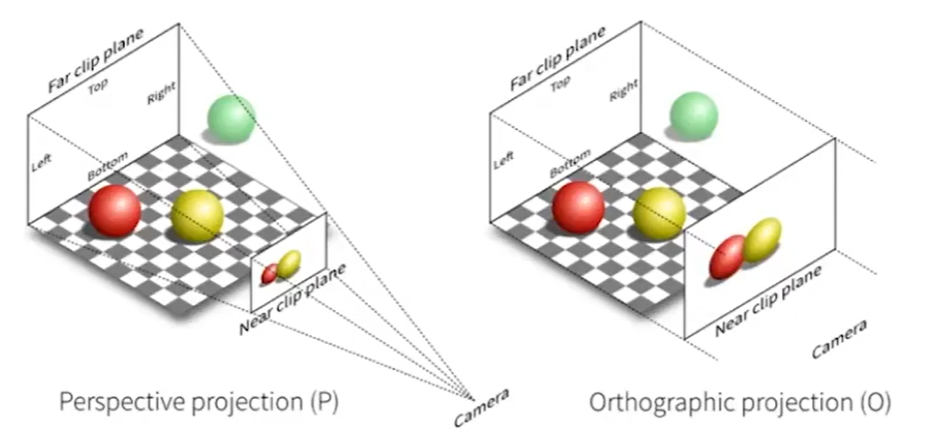
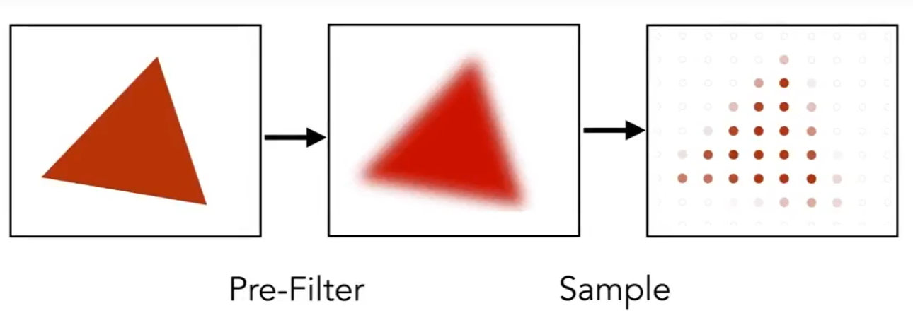

B站课程 https://www.bilibili.com/video/BV1X7411F744

参考书 Fundamentals of Computer Graphics

## Transformation

### Modeling

主要是模型的变换

#### 2D Transformation

涉及到变换，其实可以看3B1B的一个视频 https://www.bilibili.com/video/BV1ys411472E?p=4

一个变换矩阵可以简单地由基向量变换前后的坐标来得到

##### Scale

缩放变换


其变换很简单，即将x缩放sx倍，y缩放sy倍，即

$$
\left \{
\begin{aligned}
x' &= s_x x \\
y' &= s_y y
\end{aligned}
\right .
$$

因此变换矩阵为

$$
scale(s_x, s_y) = 
\begin{bmatrix}
s_x & 0 \\
0 & s_y
\end{bmatrix}
$$

##### Shearing

切变


如图是x轴方向上的切变，即

$$
\left \{
\begin{aligned}
x' &= x + ay \\
y' &= y
\end{aligned}
\right .
$$

因此变换矩阵为

$$
\textit{shear-x}(a) =
\begin{bmatrix}
1 & a \\
0 & 1
\end{bmatrix}
$$

##### Rotate

旋转矩阵


经过一些推导可得

$$
\left \{
\begin{aligned}
x' &= x cos \theta - y sin \theta \\
y' &= x sin \theta + y cos \theta
\end{aligned}
\right .
$$

因此变换矩阵为

$$
rotate(\theta) = 
\begin{bmatrix}
cos \theta & -sin \theta \\
sin \theta & cos \theta
\end{bmatrix}
$$

##### Reflection

反射矩阵


这里以y轴为反射轴，所以变换公式为

$$
\left \{
\begin{aligned}
x' &= -x \\
y' &= y
\end{aligned}
\right .
$$

变换矩阵为

$$
\textit{reflect-y} = 
\begin{bmatrix}
-1 & 0 \\
0 & 1
\end{bmatrix}
$$

##### 变换矩阵求解

实际上可以将问题转换为对基向量的变换矩阵求解，因为每个向量都是由基向量线性组合成的

如对于旋转矩阵，基向量x和y旋转角度 $\theta$ 后为

$$
\begin{aligned}
x =
\begin{bmatrix}
1 & 0
\end{bmatrix}^T
& \rightarrow
x' =
\begin{bmatrix}
cos \theta & sin \theta
\end{bmatrix}^T

\\

x =
\begin{bmatrix}
0 & 1
\end{bmatrix}^T
& \rightarrow
x' =
\begin{bmatrix}
-sin \theta & cos \theta
\end{bmatrix}^T
\end{aligned}
$$

将两个向量顺序排列即组成变换矩阵（即按[x y]的顺序排列，注意上面的两个向量x和y都是列向量）

##### Homogeneous Coordinates

齐次坐标

注意到上述的坐标变换无法表示平移的操作，因为变换矩阵只能表示x和y的线性组合，所以引入齐次坐标

###### 平移变换

首先考虑平移变换的表示

$$
\left \{
\begin{aligned}
x' &= x + t_x \\
y' &= y + t_y
\end{aligned}
\right .
$$

可以表示为

$$
\begin{bmatrix}
x' \\
y'
\end{bmatrix}
=
\begin{bmatrix}
1 & 0 \\
0 & 1
\end{bmatrix}
\begin{bmatrix}
x \\
y
\end{bmatrix}
+
\begin{bmatrix}
t_x \\
t_y
\end{bmatrix}
$$

###### 齐次坐标

齐次坐标的想法就是将普通的变换矩阵扩展一维，变为

$$
\begin{bmatrix}
a & b & t_x \\
c & d & t_y \\
0 & 0 & 1
\end{bmatrix}
$$

而对于向量和点的表示，也多一个维度，其中对于向量而言，由于平移操作对其无意义，所以最后一维为0；对于点，最后一维则为1

$$
\begin{aligned}
Vector &: &
\begin{bmatrix}
x & y
\end{bmatrix}^T
\rightarrow
\begin{bmatrix}
x & y & 0
\end{bmatrix}^T
\\
Point &: &
\begin{bmatrix}
x & y
\end{bmatrix}^T
\rightarrow
\begin{bmatrix}
x & y & 1
\end{bmatrix}^T
\end{aligned}
$$

如此一来，若使用变换矩阵左乘向量，得到的结果不变

$$
\begin{bmatrix}
1 & 0 & t_x \\
0 & 1 & t_y \\
0 & 0 & 1
\end{bmatrix}
\begin{bmatrix}
x \\
y \\
0
\end{bmatrix}
=
\begin{bmatrix}
x \\
y \\
0
\end{bmatrix}
$$

而左乘一个点，则会进行平移变换

$$
\begin{bmatrix}
1 & 0 & t_x \\
0 & 1 & t_y \\
0 & 0 & 1
\end{bmatrix}
\begin{bmatrix}
x \\
y \\
1
\end{bmatrix}
=
\begin{bmatrix}
x + t_x \\
y + t_y \\
1
\end{bmatrix}
$$

此外，对于点、向量间的运算也有定义

```
向量 + 向量 = 向量   对应的最后一维还是0
向量 + 点   = 点     对应的最后一维变为1
点   - 点   = 向量   对应的最后一维变为0
```

对于点+点的操作，本身在数学上是无意义的，但我们认为定义其操作：当齐次向量的最后一维大于0时，运算法则如下

$$
\begin{bmatrix}
x \\
y \\
w
\end{bmatrix}
=
\begin{bmatrix}
\frac{x}{w} \\
\frac{y}{w} \\
1
\end{bmatrix}
$$

因此对于点+点的情况，表示两者的中点

###### 齐次坐标的变换

对于齐次坐标表示法下的变换很简单，这里以旋转矩阵为例

$$
rotate(\theta) = 
\begin{bmatrix}
cos \theta & -sin \theta \\
sin \theta & cos \theta
\end{bmatrix}
\rightarrow
rotate(\theta) = 
\begin{bmatrix}
cos \theta & -sin \theta & 0 \\
sin \theta & cos \theta & 0 \\
0 & 0 & 1
\end{bmatrix}
$$

对于2D的变换，直接将2D的变换矩阵填入新矩阵的前2维即可

##### Inverse Transform

逆变换

由线代可得，当左乘一个变换矩阵，此时再左乘该矩阵的逆矩阵，则结果不变。因此逆变换即为逆矩阵

如旋转矩阵的逆矩阵为

$$
rotate(\theta)^{-1} = 
\begin{bmatrix}
cos \theta &  sin \theta \\
-sin \theta & cos \theta
\end{bmatrix}
$$

在齐次坐标下是相同的，因为多出来的维度是单位阵的形式，所以并不影响结果

##### Composing Transforms

组合变换

如要将某个图形绕 (x0, y0) 旋转θ度，由于上述所有的变换都是基于原点的，因此应该进行如下操作

* 平移 (-x0, -y0) ，令旋转点与原点重合

* 旋转a度

* 平移 (x0, y0) ，使图形回到正确位置

表示为公式，即为

$$
\begin{bmatrix}
x' \\
y' \\
1
\end{bmatrix}
=
\begin{bmatrix}
1 & 0 & t_x \\
0 & 1 & t_y \\
0 & 0 & 1
\end{bmatrix}
\begin{bmatrix}
cos \theta & -sin \theta & 0 \\
sin \theta & cos \theta & 0 \\
0 & 0 & 1
\end{bmatrix}
\begin{bmatrix}
1 & 0 & -t_x \\
0 & 1 & -t_y \\
0 & 0 & 1
\end{bmatrix}
\begin{bmatrix}
x \\
y \\
1
\end{bmatrix}
$$

注意，先进行的操作放在右边

#### 3D Transformation

##### Rotate

###### 绕z轴

先从绕z轴旋转看起，因为绕z轴旋转可以视作在x-y平面上做二维旋转，因此旋转矩阵为

$$
\begin{bmatrix}
cos \theta & -sin \theta & 0 & 0 \\
sin \theta & cos \theta & 0 & 0 \\
0 & 0 & 1 & 0 \\
0 & 0 & 0 & 1
\end{bmatrix}
$$

###### 绕x轴

$$
\begin{bmatrix}
1 & 0 & 0 & 0 \\
0 & cos \theta & -sin \theta & 0 \\
0 & sin \theta & cos \theta & 0 \\
0 & 0 & 0 & 1
\end{bmatrix}
$$

###### 绕y轴

绕y轴的形式有点不一样，是反过来的，这与x-y-z是右手系有关

$$
\begin{bmatrix}
cos \theta & 0 & sin \theta & 0 \\
0 & 1 & 0 & 0 \\
-sin \theta & 0 & cos \theta & 0 \\
0 & 0 & 0 & 1
\end{bmatrix}
$$

###### 性质

观察上面式子可以发现，每个旋转矩阵的逆矩阵与旋转矩阵的转置相同，即

$$
A^{-1} = A^T
$$

即为**正交矩阵**，此类矩阵有一些很好的性质

###### 绕任意轴旋转

证明可以见如下的网页

[Rodrigues 旋轉公式](https://openhome.cc/Gossip/WebGL/Rodrigues.html)

$$
\bold{v'} = \bold{v} cos \theta + (\bold n \cdot \bold v) \bold n (1-cos \theta) + sin \theta (\bold n \times \bold v)
$$

其中n为旋转轴，v为变换前的向量，v'为变换后的向量

所以上式写为旋转矩阵形式，即为

$$
R(\bold n,\theta) = cos(\theta) \bold I + (1-cos \theta) \bold n \bold n^T + sin \theta
\begin{bmatrix}
0 & -n_z & n_y \\
n_z & 0 & -n_x \\
-n_y & n_x & 0
\end{bmatrix}
$$

注意这里的几个转换，首先 $\bold n \bold n^T$ 为投影矩阵，其左乘向量v则得到v在n上的**投影向量**，所以有

$$
(\bold n \cdot \bold v) \bold n = \bold n \bold n^T \bold v
$$

另一个转换为叉乘的转换，有

$$
\bold n \times \bold v =
\begin{bmatrix}
n_2 v_3 - n_3 v_2 \\
n_3 v_1 - n_1 v_3 \\
n_1 v_2 - n_2 v_1
\end{bmatrix}
=
\begin{bmatrix}
0 & -n_3 & n_2 \\
n_3 & 0 & -n_1 \\
-n_2 & n_1 & 0
\end{bmatrix}
\begin{bmatrix}
v_1 \\
v_2 \\
v_3
\end{bmatrix}
$$

### Viewing

主要是视图的变换

#### 相机

所谓视图，其实即为相机所看到的内容，视图变换其实是从模型坐标系到相机坐标系的变换，因为场景最终呈现的画面是以相机的视角进行观察的

首先需要定义一个相机的**位置和姿态**，使用下面几个参数

* $\vec e$  Position  相机的位置向量

* $\hat g$  Look-at/ gaze direction  相机朝向的向量

* $\hat t$   Up direction  指向相机上方的向量

可以用直观些的语言说明g和t的关系，g确定的是相机的俯仰角（pitch）和偏航角（yaw），t确定的则是滚转角（roll）

#### View / Camera Transformation

视图变换

##### 默认视图坐标系

视图变换其实就是要将模型坐标系的物体变换到相机坐标系，默认的变换为：将相机的位置和姿态变换到下面定义的位置

* 相机位置在原点，g指向-Z（即相机朝向-Z），t指向Y

##### 视图变换矩阵

###### 思路

由前面所述的组合变换，可以得到视图变换的方法：

* 将相机从e平移到原点

* 将向量g转向-Z

* 将向量t转向Y

###### 公式

首先平移到原点

$$
\begin{bmatrix}
1 & 0 & 0 & -x_e \\
0 & 1 & 0 & -y_e \\
0 & 0 & 1 & -z_e \\
0 & 0 & 0 & 1
\end{bmatrix}
$$

再进行旋转，这里旋转用了一个比较巧妙的方法：先求将坐标系旋转到相机坐标系的矩阵：由于y轴旋转到了t，z轴旋转到了-g，x轴旋转到了 $g \times t$ ，所以可以直接得到变换的矩阵为：

$$
\begin{bmatrix}
\hat g \times \hat t & t & -g
\end{bmatrix}
$$

因此对应的变换矩阵为

$$
\begin{bmatrix}
x_{\hat g \times \hat t} & x_t & x_{-g} & 0 \\
y_{\hat g \times \hat t} & y_t & y_{-g} & 0 \\
z_{\hat g \times \hat t} & z_t & z_{-g} & 0 \\
0 & 0 & 0 & 1
\end{bmatrix}
$$

又因为是旋转矩阵，所以其逆矩阵为（正交矩阵相乘仍为正交矩阵）

$$
\begin{bmatrix}
x_{\hat g \times \hat t} & y_{\hat g \times \hat t} & z_{\hat g \times \hat t} & 0 \\
x_t & y_t & z_t & 0 \\
x_{-g} & y_{-g} & z_{-g} & 0 \\
0 & 0 & 0 & 1
\end{bmatrix}
$$

因此可以得到最终的视图变换矩阵

$$
M_{view} = R_{view} T_{view} = 
\begin{bmatrix}
x_{\hat g \times \hat t} & y_{\hat g \times \hat t} & z_{\hat g \times \hat t} & 0 \\
x_t & y_t & z_t & 0 \\
x_{-g} & y_{-g} & z_{-g} & 0 \\
0 & 0 & 0 & 1
\end{bmatrix}
\begin{bmatrix}
1 & 0 & 0 & -x_e \\
0 & 1 & 0 & -y_e \\
0 & 0 & 1 & -z_e \\
0 & 0 & 0 & 1
\end{bmatrix}
$$

#### Projection Transformation

投影变换，有两种投影方式：正交投影和透视投影



##### Orthographic Projection

正交投影

###### 简单的理解和操作

正交投影因为投影线都是平行线，因此最简单的操作即将所有模型的Z轴置为0，得到的投影即为正交投影。为了方便一般归一化到 $\begin{bmatrix} -1, 1 \end{bmatrix}^2$ 的区域上

###### 标准变换方法

假设我们希望得到空间中的一个立方体的正交投影，首先假设该立方体为 $[l, r] \times [b,t] \times [f, n]$


* 首先将立方体几何中心平移到原点

* 将立方体缩放到 $[-1, 1]^3$ 的区域

因此对应的正交投影矩阵为

$$
M_{ortho} =
\begin{bmatrix}
\frac{2}{r-l} & 0 & 0 & 0 \\
0 & \frac{2}{t-b} & 0 & 0 \\
0 & 0 & \frac{2}{n-f} & 0 \\
0 & 0 & 0 & 1
\end{bmatrix}
\begin{bmatrix}
1 & 0 & 0 & -\frac{r+l}{2} \\
0 & 1 & 0 & -\frac{t+b}{2} \\
0 & 0 & 1 & -\frac{n+f}{2} \\
0 & 0 & 0 & 1
\end{bmatrix}
$$

注意，正交投影后物体会被拉伸，之后要通过视口变换还原

##### Perspective Projection

透视投影

这里做透视投影的方法也很直观，将透视投影分为两步


* 首先将截锥体“挤压”为立方体

* 再对立方体做正交投影

并且做如下直观的假设

* 近平面（即z=n处，截锥的上表面）的任意一个点在变换后坐标不变

* 远平面（即z=f处）的任意一个点在变换后z不变

* 远平面的中心点变换后坐标不变

“挤压”操作会使得物体的大小按比例缩放，由相似三角形得出


这里e是眼睛所在的点，眼睛看的方向为g（即-z的方向），d为要投影到的视平面与眼睛的距离（这里统一用n，因为之前都是用n来表示近平面的坐标），则对于x坐标来说同理，有

$$
\left \{
\begin{aligned}
x_s &= \frac{n}{z} x \\
y_s &= \frac{n}{z} y
\end{aligned}
\right .
$$

因此可以得到比较一般的结果。注意，这里得到的只是x和y投影后的坐标，因为目前只能确定x和y投影后的大小，但无法确定z坐标。

$$
M_{persp}
\begin{bmatrix}
x \\
y \\
z \\
1
\end{bmatrix}
=
\begin{bmatrix}
\frac{n}{z} x \\
\frac{n}{z} y \\
z' \\
1
\end{bmatrix}
=
\begin{bmatrix}
nx \\
ny \\
z'' \\
z
\end{bmatrix}
$$

要确定z需要引入前面的几个假设，因此有

$$
\begin{aligned}
M_{persp}
\begin{bmatrix}
x \\
y \\
n \\
1
\end{bmatrix}
&=
\begin{bmatrix}
nx \\
ny \\
n^2 \\
n
\end{bmatrix}
\\
~
\\
M_{persp}
\begin{bmatrix}
x \\
y \\
f \\
1
\end{bmatrix}
&=
\begin{bmatrix}
nx \\
ny \\
f^2 \\
f
\end{bmatrix}
\end{aligned}
$$

所以得到变换矩阵为

$$
\begin{bmatrix}
n & 0 & 0 & 0 \\
0 & n & 0 & 0 \\
0 & 0 & n+f & -nf\\
0 & 0 & 1 & 0
\end{bmatrix}
$$

#### Field Of View

即fov


fov的概念很简单，假设摄像机朝向做正交投影的长方体，则fovY为画面高度对应的角度，fovX为画面宽度对应的角度，如图，其中t为高度的一半，r为宽度的一半，aspect为长宽比


## Rasterization

光栅化

### Viewport Transformation

视口变换

概念很简单，上面的投影变换将物体投影到单位立方体，视口变换就是将单位立方体内的物体投影到屏幕上

首先需要定义屏幕大小，宽为w，高为h，因此视口变换需要将 $[-1, 1]^2$ 映射到 $[0, w] \times [0, h]$

所以视口变换的数学形式十分简单

$$
M_{viewport} =
\begin{bmatrix}
\frac{w}{2} & 0 & 0 & \frac{w}{2} \\
0 & \frac{h}{2} & 0 & \frac{h}{2} \\
0 & 0 & 1 & 0 \\
0 & 0 & 0 & 1
\end{bmatrix}
$$

### Sampling

#### 基本原理

采样是最简单的光栅化方式，它的原理很简单：遍历屏幕上的每个像素坐标，根据一个函数判断当前的坐标是否需要着色

```c
for(int x=0; x<xmax; x++)
    for(int y=0; y<ymax; y++)
        image[x][y] = inside(tri, x+0.5, y+0.5);
```

其中inside函数只返回1或0，tri这里表示渲染的图形的结构体（例子中为一个三角形），x+0.5和y+0.5是因为这里以像素的中心点为判断的依据

这里要判断一个点是否在三角形内，方法也很简单：假设三角形为ABC，判断向量的乘积 `AB*BC  BC*CA  CA*AB` 符号是否相同即可

#### 算法加速

上面的示例代码需要对屏幕上每个点进行判断，肯定增加了很多额外开销，因此有下列优化方式

##### Bounding Box

包围盒

思路很简单，根据三角形的坐标来得到包围该三角形的矩形，只对该矩形内进行遍历


### Aliasing

走样，即图像上的锯齿

#### 产生原因

本质上是由于sampling artifacts导致的，即采样中产生的一些瑕疵


jaggie（锯齿）

#### Antialiasing

##### Antialiasing Sampling

这种抗锯齿的基本思路即，先对图形进行模糊处理，再进行采样



这种方法其实是基于信号处理的理论，课程里花了很多时间在说明信号处理的基础知识，这边只记录一些图像相关的重点（信号相关去看信号与系统）

###### 图像的频域信息

高频的内容倾向于记录边缘的信息，因为边缘说明信号的变化量大。低频则是将边缘模糊的信息。

课程里给出了这张图片与频域的关系作为例子


右边为频域图，其中含有四条竖线主要是因为到达图片长宽边缘时像素信息发生突变，导致高频信息较强


高通滤波，可以看到主要是边缘信息


低通滤波，可以看到边缘被模糊了


带通滤波

###### 采样与aliasing的关系


这里其实是在解释奈奎斯特频率

若想采样信号a，做法就是用c的冲激函数序列与a进行卷积，得到e
