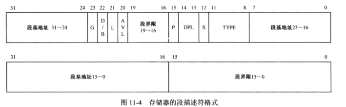
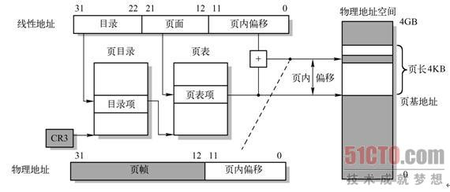
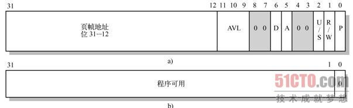

# 0x00 内核引导启动程序
内核引导启动程序主要有三个
## bootsect.s
bootsect.s位于磁盘的**0磁头0柱面1扇区** BIOS自检完成后被读入到**0x7C00**([Why 0x7C00](http://www.ruanyifeng.com/blog/2015/09/0x7c00.html))
### 流程
* 47-56行：把自己从**0x07C0:0000**移动到**0x9000:0000**
* 57-62行：设置**es**，**ds**为**0x9000**，**ss:sp**为**0x9000:ff00**
* 67-77行：从磁盘读入setup.s到**0x9000:0200**，长度为4个扇区（一个扇区512KB）
* 83-90行：获取磁盘每磁道扇区数
* 94-102行：打印“Loading system”
* 107-109行：调用read_it函数（后面会说明）加载system模块到**0x1000:0000**
* 110行：关闭软驱电动机，说实话我不大知道这里为什么要关软驱（这里软驱是因为当时主要使用的就是软盘），是因为该读入的东西都读完了么
* 117-133行：判断软驱类型是否已被定义，若没有通过每磁道的扇区数区分1.44MB驱动器和1.2MB驱动器
* 139行：跳转至setup.s运行

##### read_it

几个注意点：

* sectors保存单个磁道扇区数，sread保存当前磁道已经读到第几个扇区，track保存当前磁道号，head保存当前磁头号，bx保存当前内存偏移量
* ok1_read(161~172)：计算sectors-sread，当前磁道未读的扇区数n，再算n*512，若大于0x10000（即结果溢出，置CF位）则调整将读入的扇区数为`(0x10000-bx)/512`
* read_track(198~226)：设置要读入的磁道track，扇区sread+1（因为sread是已经读入的扇区号），磁头head（注意磁头号只有0和1，因此and 0x0100），读入扇区数AL，读磁盘。若出错reset磁盘，重试
* ok2_read和ok4_read(173~186)：sread+ax（ax为上次读入的扇区数），与sectors比较，若不等于说明当前磁道未读完，跳转ok3_read，否则判断head是否为1，若head==1则track加1，head=0，否则(head==0)则head=1，并将sread置0
* ok3_read(187~196)：若新读入的内容大小加bx等于0x10000，则新分配0x10000空间（es+=0x1000 xor bx,bx）否则回到开头继续读入

这个函数可能是bootsect.s最复杂的，它负责读入软盘的system模块，且能一次性尽量读多个扇区。
我翻译的伪代码如下（不一定正确）

```c
es = SYSSEG; //指向要写入的内存，这里即0x1000:0000
sector = sector of track;  //这里的sector在之前就初始化过，为单个磁道扇区数
sread = 1 + SETUPLEN;   //sread用于指示读到了当前磁道的第几位，初始化的时候，0磁道已经被读入了1（bootsect.s）+ SETUPLEN（setup.s）
head = 0; //0磁头
track = 0; //0磁道

if( es&0xfff != 0 )  //用于检查目的地址是否64KB对齐
    die();          //如果不是就die（死循环）
offset = 0;     //用于记录当前内存的偏移
while( es < ENDSEG )   //ENDSEG记录了system模块的结束地址
{
    read = sector - sread;  //若把当前磁道读完还需读入的扇区数
    if( offset + read*512 > 64K ) //因为缓冲区是64K对齐的，read*512是因为一个扇区512字节，这里64K其实应该写成0x10000
        read = (64K - offset) / 512;
    read_num = read_track( read,es );  //read_num为实际读入的扇区数，es为目的地址
    sread += read_num;
    if( sread == sector )    //如果当前磁道读完
    {
        if( head == 0 )    //如果当前读的是0磁头
            head ++;
        else
            head = 0;
        sread = 0;
    }
    offset += read_num*512;
    if( offset >= 64K )    //如果当前64K缓冲区满
    {
        offset = 0;
        es += 0x1000;    //分配新缓冲区
    }
}
```
## setup.s

* 31-87行：将一些设置保存在**0x9000:0000**

```
offset      data
  0        光标位置
  2        扩展内存大小
 4-7       显卡显示页面 显示模式 窗口字符列数
 8-13      一些VGA参数
 80        硬盘1参数表
 90        硬盘2参数表
```
  这里需要注意硬盘1和2参数表的偏移分别为中断向量0x41和0x46的值，也就是说这两个中断向量指向这两个表

  * 89-104行： 检查存不存在硬盘2，如果不存在就把刚刚获取的硬盘2参数表清零
      **接下来要开始做转移到保护模式的准备了**
  * 109行：      关中断
  * 113-126行： 把system从**0x1000:0000-0x8000:ffff**移到**0x0000:0000-0x7000:ffff**
      这段我翻译的伪代码如下
  ```C
  for(ax = 0x1000; ax<0x9000; ax+=0x1000)
  {
      es = ax - 0x1000;
      ds = ax;
      si = 0;
      di = 0;
      memcpy(ds:si, es:di, 0x10000);
  }
  ```
  * 131-134行： 加载中断描述符表寄存器和全局描述符寄存器
  * 138-144行： 使能A20地址线，A20地址线的作用在于，早期Intel处理器只有20根地址线（寻址1MB），对于超出的部分默认环绕回来（即寻址0x10010返回0x0ffef的内容），后期处理器地址线增加，为了兼容引入A20地址线来使能该功能
  * 154-179行： 设置8259A的中断
  * 191-192行：设置保护模式位，开启保护模式！
  * 193行：跳到**0x0000:0000**执行

## head.s
head.s位于system模块的头部
从这里开始因为程序已经进入32位保护模式，所以用的是AT&T风格的32位汇编（与之前实模式的16位汇编相对应。。。至于为什么是AT&T。。。布吉岛）

* 18-22行 设置ds es fs gs ss为段选择符0x0010（位0-1:00 Ring0  位2:0 选择全局描述符表 位3-15:2 选择第二个描述符）
* 23行 设置ss:esp = _stack_start
* 24行 call setup_idt 设置中断向量符表
* 25行 call setup_gdt 设置全局描述符表
* 26-31行 与之前一样重新装载ds es fs gs ss段寄存器
* 32-36行 测试A20地址线是否开启，测试方法：往0x000000写数据，将其与0x100000比较（若A20地址线开启两个地址相同）
* 43-49行 检查有没有数学协处理器（浮点运算器件等），通过修改控制寄存器CR0仿真，在check_x87函数中运行浮点运算指令，若出错则表明没有协处理器
* 135-143行 压入main函数地址，并且设置若main返回则死循环
* 198-202行 清空0x0000-0x5000，作为页目录和页表使用，代码如下
```
movl $1024*5,%ecx    :1024*5=0x1400
xorl %eax,%eax
xorl %edi,%edi   :目的地址 0x0000
cld;rep;stosl   :cld 每次操作后地址向上增长  rep stosl 将eax赋值给ES:EDI，每次长度4字节
```
* 203-206行 填充4个页目录项，指向4个页表的地址，分别为0x1000 0x2000 0x3000 0x4000
* 207-212行 填充页表表项，在此版本内核中页表映射为固定的，一共可映射 4096*4KB=16MB内存（因为4个页表，每个页表1024项，一个页表项映射4KB内存，也因此每个页表项的低12位为0）这里填充是从后往前的，每个项填充为 0x000007-0xfff007，所以可以推断，如页表地址为0x1010，即为页表第5项（一项4B），映射的内存地址为0x005000。0x007标记了内存页的一些属性，这里表示内存可读/写/执行，任何特权级的程序均可访问
* 213-214行 设置cr3寄存器指向页目录表
* 215-217行 设置cr0寄存器的PG位（使用分页处理）为1
* 218行 执行main()
#### setup_gdt
直接加载（lgdt）gdt_descr的内容，gdt_descr为GDTR寄存器内容，定义大小为 256*8-1
关于GDT全局描述符表的知识在下面有说
```asm
_gdt:	.quad 0x0000000000000000	/* NULL descriptor  空项 */
	.quad 0x00c09a0000000fff	/* 基址00000000 界限0xfff  大小0x1000*4KB = 16Mb  Ring0 代码段*/
	.quad 0x00c0920000000fff	/* 基址00000000 界限0xfff  大小0x1000*4KB = 16Mb  Ring0 数据段*/
	.quad 0x0000000000000000	/* TEMPORARY - don't use */
	.fill 252,8,0			/* space for LDT's and TSS's etc 其余252个表项填充为0 */
```
#### setup_idt
用于设置中断描述符表，这里把256个中断描述符表全部初始化为**Ignore_int**真正的中断处理程序之后设置，这里被称为哑中断
**中断描述符表结构：** 8字节组成  
```
7   6   5   4   3   2   1   0
偏移量  标志位   选择符  偏移量
```
具体内容根据中断的类型不同而不同，如下图

这里的中断描述符表显然为Interrupt Gate 4，其设置为：偏移量为**cs:ignore_int**的地址，段选择子CS，size of gate 32bits Ring0
接下来复制该表256次到**cs:_idt**变量处

#### Ignore_int
使用内核打印函数printk打印"Unknown interrupt"

### 程序执行完后的内存映像
```
GDT         （2KB）
IDT         （2KB）
部分head.s代码
软盘缓冲区   （1KB）   0x5000
内存页表3    （4KB）   0x4000
内存页表2    （4KB）   0x3000
内存页表1    （4KB）   0x2000
内存页表0    （4KB）   0x1000
内存页目录表  （4KB）   0x0000
```
### 一些说明
#### 32位CPU与保护模式下的寻址
众所周知8086等16位CPU上的寻址方式是 **段寄存器:偏移量** 其中段寄存器左移四位后和偏移量相加即为20位物理地址
但是这种寻址方式的缺点显而易见，没有任何访问保护机制来限制一个程序对其他程序内存的访问
在32位CPU诞生时，已经出现了段页式的内存访问机制，因此保护模式下的寻址与实模式下是完全不同的。以下简单说明，详细的内容在《x86汇编语言 从实模式到保护模式》第11章（这本书应该过几天也会写个笔记（咕））
x86通过一个全局描述符表的机制来定义内存的访问权限等，全局描述符表（Global Descriptor Table）可以置于内存的任意位置。有个叫GDTR的寄存器用于存储全局描述符表的地址。GDTR共48位，结构如下

```
47-16位  GDT线性基地址
15-0位   全局描述符表边界
```
边界用于定义全局描述符表的大小。因为为16位，因此全局描述符表最大为0xFFFFFFFF，即64KB，因为每项描述符占8字节，因此全局描述符表最多可有 64KB / 8B = 8192项


GDT描述符定义如下：
```
GDT描述符
高32
  段基址     31-24    段基址31-24
  G         23       粒度 定义段界限单位 0:B 1B~1MB  1:4KB 4KB~4GB
  D/B       22       兼容16位保护模式 0:16位  1:32位
  L         21       64位代码段 保留
  AVL       20       保留
  段界限     19-16    段界限19-16
  P         15       段存在位，标记内存是否被交换到虚拟内存中
  DPL       14-13    Ring 0 1 2 3
  S         12       0:系统段  1:代码段/数据段
  TYPE      11-8     描述段的权限
                          数据段 X 执行 E 0:地址向上扩展 W 可写 A 最近是否访问过
                          代码段 X 执行 C 1:允许从低特权级调用 R 可读 A
  段基址     7-0      段基址23-16
低32
  段基址     31-16    段基址15-0
  段界限     15-0     段界限15-0
```
在构建GDT表时，第一项通常赋全0，这是处理器规定的
重点看一下setup.s在第131-134行加载的GDT内容
```asm
gdt:
	.word	0,0,0,0		! dummy

	.word	0x07FF		! 8Mb - limit=2047 (2048*4096=8Mb)
	.word	0x0000		! base address=0
	.word	0x9A00		! code read/exec
	.word	0x00C0		! granularity=4096, 386

	.word	0x07FF		! 8Mb - limit=2047 (2048*4096=8Mb)
	.word	0x0000		! base address=0
	.word	0x9200		! data read/write
	.word	0x00C0		! granularity=4096, 386

idt_48:
	.word	0			! idt limit=0
	.word	0,0			! idt base=0L

gdt_48:
	.word	0x800		! gdt limit=2048, 256 GDT entries
	.word	512+gdt,0x9	! gdt base = 0X9xxxx
```
首先，加载的指令是 **lgdt gdt_48**，即把gdt_48的48位内容加载到GDTR寄存器
由于是小端序，且程序文件中对应的内存地址是由下而上增长的，因此GDTR寄存器加载后的内容为
```
0x9  0x200+gdt  0x800
```
即GDT表基地址为**0x90200+gdt**，gdt即为上方文件中gdt表的偏移量
界限为0x800，因此最多支持0x100个表项

GDT表项第一个为4个为0的字
##### 第二个为代码段描述符
```
	.word	0x07FF		! 8Mb - limit=2047 (2048*4096=8Mb)
	.word	0x0000		! base address=0
	.word	0x9A00		! data read/write
	.word	0x00C0		! granularity=4096, 386
```
对照下上面的表
* 段基地址：0x00000000
* 段界限：  0x07FF
* 粒度G：1:段空间为段界限*4KB = 8MB
* D/B： 1:32位
* DPL：00: 权限级ring0
* S： 1:代码段
* TYPE：1010: X 1可执行 C 0不允许从低特权级调用 R 1可读 A

**第三个**为数据段描述符
```
	.word	0x07FF		! 8Mb - limit=2047 (2048*4096=8Mb)
	.word	0x0000		! base address=0
	.word	0x9200		! data read/write
	.word	0x00C0		! granularity=4096, 386
```
差别仅在于第三个字为0x9200，表示
* TYPE： 0010: X 0不可执行 E 0地址向高地址扩展 W 1可写 A

这里A值是操作系统用于标记当前段最近有没有被访问过的，用于虚拟内存的交换

#### x86中的页表结构和页表项格式
ref: [x86中的页表结构和页表项格式](https://www.cnblogs.com/vinozly/p/5703215.html)
x86使用两级页表：
cr3寄存器指向页目录表，页目录表每个表项指向一个页表
在寻址时，线性地址的高10位（31-22位）对应页目录项，中10位（21-12位）对应页表项低12位对应偏移地址
由此也可知标准的可寻址4GB内存空间的x86系统应有1024个页目录项，每个页表有1024个页表项，每个页表项对应4KB内存


##### 页表项格式

因为一个页表项对应4KB空间，因此低12位没有用到，可用于标记属性

* P 页面存在标志
* R/W 1 可读可写可执行  0 只读/可执行，对除Ring3用户外无效
* U/S 特权级 0 Ring3用户不能访问
* A 已访问标志，可用于统计页面使用情况，便于与虚拟内存交换空间
* D 页面已被修改标志
* AVL 给程序保留的
#### 段选择子

#### 段选择子


- **段描述符索引** 指定了要选择的段描述符在段描述符表（GDT或LDT）中的位置
- **T1** T1=1时从LDT中读取描述符，T1=0时从GDT中读取
- **RPL** 请求特权级，当RPL小于对应段的权限级时（即RPL权限高）则可以访问

- **段描述符索引** 指定了要选择的段描述符在段描述符表（GDT或LDT）中的位置
- **T1** T1=1时从LDT中读取描述符，T1=0时从GDT中读取
- **RPL** 请求特权级，当RPL小于对应段的权限级时（即RPL权限高）则可以访问

### 内核引导启动程序部分施工完毕 2019.01.31（咕）