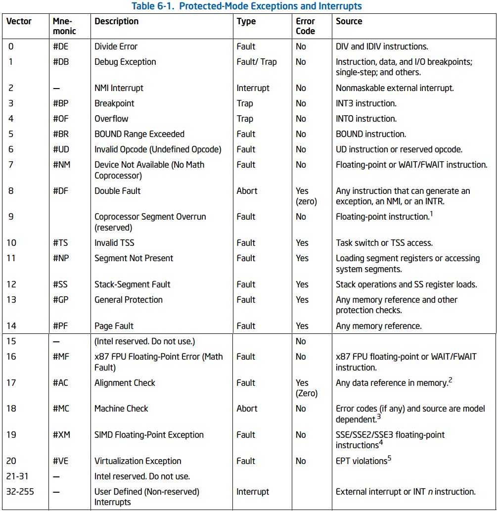

# 0x01 内核初始化过程
## main.c
110-113行 取之前从bios中读出的信息
* 根目录设备号：地址0x901FC处
* 磁盘信息： 地址0x90080处
* 扩展内存大小：地址0x90002处

**（这里有个地方我不是很清楚，为什么内存大小的计算是这样的）**
```
memory_end = (1<<20) + (EXT_MEM_K<<10);
memory_end &= 0xfffff000;
//第一行的EXT_MEM_K存储的是外存的KB数，所以要左移10位（乘1024），第二行用于4KB对齐
//但是为什么第一行要加个1MB，是因为原本的机器内存默认都是1MB么
```
114-122行 
* 如果内存大于16MB则视为16M
* 如果内存大于12M则把前4MB设为缓冲区
* 如果内存大于6M小于12M则把前2MB设为缓冲区
* 如果内存小于6M则把前1MB设为缓冲区

123-125行 如果定义了RAMDISK则调用**rd_init**初始化虚拟盘，并将前RAMDISK*1024字节内存划为虚拟盘
125-135行 调用初始化程序
* mem_init 内存
* trap_init 陷阱门
* blk_dev_init 块设备读写模块初始化
* chr_dev_init 字符设备初始化。。。不过这个函数是空的 （
* tty_init 初始化tty
* time_init() 初始化时间
* sche_init() 调度程序初始化

### 调用
#### RAMDISK初始化：kernel/blk_drv/ramdisk.c/rd_init()
**ramdisk.c的内容在0x03 块设备驱动程序详细说**
这里填充了一个叫 blk_dev_struct的数据结构，定义在kernel/blk_drv/blk.h 第45行，如下
```C
struct blk_dev_struct {
	void (*request_fn)(void);
	struct request * current_request;
};

```
填充的数组**blk_dev**是blk_dev_struct类型的，定义在ll_rw_blk.c，用于存储块设备的参数，这部分内容之后章节会提到
```C
/* blk_dev_struct is:
 *	do_request-address
 *	next-request
 */
struct blk_dev_struct blk_dev[NR_BLK_DEV] = {
	{ NULL, NULL },		/* no_dev */
	{ NULL, NULL },		/* dev mem */
	{ NULL, NULL },		/* dev fd */
	{ NULL, NULL },		/* dev hd */
	{ NULL, NULL },		/* dev ttyx */
	{ NULL, NULL },		/* dev tty */
	{ NULL, NULL }		/* dev lp */
};
```
看注释即可知道blk_dev数组第二项为内存的描述符，其**request_fn**函数用于处理对该设备的调用
rd_init()将blk_dev[1].request_fn初始化为ramdisk的处理函数**do_rd_request**
并且对ramdisk范围的空间进行初始化（写0）
#### 内存初始化：mm/memory.c/mem_init()
**memory.c的内容在0x07 内存管理详细说**
在memory.c中声明了一个数组mem_map用于标记页表的使用状况


* mem_init将映射0-1MB的内存页表初始化为USED（0x64,即100）
* 剩余有内存映射的页表项初始化为0
* 对于超出内存大小的映射（如总内存只有12MB，但页表可以映射16MB内存），初始化为USED

#### 陷阱门初始化 kernel/traps.c/trap_init()
**traps.c在0x02 进程调度与系统调用会详细讲**
这里需要详细说明下IDT（中断向量表）中的几类不同中断

上文已经有过这张图，可以看出中断向量的类型是通过前4个字节的第10-8位指定的
x86中，对中断门的分类如下

* 任务门为101，用于指定下一个中断操作系统将调用的进程的TSS描述符
* 中断门为110，当中断发生时，跳转到中断处理程序，并清处理器IF标志（停止接收可屏蔽中断）
* 陷阱门为111，当中断发生时，跳转到中断处理程序，但不清处理器IF标志

而在linux中，对中断门多了一些细分
这里使用了GNU内联汇编，具体语法可以看[linux中x86的内联汇编](https://www.ibm.com/developerworks/cn/linux/sdk/assemble/inline/index.html)和[inline assembly - linux inside](https://0xax.gitbooks.io/linux-insides/content/Theory/linux-theory-3.html)
注：linux inside也是gitbook上一本讲linux内核的书，而且内核版本是4.1x的，很新，gitbook上有人翻译成中文了，我想有空的话应该也会去读一下（咕）
**常用的寄存器加载代码参数类型**
* a  eax
* b ebx
* c ecx
* d edx
* S esi
* D edi
* q 动态分配字节可寻址寄存器(eax/ebx/ecx/edx)
* r 动态分配任意寄存器
* g 通用有效地址(eax/ebx/ecx/edx/内存变量)
* A eax与edx联合组成64位寄存器
* m 内存地址
* o 内存地址加偏移值
* I 常数0-31
* J 常数0-63
* K 常数0-255
* L 常数0-65535
* M 常数0-3
* N 使用一字节常数
* O 常数0-31

```C
#define _set_gate(gate_addr,type,dpl,addr) \
__asm__ ("movw %%dx,%%ax\n\t" \
	"movw %0,%%dx\n\t" \
	"movl %%eax,%1\n\t" \
	"movl %%edx,%2" \
	: \
	: "i" ((short) (0x8000+(dpl<<13)+(type<<8))), \
	"o" (*((char *) (gate_addr))), \
	"o" (*(4+(char *) (gate_addr))), \
	"d" ((char *) (addr)),"a" (0x00080000))
```
* **参数1 类型"i"** 立即数  0x8000+(dpl<<13)+(type<<8) 即填充了第一个4B的低16位，其中**P=1**，**DPL=0,1,2,3**，实际用到的只有0和3 **TYPE=15(1111,trap gate),14(1110,interrupt gate),5(task gate)**
* **参数2 类型"o"** 地址 *((char *) (gate_addr))
* **参数3 类型"o"** 地址 *(4+(char *) (gate_addr))
* **参数4 类型"d"** 表示该内容提前装入edx，(char *) (addr)
* **参数5 类型"a"** 表示该内容提前装入eax，(0x80000)
因此这段代码可以翻译如下
```C
void _set_gate(gate_addr,type,dpl,addr)
{
    *((char*)gate_addr) = 0x00080000 | (addr&0xffff);    //0x00080000用于设置段选择子为cs，
                                                         //注意这里addr为低16位
    *((char*)(gate_addr+4)) = (addr&0xffff0000) | (0x8000 | (dpl<<13) | (type<<8));
}
```
所以下面这几个设置门的函数就很清楚了
```C
//设置中断门，特权级0
#define set_intr_gate(n,addr) \
	_set_gate(&idt[n],14,0,addr)
//设置陷阱门，特权级0
#define set_trap_gate(n,addr) \
	_set_gate(&idt[n],15,0,addr)
//设置陷阱门，特权级3
#define set_system_gate(n,addr) \
	_set_gate(&idt[n],15,3,addr)
```
这里可以看到，linux中，特权级为3的陷阱门称为**系统中断门**，一些用户态的异常使得程序需要进入内核态进行异常处理就通过这个门实现（如int3，这个中断即调试器普通断点的原理）
##### trap_init()
该程序主要流程
* 初始化了intel保留中断（0-31）如下

该内核版本的时代中断号只到16（上面那张图是我从最新的手册上扒下来的），因此17-31为reserved
* 32-48号也初始化为reserved，等待各硬件初始化时设置中断门
* 45号 协处理器中断门
* 设置8259A主芯片允许IRQ2，从芯片允许IRQ13
* 39号 并行口陷阱门
#### 块设备读写模块初始化：kernel/blk_drv/ll_rw_blk.c/blk_dev_init()
**ll_rw_blk.c内容将在0x03 块设备驱动程序详细说**
这里只干了一件事，初始化了块设备请求队列，数据类型为**request**
初始化队列每一项的**dev**字段为-1，**next**字段为NULL

#### tty初始化 kernel/chr_drv/tty_io.c/tty_init()
**tty_io.c详细内容将在0x04 字符设备驱动程序讲到**
调用了同目录下**serial.c**的rs_init()和**console.c**的con_init()
##### rs_init()
设置0x24号中断为串口1
设置0x25号中断为串口2
配置串口1（设备号0x3f8）
配置串口2（设备号0x2f8）
允许主8259A的IRQ3和IRQ4
##### con_init()

#### 时间初始化：init/main.c
从BIOS直接读取时间数据
tm结构体如下
```C
struct tm
{
    int tm_sec;   // seconds after the minute - [0, 60] including leap second
    int tm_min;   // minutes after the hour - [0, 59]
    int tm_hour;  // hours since midnight - [0, 23]
    int tm_mday;  // day of the month - [1, 31]
    int tm_mon;   // months since January - [0, 11]
    int tm_year;  // years since 1900
    int tm_wday;  // days since Sunday - [0, 6]
    int tm_yday;  // days since January 1 - [0, 365]
    int tm_isdst; // daylight savings time flag
};
```
80-87行 读取BIOS数据，这里要求读取前后tm_sec字段值相同，否则会反复读
88-93行 转化BIOS中存储的BCD码为16进制
94行 对月份-1，因为内存中存储的月份值为0-11
95行 kernel_mktime()定义于mktime.c，将BIOS中存储的时间（年月日）转换为unix时间（相对1970年的秒数），这里有个有趣的现象，BIOS时间中年份是用两位BCD存储的，因此会导致千年虫问题
#### 调度程序初始化 kernel/sched.c
**sched.c内容将在0x02 进程调度与系统调用讲到**
390-391行 若sigaction结构体长度不等于16则提示