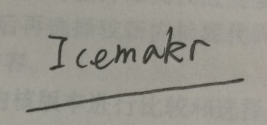

咕了一学期，终于又想起要看这本金老板传下来的书了
[电子版](http://vdisk.weibo.com/s/yZGRD43Uoo_8H) 可以直接看
[源码](http://www.oldlinux.org/Linux.old/Linux-0.11/sources/system/) 可以在这里下到
虽说用的内核是0.11的上古版本（启动代码还有一些上古芯片的操作）
不过主要的设计思想还是相通的
立下flag，日更，咕了我是苟

## 一直学习就好了

**当然了这篇帖子不可能把整本书的内容全部讲一遍，推荐的食用方式是看一遍书，然后看看帖子里的总结之类。**
**emmm。。。其实本来就是当做自己记的读书笔记**