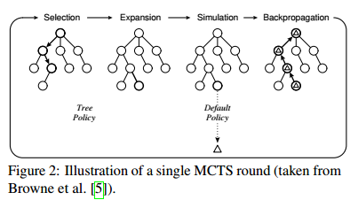
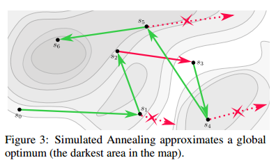

## Syntia: Synthesizing the Semantics of Obfuscated Code

### 技术背景

#### 蒙特卡洛树搜索

蒙特卡洛树算法对于游戏AI有着很深远的影响，树的每个节点都表示一个游戏的状态

主要有四个步骤

* 选择  从根节点开始，往下遍历最优的子节点，直到某个可扩展的节点
* 扩展  扩展被选择的节点
* 模拟  每个节点将会有一个reward值，而每个节点表示的状态将继续随机模拟直到游戏结束，结束的结果将确定一个reward值
* 反向传播  通过上述过程模拟得到的路径，算法将沿着这条路径根据结果的reward值进行更新

算法终止的条件为：时间/迭代次数达到限制、一个较优结果被找到

其中选择较优子节点的问题被称为 multi-armed bandit problem（被译为多臂老虎机问题），这里赌徒需要在不知道概率分布的前提下尝试选择众多老虎机中的一台使自己的收益最大化

此外根据一些文献，蒙特卡洛树的置信上界可以在探索（exploration）和开发（exploitation）间得到较好的平衡，公式如下
$$
\overline X_j + C \sqrt{\frac{ln \ n}{n_j}}
$$
$\overline{X_j}$ 表示子节点j的平均reward（average reward），n表示当前可见的节点数，$n_j$ 表示子节点j的子节点数，C是探索常数。

平均reward也被称为开发系数（exploitation parameter）

当C减少时，搜索会倾向于直接找那些有高reward值的节点；当C增加时，搜索倾向于模拟那些被较少探索过的节点

#### 模拟退火算法

模拟退火算法的主要思想是通过提升最初的候选解及探索周边是可行解来得到近似全局最优解。为了防止在局部最优解收敛，该搜索过程由一个下降温度T所引导，使得算法随着时间推移降低接受较差候选者的概率

上图演示了模拟退火算法搜索最优解的过程。初始状态是s0，算法总是会接受更优的候选解，此外会根据退火温度的高低和候选解的cost值来以一定概率接受较差的解。如在s2状态时，s3显然更差，但依然被接受。但对于s4和s5，由于温度的下降使得接受的概率越来越低

### 感兴趣的论文

* ROLLES, R. Unpacking Virtualization Obfuscators. In USENIX
  Workshop on Offensive Technologies (WOOT) (2009).  

  静态分析

* BANESCU, S., COLLBERG, C., GANESH, V., NEWSHAM, Z.,
  AND PRETSCHNER, A. Code Obfuscation against Symbolic Execution Attacks. In Annual Computer Security Applications Conference (ACSAC) (2016).  

* COLLBERG, C., THOMBORSON, C., AND LOW, D. Manufacturing Cheap, Resilient, and Stealthy Opaque Constructs. In ACM
  Symposium on Principles of Programming Languages (POPL)
  (1998) 

  不透明谓词构造

* 