### 一些术语解释

* address-taken function  一个将变量地址作为参数的函数，即它可以通过该地址改写函数作用域之外的变量

### Evaluating Real-World Disassembly

#### Binary Test Suite

* 平台
  
  * Linux
  
  * Windows

* 编译器
  
  * gcc v5.1.1
  
  * clang v3.7.0
  
  * VS2015

* 架构
  
  * x86
  
  * x64

* 数据集
  
  * SPEC CPU2006 C and C++ benchmarks
  
  * glibc-2.22
  
  * 一些服务器
    
    * nginx v1.8.0
    
    * lighthttpd v1.4.39
    
    * opensshd v7.1p2
    
    * vsftpd v3.0.3
    
    * exim v4.86

* 编译选项
  
  * O0 O1 O2 O3 （gcc clang VS）
  
  * Os （gcc clang）
  
  * -flto （64bit gcc）
  
  * strip后的二进制

选取数据集的依据如下

* 包含了大量真实的C和C++程序，从较小的程序到较大的都有

* 这些程序也在很多其他工作的evaluation中被使用

* 包含很多高度优化的代码，如手写汇编和一些复杂结构

* SPEC CPU2006在linux和windows上都能编译，因此可以用来公平对比gcc clang和VS

#### Disassembly Primitives

本文主要分析反汇编器的五个原语（primitive）

* 指令

* 函数开头

* 函数签名（function signature）

* CFG准确率
  
  由于不同的反汇编器可能使用不同类型的CFG（有针对函数的也有针对整个binary的），因此本文定义了 Interprocedural CFG（ICFG），其由函数级的CFG相连接组成
  
  本文在测试时重点注意了一些不容易被解析的bbl，如address-taken函数的开头，以及通过跳转表到达的bbl

* Callgraph准确率
  
  反汇编器一般只考虑由直接跳转组成的callgraph

#### Complex Constructs

主要考虑了下列复杂结构

* Overlapping/shared basic blocks

* Overlapping instructions

* Inline data and jump tables

* Switches/cases blocks
  
  因为一般都使用间接跳转

* Alignment bytes
  
  一些仅用于对齐的无意义字节

* Multi-entry functions

* Tail calls
  
  这种情况下函数不以ret作为结尾，而是直接jmp到另一个函数

#### Disassembly & Testing Environment

测试了9种反汇编器

* IDA Pro v6.7

* Hopper v3.11.5

* Dyninst v9.1.0
  
  只支持ELF

* BAP v0.9.9

* ByteWeight v0.9.9
  
  只用于测试函数开头

* Jakstab v0.8.4
  
  只支持x86

* angr v4.6.1.4
  
  因为angr是针对x64进行优化的，因此不测试其x86的结果

* PSI v1.1
  
  只支持ELF

* objdump v2.22

#### Ground Truth

* ELF
  
  使用DWARF信息收集函数及其参数列表信息
  
  使用DWARF提供的指令地址信息和capstone对指令进行还原
  
  上述措施可以解析二进制文件中98%的代码段中的字节，剩下的经过人工分析发现大多是控制流无法到达的用于alignment的代码

* PE
  
  pdb文件可以提供与DWARF类似的结果

### Disassembly Results

#### Application Binaries

##### SPEC CPU2006 Results

###### Instruction boundaries

下图表示了反汇编器正确还原的指令的占比（即TP）

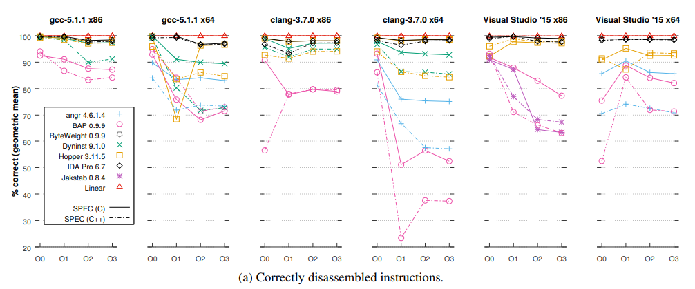

* Linear disassembly
  
  可以看到，linear方法具有很高的准确性
  
  特别是对于gcc和clang。这是因为gcc和clang会把诸如跳转表等信息放在.rodata，而VS会使用inline data。此外由于x86/64 resynchronize的性质，FN也很少

* Recursive disassembly
  
  准确率最高的是IDA。主要丢失的指令是一些alignment code，如gcc/clang中的nop和VS中的int3
  
  FP概率普遍高于Linear方法

* C versus C++（实线C 虚线C++）
  
  对于表现较差的反汇编器，两者存在比较大的差异，但对于表现好的几乎没有差别
  
  使用clang编译时差异最大

###### Function starts

下图展示了反汇编器正确识别的函数占比（TP）

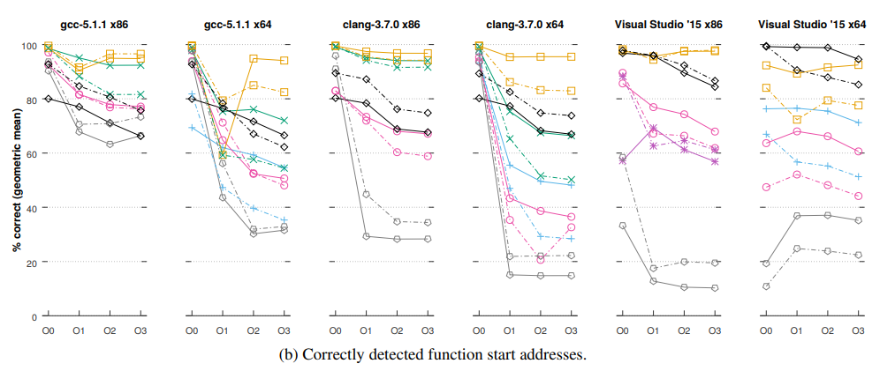

可以看到，如Hopper和Dyninst的TP较高，但代价是它们的FP也较高，如下图

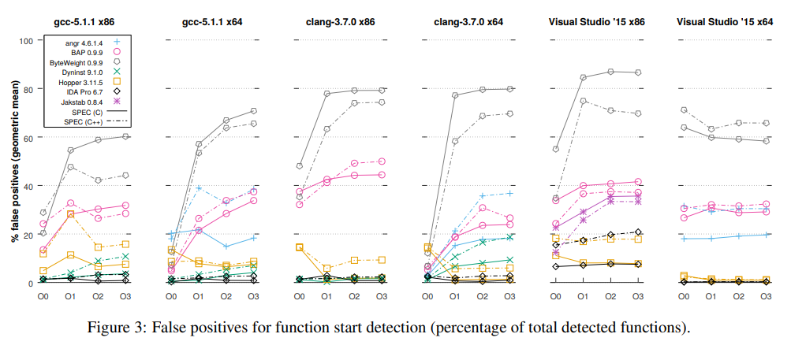

* False negatives
  
  主要是由间接跳转和tail call导致的。这也解释了TP随优化等级上升显著下降的原因
  
  Listing1是间接跳转的一个例子

* False Positive
  
  导致FP的原因有多种
  
  * Dyninst  主要是因为错误地匹配了函数序言
    
    * 如Listing2的例子，Dyninst匹配了push r15，但忽略了前面的push rbp
    
    * 如Listing3和Listing4的例子，Dyninst错误地将 `ret;nop` 序列后的指令当做新的函数，但实际上只是一个含有多个exit的函数体，nop只是一个padding
    
    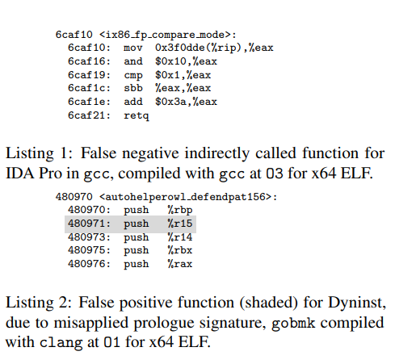
    
    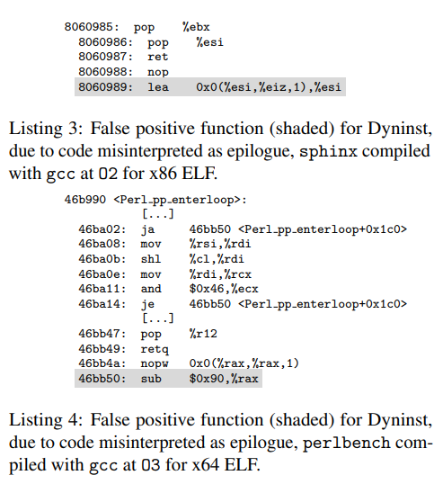
  
  * Hopper  主要出现在没有被其他指令直接引用的padding代码后，或direct jmp后。因为Hopper将符合这种条件的直接视为函数开头
    
    * 如Listing5，符合该模式的代码经常出现在switch语句的case块中
    
    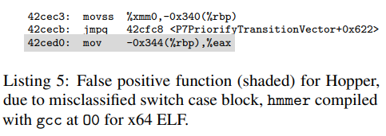
  
  * IDA  主要的FP与Hopper相同，但出现的概率小很多

###### Function Signatures

只有IDA提供了该检测，下表显示了对函数签名检测的TP

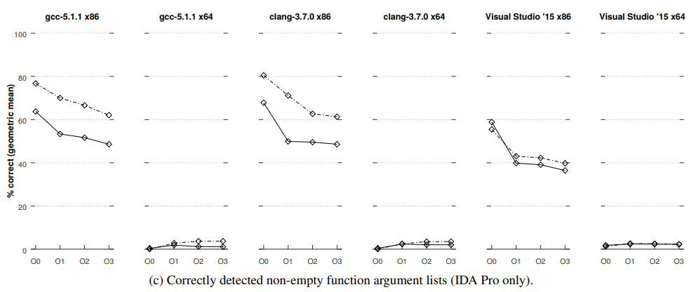

可以看到，x86与x64存在极大的差别，因为x64的参数都是通过寄存器传的。此外，随着编译优化等级的提升，准确率下降

###### Control Flow Graph accuracy

下图展示了ICFG中各个bbl的准确性

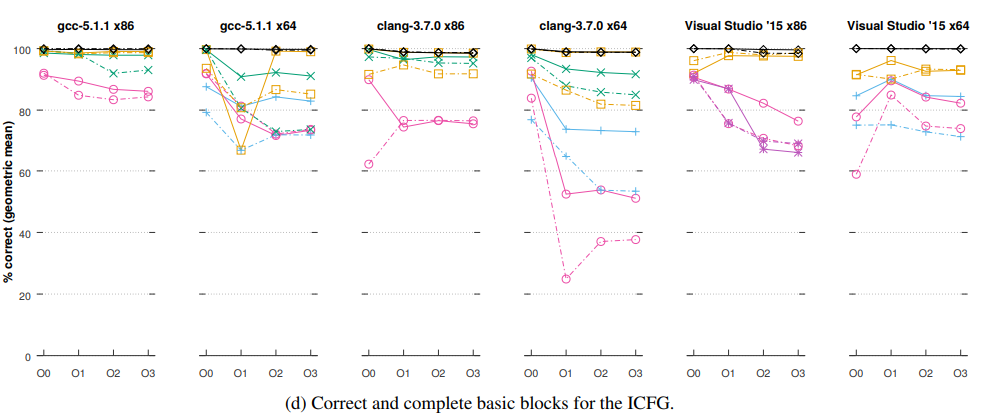

ICFG的还原准确度强依赖于对指令的还原准确度

* IDA  对于gcc和clang，x64的结果比x86差了一些，这与前面讨论的指令和函数识别准确率在这两者的表现上一致，也说明了ICFG还原准确率与这两者正相关

###### Callgraph Accuracy

下图显示了不同工具对callgraph还原的TP，注意这里的callgraph只考虑直接跳转，且不考虑address-taken函数

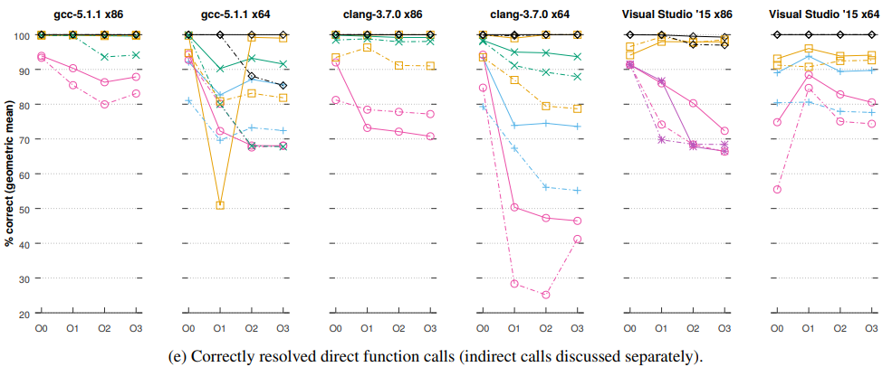

识别率最高的三个是IDA Dyninst和Hopper，这也说明了函数识别的准确率降低主要是由于对函数的间接调用

##### Server Results

这里由于篇幅只展示了IDA的结果，其他工具的准确率结果与前面对SPEC的测试类似

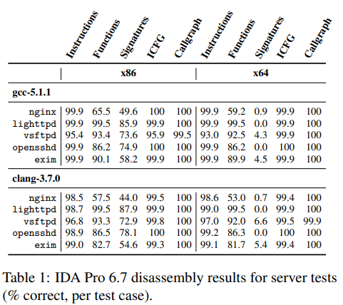

##### Prevalence of Complex Constructs

下图表示了各种complex constructs出现的情况

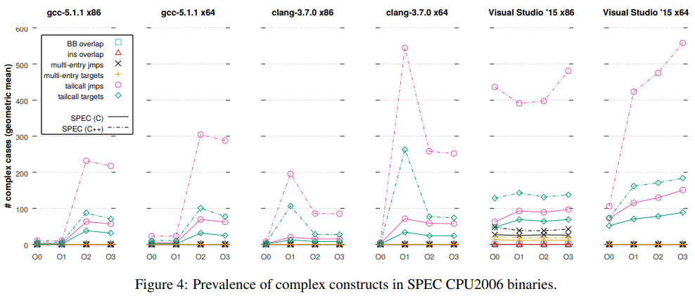

* 不存在overlap block

* overlap instruction只极少地出现在windows中

* Multi-entry function出现得相对多一些，主要出现的情况是在main函数前有一些可选的basic block可能在main前被执行，并跳转到main函数的prologue后继续运行

* tailcall出现得很多，其会显著影响函数识别。一般优化等级越高tailcall越多

* jump table出现得最多，但只有在VS中以inline data的形式出现

##### Optimizing for Size

对于Os，也不会出现overlap block的情况，且各项测试的结果与前面O2 O3的结果类似

#### Shared Library Objects

主要分析glibc-2.22，架构x64，优化等级为O2。该库也被其他工作引用以作为较复杂的case分析

##### Disassembly Results

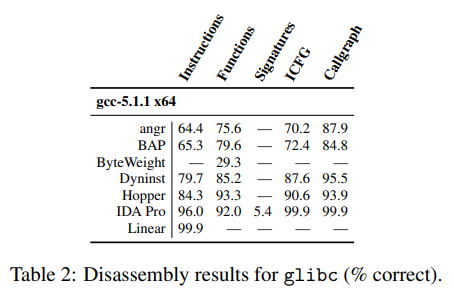

* instruction识别的准确率与前面的相比都有所下降，只有IDA结果比较好

* 函数识别准确率则相当，甚至有所上升。其中IDA对于函数签名的识别率高于前面的SPEC，这是因为IDA专门对glibc做了签名

* ICFG和callgraph准确率也都有所下降

##### Complex Constructs

glibc-2.22没有出现overlap block，也没有出现inline的jump table，甚至对于手写汇编的jump table也放在.rodata。这是因为glibc对于类似的编程方法进行了一定的改进（老版本的glibc存在诸如inline的jump table）

但发现了一些overlap instruction，如Listing6，这里使用条件跳转来决定是否忽略lock前缀

此外还存在tail-call和multi-entry，如listing7，在main函数前置了一个bbl，若调用该bbl则会创建线程安全的变量，该bbl会跳过main函数的prologue

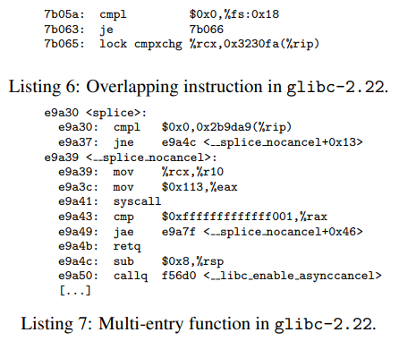

#### Static Linking & Linker Optimization

静态链接一般会使反汇编器的性能下降，因为它将复杂的库函数直接编译进二进制。此外现在link-time optimization（gcc -flto）技术开始普及，它在链接时将库函数代码与原程序的代码一起优化，使得反汇编器的性能更差

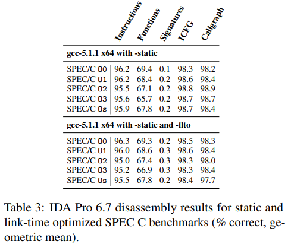

上图的IDA对于静态编译的SPEC的结果

* instruction  降低了3%，优化等级则几乎不影响；-flto没太多影响

* 函数识别  对于优化等级低的情况，有显著下降；而对于优化等级高的则没有太大区别；-flto也没太多影响

* ICFG/Call graph  同样对优化等级低的影响大，-flto没太多影响

### Implications of Results

这里讨论上面evaluation的结果对于三个二进制研究方向的启示

#### Control-Flow Integrity

CFI技术用于保护控制流不被篡改（主要是间接跳转），该技术依赖binary instrumentation技术来对控制流插入保护代码

这里将间接跳转的类型分为三类讨论

##### Indirect calls

要保护间接call，则需要同时对call的调用方（call site）和目的地址插入保护。对于call指令的识别准确率还是很高的（即使文中提到VS存在一小部分call site无法识别的情况），因此主要的难题在于识别间接call的目的函数，从前面分析可以看出，目前工具对于该问题的准确率较低

此外，细粒度的CFI技术还需要判定对于每个间接call，有哪些函数是合法的目标。这需要构建准确的ICFG，包括识别跳转表。先前的结果表明这两步工作都可以以较高的准确率达成

正确的函数签名则可以促进细粒度的CFI技术，原理很简单：拥有函数签名的信息可以使得程序快速将签名不同的函数排除，从而减小合法目标的集合

##### Indirect jumps

与Indirect call的需求类似，唯一区别是Indirect jump一般是程序内的，这使得其对跳转表识别的要求较高，而对函数识别的要求较低

##### Return instructions

使用影子栈（shadow stack）来保护ret指令，因此需要对所有的call/ret和tail-call的jump进行追踪。得益于反汇编器对于指令识别的准确性，准确而完整地识别这些指令是可行的

##### Summarizing

总之，Indirect call是最有挑战性的一项工作，因为

* 函数识别（特别是间接调用的函数）是最不准确的原语之一

* 函数签名信息非常难以还原

#### Decompilation

由于大多数反编译器在函数粒度上工作，因此对于函数识别的要求很高，因此也对函数CFG还原准确率的要求很高。此外，反汇编对函数开头的识别实际上不是非常敏感，但需要较准确的函数末尾识别，这其实比函数开头识别还难，特别是考虑tail call的情况

指令识别重要性没有CFI那么大，因为一般来说反编译是用来做人工分析的，但一些反汇编的错误会影响反编译进程，如影响栈分析和数据类型分析

函数签名的信息可以极大提升反汇编结果

跳转表识别对于还原switch指令则是必不可少的

call graph可以让人更好地理解函数间的调用关系

#### Automatic Bug Search

大多数这种系统工作在函数粒度，因为对于大多数函数来说它的粒度恰好，如对于一些基于栈的bug，也方便使用符号分析等技术进行进一步分析

大多数自动bug搜索系统都依赖函数边界检测和函数CFG，但函数信息和CFG的不完善主要影响的是bug分析的完整性，对于准确性则没有太多影响

### Disassembly in the Literature

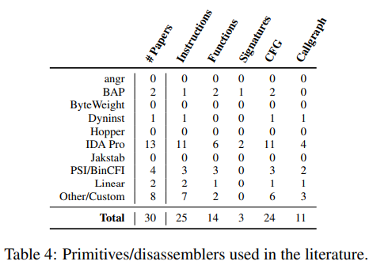

这里对从2013到2015的四大顶会和RAID ACSAC中用到反汇编器的文章进行了总结，包括其使用了哪些反汇编工具，以及使用到的原语

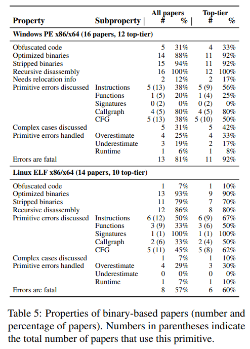

上图更系统化地梳理了这些文章针对的平台、针对的文件类型、使用到的技术以及对特殊情况和错误处理的讨论

之后，文章总结了这些paper中三种常用的错误处理方式

* Overestimation  如对CFG和callgraph采用过拟合处理很常见，采用尽可能多地建立有效边的处理方式

* Underestimation  当准确率要求高于完整性时使用

* Runtime augmentation  使用runtime check来修正错误

### Discussion

对于复杂结构

* gcc和clang生成的文件没有inline的jump table，而VS则有，但如IDA可以准确识别

* overlap instruction和multi-entry function十分少见，且目前发现的形式可以被IDA和Dyninst正确处理

* overlap block目前没发现

对于几种反汇编的原语

* 指令还原过程准确率很高，特别对于gcc和clang生成的ELF

* 递归反汇编在优化等级高的文件中会错过很多代码

* 64位的函数签名很不准确

* 函数识别在很多工作中需要，但FN和FP都很高，特别对于优化等级高的文件。符号表会极大改善这个问题
