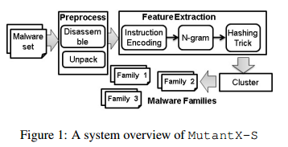
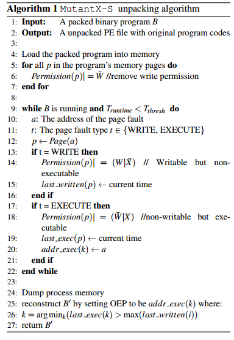

### Architecture

分为如下几步

* 数据集  使用PEID来获取到恶意软件的数据集

* 预处理  使用generic unpacking算法获取原始二进制文件，并进行反汇编

* 特征提取
  
  * 指令编码  将原始指令编码，以提取语义
  
  * N-gram  再将指令编码转换为N-gram，构造特征向量
  
  * Hashing Trick  压缩特征向量来提高效率

* 聚类算法

### Generic Unpacking Algorithm

#### 脱壳

大致过程如下

* 加载加壳后的程序，DLL注入，将所有段改为可执行但不可写

* 继续执行加壳后的程序，当程序触发一个写异常，则将该页标识为dirty，并该权限为可写但不可执行

* 若程序之后又触发了页不可执行异常，说明捕获到了一个“写后执行”的过程。但对于一些高级壳，可能存在多次的解密/解压。因此这里再次为该页面加上可执行权限，去除可写权限。此外还会对新分配的页面进行监控

* 在执行到程序结尾，或执行一段时间后dump程序

#### 获取OEP

但获取程序的OEP仍是一个难题，一些壳会进行一些诸如分段解密的操作。因此这边使用了一种名为LMFE（Last Modification First Execution）的heuristic。思路是对每个内存页记录如下信息

* 最后一次修改时间（即写异常发生的时间）

* 最后一次执行异常发生的时间

* 触发异常的地址

于是可以将内存页分为三种

* 被修改过也执行过的页

* 被修改过但没执行的页。可能是数据，也可能是还没被执行的代码

* 没被修改过也没被执行过的页。可能是只读数据或packer本身的代码

可以推断，第一种页是OEP可能出现的页，假设P(i)是所有这一类型的页，当k满足

$$
k = argmin_k(\ last\_exec(k) > max(last\_written(i))\ ) 
$$

则说明OEP为P(k)页面中的`addr_exec(k)`，即最后一次触发该页执行异常的地址

论文给出了一个证明，简单描述如下

* 对于简单的packer（如UPX），会直接将原程序全部解密后再执行，于是当所有页面的最后一次写入发生后（即公式里的`max(last_written(i)`）的第一次执行即为OEP

* 对于复杂的packer，这里假设它们的行为是会在一些内存中写入一些垃圾指令，并执行这些指令来混淆。这种情况下依然可以适用刚刚那个公式，因为对于上述情况，执行完垃圾指令后依然会跳回unpack程序继续解密，直到全部解密完并跳到OEP，这样也符合上面公式描述的行为

### Feature Extraction

这里主要用了指令的opcode来做特征，之后花了比较大的篇幅叙述为什么不直接分析binary和为什么使用opcode而不是很多其他工作使用的mnemonic

之后将上面的opcode序列转换为n-gram作为特征向量，从而使用欧几里得距离来计算特征向量的相似度

$$
d(m,n) = ||\ V_m - V_n\ || = \sqrt{\sum_{i=1}^{|S|} (\ V_m(i) - V_n(i)\ )^2}
$$

### Clustering Algorithm

#### Hashing Kernel

一般在机器学习中，hashing kernel的用途是将特征由低维升到高维，从而使其可以在高维被线性划分（SVM的做法）

但这里需要反过来，用于降维，因为原始的n-gram信息维度太高，其维度D有

$$
D = |o|^N
$$

其中o代表指令的空间，所以 |o|>200

所以需要采用hashing算法降维，这里的降维函数H

$$
H:\{N-gram\} \rightarrow [1..m]
$$

（从前面的图看似乎就是直接把opcode给连起来了，从后面的evaluation看是使用了不同的hashing算法测试）

所以使用了hashing后对应的函数值计算如下

$$
\phi_i(v) = \sum_{I:H(o)=i, I \in S} v(\xi(o))
$$

这公式意思其实就是若原始的特征向量v，hashing后得到的结果一致，就需要将对应的ngram值加到该hashing对应的值上

最后使用hashing后的值来计算距离

$$
d_{\phi} (M, M') = ||\ v-v' \ ||_{\phi} = ||\ \phi(v), \phi(v')\ ||
$$

#### Prototype-Based Clustering

这里介绍了Prototype-Based Clustering算法的原理
