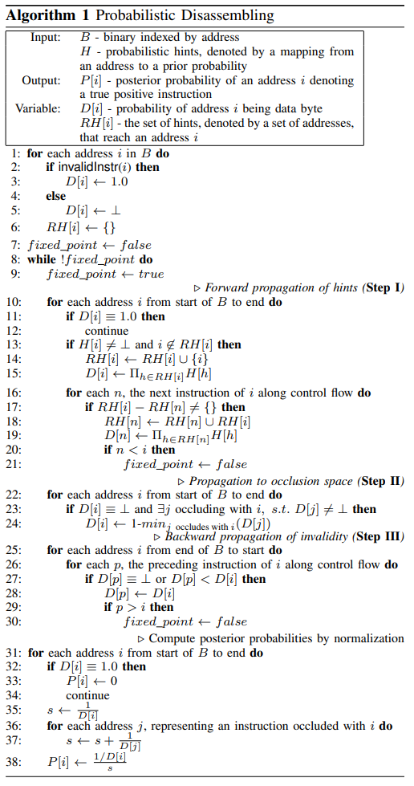

### 一些术语

#### 对于反汇编正确性的评价

* True Positive 真阳性  实际确实是指令，反汇编器也识别为指令，结果正确

* True Negative 真阴性  实际上不是指令，反汇编器也不识别为指令，结果正确

* False Negative  假阴性  实际上是指令，但反汇编器不识别为指令，结果错误

* False Positive  假阳性  实际上不是指令，但反汇编器识别为指令，结果错误

#### 其他

* hints  提示，本文用来表示实际指令中会出现一些上下文特征，应用这些特征可以确定该条指令的置信度

* occluded instruction  当一条x86指令的某个部分可能是另一条指令，或两条指令间可能发生重叠（overlapping），则称为occluded instruction

* probabilistic hints  文中用这些hints通过上下文关系来计算某个指令序列为TP的概率

### BACKGROUND AND MOTIVATION

#### Binary Code Disassembly

这里对比了几种反汇编方式

* Linear Sweep Disassembly
  
  如图，含有一些FP（由于错将数据当做指令）和大量FN（由于错过一些指令）

* Traversal based Disassembly
  
  无FP，大量FN

* Superset Disassembly
  
  无FN，非常大量的FP

#### Our Technique

本文提出的思路是：

* 首先通过Superset Disassembly获得无FN的反汇编序列

* 通过上下文和指令本身提供的“hint”（或者更类似于特征），计算哪些指令序列更有可能出现

首先，由于**该方法针对的是由正常编译器编译得到的程序**，所以有如下假设

> 若superset instruction中的某个序列是True Positive，则与该序列控制流相关的指令也应该是True Positive，且与这些相关序列存在公共字节的指令序列应该不是TP

### PROBABILISTIC CHARACTERISTICS OF X86

#### Observing Instruction Occlusion

##### 现实情况

这里举了个例子介绍了occluded instruction的情况

关于occluded instruction序列，在 [这篇论文][1] 中有一个重要结论：

> 多个occluded instruction序列倾向于快速收敛于某条公共的指令

就如上图所示，4个occluded instruction序列都在3条指令内收敛于同一条call指令上

文中的研究测试了2064个ELF文件，其中99.992%会在4条指令内收敛

##### 形式化证明

文中说由x86的编码规则做了一个形式化证明，说明：

> 对于指令序列 $i_0, \cdots, i_k$ 及其对应的字节数 $n_0, \cdots, n_k$ ，若某个occluded sequence的开头为 $i_0$ ，则它直到 $i_k$ 还没有收敛的概率**最大**为
> 
> $$
> \frac{1}{(n_0 - 2) \cdots (n_k - 2)}
> $$

如对于7条指令的序列，每条指令长度为5字节，则概率为

$$
\frac{1}{3^7} = \frac{1}{6561}
$$

（虽然我没想明白这个是怎么推的（这边n-2可能是因为opcode最高有3位），但我觉得他给的这个概率下界也太大了，以至于不太需要证明就知道真正的概率肯定小于这个概率。。。）

#### Observing Probabilistic Hints for Disassembling

这边定义了一系列称为 probabilistic hints 的规则，通过上下文来计算某条指令为TP的概率

##### Hint I: Control Flow Convergence

###### 特征

若对于两条跳转指令（instr1 instr2）和一条任意指令（instr3），两条跳转指令（instr1 instr2）的目的地址相同，且目的地址的内容大概率是指令（instr3），则认为这些指令序列为TP的概率很高

###### 概率分析

对于跳转指令，有8位、16位、32位三种，所以跳转的目的地址相同的概率分别为 $\frac{1}{2^8}  \frac{1}{2^{16}}  \frac{1}{2^{32}}$

##### Hint II: Control Flow Crossing

###### 特征

若对于两条跳转指令（instr1 instr2）和一条任意指令（instr3），instr1的目的地址为instr3，instr2的目的地址不为instr3，且instr2与instr3相邻，则认为这些指令序列为TP的概率很高

###### 概率分析

与上条hint类似

##### Hint III: Register Define-use Relation

###### 特征：define-use关系

若对于两条指令（instr1 instr2），instr1中声明了某个寄存器、内存或标志位的值，instr2中使用了该值

如图c，rdx和eax都构成了define-use关系

但图中a和b都存在def-use关系，因此进一步讨论如下

###### 概率分析

> **假设表示数据的字节是均匀分布**

为了讨论方便，这边做了进一步的假设

> 对于写入操作：假设一条指令有一半的概率将结果写入寄存器或一些标志位，另一半的概率写入内存
> 
> 对于读取操作：一条指令从寄存器读取的概率要远高于从内存读取，因为大多数内存读取指令也会涉及寄存器读取的操作。这边假设从寄存器读取的概率为0.99

下面讨论对于不同操作数的概率（论文里只讨论了这一种）

* 寄存器  因为每条指令可能使用8个寄存器，所以若指令序列中发现寄存器的def-use，则该序列为数据的概率为 $\frac{1}{2} * \frac{1}{8} = \frac{1}{16}$

##### 其他hint

###### control flow

在讲hintII时提到了这样一个hint

若一条跳转指令i的目的地址指向的位置，不在从i开始的occluded instruction序列中，则指令i是数据字节的可能性为 $\frac{1}{n}$ ，其中n为指令的平均长度。因为一条FP的跳转指令倾向于跳转到指令序列的中间。

类似的还有一些其他不那么强但可以创造一些指向性的hint

###### data flow

在讲hintIII时提到了这样一个hint

若一条指令将寄存器保存到某个内存地址，且下一条指令重新定义了该寄存器的值，称为register spilling

#### PROBABILISTIC DISASSEMBLING ALGORITHM

##### 原理

基于前面讨论的Instruction Occlusion和probabilistic hints，构建算法

基于几个设计思想

* Instruction Occlusion会在几条指令内快速收敛

* 当某条指令被多个序列（这里序列是跟随control flow的）的hint匹配，则认为这条指令是TP的概率很大，并称多个序列converge on这条指令。

算法的基本原理就是首先对各occluded instruction序列求概率（概率相关见下节），此后使用 *exclusion property* 筛选序列，该属性即：由于本文针对的仅是未混淆的代码，所以不存在指令overlap的情况，所以对于多个occluded instruction序列

* 若某个序列的TP概率远大于其他序列，则仅保留该序列，其他任何发生重叠的序列将被排除

* 若有多个序列的TP概率相似，则类似superset disassembly，保留几个TP概率较高的序列

由于Occlusion快速收敛的属性，序列会快速converge on某条TP指令，这会导致大多数occluded序列概率与TP序列相差极大，只对某些短且无特征的指令块例外。

##### 概率分析

假设指令序列目前分析到一半，对于先前的部分，由于hint h匹配而获得先验概率为p，则对于序列的下一条指令j，j的概率应该继承先前的分析得到的概率，所以j为数据的概率应小于等于p。

当多个hint converge on某条指令i，产生的先验概率为p1 p2 ... pn，则i为数据的概率应为

$$
D[i] = p_1 \times p_2 \times \cdots \times p_n
$$

##### Algorithm Details

###### 算法概述

输入

* B  二进制文件，是一个以地址为下标的数组

* H  probabilistic hints，是一个map，以地址为键，地址对应的指令的先验概率为值

输出

* P[i]  地址i的指令对应的后验概率，用于最终确定TP指令

变量

* D[i]  地址i的字节是一个数据的概率

* RH[i]  记录匹配到地址i的所有hint集合，这里集合中保存的是地址

算法主要分为三个步骤

* forward propagation of hints
  
  这一步匹配每条指令的hint，并进行前向传播。这一步利用了推论：
  
  > 控制流指向的地址一般也是一条指令

* local propagation within occlusion space
  
  这一步将每条指令i的概率传播到occluding with i的所有指令序列。这一步利用了推论：
  
  > 一条指令为TP指令的概率越大，则它的occlusion space中的其他指令为TP指令的概率越小

* backward propagation of invalidity
  
  这一步利用了推论：
  
  > 若i是数据的概率很大，则所有控制流可以到达i的指令序列为TP指令的概率很小

可以认为第一步是在识别指令字节，后两步则是在识别数据字节。

注意，该算法采用的前驱和后继指令是跟随控制流的，但不要求解析间接跳转。

###### 算法解析

* 初始化：若以地址i为开头的指令
  
  * 无法被正确编码，则D[i] = 1，即表示以该地址为指令起始的肯定是数据（这里需要注意，意思并不是地址为i的字节肯定是数据，而是如果最终occluded instruction序列中含有i地址，则该地址处肯定是数据）
  
  * 可以被正确编码，则 $D[i] = \bot$ ，表示目前没有更多信息
  
  此后初始化RH

* 循环，直到算法到达不动点
  
  * 步骤I，前向传播
    
    这里采用了前向分析，may analysis，主要的转换函数为
    
    $$
    \begin{aligned}
RH[n] &\leftarrow RH[n] \cup (RH[i] - RH[n])
\\
D[n] &\leftarrow \prod_{h \in RH[n]} H[h]
\end{aligned}
    $$
    
    * 遍历整个二进制文件中的每一个地址
      
      * 若D[i] = 1，则说明以i为起始地址的指令不存在，continue
      
      * 若H[i]不为空，且i不在RH中，说明i地址存在一个新的hint，需要进行前向传播
        
        将i添加到RH[i]集合，D[i] = RH[i]集合中所有地址h对应的先验概率（H[h]）的乘积
      
      * 跟随i的控制流向下遍历每条指令n
        
        * 若RH[i]与RH[n]的差集不为空
          
          * RH[n]为原来集合与RH[i]的并集（这里相当于把i引入的新hint继承给n）
          
          * 根据新的RH更新D[n]（同样是全部先验概率相乘得到后验）
          
          * 若任意n的地址小于i，则该轮前向分析必然无法到达不动点
            
            因为这说明控制流中有回跳，可能使得前向分析的输入状态集合IN改变
  
  * 步骤II，传播到occlusion space
    
    * 遍历二进制文件的每个地址i
      
      * 若 $D[i] = \bot$ 且存在i的occluding序列j， $D[j] \neq \bot$ 。首先条件说明了目前的传播中i没有被匹配到，其次因为存在被匹配到的occluding序列j，所以j比i更有可能是正确的指令，因此对i做如下的更新
        
        $$
        D[i] \leftarrow 1 - min_{j \ occludes \ with \ i} (D[j])
        $$
        
        原理也很简单，若j为指令的概率为p，因为i和j是occluded peer，所以i为指令的概率为1-p
  
  * 步骤III，反向分析
    
    * 遍历二进制文件的每个地址i
      
      * 沿着i的控制流，遍历i的所有前驱指令p
        
        * 若 $D[p] = \bot 或 D[p] < D[i]$
          
          * 说明我们从D[i]可以获得更强的证据证明p为数据。更新D[p]为D[i]，从而使前驱指令序列的D不小于D[i]
          
          * 若任意p的地址大于i，则该轮反向分析必然无法到达不动点
            
            因为这说明有跳转指向高地址，可能使得反向分析的输入状态集合OUT改变

* 算法到这里，程序分析的部分已经结束，下面输出某个地址i为TP指令的概率P
  
  * 遍历二进制文件的每个地址i
    
    * 若 D[i] = 1.0
      
      * 说明必然是数据，P[i] = 0
    
    * 否则对所有地址i的D[i]做归一化，输出归一化后的P

###### 举例

其中，AD是occluded with地址40057b的指令序列，BE对应地址40058c，CF对应地址4005d7

**预处理**

在预处理阶段，算法根据采用的hint填充了H映射，作为先验概率，如

* 1为寄存器的def-use，根据讨论的算法先验概率为1/16

* 2 3为register spilling

* 4 为寄存器def-use

* 5 为control-flow-crossing

* 6 为内存的def-use

对应的occluded sequence则没有匹配任何hint

**初始化**

* 初始化时 D[0x400583] 和 D[0x40057e] 为1，因为无法解析为指令

**step I**

* 由于400583指令不可用，hint 1无法向下传播，所以 $D[0x400584] = \bot$ ，对于AD也是一样

* 对于40058c，D[40058c] = 1/16，类似的，由于有3个hint匹配，D[40058d] = (1/16)^3。BE则完全没有hint匹配

* 对于4005db，由于2~6这几个hint都能影响到该地址，其拥有一个很小的D值 $D[4005db] = \frac{1}{2^{32}}$ 

**step II**

* 由于 $D[40058d] = \frac{1}{16}^3$ ，则对应的occluded序列BE，有 $D[40058e] = D[40058f] = 1 - \frac{1}{16}^3$

* CF对应的D则趋于1

**step III**

* 对于400583，反向传播使得前驱的几个指令（40057b~400582）都作为数据

* 因为 $D[40058d] = \frac{1}{16}^3$ ，而D[40058c] = 1/16，所以这边不会更新

**归一化**

最后进行的步骤就是归一化上述计算得到的概率

### IMPLEMENTATION AND EVALUATION

主要围绕几个问题做

* RQ1  该方法反汇编的准确性、完备性和效率

* RQ2  与superset disassembly的对比

* RQ3  当数据和代码interleaved时的表现（与线性下降算法对比）

* RQ4  当没有任何函数入口信息时的表现

数据集：

* BAP corpora

* SPEC2006INT  主要用于与superset disassembly作对比实验

* SPECint 2000  主要用于interleave的测试

#### RQ1

设计了4个实验

* 对2064个二进制文件测试FP和FN率

* 测试反汇编时间

* 分析每个hint的贡献

* 测试不同的后验概率阈值（因为当后验概率小于某个值时，算法会选择保留多个occluded sequence）

注：前三个实验的阈值是P >= 0.01

大多数FP率小于5%，对越大的文件FP率越低，FP率高的主要集中与小文件。平均FP率为3.7%

平均反汇编时间大概在4~8分钟，确实较慢

蓝色表示仅使用控制流的hint，黄色表示仅使用数据流的hint，红色表示都使用。横轴表示FP率，纵轴表示有多少二进制文件的FP率在该区间

纵轴（右）表示FN和FP率，其中蓝线表示FP，红线表示FN

纵轴（左）表示有多少百分比的函数被正确解析

如x轴的最小值为0.67%，说明P>=0.0067时我们会保留指令。对应的FP为4%，FN为0%，53.23%的函数被精确识别并反汇编

#### RQ2

与superset disassembly的主要区别在于FP率和rewrite后的膨胀率

#### RQ3

测试方法是用VS2017开启不同优化级别对SPECint 2000生成不同的二进制文件。与objdump进行对比

objdump丢失了3095条指令，该方法丢失0条。

该方法对于O1 O2 Od和Ox的平均FP分别为 5.95% 8.84% 5.76% 8.98%，总平均8.12%

#### RQ4

在没有函数信息的前提下（该方法相应地删去一些函数上下文相关的hint）

平均FP率为6.8%，FN为0%

### 一些相关的文献

[1]: Obfuscation of executable code to improve resistance to static disassembly
