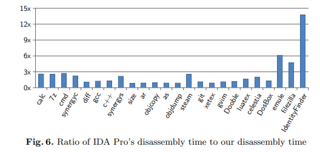

### Disassembler Design

问题定义：给定一个二进制串，其中包含有指令串，需要给出最可能包含正确的反汇编的结果

#### Shingled Disassembler

##### 一些形式化的定义

###### 定义1 Shingle

> shingle是指一串能被解码为一条机器码的字节串。shingle可能发生overlap

这边定义了shingled disassembler，用来解析所有的可能shingle的反汇编器，实际上跟就是superset disassembler（虽然这篇文章比superset早）

###### 定义2  Fall through

当shingle x会执行到shingle y，则产生 $x \rightharpoondown y$

###### 定义3  Unconditional Branch

这里对无条件分支的定义是，它是一个无条件，且操作数是立即数的无条件跳转指令

###### 定义4  Static Successor

当 $x \rightarrow y$ ，或x是一条条件/非条件跳转，且目的地址是确定的y，则称y是x的Static Successor，记为

$$
S(x) = \{ y | (x, y) \ is \ static \}
$$

###### 定义5  Postdominating Set

对于Shingle x的Postdominating Set，是一个关于x的传递闭包S（transitive closure，意思应该就是能从x fall through的所有目的地址的集合）

若x处是一个到非法地址的静态跳转，则 $P(x) = \perp$

###### 定义6  Valid Execution Path

所有P(x)中的路径都被认为是Valid Execution Path

**Lemma 1  Invalid Fall-through**

$$
\langle \forall x, y :: x \rightharpoondown y \wedge y := \empty \rightarrow x:=\empty \rangle
$$

其中这边的 $\empty$ 就表示该字节是一个数据字节

这条规则表示了invalid过程的反向传递性：若一条路径上有一条指令被标记为invalid，则该路径上所有的指令都应被标记为invalid

###### 定义7  Sheering

若 $\forall y :: x \rightharpoondown y$ ，y都被标记为数据，则x也被标记为数据，且称x is sheered from the shingled disassembly

##### 解析Shingle

###### 实例

* 第一轮从第一个字节开始反汇编，并标记路径上的所有instruction boundary
* 第二轮从下一个未标记的字节出发（这里是第二字节），接下来重复该过程
* 如图d，表示了当反汇编器遇到了一条invaild指令，反向将前一条指令invalid的情况

##### Code/Data Modifier

该算法使用一些heuristic来计算当前shingle为代码或数据的可能性。主要使用下列heuristic

* 若a是一条直接跳转，a'是其目的地址，则a’更可能是一条指令
  
  这里长跳与短跳由于操作数长度的不同，分配了不同的概率

* 若三个shingle最终都互相fall through，并匹配了一些常见的代码片段（如函数序言），则这三个shingle都更有可能是代码

* 若地址a和a+4都编码了某个地址，该地址是某个shingle的引用，则a到a+7更可能是数据
  
  迭代引用该heuristic，可以解析出类似跳转表的内容

##### 具体算法

这里主要就是展示了前面解析shingle的算法

这里G重建了所有可能路径的CFG，因此是一个图的超集。若遇到解析失败，则节点指向一个特定的bad节点

该算法复杂度为O(n)

#### Opcode State Machine

这里使用反汇编二进制文件中的opcode序列训练了一个概率的FSM（有限状态机）。数据是以基本块作为切分的

#### Maximum-Likelihood Execution Path

这里计算一条路径的likelihood的方法比较直观：找到一个receiving state（可以是多个shingle的公共序列，也可以是作为FSM结尾的非条件跳转）

注意，这里单条指令的likelihood是由FSM提供的先验概率和Code/Data Modifier中heuristic提供的后验概率计算而成的

令r为receiving state，xi为触发r的指令，Pr(pred(xi))表示xi的前驱路径中概率最大那条的概率，cm和dm为modifier计算的该路径上的code概率和data概率。则

$$
Pr(r) = Pr(pred(x_i)) * \frac{cm}{dm}
$$

或当xi为一条分支语句时

$$
Pr(r) = Pr(pred(x_i)) * \frac{cm}{dm} * Pr(db_i) * Pr(db_r)
$$

其中Pr(dbi)表示xi指令后是一个数据的概率，Pr(dbr)表示r的前驱是一个数据的概率

因为跳转指令后可能是数据，跳转目的地址的指令前也可能是数据。这两个概率就是考虑到了这种情况

最终得到的execution path的概率为

$$
Pr(s) = Pr(r_0) Pr(r_1) ... Pr(r_i) ... Pr(r_k)
$$

则最终优化目标为

$$
s^* = arg max \ Pr(s) \ \ \ s \in S
$$

### Evaluation

#### Broad Results

这边与IDA进行比较

下图列出了IDA未识别，而本文识别为指令的情况

下图列出了IDA和本文方法都识别为指令的百分比（这个实验应该主要是用于确定本文方法的准确性，因为IDA使用的方法输出结果是较为准确的）

下图比较了处理时间

最后还设计了一个实验比较动态方法和静态方法的区别

首先用ollydbg记录trace，此后将记录的trace结果与IDA、本文方法以及一个动态分析工具VDB作比较，其中IDA和本文方法准确率为100%，VDB则只有15~35%
