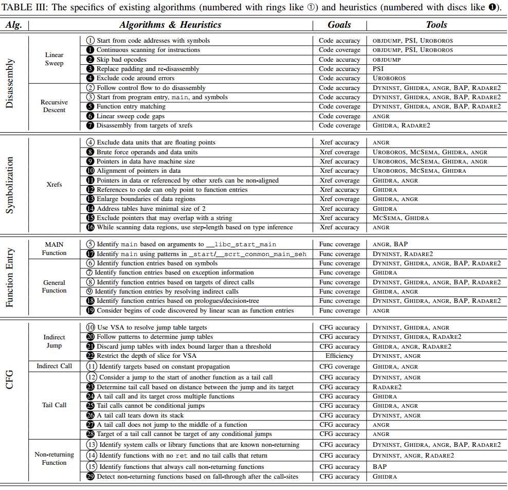
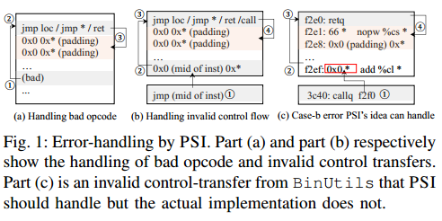
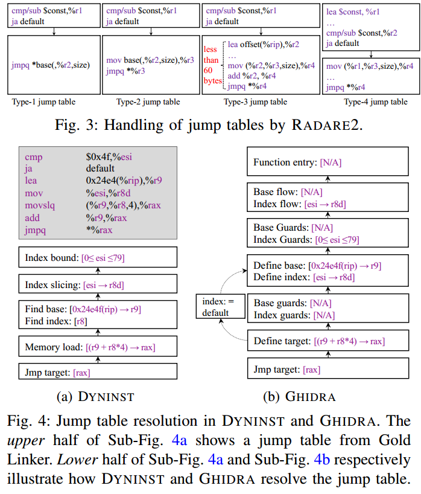

## SoK: All You Ever Wanted to Know About x86/x64 Binary Disassembly But Were Afraid to Ask

### Scope of Systematization

#### Functionality

论文中主要在以下几个方面测试反汇编器

* Disassembly  反汇编
* Symbolization  符号化，主要指检测xrefs。根据source和target的位置主要分为四种xrefs
  * code-to-code (c2c)
  * code-to-data (c2d)
  * data-to-code (d2c)
  * data-to-data (d2d)
* Function Entry Identification  函数入口检测
* CFG Reconstruction  CFG重构

#### Targeted Binaries

主要依据如下要求选取测试样本

* 使用主流编译器/链接器编译
* 源码中可能含有内联汇编
* 未被混淆
* 可能被strip
* 只考虑x86/64
* 在linux或windows上运行

#### Targeted Tools

主要依据如下要求选取被测试的工具

* 工具本身用于反汇编，或其中有一个模块用于反汇编
* 可以在不与用户交互的情况下自动反汇编一个文件
* 是开源工具
* 相较于其他工具有一些自己的特性
* 可以正常反汇编上述的Targeted Binaries

最终选取的工具如下表

### Analysis of Tools

本文主要从各个工具的源码出发研究特性，主要特性如下表

上表中，白色序号的表示算法（algorithm） 黑色序号的表示启发式算法（heuristic）

下面对这里提到的算法做一个简单的翻译

* Disassembly
  
  * Linear Sweep
    
    * 白1 从含有符号的代码地址开始
    
    * 黑1 对指令进行持续扫描
    
    * 黑2 跳过错误的opcode
    
    * 黑3 替换padding并重新反汇编
    
    * 黑4 不处理错误周围的代码
  
  * Recursive Descent
    
    * 白2 顺着控制流进行反汇编
    
    * 白3 从程序入口点 main函数和符号开始进行反汇编
    
    * 黑5 匹配函数入口
    
    * 黑6 线性扫描代码间隙（原文是code gaps）
    
    * 黑7 从xref的目标开始反汇编

* Symbolization
  
  * xrefs
    
    * 白4 排除作为浮点数的数据单元（data unit）
    
    * 黑8 暴力枚举操作数和数据单元
    
    * 黑9 数据中的指针与机器字长相同
    
    * 黑10 数据中指针对齐
    
    * 黑11 数据中的指针或被其他xref引用的指针可能是非对齐的
    
    * 黑12 对代码段的引用只能指向函数开头
    
    * 黑13 扩大数据段的范围（注：应该是为了尽量多地解析xref）
    
    * 黑14 地址表的最小大小为2
    
    * 黑15 将可能被字符串覆盖的指针排除（注：意思应该是，当某个地址被解析成字符串后，其覆盖的范围又可能被解析为指针的情况）
    
    * 黑16 当扫描数据段，根据类型推断来指定每次扫描的步长

* Function Entry
  
  * Main Function
    
    * 白5 通过解析 `__libc_start_main` 的参数来识别main函数
    
    * 黑17 根据 `_start/__scrt_common_main_seh` 的一些模式特征来识别main函数
  
  * General Function
    
    * 白6 基于符号识别函数入口
    
    * 白7 基于exception的信息识别函数入口
    
    * 白8 基于直接call指令的目标识别函数入口
    
    * 白9 基于解析间接call指令的目标识别函数入口
    
    * 黑18 基于函数序言/决策树识别函数入口
    
    * 黑19 将被线性扫描发现的代码片段的起始视为函数入口

* CFG
  
  * Indirect Jump
    
    * 白10 使用VSA（Value Set Analysis）解析间接跳转
    
    * 黑20 使用模式来识别跳转表
    
    * 黑21 忽略下标大于某个阈值的跳转表元素
    
    * 黑22 限制VSA的切片深度
  
  * Indirect Call
    
    * 白11 通过常量传播识别目标
  
  * Tail Call
    
    * 白12 将到达其他函数入口的jmp指令视为尾调用
    
    * 黑23 基于跳转位置与目标位置的距离识别尾调用
    
    * 黑24 一个尾调用机器目标会横跨多个函数
    
    * 黑25 尾调用不能是一个条件跳转
    
    * 黑26 一个尾调用会回收（tear down）栈空间
    
    * 黑27 一个尾调用不能跳转到函数的中间
    
    * 黑28 一个尾调用的目标函数不能是任何其他条件跳转语句的目标
  
  * Non-returning Function
    
    * 白13 识别已知的不返回的系统调用或库函数
    
    * 白14 识别没有ret指令及尾调用的函数
    
    * 白15 识别总是调用一个不返回函数的函数
    
    * 黑29 根据调用点是否为fall-through跳转来识别不返回函数
      
      （注：文中后面有注明non-fall-through跳转包含非条件跳转、间接跳转、ret，因此non-fall-through跳转应该就是指这种不返回到下一条指令的跳转）

下面的内容就是对表中内容的进一步解释

#### 反汇编中使用到的算法和启发式方法

##### Linear Sweep

###### 算法

线性扫描法连续地扫描预选的代码域（白1），一般各个工具使用该方法的不同可以归纳为对两个问题的处理方式

* 如何选取扫描范围
  
  * 根据处理程序的.symtab和.dynsym段的符号来确定

* 当扫描过程中出现错误应该怎么处理
  
  不同的反汇编器使用的方法不一样
  
  * Objdump  跳过一个字节（黑2）
  
  * PSI
    
    * 认为一个到非指令的跳转是error
    
    * 当发现一个错误的opcode时，反向追踪到上一个non-fall-through的跳转（包括非条件跳转、间接跳转、return），并从该跳转的下一条指令开始识别padding指令，此后将padding换成nop，再运行一次线性扫描反汇编算法（黑3）
    
    * 当发现跳转目标的指令非法时，从跳转位置向上追踪直到遇到一条0x00开头的指令，此后再往上追踪到一条non-fall-through跳转及其padding，之后把padding替换为nop并重新运行线性扫描算法
      
      
      
      注：这里的原理应该是这样：每个non-fall-through跳转后一般都会有padding（因为这种跳转不会返回）作为函数的结尾，再往下应该是其他的指令。这里的处理方式就是因为跳转地址的指令非法，因此就忽略这些跳转，认为控制流可能返回到跳转的下一条指令，并接下去反汇编。
      
      上图ab展示了这种算法可以覆盖的情况，但PSI的限制比较死，比如一定要找到0x00开头的指令，导致没法处理c的情况
  
  * UROBOROS  与PSI类似，但不会执行替换padding为nop的操作，而是直接将这些代码排除在反汇编区域外（黑4）

###### 总结

线性扫描法可能因为data-in-code被打断，为了解决这些error，往往采用一些heuristic来解决，但这些heuristic不一定通用

##### Recursive Descent

###### 算法

递归下降算法从一个选择的代码地址开始，跟随控制流对代码进行反汇编（白2）一般各个工具使用该方法的不同可以归纳为对三个问题的处理方式

* 如何选择代码地址
  
  * 程序入口点与符号表中指定的地址（白3）
  * Angr Bap Dyninst Radare2使用一些方法来发掘main函数，见[main函数](#main函数)

* 如何分析控制流
  
  * 对于直接跳转，所有工具都是直接到跳转的地址继续反汇编
  * 对于间接跳转，见 [间接jmp](#间接jmp) 
  * 对于不返回的函数，见 [Non-returning Functions](#不返回的函数)

* 如何处理递归反汇编后剩余的code gaps。code gaps产生的原因很多，总的来说就是递归反汇编方法往往无法覆盖所有代码，使得函数间剩余很多未处理的二进制串。因此大多数反汇编器都会采用一些启发式算法来增加代码覆盖率
  
  * Angr Dyninst Radare2 Bap Ghidra 通过搜索函数的prologue/epilogue，或是使用pre-trained decision-tree model（黑5，感兴趣的论文第一篇）来搜索函数入口（表中的function matching算法）
  
  * 此外还有一些较为激进的方案，如
    
    * Angr 对code gap的范围进行线性扫描，并且对扫描到的合法指令采取递归下降算法。（黑6）
      
      若遇到错误，则跳过当前basic block，并且移动到下个字节。缺点在于可能将数据当做指令
    
    * Ghidra 会将xref的内容作为递归下降算法的目标。缺点在于xref一般也是使用启发式算法收集的

###### 总结

严格的递归下降算法可以保证反汇编的正确性，但一般会使覆盖率较低。因此很多工具会通过一些启发式算法来提高覆盖率，但也不可避免地会降低正确率

#### 符号化过程中使用到的算法和启发式方法

符号化是将二进制中的数识别为对代码或对象数据的引用，一般符号化的过程如下图

##### 常量操作数和数据单元的提取

讨论范围：angr ghidra uroboros mcsema

这些工具将所有数据作为潜在的指针进行处理，首先扫描所有指令中的常量操作数，并扫描非代码段来尝试找到其对应的数据单元（data unit）（黑8）。

这里主要的问题在于如何识别一个数据单元，一般来说一个数据单元在一个对齐的地址上，由连续的n个字节组成。差别在于n、内存对齐和非代码区域的选择

* n的选取
  
  * 所有的工具认为数据单元的基本单元与机器字长一致（黑9）
    
    但这种假设并非一定正确，如在64位程序里可能出现以4字节作为偏移的跳转表

* 内存对齐
  
  * UROBOROS MCSEMA使用机器字长作为内存对齐（黑10）
  
  * ghidra假设都是4字节对齐，除非当前的数据单元是另一个xref的目标（这种情况下ghidra会忽略对齐的要求，因为它是xref的目标）（黑11）
  
  * angr不对内存对齐做假设（黑11），因为非对齐指针的存在（但这导致了正确率的下降）

* 非代码区域
  
  * 除数据段外，ghidra和angr还搜索了代码段中没有被成功反汇编的数据单元

##### 数据单元类型推断

讨论范围：angr ghidra

* angr会检测进行内存加载的指令，比如若一条内存加载的数据最后流向一条浮点运算指令，就会将该数据单元推断为浮点类型

* ghidra用更加激进的策略：若一个常数指针指向一个数据单元，ghidra会通过下列策略来推断其是否为指针
  
  * 假设是一个00截断的ASCII/Unicode字符串
  
  * 假设是一个数
    
    * 数值大于等于4096
    
    * 值等于一条指令的地址或一个非代码段的地址
    
    * 若值等于一个被识别到的函数中某条指令的地址，它必须指向该函数的起始地址（黑12）
    
    * 若值是一个数据的地址，它的地址空间不能与其他已被识别的数据单元重叠

##### Code-to-Code或Code-to-Data Xref

讨论范围：angr ghidra uroboros mcsema

###### Code-to-Code

* 对于每个常量操作数，angr uroboros mcsema通过检查其是否指向一条合法指令试图将其作为一个代码指针

* ghidra除了采用以上策略，还有两条规则
  
  * 该操作数不是 0~4096, 0xffff, 0xff00, 0xffffff, 0xff0000, 0xffffffff, 0xffffff00, 0xffff0000, 0xff000000
  
  * 该指向指令的地址应该是函数的开头（黑12）

###### Code-to-Data

若上面的操作没有将常数解析为Code-to-Code指针，则会试图将其解释为Code-to-Data指针

* 检查该常量是否指向数据段

* angr和ghidra会适当扩大数据段的搜索地址范围，因为很多指针是通过基址+变址寻址的（用偏移量来寻址）（黑13）

* 当ghidra找到一个指向代码段的引用，且该地址还未被反汇编，则会试图对其进行反汇编

##### Address Table

讨论范围：angr ghidra uroboros mcsema

address table在二进制上的表示即一系列连续的作为指针的数据单元

ghidra选择2作为最小的address table大小，而其他工具都选择了1。ghidra的方式虽然能更准确地识别函数地址表，但也会遗漏很多独立的指针

在找到可能的地址表后，几个工具采用了下列处理方式

* angr排除那些作为浮点数的表项（白4）
  
  当angr穷举搜索数据段时，它依次使用这样一种策略来判断当前数据单元是否为指针
  
  * 假设其指向字符串
  
  * 假设其为一个数组
  
  若假设匹配，则跳过这些推断到的数据，处理其他数据（黑16）

* mcsema排除那些可能与字符串发生overlap的表项（黑15）

* ghidra排除那些指向识别到的函数中的表项（注：从前面可以看出，ghidra的处理方式一直都是只能指向函数开头，虽然我不能理解为什么不是指向basic block的开头）
  
  排除那些可能与字符串发生overlap的表项，或将其切分成新的指针
  
  若同一个地址表内表项指向的地址间偏移量大于0xffffff，则将该地址表切分（注：这里应该是假设同一个地址表指向的地址应该有局部性）
  
  与Code-to-Data的处理方式一样，当ghidra找到一个指向代码段的引用，且该地址还未被反汇编，则会试图对其进行反汇编

##### 总结

总之，当前缺乏算法进行符号化，大多数工具都是采用启发式算法来平衡覆盖率与正确性

#### 识别函数入口使用到的算法和启发式方法

##### main函数

讨论范围：dyninst angr bap redare2

* angr和bap分析 `_start` 函数，并跟踪传递给 `__libc_start_main` 函数的第一个参数作为main函数（白5）

* radare2和dyninst在 `__libc_start_main` 的调用周围识别架构相关的一些模式串

* radare2通过在 `__scrt_common_main_seh` 中搜索模式串来定位windows中的main函数

##### 普通函数

讨论范围：dyninst ghidra angr bap redare2

* 通过符号
  
  * 查找.symtab和.dynsym段中的符号（白6）
  
  * ghidra会考虑.eh_frame段中的符号解析unwind信息（白7）

* 通过调用
  
  * 将直接call的目的地址作为函数的入口（白8）
  
  * angr和ghidra会对间接call进行额外处理来识别函数入口（白9）
  
  * dyninst ghidra angr和radare2会将尾调用的目的地址作为新的函数入口

* 通过模式
  
  * ghidra angr和radare2会使用函数prologue和epilogue识别函数
  
  * dyninst和bap会使用预训练的决策树模型来识别函数

* 其他
  
  * angr使用一个比较激进的方案，在递归下降扫描后，线性扫描那些未被识别的代码区域，并会将扫描到的代码片段直接视作一个新的函数

##### 总结

对于函数识别一般会使用混合算法和启发式方法的方式

#### 重建CFG使用到的算法和启发式方法

##### 间接jmp

讨论范围：dyninst ghidra angr radare2

###### 类型

一般间接跳转有三种类型

* 跳转表（多在switch-case、if-else中使用）

* 间接尾调用（一般在尾调用优化中使用）

* 手写实现的间接跳转（如glibc的longjmp机制）

###### 算法

* radare2只处理跳转表，处理如图的四种模式（黑20）
  
  * 处理的方式就是匹配类似模式的指令串，如对于第一种模式，若发现`jmp [base+reg*size]` 形式的跳转，则在上一个基本块查询 `cmp/sub` 相关的指令
  
  * 这里若radare2发现跳转表的下标大于512，则会忽略该跳转表（黑21）

* dyninst也只处理跳转表
  
  * 处理的方式是从间接跳转语句开始反向切片，查找是否有形式是 `[const+reg*size]` 的内存读取（黑20）。这里反向切片的长度是直到函数开头，或到达50条指令（黑22）
  
  * 使用了VSA方法来分析跳转表的上界和下标的数据流

* ghidra首先按跳转表方式处理
  
  * 找到一条定义了base和index的路径，并根据变量的传播识别index的上下界。ghidra没有使用完整的VSA分析，而是通过考虑变量类型、条件跳转和and指令带来的约束进行分析
  
  * ghidra对于下标大于1024的跳转表采取忽略的方式
  
  若上述解析失败，则会采取下一节使用的间接跳转分析的方法

* angr首先按跳转表进行处理
  
  * 采用反向切片的方式和完整的VSA对跳转的地址进行分析
  
  * 限制切片大小为3个基本块，但对于指令的限制较松，高达100000条

###### 总结

这些工具使用了一系列启发式算法来解析间接跳转，这些方法大多准确性较高但牺牲了覆盖率

##### 间接call

讨论范围：ghidra angr

* ghidra通过常量传播算法寻找间接call的目标（白11），这些常量包括指令中的立即数，或内存中的常量

* angr也使用常量传播算法，但只会考虑当前的基本块

##### 尾调用

讨论范围：dyninst ghidra angr radare2

###### 算法

* radare2检查跳转目标与跳转指令的距离是否大于某个阈值（黑23），这是基于不同函数一般不会被放到一起的假设，但难以确定一个精确而高效的阈值

* ghidra检查跳转目标与跳转指令是否横跨了多个函数（黑24），并排除了条件跳转为尾调用的情况（黑25）
  
  若有较多的未识别函数，可能导致漏报；若误识别了不连续的函数则可能导致误报

* dyninst检查跳转目标是否为函数开头（白12），否则检查两条规则
  
  * 跳转目标无法通过false分支到达（注：没太懂这是什么道理）
  
  * 在jmp后，栈会马上通过指令序列 `leave; pop reg` 或 `add rsp, const` 被回收（黑26）

* angr同样检查跳转目标是否为函数开头，否则检查四条规则
  
  * jmp为非条件跳转
  
  * 栈在跳转后被回收
  
  * 目标不属于当前函数或其他函数（黑27）
  
  * 目标的所有入边都是直接call或非条件跳转（黑28）

###### 总结

这些工具采用了不同的策略来检查尾调用，这些策略强依赖于函数识别，因此其准确性也会被函数识别的准确性影响

##### 不返回的函数

讨论范围：dyninst ghidra angr radare2 bap

###### 算法

比较通用的方法是根据已知的库函数或系统调用来查找新的不返回函数（白13）

* angr radare2 dyninst ghidra bap都检查函数中是否含有ret指令，若无则认为其是不返回函数（白14）
  
  对于调用了未知返回状态的子函数，不同的工具则有不同的处理方式
  
  * angr直接认为该函数在调用后是fall-through的（意思应该是默认子函数是返回的）
  
  * bap radare2也默认函数返回，但当子函数之后被处理，会递归地更改调用该函数的那些函数的属性
  
  * dyninst采用深度优先的策略，总是先处理子函数
  
  * ghidra检查调用后的fall-through代码，若这些代码之后会进入非正常的区段（如数据段、不可识别的指令或其他函数），或这段代码被除了jmp外的其他xref引用，ghidra会将这段fall-through代码标记为unsafe的，并认为子函数是不返回的函数。此外，ghidra不会递归更改函数属性，而是直接跑两遍函数分析

### Evaluation

### 感兴趣的论文

这里的table II有使用到反汇编器的各种应用的引文，涵盖了二进制安全的各个方面，可以参考

* T. Bao, J. Burket, M. Woo, R. Turner, and D. Brumley, “Byteweight: Learning to recognize functions in binary code,” in 23rd USENIX Security Symposium, 2014, pp. 845–860  
