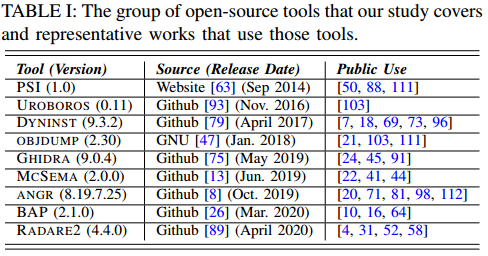
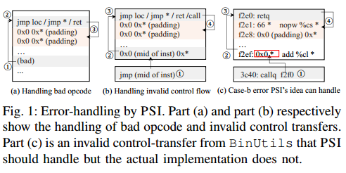
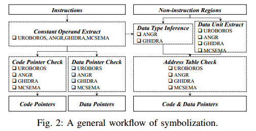

## SoK: All You Ever Wanted to Know About x86/x64 Binary Disassembly But Were Afraid to Ask

### Scope of Systematization

#### Functionality

论文中主要在以下几个方面测试反汇编器

* Disassembly  反汇编
* Symbolization  符号化，主要指检测xrefs。根据source和target的位置主要分为四种xrefs
  * code-to-code (c2c)
  * code-to-data (c2d)
  * data-to-code (d2c)
  * data-to-data (d2d)
* Function Entry Identification  函数入口检测
* CFG Reconstruction  CFG重构

#### Targeted Binaries

主要依据如下要求选取测试样本

* 使用主流编译器/链接器编译
* 源码中可能含有内联汇编
* 未被混淆
* 可能被strip
* 只考虑x86/64
* 在linux或windows上运行

#### Targeted Tools

主要依据如下要求选取被测试的工具

* 工具本身用于反汇编，或其中有一个模块用于反汇编
* 可以在不与用户交互的情况下自动反汇编一个文件
* 是开源工具
* 相较于其他工具有一些自己的特性
* 可以正常反汇编上述的Targeted Binaries

最终选取的工具如下表

### Analysis of Tools

#### 反汇编中使用到的算法和启发式方法

本文主要从各个工具的源码出发研究特性，主要特性如下表

上表中，白色序号的表示算法（algorithm） 黑色序号的表示启发式算法（heuristic）

下面对这里提到的算法做一个简单的翻译

* Linear Sweep
  
  * 从含有符号的代码地址开始
  
  * 

下面的内容就是对表中内容的进一步解释

##### Linear Sweep

线性扫描法连续地扫描预选的代码域，一般各个工具使用该方法的不同可以归纳为对两个问题的处理方式

* 如何选取扫描范围
  
  通过处理程序的.symtab和.dynsym段的符号来确定

* 当扫描过程中出现错误应该怎么处理
  
  不同的反汇编器使用的方法不一样
  
  * Objdump  跳过一个字节
  
  * PSI
    
    * 认为一个到非指令的跳转是error
    * 当发现一个错误的opcode时，反向追踪到上一个non-fall-through的跳转（包括非条件跳转、间接跳转、return），并从该跳转开始识别padding指令（形如0x0 0x*），此后将padding换成nop，再运行一次线性扫描反汇编算法
    * 当发现跳转目标的指令非法时，从跳转位置向上追踪到第一条padding，此后再往上追踪到第一条跳转，再从这条跳转向下寻找padding，替换为nop并重新运行线性扫描算法
    
    
  
  * UROBOROS  与PSI类似，但不会执行替换padding为nop的操作，而是直接将这些代码排除在反汇编区域外

线性扫描法可能因为data-in-code被打断，为了解决这些error，往往采用一些heuristic来解决，但这些heuristic不一定通用

##### Recursive Descent

递归下降算法从一个选择的代码地址开始，跟随控制流对代码进行反汇编。一般各个工具使用该方法的不同可以归纳为对三个问题的处理方式

* 如何选择代码地址
  
  * 程序入口点与符号表中指定的地址
  * Angr Bap Dyninst Radare2使用一些方法来发掘main函数

* 如何分析控制流
  
  * 对于直接跳转，所有工具都是直接到跳转的地址继续反汇编
  * 对于间接跳转，见 [Indirect Calls](#Indirect Calls) 
  * 对于不返回的函数，见 [Non-returning Functions](#Non-returning Functions)

* 如何处理递归反汇编后剩余的code gaps。code gaps产生的原因很多，总的来说就是递归反汇编方法往往无法覆盖所有代码，使得函数间剩余很多未处理的二进制串。因此大多数反汇编器都会采用一些启发式算法来增加代码覆盖率
  
  * Angr Dyninst Radare2 Bap Ghidra 通过搜索函数的prologue/epilogue，或是使用pre-trained decision-tree model（感兴趣的论文第一篇）来搜索函数入口（表中的function matching算法）
  
  * 此外还有一些较为激进的方案，如
    
    * Angr 对code gap的范围进行线性扫描，并且对扫描到的合法指令采取递归下降算法。
      
      若遇到错误，则跳过当前basic block，并且移动到下个字节。缺点在于可能将数据当做指令
    
    * Ghidra 会将xref的内容作为递归下降算法的目标。缺点在于xref一般也是使用启发式算法收集的

#### 符号化过程中使用到的算法和启发式方法

##### 常量操作数和数据单元的提取

### 感兴趣的论文

这里的table II有使用到反汇编器的各种应用的引文，涵盖了二进制安全的各个方面，可以参考

* T. Bao, J. Burket, M. Woo, R. Turner, and D. Brumley, “Byteweight: Learning to recognize functions in binary code,” in 23rd USENIX Security Symposium, 2014, pp. 845–860  
