注意，这篇是针对ARM的thumb指令集的

### 概述

整个框架框图如下

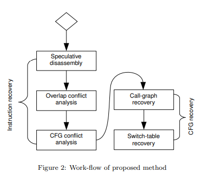

分为instruction recovery和CFG recovery两大块

### INSTRUCTION RECOVERY

如框图所示，分为三步

#### Speculative disassembly

这边也是使用了superset disassembly的思路，不过thumb指令集单条指令长度为2

##### Maximal Block

###### 概念

这里引入了一个概念Maximal Block。当多个基本块以同一个CTI（控制流转移指令）作为结尾时，则被分组到同一个Maximal Block    

形式化描述如下

* 对于单条指令t，有 end(t) = start(t) + size(t)

* 对于基本块bb，也有 end(bb) = start(bb) + size(bb)，假设基本块包含指令t0 ... ti，则start(bb) = start(t0)，end(bb) = end(ti)
  
  我们称指令t可以append bb，当end(bb) = start(t)。这里描述的是当两条指令相邻时它们的append关系

* 对于Maximal Block mb，Tmb表示mb包含的指令集合，Bmb表示mb包含的基本块集合
  
  我们称maximal block mbi+1可以append mbi，当
  
  $$
  \exists bb \in B(mb_{i+1}) \ | \ end(mb_i) = start(bb)
  $$
  
  该式描述的是类似遇到条件跳转的情况下相邻maximal block的append关系

###### 算法

Maximal block还原算法如下

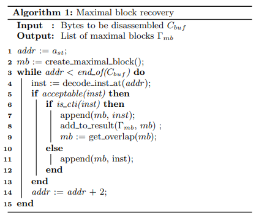

* 首先这里大循环同样采用了superset disassembly的方法，只不过thumb指令是2字节对齐的，因此每次地址+2

* 若当前指令可用，判断是否为CTI
  
  * 若不为CTI，则直接将当前指令加入当前mb中。注意，这里不是一个线性反汇编过程，因此当前指令是可能与上一条指令发生overlap的
  
  * 若为CTI，则
    
    * 首先同样将指令加入当前mb
    
    * 此时由于控制流已经到达CTI，一个基本块被构建完成
      
      整个基本块被分为两部分
      
      * 不含CTI的部分，称为incomplete bbl
      
      * 含CTI的部分，称为complete bbl
      
      其中complete部分是可以确定的，incomplete部分则又被分为两种：
      
      * invalid  这部分是错误的bbl结果
      
      * overlap  这部分表示当前的CTI指令与该bb不存在append关系，因此与当前mb发生了overlap，由于该序列可能属于另一个mb，因此这边将其保留（get_overlap）
        
        注意，对于overlap BB有限制：
        
        $$
        end(bb) - end(mb) < S_{max}
        $$
        
        其中Smax代表当前指令集中最长的指令长度。因为当小于该长度时，该bb就不属于另一个mb了

**注意，上述算法感觉跟x86中的情况有点不一样，thumb似乎不存在指令序列快速收敛到某条指令的情况，因此这边认为只有complete bbl是一个完整的结果，而余下的bbl除了overlap后属于另一个mb的情况其他均不可用**

##### 建立direct CFG

这个算法很直观，也很传统，没什么好解释的

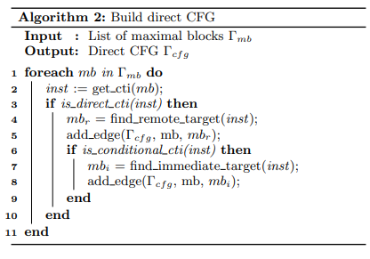

#### Conflict analysis

##### Overlap conflict analysis

###### 理论

overlap发生的特点形式化描述即，对于两个mb，i<j，有

$$
end(mb_i) > start(mb_j)
$$

因此很直观地，有两个方案解决overlap问题

* 将mbi invalid

* 将mbj进行shrink，使得
  
  $$
  end(mb_i) < start(mb_j) 
  $$

这边主要使用两方面的heuristic进行决策

* Alignment  若mbj与某个其他mb存在append关系，则倾向于invalid mbi

* Connectedness  若mbi与CFG的连接性较强，则倾向于shrink mbj

###### 算法

处理的算法具体如下

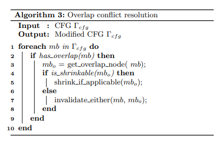

* 对于两个overlap的mb，首先检查后一个mb（记为mbj）是否可以进行shrink
  
  * 若可以则试着对mbj进行shrink操作，即对于所有小于 end(mbi) 的指令都执行invalid操作
  
  * 若不可以则根据计算的权重决定保留哪一个mb

###### 实例

下图展示了一种overlap情况

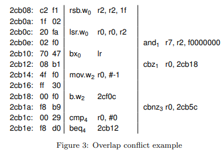

这个例子存在两个overlap的mb

* 对于2cb10处的bx指令，end(mb0) = 2cb12 < start(mb1) = 2cb0e

* 对于2cb18处的b指令，end(mb2) = 2cb1c < start(mb3) = 2cb1a

对于第一个冲突，通过shrink mb1的方法解决，即invalid掉2cbe0的指令

对于第二个冲突，因为无法shrink，所以invalid掉mb3

##### CFG conflict analysis

前面讨论了不同MB间的冲突解决，这边讨论同一个MB中不同BB的冲突解决

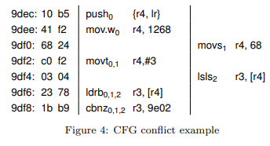

如上的例子，两个bb同属于一个mb，末尾都是9df8处的CTI指令

这边有三个冲突的BB，起始地址分别为 9dec 9df0和9df4

这边采用的方法类似MB中选择被invalid的mb的方法，也是计算权重

### CFG RECOVERY

CFG还原主要目的就是还原间接跳转

一般来说，间接跳转有如下三种：

* 函数返回

* 地址表（switch table）

* 间接call

#### Call graph recovery

##### 问题的定义与假设

本文将一个函数的CFG子图形式化定义为

$$
\Gamma^i_{cfg} = ( e^i_{mb}, M^i_{mb}, A^i, E^i_{mb} )
$$

其中

* emb为入口的MB集合

* Mmb为属于当前函数（procedure）的所有MB集合

* A为Mmb占据的内存空间，这里假设一个函数占据的内存空间是连续的

* Emb为出口的MB集合，即跳转地址不在A内的MB

这里考虑的是标准的函数（well-formed procedures），因此对于这种过程有以下两个假设

* 所有属于Mmb的mb（即所有函数中的mb）都是以emb作为入口的（原文为dominated by）

* 所有属于Emb的mb，要么以一个对其他函数的call为结尾，要么以一个ret为结尾

注意：call一般分为两种

* return-call  直接从callee立即返回到caller
  
  ARM架构中一般使用bl/blx实现这种call，它的返回地址直接保存在lr寄存器

* tail-call  不需要立即返回到caller，而是可能返回到其他地方，如栈帧中的其他函数
  
  ARM架构中一般使用b/bx实现这种call，这两条指令类似x86中的jmp

##### 函数识别

上述call graph的还原需要识别函数，本文的函数识别采用了如下方法

* 第一部分  识别直接调用（direct-call）
  
  * 首先使用 $\Gamma_{cfg}$ 中的call指令识别函数入口和内存范围，并将Mmb中使用直接调用的目的地址加入 $L_e$ 集合。此后对Le集合进行排序，并以此切分地址空间 $A^i_o$ （下面简化写作A）
  
  * 此后使用DFS对每个识别出的函数的emb进行遍历，并将遍历到达的mb加入Mmb。直到遇到exit point，或间接跳转（除了switch语句，后面会讲switch语句的识别）
  
  * 此外，这里还跟踪了对lr寄存器的读写，从而能够正确识别对返回地址的修改（如程序将lr寄存器保存在栈帧中的情况）
  
  * 这里对于mb内的跳转，会判断其目的地址是否在A内，若没有则将该mb当做出口mb。在A范围内的最后一个出口mb会被标记为真实的函数范围 $A^i$
    
    注意目的地址在A外的直接跳转也可能指向一个tail-call函数，或是指向另一个函数的函数体中，这被称为overlap exit
    
    这种情况的出现也使得该方法可以分析函数存在多entry的情况
  
  这里感觉原文写得有点复杂，细节很多，我也看了老久。因此这边做一些解释
  
  > 对于识别直接调用的情况，说得很复杂，其实道理很简单，跟大多数反汇编器拿到一个函数的首地址就以此往下分析
  > 
  > 这里存在一个比较特殊的情况，就是tail-call，可能在ARM中比较常用。尾调用即在函数的最后一个语句进行函数调用，因此可以被优化，如
  > 
  > ```
  > int main()
  > {
  >     xxx1;
  >     A();
  >     xxx2;
  > }
  > 
  > int A()
  > {
  >     xxx3;
  >     B();
  > }
  > ```
  > 
  > 这种情况下，由于调用B之后A没有做其他事，所以B结束后可以直接返回到main的xxx2。
  > 
  > 因此尾调用情况下，函数B的末尾可能会指向main函数体中间的xxx2，这就造成了函数存在多个入口的情况，或文中称为overlap exit的情况

* 第二部分  识别其他函数，如通过间接调用的函数
  
  * 对于前面识别到且不属于任何函数的mb，这里都视为一个函数入口进行分析
  
  * 分析的过程与上部分类似，唯一区别就是有一个额外限制：识别到的函数的地址范围不能与前面的发生重叠

* 第三部分  考虑某些不返回的函数，如abort
  
  前面的两种分析方式都有一个假设，即call是一定会返回的，因此前面的分析中自然地将call指令的后续块纳入分析
  
  这边使用的方法比较简单，通过分析.plt表来找到那些对不返回函数的调用

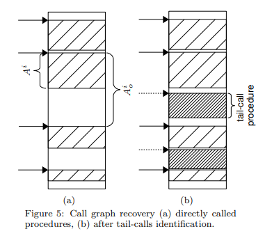

* 如图a，为执行完直接调用分析后的结果示意：首先地址空间按照被识别到的直接调用切分（如图中 A^i_o 标记的地址范围），此后从每个直接调用地址出发进行分析，从而识别到真实的函数地址范围（如图中 A^i 标记的地址范围）

* 如图b，则为执行完第二步后的结果示意，这一步识别出那些不直接调用的函数

#### Switch table recovery

##### switch结构

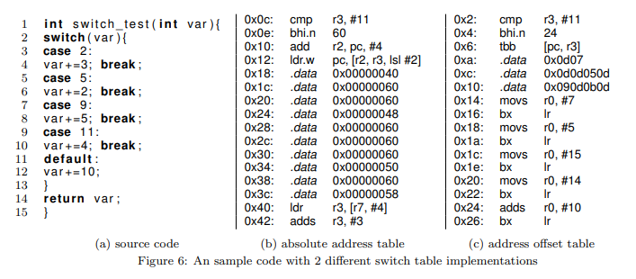

如图是两种switch形式

* b展示了绝对地址跳转表的形式
  
  * 先比较数字（r3）是否大于11，若是则直接跳转
  
  * 否则装载跳转表基地址（r2）
  
  * 通过 r2 + r3 << 2 计算跳转表项，并跳转

* c展示了偏移量跳转表的形式
  
  * 同样比较数字是否大于11，若是则跳转
  
  * 直接通过tbb指令进行表项的寻址

上述两种跳转表项实际上都是offset，区别在于表项的长度（4字节和1字节）

总体而言，switch都有如下形式

```
if(index > limit)
  pc = default_case
else
  pc = jump_func(base, index)
```

##### switch的识别

对于switch的识别一般都分为如下步骤

* 识别跳转表基址

* 识别可能的索引值

* 计算跳转函数的值

本文的方法如下

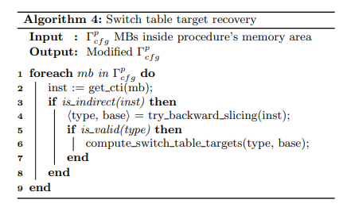

* 将每个间接跳转都视为可能的switch语句

* 试着从间接跳转语句开始进行反向切片，条件如下
  
  * 间接跳转的地址应由至少两个寄存器的值决定，且其中一个寄存器的值可以被静态分析计算（该值是与pc相关的值，或一个立即数）
  
  若符合条件，则可以得到一个确定的base值

* 若上述过程解析到了switch table，则接着判断table类型。这里用到了架构相关的heuristic，将table分为三种
  
  * 绝对地址的table
  
  * tbb指令使用的table，这种table每个偏移量只有1字节
  
  * tbh指令使用的table，这种table每个偏移量有2字节

### RESILIENCE TO OBFUSCATION

这里主要考虑混淆会破坏前面的两个假设

* 使用不透明谓词，使得一个条件跳转语句可能是永真或永假跳转

* call后的第一条指令可能并不是真实的返回地址

这里借鉴的工作是 Static disassembly of obfuscated binaries 这篇，但存在一定区别，这里从几个方面对比了两者

* 函数识别
  
  本文不需要在分析前进行函数识别

* 冲突分析
  
  那篇文章处理冲突只使用一步，计算weight，weight值则主要与节点的入度和出度相关
  
  本文则先使用overlap分析处理MB的冲突，再用类似方法解决BB间的冲突)
  
  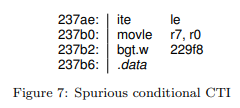
  
  这里ite指令应该与下面movle存在overlap
  
  若采用那篇文章的方法，整个块都会被invalid，因为bgt是一个条件跳转，而其下面是data。本文方法则会直接将ite对应的bb invalid

* 统计分析
  
  那篇文章使用bigram，而本文不使用统计方法

### Evaluation

#### Instruction recovery

表1展示了benchmark中指令总数、跳转指令数以及其中间接跳转的占比

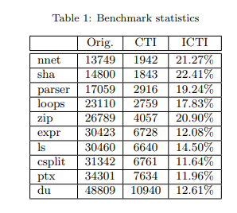

表2展示了本文方法与objdump和IDA的比较，其中VIR表示还原后的指令在实际指令中的占比

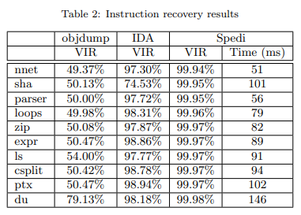

#### Call graph recovery

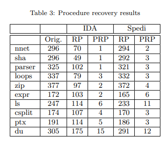

其中RP代表Recovered Procedure，PRP代表Partially Recovered Procedure

本文方法没有完全还原的主要原因有

* 因为对于间接调用的函数，无法完全确定一个基本块的开头，本文方法倾向于最大化基本块

* 考虑存在两个连续函数Pi和Pi+1的情况，若Pi存在一个**间接**尾调用到Pi+1，则算法会将两个函数视为一个

#### Switch-table recovery

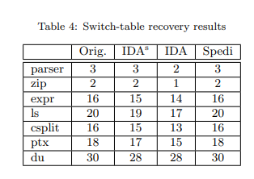

*注意，这里IDAs指测试的二进制文件含符号表*

Spedi无FN，且只有一个False Positive，出现FP的原因是目前算法的逻辑是执行反向切片，直到到达一个限制index大小的条件跳转（由于switch的结构，具体见上面的分析）
