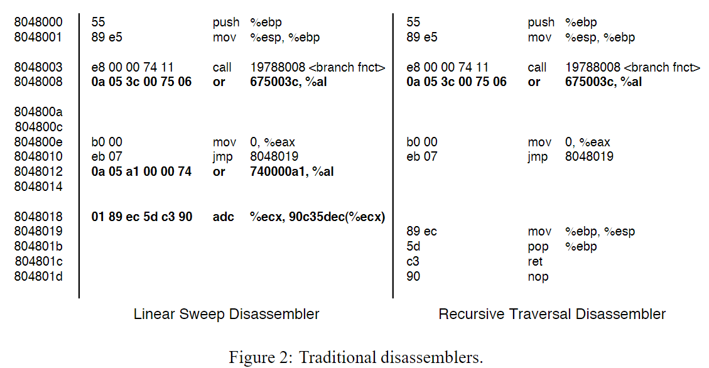
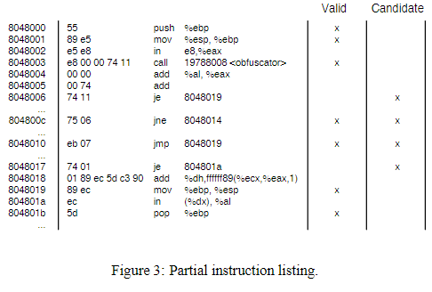
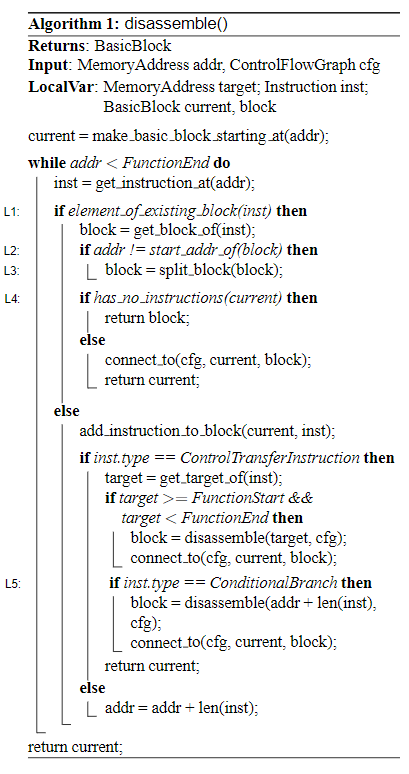
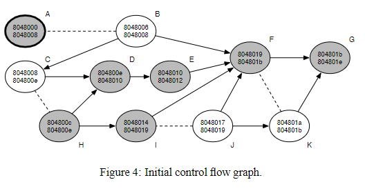
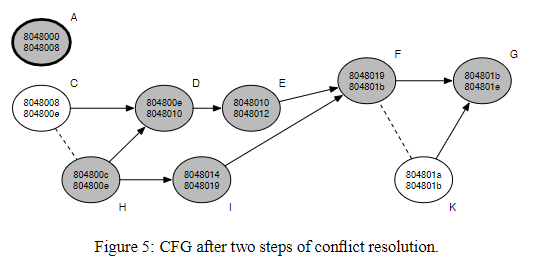
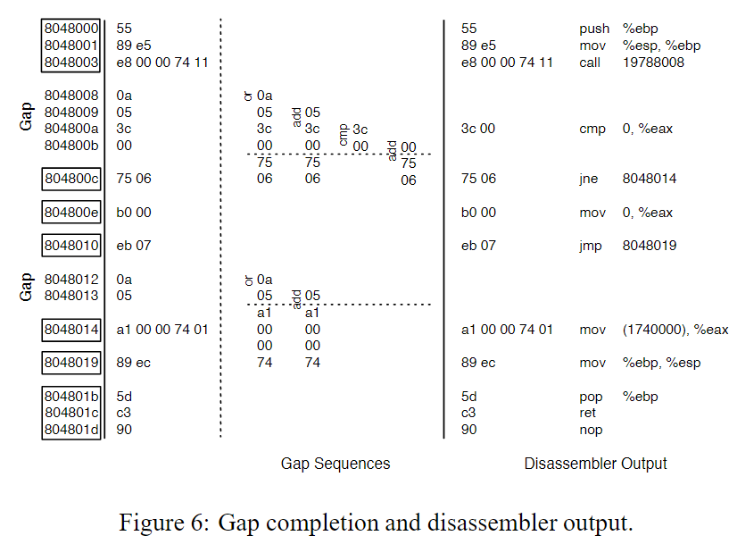
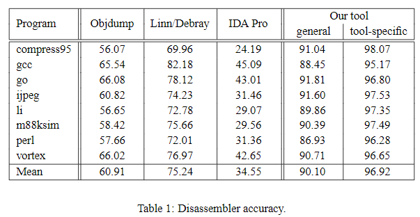
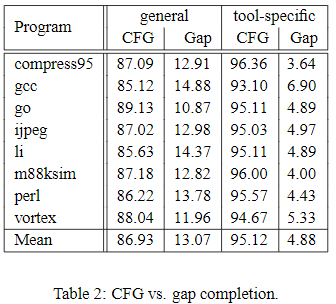
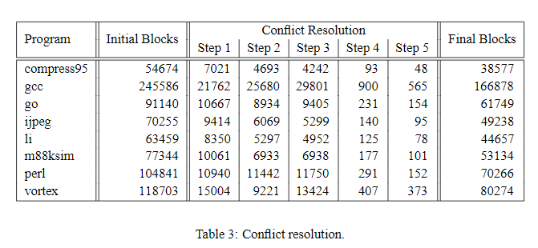

### Related Work and Background

这篇论文主要针对的一个工作是 [这篇文章][1]  ，这篇文章的方法主要基于两个技术

* 在一些运行时无法到达的地方插入junk bytes，从而导致反汇编器误识别指令（主要针对线性下降反汇编器）

* 使用一个branch function替代各种call指令，在函数中使用间接跳转。此外在返回地址加上一个offset，使得递归下降反汇编器也被迷惑

如图，8048012即插入的junk bytes，而8048008则不是真正的返回地址，在运行时会对返回地址加上一个偏移，使得真实的返回地址为804800a

### Disassembling Obfuscated Binaries

本文对混淆指令的一些假设如下

* 指令不会发生overlap

* 条件跳转不一定发生跳转（这里是为了限制条件跳转为不透明谓词的情况，即不考虑不透明谓词）

* 对于运行时不可达的地址，可以插入任意多的junk bytes

* call指令后的第一条指令不一定从下一个指令位置开始

* 两个函数之间的基本块不会交织在一起（应该指的是地址上不会有交织。该假设在4.2.1中提及）

后两个假设主要就是为了还原 [这篇文章][1] 的场景

### General Techniques

这章介绍本文提出的反汇编技术，该技术不依赖于对混淆工具的了解（即这边的技术是通用技术，而不是对某种工具特化的技术）

#### Function Identification

这里简单地使用了函数prolog

#### Intra-Procedural Control Flow Graph

这里为了获得较完整的控制流图，将过程分为了两步

##### Initial Control Flow Graph

###### 思路与原理

* 首先用了类似superset disassembly的方法（不过这篇比superset那篇早多了）。对**函数中**的每个地址都作为指令的开头进行反汇编
  
  
  
  如图，其中标为Valid的指令是ground truth

* 第二步是识别过程中（intra-procedure）的控制流转移指令
  
  注意，这边对于控制流转移指令的后续指令的假设为
  
  * 对于一个条件转移，后续的指令一定是连续的
  
  * 对于一个非条件转移，后续的指令不一定是连续的（这里应该也是为了设计用于对抗 [这篇文章][1]）
  
  因此过程中的控制流转移的判定标准应该为
  
  * 跳转的目的地址是确定的，且在当前函数中间
  
  * **或者**该跳转是一个条件跳转
  
  当识别到一个这类指令时，会将其标记为candidate（如图，8048003的call指令目的地址没有被标注，因为其地址不在函数中，即不是intra-procedure的）

利用上面识别到的candidate，可以建立一个Initial Control Flow Graph。这里的思路就是：利用由superset disassembly的结果建立控制流图，这样可以形成一个CFG的superset，而真实的CFG是其的一个子图。

###### 具体算法

具体算法如下图，注意该算法调用一次不一定能完全处理一个函数（看逻辑应该每次都以拆分一个bbl，或到达一个已解析的bbl为结束）

* 初始化当前bbl（current）为起始地址所在的bbl

* 循环直到结束地址
  
  * 获取当前地址的汇编指令inst
  
  * 当前指令是否属于某个已存在的bbl
    
    是，则说明当前控制流跳转到了一个已经解析过的bbl（设为block）
    
    * 若当前指令不是block的第一条指令，则说明block中间存在某个跳转的目的地址，于是拆分block
    
    * 若current没有任何指令（这个case主要场景是传入的起始地址刚好是某个已被解析的bbl），则**返回block**，否则将current和block的CFG连接，并**返回current**
    
    否，则算法继续进行线性反汇编
    
    * 将当前指令inst加入current块
    
    * inst是否为跳转指令
      
      若是
      
      * 若跳转地址在函数内，则获取目的地址的bbl（设为block），并将其与current连接
      
      * 若跳转指令为条件跳转，则额外将跳转的下一条指令所在的bbl与current连接。注意，这里符合前文所述，对于条件跳转，会将其下一条指令作为一个新的bbl，而对于非条件跳转则不会这样处理
      
      * 最后返回current
      
      若不是，则直接线性反汇编下一条指令

###### 算法特点

该算法与递归下降反汇编的不同之处主要有两点

* 不假设非条件跳转的下一条指令一定是合法的汇编

* 允许指令overlap

为了处理指令overlap，又基于x86汇编会快速收敛于同一条指令的特性，算法将bbl拆分为两部分：第一部分表示多个指令序列的非公共部分，第二部分则表示指令序列的公共部分。由此，bbl的入边一定连接到第一部分，出边则一定从第二部分连出。

此外，算法保证某个特定地址的一条指令只在一个bbl中出现，也就是说，对于overlap的指令序列，其相同的部分一定在公共bbl中，不同的部分一定在非公共部分中

###### 实例

对文中前面所举的例子应用该算法的结果如下（多图对照着好看）

上图为算法建立的初始控制流图，其中实线箭头连接控制流转移，虚线箭头则连接overlap的两个bbl。有阴影的部分为实际的指令

##### Block Conflict Resolution

###### 规则

用于去除含有冲突的block，分为5步，其中2步去除那些肯定不可用的块，另外3步则通过一些heuristic来去除

* 可用的（valid）bbl的起始地址必然包含一条可用的指令。此外，若某个bbl符合上述条件，则认为与它存在入边的bbl也可用
  
  当某些bbl与上述标记为可用的bbl冲突时，删去这些bbl

* 由于不允许指令overlap，若某个bbl指向两个不同的bbl，且这两个bbl存在冲突，则该bbl是不可用的
  
  这种情况较常发生在条件跳转的对象bbl发生冲突的情况（但一些混淆本身也是这样做的，可惜这篇文章假设不处理这种情况。该情况的处理得看codisasm）

* 这步假设一个真实的bbl倾向于更深地嵌入程序的CFG中，因此应该有更多的前驱节点
  
  因此对于多对冲突的bbl，会根据该假设删除那些入度更小的节点

* 这步假设一个真实的bbl倾向于跳转到函数中，而不是一个随机的外部地址，因此应该有更多的后继节点
  
  因此对于多对冲突的bbl，会根据该假设删除那些出度更小的节点

* 最后这步必须对剩余的冲突bbl做最后决策，这边简单地使用随机方法丢弃，并且说可以future work可以基于统计来做

###### 实例

注意，上图是step1和step2执行后的结果

* 在step1中，A被标记为valid，此后无法继续遍历，因为A的控制流没有直接相连的其他bbl。而由于B与A冲突，被删除

* 在step2中，J指向F和K，且F和K是冲突的，因此删除J

* 在step3中，冲突的bbl F和K拥有不同的入度（2和0），因此删除K

* 在step4中，冲突的bbl C和H拥有不同的出度（1和2），因此删除C

##### Gap Completion

###### gap序列

gap表示bbl中的一串数据或指令，但它们从未被使用过，只是junk bytes或junk instruction

gap主要是混淆器加入的，它可能只是junk bytes，但也有可能是可以被解析的指令，如

* 移入某段没有被静态跳转指令调用的函数（对于这种函数静态反汇编并不能正确解析）

* 由于本文采用的方法不假设call指令后的指令串是可用的，这就导致call指令后的TP（true positive）指令被遗漏

因此这边需要设计算法来识别gap中可能存在的指令序列

###### gap序列识别

这里采用两个假设来识别：一个可行的指令序列需要满足

* 最后一条指令与gap的最后一个字节对齐

* 或最后一条指令是一个跳转，但不是指向过程内的跳转（intra-procedural）

因为对于一个gap中执行的指令序列，存在两种情况：第一种就是执行完gap序列后控制流继续顺序执行，这就要求gap指令与范围对齐（第一条限制）。第二种就是gap序列中发生了控制流转移，而这里限制过程内的跳转是因为若存在此种跳转，则在建立初始CFG时就已经将其包含。这里若再次考虑则可能重复建立起一些已经在 [Block Conflict Resolution](#Block Conflict Resolution) 被删除的节点

###### sequence score

当符合上述条件的gap序列被识别后，这里采用sequence score来对序列出现的概率进行评价，而sequence score是instruction scores之和，instruction scores则由指令的unigram和bigram得到。注意这里只对指令的opcode进行了统计

此外这里还采用了一系列heuristic来提高识别率，当匹配的指令中含有下述特性时，其instruction score会被设为0

* operand size mismatch

* 对特殊功能寄存器进行算术运算

* 一些极少见的寄存器间移动，如将一个非ebp寄存器的值赋给esp

* 将寄存器的值赋给该寄存器引用的内存（这里存疑，正常的二级指针不就是这个结构）

###### gap序列决策

最终sequence score最高的作为gap序列

###### 实例

上例中两段gap指令如图，最终得到的gap序列如图右半边

### Tool-Specific Technique

这里讨论了基于对 [这篇文章][1] 的技术对上述反汇编器进行的改进，并以此说明该技术可以针对工具进行特化。

这篇文章的核心是将call指令指向的具体函数替换为一个hash查找函数，并且在call返回时会将返回地址加上一个offset，使得call指令后可以插入一些junk bytes来迷惑反汇编器

### Evaluation

#### 数据集与评价指标

##### 数据集

SPECint 95

##### 评价指标

这边引入的指标称为 confusion factor

令V为实际的指令，O为反汇编器输出的指令，则confusion factor定义为

$$
CF = \frac{|V-O|}{V}
$$

由于本文聚焦于反汇编器识别可用指令的效率，因此定义 disassembler accuracy为

$$
DA = 1 - CF
$$

#### 实验

##### 反汇编器横向对比

注意，在这个评价指标下，IDA的结果很差，因为IDA倾向于不处理那些存疑的汇编指令

##### 该工具不同算法的贡献

图标显示的是CFG和gap两种算法所还原的指令占比，可以看出主要由CFG建立了程序的框架

##### block conflict算法各步骤的贡献

可以看到前三步过滤掉了绝大多数的block

##### 性能测试

这边图不放了，总的意思就是随着二进制文件的增加，反汇编器的开销线性增长

### 相关文章

[1]: Obfuscation of executable  code to improve resistance to static disassembly

[2]: http://all.net/books/IP/evolve.html

### 一些问题

* sequence score这边引入的一些heuristic感觉有点问题，比如 *将寄存器的值赋给该寄存器引用的内存* 这条，意思类似 `mov [eax], eax` 的指令也会被认为是少见的

* evaluation里的指标CF的计算方式似乎只反映FN，没有反映FP
