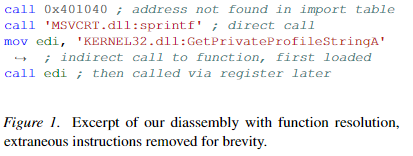
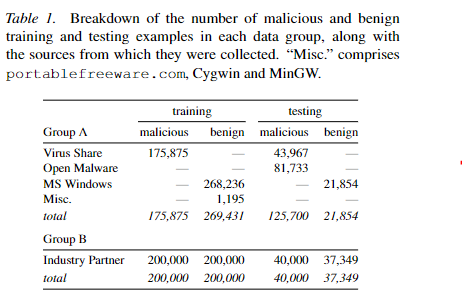
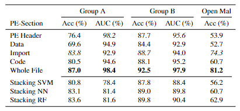
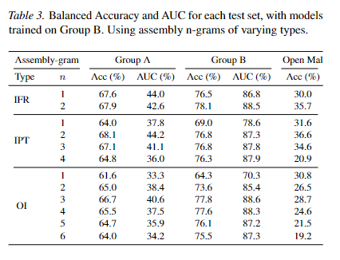
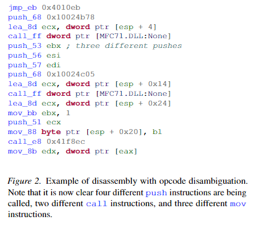
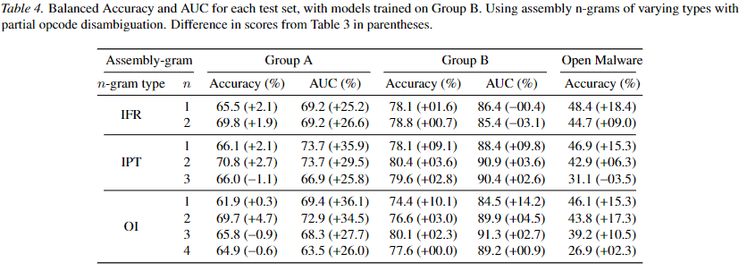

### Related Work

这边对ngram在malware detection的应用做了一个比较系统的阐述，可以看一下。主要有这几种

* byte ngram

* assembly ngram

* 上述的变种，主要思路就是只取指令的某些部分。在后面讨论

* byte ngram和assembly ngram结合

### Sectional Byte N-Gram Features

这里对可执行文件的四种段使用了byte ngram

* PE头

* 数据段

* 导入表

* 可执行段

首先需要指出，byte ngram对于低熵（low-entropy）、长度较为一致的内容匹配程度较好（从ngram的原理可以直观看出）

#### PE头

PE头包含的信息一般是低熵的（low-entropy），该特性比较契合byte ngram的特征

但PE头包含的各个字段长度可能不一致，该特性则比较不契合byte ngram

#### 可执行段

一部分的可执行文件只有一个可执行段，这些段的特点是熵值较高（因为是指令），且从语义角度来讲各个字段是变长的（x86是变长指令）。因此文章估对这种可执行段采用byte ngram表现最差

#### 导入表与数据段

一般这两个段都是不可执行段。对于正常程序来说，比较容易区分这两个段，因为会在PE头里标识；但对于malware则不一定

##### 导入表

这里分析malware的导入表，可能存在下列情况

* 指向一个超出文件范围的地址

* 指向一个已存在的段的中间

* 指向一个不存在任何导入表信息的区域

这里采用如下方式处理

* 若导入表地址存在，则将其视作一个段偏移，并将该偏移到段结尾的所有段当做导入表内容

* 若不存在，则使用一个字符串匹配的方法，在段中匹配一些常用DLL和函数名，来确定该段是否为导入表

##### 数据段

经过上述的处理后，剩下的段视为数据段

### Assembly N-Gram Features

这里先主要介绍了直接使用mnemonic与使用opcode的区别

#### Instruction Only

这种方法只使用mnemonic。这里列出了一篇使用该方法的论文，该论文中认为仅使用mnemonic的优势在于汇编语句的一些小扰动，如内存寻址的位置等不会反应到ngram上，使得其泛化性较好

#### Instructions with Parameter Type

将操作数划分为内存、寄存器和常数，列出了几个相关工作，较多工作倾向于使用该方法

#### Instructions with Function Resolution

这种方法将call时引用的地址替换为对应的函数（如果该地址可以被反汇编器识别的话，一般这种函数是导入表导入的函数）

### Machine Learning Models

#### Elastic-Net Regularized Logistic Regression

该回归的损失函数为

$$
f(w) = \frac{1}{2} ||w||_1 + \frac{1}{4} ||w||_2^2 + C \sum_{i=1}^N log(1+e^{-y \cdot w^T x_i})
$$

选用该模型是因为该模型可以有效缓解ngram中n增加带来的特征数几何增加对于整体的负面影响

#### Stacking

为了区分 [Sectional Byte N-Gram Features](#Sectional Byte N-Gram Features) 中描述的4种区段对于模型的影响，这边采用了stacking技术

该技术首先使用一系列基本的分类器（base classifiers），每个分类器都单独训练；此后这些分类器的分类结果组成了一个新的特征集（该特征集的维度与分类器个数相同）。此后再使用一个combiner，通过该特征集得到结果，这个combiner可以是任何算法，但一般采用线性combiner，因为该combiner应该是一个对多个分类器结果自动分配权重的算法

### Evaluation and Results

#### 数据集与指标

##### 数据集

文章采用两个数据集来测试，分为GroupA和GroupB。A与先前其他malware detection的文章收集方式类似，B则是由反病毒公司提供的。A主要由微软安装包收集，先前的研究表明这种数据集可能带来过拟合（拟合了微软安装包软件与非微软安装包软件的特征而非恶意软件和正常软件特征）。B则比较好地代表了在野软件的特性，因此只使用B进行训练，但也会在A上进行测试

##### 指标

选用了两个指标来评估

###### balanced accuracy

该指标降低了样本较多的类的错误权重，使得正常样本与恶意样本对于最终的准确性有着相同的总权重。这解决了数据集中不同类型的样本数不平衡导致的权重失衡问题

###### AUC

Area Under the ROC Curve。ROC曲线下的面积，其中ROC曲线的横坐标是假阳性率（FPR），纵坐标是真阳性率（TPR）。易得直线 y=x 对应的是随机分类器（因为50%的概率为假阳性，50%为真阳性）。因此AUC一般面积大于0.5，越接近1说明准确率越高

#### Byte 6-Gram Results

这是使用byte 6-gram的结果，注意这里评估了4个不同段对于结果的影响

前4行是不同段单独进行6gram的结果，第5行是对整个文件直接进行6gram的结果。

* 结果表明最好的结果是对整个文件直接使用6gram，其次是对PE头使用（AUC第二高）和对导入表使用（Acc第二高）

* 此外注意对于open malware数据集，部分方法几乎没有分类效果，可以推断出模型似乎倾向于将一个二进制归类为正常二进制。例如对PE头的模型，准确率高达99.7%但召回率也高达72.8%

* 结果还表明每个段都对分类效果有贡献，而非之前大多数人认为的只有Import和PE头有贡献。但这两个模型单独运行时确实准确率较高，因为其内容熵值低，使得出现在训练集中的内容更有可能在测试集出现

* Stacking model的表现普遍不如仅使用PE头和Import的模型。而理论上来说这种模型具有4个类型的段的所有信息，因此信息获取能力应与whole file的结果类似，甚至应该拥有更高阶的信息（段信息）
  
  这里的分析认为，导致这一结果的原因是这4个段的分类器的决策基于的信息是强相关的，导致各分类器实际上提供的噪声多于信息（对于stacking model，几个base classifier基于的信息相关性越低，才会给模型带来越大的性能提升），文章进一步认为byte ngram从代码段获取的信息与PE头和Import段获取的信息其实是同类的

#### Assembly N-Gram Results

表里得到的结果可以看出该方法存在严重的过拟合问题，在B上训练的模型用于A时准确率甚至不如随机分类

这里提出了两个可能的问题

* 使用mnemonic而非opcode，使得该方法比起byte ngram丧失了许多信息

* byte ngram的方式使得它可以获取到一些比较奇怪的灵活性和特异性，比如它可以获取到从某条指令开始，到某条指令中间的这一段信息，而非每次都以指令为单位

#### Assembly-Grams with Disambiguation

这里采用的测试方式是使用mnemonic和opcode的第一字节来区分指令，如图

（这里的注解其实有问题的，不是4种不同的push，而是push reg只使用前5位作为opcode）

这是使用该方法进行上述实验后的结果

可以看到这里结果得到了非常大的提升（但是这效果好像还是不如byte 6-gram，此外表里可以看出IPT效果是最好的，但这里在2-gram就打到了最好的效果，可能在2以上发生了过拟合（燃鹅论文好像没给出召回率的数据））

### Discussion

为了方便比较，这里又做了一个实验，对比了只从代码段提取的byte ngram与assembly ngram，并分析出一系列结论

* assembly ngram的效果与byte ngram差不多（甚至可能更差），这说明分类器可能并不是通过代码内容本身获取的信息，而是从例如导入函数、字符串和其他低熵内容获取信息

* stacking model的效果并没有提升，这说明选取的多个分类器其依赖的特征相关性很大
  
  一个假设是，若导入了某个函数，则与其相关的函数调用模式十分相似，因此带来了极大的特征相关性

* 即使使用了考虑opcode的assembly ngram，模型的效果仍比byte ngram差。原因可能是这种ngram丢失了一些信息，或是由于过拟合较严重（我倾向于这个解释）

### 我的一些想法

看完以后也感觉比较惊讶，因为原来感觉类似byte ngram这种方法效果应该差于assembly ngram，因为它基本没有高阶的语义信息，而汇编指令本身熵值就很高。如果效果差别不大，那如论文的分析所说，这说明分类器可能并不从code本身获取信息，那这是不是指向一个结论，就是目前的分类方法基本不靠对恶意代码的模式进行匹配来分类，那其效果我感觉真的得打个问号了

文中认为byte ngram可能有一些assembly ngram不具有的信息，如一些横跨多条指令的byte片段。但我感觉这种毫无语义的片段真的会给结果带来帮助么。

几个猜想，不一定对

* assembly ngram存在的最大问题就是过拟合，这可以从泛化能力的实验（将B训练的模型用于A上）效果非常差看出
  
  那么为什么会存在那么严重的过拟合呢？从两次实验中可以看出，效果最好的都是2-gram或者3-gram，再往上又低了，而对于assembly ngram来说，由于intel指令大多至少有2字节，所以3-gram往上的assembly ngram对比6-gram的byte ngram来说，其可以采样的数量肯定要少了很多
  
  做个简单计算：假设要采样10字节，每条汇编语句2字节。若使用byte 6-gram，可以采样5段，但对于assembly 3-gram则只能采样3段。这样明显的差距导致assembly ngram的样本数不足。而其样本空间并不比byte 6-gram小，甚至要大上不少，这直接导致样本数不足而造成了过拟合
