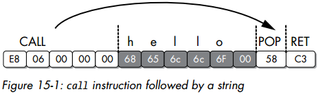
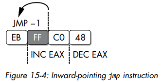
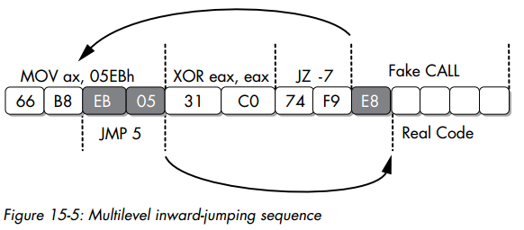
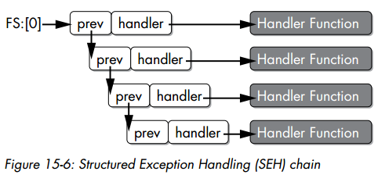
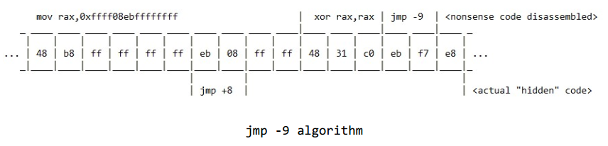
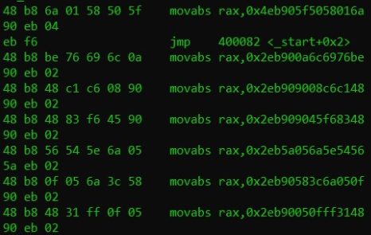
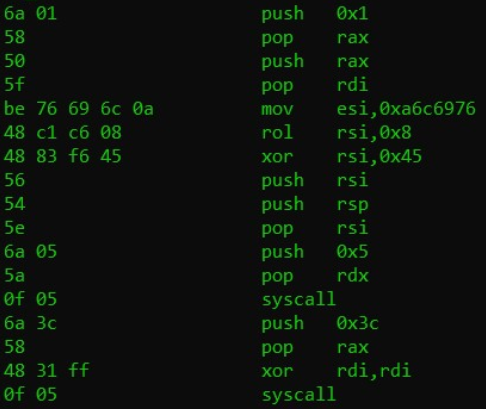

## Practical Malware Analysis  Chapter 15

### Understanding Anti-Disassembly

这里举了一个常见的花指令

```asm
	jmp short near ptr loc_2+1
; ---------------------------------------------------------------------------
loc_2: ; CODE XREF: seg000:00000000j
    call near ptr 15FF2A71h 
    or [ecx], dl
    inc eax
; ---------------------------------------------------------------------------
    db 0
```

这是个典型的使用线性扫描算法进行反汇编的反汇编器，因此jmp的跳转目标没有被正确识别。而正确的汇编应该是

```asm
    jmp short loc_3
; ---------------------------------------------------------------------------
	db 0E8h
; ---------------------------------------------------------------------------
loc_3: ; CODE XREF: seg000:00000000j
    push 2Ah
    call Sleep
```

这里使用了控制流导向的反汇编算法（递归下降法），因此得到了正确结果

### Defeating Disassembly Algorithms

#### 线性反汇编 Linear Disassembly

下面展示了一段典型的线性反汇编器代码，来自 [libdisasm](http://sf.net/projects/bastard/files/libdisasm/)

```c
char buffer[BUF_SIZE];
int position = 0;

while (position < BUF_SIZE) {
	x86_insn_t insn;
	int size = x86_disasm(buf, BUF_SIZE, 0, position, &insn);
	if (size != 0) {
		char disassembly_line[1024];
		x86_format_insn(&insn, disassembly_line, 1024, intel_syntax);
		printf("%s\n", disassembly_line);
		position += size;	// 注意这里
	} else {
		/* invalid/unrecognized instruction */
		position++;			// 和这里
	}
}
x86_cleanup();
```

两个标记的位置表明了线性反汇编算法是如何定位下一条汇编指令的：

* 若当前指令可用，则下一条汇编指令是当前位置后移当前指令长度
* 若当前指令不可用，则直接试图反汇编下一个字节

这种方法还有个显著问题就是容易把代码段中的数据也作为指令反汇编，如下面所示的switch语句的跳转表

```asm
    jmp ds:off_401050[eax*4] ; switch jump
    ; switch cases omitted ...
    xor eax, eax
    pop esi
    retn
; ---------------------------------------------------------------------------
off_401050	dd offset loc_401020 ; DATA XREF: _main+19r
            dd offset loc_401027 ; jump table for switch statement
            dd offset loc_40102E
            dd offset loc_401035
```

off 401050的这个跳转表也会被线性反汇编算法直接反汇编为

因此对于线性反汇编算法，对抗方式较为简单，因为它无法分辨数据和代码

#### 控制流导向反汇编 Flow-Oriented Disassembly

下面这段代码可以被控制流导向的反汇编成功识别

```asm
    test eax, eax
    jz short loc_1A
    push Failed_string
    call printf
    jmp short loc_1D
; ---------------------------------------------------------------------------
Failed_string: db 'Failed',0
; ---------------------------------------------------------------------------
loc_1A: 
    xor eax, eax
loc_1D:
	retn
```

但对于线性反汇编，会把字符串Failed当做指令，因此结果如下

```asm
    test eax, eax
    jz short near ptr loc_15+5
    push Failed_string
    call printf
    jmp short loc_15+9
Failed_string:
    inc esi
    popa
loc_15:
    imul ebp, [ebp+64h], 0C3C03100h
```

但下面给出了一个控制流导向反汇编无法正确识别的代码



这段代码在手写汇编或者混淆后的代码中较为常见，用途是获取hello字符串的指针。IDA的反汇编结果如下

```asm
E8 06 00 00 00 		call near ptr loc_4011CA+1
68 65 6C 6C 6F 		push 6F6C6C65h
				   loc_4011CA:
00 58 C3 				add [eax-3Dh], bl
```

### Anti-Disassembly Techniques

#### 拥有同一个跳转目标的jmp

因为对于控制流导向算法的反汇编器来说，当遇到一个条件跳转时，一般都会选择将跳转目标保存，继续反汇编当前的函数，直到结束后再反汇编跳转目标的内容。因此下面使用jz和jnz构造的jmp可以正确误导算法

```asm
74 03 				jz short near ptr loc_4011C4+1
75 01 				jnz short near ptr loc_4011C4+1
				    loc_4011C4: ; CODE XREF: sub_4011C0
								; sub_4011C0+2j
E8 58 C3 90 90 		 call near ptr 90D0D521h
```

这里实际上的反汇编应为

```asm
74 03 				jz short near ptr loc_4011C5
75 01 				jnz short near ptr loc_4011C5
; -------------------------------------------------------------------
E8 					db 0E8h
; -------------------------------------------------------------------
                     loc_4011C5: ; CODE XREF: sub_4011C0
                    			; sub_4011C0+2j
58 					pop eax
C3 					retn
```

这里算法因为遇到的两个跳转都是条件跳转，因此继续反汇编下去，将E8当成指令处理，导致了错误

#### 使用常量作为条件的条件跳转

算是不透明谓词

```asm
33 C0 				xor eax, eax
74 01 				jz short near ptr loc_4011C4+1
                     loc_4011C4: ; CODE XREF: 004011C2j
                    			; DATA XREF: .rdata:004020ACo
E9 58 C3 68 94 		jmp near ptr 94A8D521h
```

正确的反汇编为

```asm
33 C0 				xor eax, eax
74 01 				jz short near ptr loc_4011C5
; --------------------------------------------------------------------
E9 					db 0E9h
; --------------------------------------------------------------------
                     loc_4011C5: ; CODE XREF: 004011C2j
                    			; DATA XREF: .rdata:004020ACo
58 					pop eax
C3 					retn
```

也是利用了算法的上述特性

### Impossible Disassembly

上面的几种方法是利用两种反汇编算法的特性，结合在代码中加入数据来实现的。这几种方法的特点是在一个条件跳转后插入一个字节来误导反汇编器，这个字节一般被称为rogue byte，因为它本身其实并不是汇编的一部分。而要修复这段反汇编只需要正确忽略掉rogue byte即可。

下面介绍的方法则是当rogue byte作为代码的一部分而无法忽略的情况。基本思想就是让一个字节同时作为两条指令的机器码，如图



实际上运行的就是 `inc eax; dec eax;` 相当于一个nop，但这里的FF字节同属于jmp和inc两条指令，导致了反汇编器的错误

下面是个更复杂的例子



这里的EB 05被复用了，所以jz的跳转地址无法被识别，导致jmp指令也无法被解析，因此反汇编器被误导而反汇编了一条实际不存在的call指令

```asm
66 B8 EB 05 		mov ax, 5EBh
31 C0 			    xor eax, eax
74 F9 			    jz short near ptr sub_4011C0+1
				loc_4011C8:
E8 58 C3 90 90 		call near ptr 98A8D525h
```

### 使控制流模糊 Obscuring Flow Control

#### 函数指针问题

函数指针的使用会模糊控制流，因为只有动态运行程序才能准确获知调用的具体函数

下面给了个例子

```asm
004011C0 sub_4011C0 	proc near ; DATA XREF: sub_4011D0+5o
004011C0
004011C0 arg_0 			= dword ptr 8
004011C0
004011C0 				push ebp
004011C1 				mov ebp, esp
004011C3 				mov eax, [ebp+arg_0]
004011C6 				shl eax, 2
004011C9 				pop ebp
004011CA 				retn
004011CA sub_4011C0 endp

004011D0 sub_4011D0 	proc near ; CODE XREF: _main+19p
004011D0 ; sub_401040+8Bp
004011D0
004011D0 var_4 			= dword ptr -4
004011D0 arg_0 			= dword ptr 8
004011D0
004011D0 				push ebp
004011D1 				mov ebp, esp
004011D3 				push ecx
004011D4 				push esi
004011D5 				mov [ebp+var_4], offset sub_4011C0	; 函数指针赋值
004011DC 				push 2Ah
004011DE 				call [ebp+var_4]				   ; 调用
004011E1 				add esp, 4
004011E4 				mov esi, eax
004011E6 				mov eax, [ebp+arg_0]
004011E9 				push eax
004011EA 				call [ebp+var_4]				   ; 调用
004011ED 				add esp, 4
004011F0 				lea eax, [esi+eax+1]
004011F4 				pop esi
004011F5 				mov esp, ebp
004011F7 				pop ebp
004011F8 				retn
004011F8 sub_4011D0 endp
```

这里使用函数指针对函数进行调用，因此是个隐式调用。对于大多数反汇编器来说，这种调用方式会导致函数的传参方式无法被识别，从而丢失一定的信息。

#### Return Pointer Abuse

这个方法利用了反汇编器在遇到ret指令时会认为是一个函数的末尾，具体例子如下

```asm
004011C0 sub_4011C0 	proc near ; CODE XREF: _main+19p
004011C0 						; sub_401040+8Bp
004011C0
004011C0 var_4 			= byte ptr -4
004011C0
004011C0 				call $+5				; 这里实际上call的就是下一条指令
004011C5 				add [esp+4+var_4], 5	 ; 这条指令将 [esp] 的内容+5，而此时esp放的就是call的返回地址4011C5
004011C9 				retn					; 因此ret到的地址是4011CA，而反汇编器却认为此时函数已结束
004011C9 sub_4011C0 	 endp ; sp-analysis failed

004011CA ; ------------------------------------------------------------
004011CA 				push ebp				; 这里才是函数的真正逻辑
004011CB 				mov ebp, esp
004011CD 				mov eax, [ebp+8]
004011D0 				imul eax, 2Ah
004011D3 				mov esp, ebp
004011D5 				pop ebp
004011D6 				retn
```

#### Misusing Structured Exception Handlers

就是使用SEH混淆

##### SEH结构

这里指的是windows的SEH

SEH从内层到外层会构成一个链表，若内层没有处理某个exception，则该exception会被抛到下一个handler。若某个exception始终没有被处理，则被称为 unhandled exception

SEH的结构体定义如下

```c
struct _EXCEPTION_REGISTRATION {
	DWORD prev;			// 指向上一个SEH块
	DWORD handler;		// 指向handler
};
```

SEH链表头指针的位置在TIB（Thread Information Block）结构体的第一个元素，而TIB是TEB（Thread Environment Block）中的第一个结构，程序的TEB则由FS段寄存器指向



##### SEH装载

由于SEH的装载与卸载是与函数调用直接相关的，因此SEH一般直接在函数栈帧上构造并装载。最简单的构造方法如下

```asm
push ExceptionHandler
push fs:[0]
mov fs:[0], esp
```

注意栈是由高地址向低地址生长的，因此push的顺序与结构体定义相反

##### SEH卸载

这里我们希望通过SEH来混淆控制流，思路就是让真正的代码在SEH中运行

注意，操作系统为了防止在用户提供的SEH代码中又触发exception，会在运行用户SEH前在SEH链表上添加一个系统的SEH（应该位于用户SEH块的下一项）。因此手动卸载SEH时应该多卸载一个SEH块，代码如下

```asm
mov esp, [esp+8]		; 这个地方是为了获取SEH混淆前的栈指针，具体下面解释
mov eax, fs:[0]			; 获取当前SEH链表头
mov eax, [eax]
mov eax, [eax]			; 两次解引用
mov fs:[0], eax			; 将两个SEH块卸载
add esp, 8				; 释放SEH块的内存
```

注意，上面代码面临的一个关键问题是如何让SEH中的逻辑运行时保证程序栈指针正确。这里用了一个巧妙的方法：（其实这里我也没完全想懂，下面是我给的一个解释）

在用户SEH安装时，栈帧如下，这是正常函数执行时的栈

```
 ----------    <== esp
|   prev   | <---- fs[0]
 ----------
|  handler |
 ----------
```

当SEH被触发时，系统添加了一个SEH，位置在Usr SEH的下一个块，栈如下

```
     ---------- Sys SEH  <== esp
--- |  Usr SEH | <---- fs[0]
|    ---------- 
|   |  handler |         
|    ---------- Usr SEH
--> |   prev   |
     ----------
    |  handler |
     ----------
```

注意，这里是prev其实指向的是上一个SEH块的地址，而这个地址应该就是被混淆函数在安装正常SEH时的esp，因此这里通过获取prev指针来获取正常的函数esp。但有个问题就是最后的add esp, 8岂不是相当于直接卸载了正常的SEH块

##### 例子

下面是一个使用SEH进行控制流混淆后的代码被IDA反汇编的结果

```asm
00401050 		mov eax, (offset loc_40106B+1)
00401055 		add eax, 14h
00401058 		push eax						; 这里其实手动构造了一个SEH块，handler地址为40106C
00401059 		push large dword ptr fs:0 ; dwMilliseconds
00401060 		mov large fs:0, esp
00401067 		xor ecx, ecx
00401069 		div ecx							; 这里手动触发了一个exception，迫使控制流进入SEH
0040106B
0040106B loc_40106B: ; DATA XREF: sub_401050o
0040106B 		call near ptr Sleep
00401070 		retn
00401070 sub_401050 endp ; sp-analysis failed
00401070
00401070 ; ------------------------------------------------------------------
00401071 		align 10h
00401080 		dd 824648Bh, 0A164h, 8B0000h, 0A364008Bh, 0
00401094 		dd 6808C483h
00401098 		dd offset aMysteryCode ; "Mystery Code"
0040109C 		dd 2DE8h, 4C48300h, 3 dup(0CCCCCCCCh)
```

IDA由于没有识别到这里的exception必然被触发，因此认为函数到401070结束。此外因为handler地址是40106C，指令被复用，因此也没有正确反汇编出SEH的处理内容。而实际上40106C通过前面的方法构造了一个到401080的跳转。401080内容如下

```asm
00401080 		mov esp, [esp+8]
00401084 		mov eax, large fs:0
0040108A 		mov eax, [eax]
0040108C 		mov eax, [eax]
0040108E 		mov large fs:0, eax
00401094 		add esp, 8
00401097 		push offset aMysteryCode ; "Mystery Code"
0040109C 		call printf
```

#### Thwarting Stack-Frame Analysis

其实就是对抗栈分析，最常见的就是破坏栈指针平衡，下面是一个简单例子

```asm
sub_401543 		proc near ; CODE XREF: sub_4012D0+3Cp
00401543 				; sub_401328+9Bp
00401543
00401543 arg_F4 = dword ptr 0F8h
00401543 arg_F8 = dword ptr 0FCh
00401543
00401543 000 	sub esp, 8
00401546 008 	sub esp, 4
00401549 00C 	cmp esp, 1000h
0040154F 00C 	jl short loc_401556	; 关键的跳转在这
00401551 00C 	add esp, 4
00401554 008 	jmp short loc_40155C
00401556 ; --------------------------------------------------------------
00401556
00401556 loc_401556: ; CODE XREF: sub_401543+Cj
00401556 00C 	add esp, 104h		; 这里把esp减了0x104，导致栈分析出错
0040155C
0040155C loc_40155C: ; CODE XREF: sub_401543+11j
0040155C -F8 	mov [esp-0F8h+arg_F8], 1E61h
00401564 -F8 	lea eax, [esp-0F8h+arg_F8]
00401568 -F8 	mov [esp-0F8h+arg_F4], eax
0040156B -F8 	mov edx, [esp-0F8h+arg_F4]
0040156E -F8 	mov eax, [esp-0F8h+arg_F8]
00401572 -F8 	inc eax
00401573 -F8 	mov [edx], eax
00401575 -F8 	mov eax, [esp-0F8h+arg_F4]
00401578 -F8	mov eax, [eax]
0040157A -F8 	add esp, 8
0040157D -100 	retn
0040157D sub_401543 endp ; sp-analysis failed
```

因为反汇编器在40154F遇到一个跳转，一个分支给esp加4，另一个给esp减0x104。因此反汇编器必须做出假设，即哪个分支会被执行。实际运行中，由于esp肯定大于0x1000，因此肯定是前者分支运行，但反汇编器没有该前置知识，因此可能导致判断错误。

## Assembly “wrapping”: a technique for anti-disassembly

这里作者基于上文的Impossible Assembly方法提出了一种x64汇编隐藏代码的方法



可以看到，mov rax, xxx 指令占据了10字节，而除了48 b8是opcode和用于指定寄存器外，剩下的8字节都是任意可控的，因此可以在这8字节中构造隐藏的代码。但是实际可用的其实只有6字节，因为2字节需要预留给jmp短跳指令

下面是作者构造的一个例子：



被隐藏的代码如下


