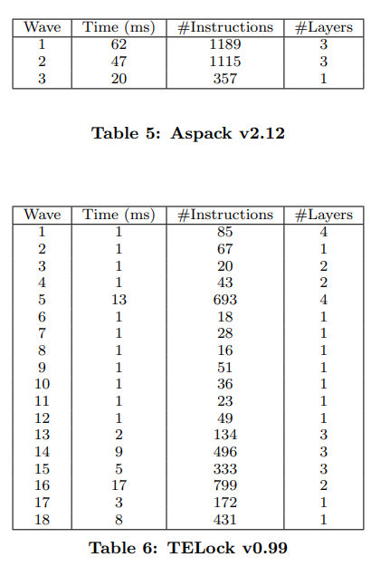

## CoDisasm: Medium Scale Concatic Disassembly of Self-Modifying Binaries with Overlapping Instructions

这篇文章主要解决两个问题

* SMC（self-modifying code）

* 指令的overlap混淆

### Related Work

这边总结概括了不少解决这类问题的技术

* 静态方法
  
  * 主要依赖控制流，如还原跳转表，建立CFG超图等
  
  * 主要依赖数据流，如尽量通过VSA还原间接跳转的地址，使用SMT等技术为目的地址确定大致的范围

* 动态和静态结合
  
  * 使用trace来缩小静态分析的搜索空间，引导静态分析走向正确的控制流等

### SELF-MODIFYING CODE

#### Wave Semantics

把SMC的行为建模为所谓code wave

* 初始时，将所有地址处的 *execution level* 设为1， *write level* 设为0

* 每当一条指令存在数据写入时，将其写入地址的 *write level* 设为1

* 若控制流转移到 *write level* 为1的区域，则令其 *execution level* 为2

* 以此类推

上述过程模拟的就是packer多次解压/解密后执行的过程

由此unpack过程可以视为多个wave的序列，而可以在每个wave的开始建立内存的snapshot来获取部分解压/解密后代码

#### Collecting execution traces

##### trace记录

这里使用pin作为tracer，并且会通过监控CreateRemoteThread和CreateRemoteThreadEx来监视dll注入

此外为了packer可能会对pin进行检测，主要可能存在这几种检测

* 运行时间检测

* 检测EIP地址来获知当前是否存在instrument程序

* CRC校验

* 使用如SIDT SLDT的指令，来检测当前是否在虚拟机环境下

##### trace处理

这边定义trace记录到的指令为 dynamic instruction，主要可能包含有下列元素

* 一个内存地址 A[D]

* 一条位于地址 A[D] 的机器指令 I[D]

* 被 I[D] 写入的一系列内存地址 W[D]

此外还有一个变量X用于记录当前的wave数

对于下列程序：


记录到的两次循环中的dynamic instruction信息如下：


#### Execution and write levels

##### 算法流程

对于一个执行trace：D1, D2, ..., Dn，我们定义对应的execution level和write level：(X0, W0), (X1, W1), ..., (Xn, Wn)

对于满足下列条件的dynamic instruction

* 当执行 Di+1 前，其对应的execution level等于Xi，且write level等于Wi

* 在执行 Di+1 后，其对应的execution level等于Xi+1，且write level等于Wi+1

我们称dynamic instruction Di+1的execution level是由Xi+1赋予的（is given by）

具体的算法如下，对每条新的trace指令D进行更新（注意这里X是单个全局变量，并不像W一样使用地址作为索引。Xi与Xi+1只是表示X变量更新前后的关系）

```
(X, W) = Update(X, W, D)
```


注意其中图中的 W( A[D] ) 代表地址A[D]处指令所覆盖的所有地址中最大的一个W值

* 更新X：
  
  X更新为 max( 原本的X值 或 W(A[D])+1 )
  
  这样保证了每轮迭代中 X' >= X 且 X‘ >= W(A[D])+1

* 更新W
  
  对于指令D写入的每个地址，都将该地址的W更新为X（注意这里也是新的X）

##### 算法原理

算法通过X和W来标记执行和写入的wave，算法保证：若当前执行的wave为i（或者说对于动态指令D，X=i），且当前程序正在进行SMC，则该轮SMC写入的新指令W=i，而当下一个wave指令执行时（即这一轮SMC解压出的代码执行时），这些指令的X=i+1，W=i

举一个简单的例子

* 对于第一轮SMC的指令序列Di，X=1，W( A[Di] )=0，写入的新指令为Dj（假设Dj与Di地址没有重叠，但其实这一套算法重不重叠没有影响）；在执行这一轮指令时，因为W=0始终不变，所以一直有X=1

* 对于第二轮SMC的指令序列Dj，W( A[Dj] )=1，因此执行时X=2。则算法将SMC代码的wave区分开了

#### Reconstructing waves from a trace

由上述更新算法可以看出该算法有一个性质，即对于指令trace序列D1 ... Dn，其execution level为单调递增的，即Xi <= Xi+1

因此最终的wave数应与trace最后一条指令Dn的X相同，且可以根据X的值来切分wave，即

$$
trace(i) = D_{l_i}, ... , D_{l_{i+1}-1}
\\
where \ X_j = i \ for \ j = l_i, l_{i+1}-1
$$

#### Overview of the wave recovery algorithm

##### 算法原理


使用上述算法来还原wave，具体步骤如下

* 初始化
  
  所有地址m的W(m)为0，初始化X为0
  
  初始化trace列表和wave列表

* 先调用Snapshot取一次内存快照，记录初始执行时的内存，并加入wave列表

* 循环直到被trace的程序运行结束
  
  * 取得当前trace的指令，加入trace序列
  
  * 调用Update函数更新X和W
  
  * 获取下一条执行的指令地址ip
  
  * 若W(ip) >= X，说明下一条指令与当前不属于同一个wave
    
    * 将之前的trace序列加入trace序列列表
    
    * 调用Snapshot取一次内存快照，记录下一个wave的初始内存状态

注意，一个内存snapshot包含

* code和data

* 所有动态分配的内存

##### 实例


如图程序，应用该算法的过程如下


可以看到，程序在6e62到6e82间解密了一段代码到5090到6e52，并跳转过去执行

6e62到6e82间W均为0，X均为1，而5090到6e52间，W均为1，X则在跳转到5090时变为2

#### Disassembly completeness

为了下面的讨论，这里对SMC代码、wave语义以及反汇编正确性做了形式化讨论

定义全部的code wave集合为

$$
trace(D) = \{ trace(i) \ | \ i=1...K \}
$$

其中K为最后一个wave的值

定义wave语义为一个图 G = (V, E)，其中所有的顶点V为

$$
V = \bigcup_{for \ all \ traces \ D} trace(D)
$$

若trace W和W'间是顺序执行的关系，则两顶点间存在一个边

因此，G包含了二进制文件中所有的SMC，并编码了所有的执行路径。因此G可以用于评估反汇编器的正确性。一个完美的（perfect）反汇编器应当可以还原整个图G。但由于反汇编问题的不确定性（undecidable），wave语义是不可计算的（uncomputable），因此反汇编器只能得到一个wave语义的近似。可以根据近似程度评估反汇编器的正确性。

### OVERLAPPING INSTRUCTIONS

#### Layers

首先引入一个概念：connected instruction set

讲了半天其实意思就是指令存在连接关系的称为connected，普通指令与后一条指令连接，条件跳转与分支的两条指令连接，间接跳转则无法确定连接对象。这样构成的集合称为connected instruction set

下一个概念就是layer，满足两个条件的称为layer L

* 指令间不发生overlap

* 集合L是connected的

算法的目标是构造一个layer集合，使其近似于wave中的代码

#### Disassembling algorithms


算法输入一个wave的snapshot和trace，根据trace记录的地址遍历，并对每个地址进行递归下降反汇编

其中，若当前反汇编指令与先前的layer对齐，则直接加入，否则建立一个新的layer

（这算法我觉得。。。不就是按着trace来直接反汇编么 = =）

#### Recovering an enhanced CFG

对每个layer构造一个CFG图，称为pre-CFG。由于可能存在多个layer，所以可能有多个pre-CFG，且每个pre-CFG的根节点是由一条overlap的指令相连的

如图为一个例子


这里指令序列在push ebp的位置重新同步（resynchronize）

#### Speculative disassembly

最后采用了之前其他工作的方法（比如这里提到了Static disassembly of obfuscated binaries这篇文章）进行反汇编，尽可能还原layer。最后使用trace来评估正确率

### EVALUATION

这里有大段解释为什么CoDisasm不好跟其他的反汇编器做对比实验，所以设计了如下几个实验

#### Experimental validation of correctness

正确性评测的数据集为 M¨alardalen WCET benchmark programs


#### Relevance of our approach on malware

数据集是从malware.lu收集的500个样本


这里比较了这些样本的wave数以及layer数（表明了有多少使用过overlap指令）

#### Relevance of our approach on packers

这里对一个已知的程序hostname.exe使用不同packer加壳，结果如下


主要显示了四个特性

* packer使用了几个进程
  
  armadillo使用了两个进程，父进程作为调试器

* packer使用了几个线程

* packer存在几个wave

* packer是否在动态分配的内存上执行了代码

文中写了几点发现

* 除了Setisoft检测到了pintools，其他程序均能在记录trace的情况下正常运行

* 除了PELock PESpin和VMProtect，其他均可在反汇编结果中找到hostname原程序片段
  
  上述三者前两个使用了code transformation技术，最后一个则是虚拟机保护



该额外实验显示了两种壳Wave Layer和对应的指令数

#### A malware writer scenario

这里使用Mystic packer打包了一段后门程序hupigon.eyf，对比加壳前后Virus Total检测结果，分别为45/57和22/57

使用CoDisasm处理后可以从最后一个wave中发现payload，但用次wave重建的PE文件检测结果为20/57，作者推测是这种由dump重建的PE文件没有被正确扫描

作者由此考虑Codisasm的新用法：对每个wave采集的dump重建PE，并以此进行检测

### Discussion

本文主要有两个发现

* 大多数payload会在最后一个wave中出现

* 使用wave结构进行重建相对比较简单

但有个问题，也是动态分析的通病，就是对于那些只有在特定情况下才触发的代码，Codisasm难以对其进行还原。packer可能还会针对Codisasm技术生成大量的wave从而消耗资源

此外，对于类似botnet的情况，一些payload也是只有在通信中接到指令才会运行，解决思路就是生成符合通信协议的内容来触发
