## 论文

### Related Work

这篇的综述写得还是比较仔细的，可以看一看了解一下技术路线，主要包含三个方面

* Disassemblers

* Rewriting Systems

* Static Analysis Using Datalog

### Preliminaries

#### Introduction to Datalog

##### datalog rule格式

一条datalog rule的格式如下

$$
h:- t_1. t_2, ... , t_n
$$

其中h和t1 t2 ... tn都是谓词

表达为谓词逻辑可以等价于

$$
t_1 \wedge t_2 \wedge ... \wedge t_n \rightarrow h
$$

##### datalog rule限制

对于谓词t有如下限制：

* t(s1, s2, ..., sn)，其中s1, s2, ..., sn是变量、整数或字符串
  
  我们称h是rule的head，t1, ..., tn是body

* rule可以是递归的，且可以包含否定谓词，记为!t，但不能包含有循环依赖的否定谓词，如
  
  $$
  p(X) :- !q(X)
\\
q(A) := !p(A)
  $$

* 所有rule中的变量都必须出现在非否谓词中至少一次

还定义了一种记法 $h:- t_1 : t_2$ 等价于 $h:-t_1 \ and \ h:-t_2$

##### datalog rule的执行

datalog引擎读入一系列facts，即一系列为真的谓词；再读入datalog程序（rules集合）。

引擎循环地根据rule，从现有的谓词推断出新的谓词，直到抵达不动点

需要注意，rule执行的顺序不会影响最终的结果

#### Encoding Binaries in Datalog

##### 汇编与datalog语法的转换

这一步主要是将二进制程序转换成datalog的facts，作为datalog引擎的输入

这里将基础数据类型简化为两种

* S  代表字符串

* Z64  代表64位整数（machine number）

在此基础上，扩展下列数据类型

* A  地址，属于Z64的子集

* R  寄存器名，属于S的子集

* O  操作数，属于Z64的子集

使用下列datalog语句来表示初始指令的facts

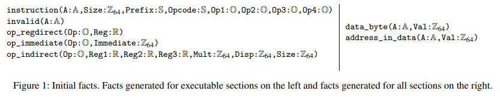

* instruction  单独表示一条指令
  
  * A  指令地址
  
  * Size  指令长度
  
  * Prefix  指令前缀
  
  * Opcode  指令的opcode
  
  * Op1...Op4  指令的操作数

* invalid  用来标记某地址的反汇编失败

* op_regdirect  表示一个寄存器操作数

* op_immediate  表示一个立即数操作数

* op_indirect  表示一个形如 `Reg1:[Reg2+Reg3*Mult+Disp]` 的操作数

* data_byte  表示某地址的一个数

* address_in_data  表示某地址的一个数，且该数表示一个地址

* entry_point  表示一个函数或一个二进制程序的入口点

##### 实例

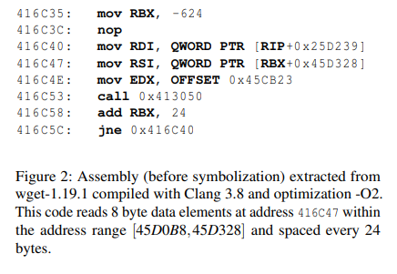

其中对于地址416C47和地址416C48（这里两条指令overlap了）的结果如下

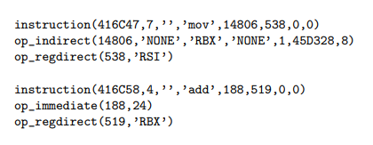

注意这里对应Op的参数都是一个随机分配的唯一ID，没有具体的意义

### Instruction Boundary Identification

#### IBI基本理论

##### 原理

IBI指令边界识别，本文的IBI技术分为三步

* 一个从invalid地址开始的反向遍历算法

* 一个结合了线性和递归遍历的前向遍历算法

* 一个冲突处理算法用于删去虚假的块

前向和反向分析算法都采用了两种谓词

* may_fallthrough(From: A, To: A)  表示控制流可能由from地址流向to地址

* must_fallthrough(From: A, To: A)  表示控制流一定会由from地址流向To地址

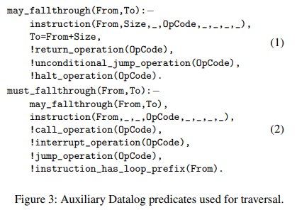

由上面两个谓词的表达式，可以看到两个谓词的条件

* may_fallthrough
  
  * from处存在一条指令
  
  * To为该条指令的下一条指令
  
  * 该指令不是ret
  
  * 该指令不是无条件跳转
  
  * 该指令不是halt停机指令

* must_fallthrough在may_fallthrough的条件上加上了更严格的限制
  
  * 该指令不是call
  
  * 该指令不是中断操作
  
  * 该指令不是任何跳转（条件非条件）
  
  * 该指令含有loop前缀（rep repne等）

##### 实例


如图，地址416C4E生成一个谓词 `must_fallthrough(416C4E, 416C53)`

而地址416C53只能生成谓词 `may_fallthrough(416C53, 416C58)`

#### Backward Traversal

反向遍历过程主要用于将must_fallthrough到达invalid谓词的指令去除

其rule如下：

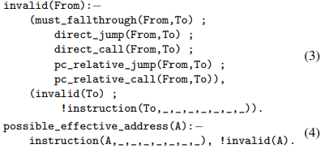

* invalid  表示所有must_fallthrough到To，或直接跳转到包含一条不可用指令的地址To的指令

* possible_effective_address  表示余下的所有没有被invalid的地址

#### Forward Traversal

正向遍历算法采用了介于线性与递归反汇编算法的技术，但它的策略更激进：除了会遍历所有直接跳转的目的地址，还会将所有已知指令的操作数中可能作为地址使用的数都作为遍历的目标

> 如上面实例中416C4E中的立即数0x45CB23

此外，data段中的可能地址也会作为遍历目标（谓词address_in_data）

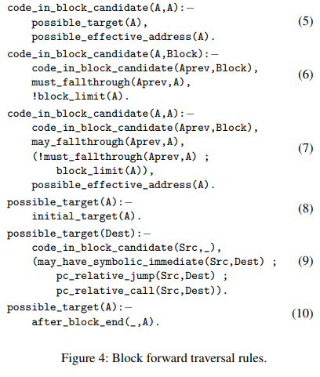

* 遍历由initial_target出发（ rule8: possible_target(A) ）
  
  该谓词包含：二进制入口点、已存在的函数符号、exception结构定义的地址和所有在address_in_data谓词中的地址
  
  此外，不是所有地址都由绝对地址的形式出现，如PIC代码。文中说用了一种办法来识别这些地址从而将其包含到address_in_data中

* possible_target谓词的创建可以使得rule5的条件被满足，使得code_in_block_candidate谓词被建立

* rule6定义了一个基本块的线性下降过程：若地址Aprev存在code_in_block_candidate谓词，且Aprev must_fallthrough 到达A，且A尚未到达block_limit，则将块合并为一个大的code_in_block_candidate
  
  其中block_limit谓词是possible_target的过拟合近似，它的计算方式类似possible_target谓词，计算方法与上图中的rule8和rule10相同（possible_target的计算还多出了一个rule9）

* rule7则定义了一个基本块的递归下降过程：若地址Aprev存在code_in_block_candidate谓词，且Aprev may_fallthrough 到达A，但不是must_fallthrough，则建立一个新的code_in_block_candidate谓词作为新的基本块

* rule9定义了一个将所有jmp/call的目的地址加入possible_target的过程。此外这里may_have_symbolic_immediate定义了一个更激进的策略：将所有指令立即数也加入。
  
  如上面例子中的 `416C4E:  mov edx, offset 45CB23` 会产生一个谓词 `may_have_symbolic_immediate(416C4E, 45CB23)`

* rule10则定义了一个基本块外的线性下降过程：对于每个无法到达End（一个无条件跳转或ret）的基本块，对基本块末尾到End间的地址都建立possible_target谓词

#### Solving Block Conflicts

这边采用的策略同样是去除overlap的块，另一个策略则是去除潜在的数据段

解决冲突块的方法依然是通过一些heuristic，这些heuristic编码为datalog规则

这里定义了谓词 `block_points(Block:A, Src:A, Points:Z64, Why:S)` 来表示符合heuristic的块，其中Block是基本块的地址；Src是个可选参数，指向另一个与当前谓词条件相关的基本块，或为0（若没有该情况）；Points则是当前块的评分。

这里采用[Souffle引擎](https://souffle-lang.github.io/index.html)的aggregates计算每个块的得分，对于overlap的块去除分较低的，并去除分低于某个阈值的。若两个块分相同则保留第一个并发出一个warning

这里使用的heuristic主要关于基本块是如何相连的，它们的空间匹配程度，以及有没有被潜在的指针引用。部分heuristic如下，其中带+为加分，-为减分

* `+`  该块存在call/jmp调用，或有从一个无overlap的块fallthrough到该块的路径

* `+`  该块的初始地址在代码段或数据段出现过；若出现该地址时是对齐的，则分数更高

* `+`  该块call/jmp到另一个非overlap的块

* `-`  一个潜在的跳转表与该块存在overlap

### Auxiliary Analyses

下一步分析是符号化，这里首先介绍用到的几种静态分析方法

#### Register Def-Use Analysis

###### def-use chain

定义的谓词如下

```
def_used(Adef:A, Reg:R, Aused:A, Index:Z64)
```

* 表示Reg在Adef处被定义，在Aused处被使用

分析过程中，首先在程序中建立def谓词 `def(Adef:A, Reg:R)`，此后建立use谓词 `use(Aused:A, Reg:R, Index:Z64)` ，对def谓词进行传播并将其对应到use谓词

该分析过程是过程内的，且只会跟踪直接跳转的控制流

一个细节是本文将32位和64位的寄存器视作同样的寄存器

##### def used for address

得到def-use链后，构建了一个新的谓词来找到那些可能用于计算寻址相关的寄存器

```
def_used_for_address(Adef:A, Reg:R)
```

* 表示定义在Adef地址处的寄存器Reg可能用于计算地址

该谓词的计算方式是从某条内存访问指令开始，反向分析其def-use链

该谓词是可传递的，若寄存器R用于定义另一个寄存器R'，且R'之后用于计算地址，则R也被归为用于计算地址的寄存器。对应datalog规则如下

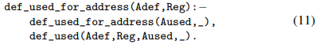

##### 实例

对于程序


对应的def-use分析结果如下

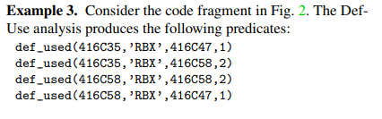

注意，这里采用了程序分析的方法，因此会遍历直到不动点，因此前两个def_used谓词是第一轮遍历时创建的，后两个def_used谓词则是416C5C跳转后创建的

#### Register Value Analysis

##### 原理

这一步主要用于解析对内存的引用，因为很多内存地址是先通过计算后才进行引用的

注意该步分析只是提供一个参考，不保证解析所有的寄存器值间关系

本文对一个内存地址计算值建模为

```
base + index * mult
```

对应的谓词为

```
reg_val(A:A, Reg:R, A2:A, Reg2:R, Mult:Z64, Disp:Z64)
```

* 表示在A地址指令引用的寄存器R的值，等于A2地址处引用的寄存器 `R2 * Mult + Disp`

而该谓词的创建主要分为两步

* 创建寄存器与值的绑定
  
  ```
  reg_val_edge(A:A, Reg:R, Aprev:A, Reg2:R, Mult:Z64, Imm:Z64)
  ```
  
  * 表示在A处引用的寄存器Reg，在Aprev处的指令被定义（可能由Reg2定义），存在关系 `Reg = Reg2 * Mult + Imm`
  
  该谓词需要针对具体指令进行定义，如下述rule定义了 `add reg, imm`)
  
  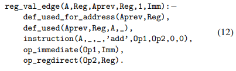
  
  * 首先看最后三个谓词，定义了A地址处的 `add reg, imm` 指令形式
  
  * 第二个谓词跟踪了add所使用寄存器Reg的定义地址Aprev
  
  * 第一个谓词则限定了寄存器Reg是一个寻址相关的寄存器

* 对上述绑定形成的关系图进行传播分析
  
  该分析从reg_val_edge谓词的一个叶子节点开始（没有Reg2与其关联，因此是形如 `mov reg, imm` 或 `mov reg, mem` 的指令）
  
  此后通过传播算法建立reg_val谓词，主要有几种规则
  
  * reg_val与reg_val_edge的合并
    
    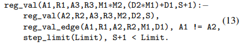
    
    该规则执行的是变量传播的操作，当R1和R3分别与R2有绑定关系时的传播关系
    
    若 `R1 = R2 * M1 + D1` ， `R2 = R3 * M2 + D2` ，则
    
    `R1 = R3 * M1*M2 + (D2*M1)+D1`
    
    注意这里定义了Limit，限制传播的迭代次数
  
  * 检测简单循环
    
    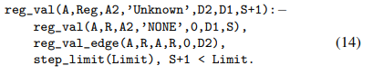
    
    该规则实际上检测的是形如
    
    ```
    R = D1
    R = R + D2
    ...
    ```
    
    即，R首先定义为D1，之后存在多个递增D2的情况
  
  * 多寄存器的操作
    
    对于reg_val谓词来说无法表示源操作数含两个寄存器的情况，但若一个寄存器含常量，或两个寄存器都可以表示用一个公共寄存器表示（这边称为diamond pattern），则可以正常传播

##### 实例

同样以这段程序为例


* 创建寄存器与值的绑定
  
  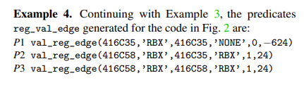
  注意，在第二轮循环中RBX创建了一个指向自己的val_reg_edge

* reg_val_edge谓词传播
  
  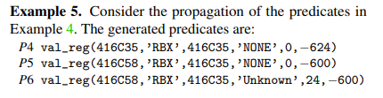
  这一步展示了reg_val与reg_val_edge的合并：
  
  * P4对应P1，`RBX = -624`， 因为其是叶子节点
  
  * P5则是P2与P4合并的结果，套用rule13
    
    
    
    ```
    reg_val(A1:416C58, R1:RBX, A3:416C35, R3:None, M:1*0=0, D:-624*1+24=-600)
    ```
  
  * P6是P5与P3合并的结果，套用了rule14，注意这里存在一个循环，满足reg_val_edge的A1=A2条件（rule13无法满足）
    
    
    
    ```
    reg_val(A1:416C58, R1:RBX, A3:416C35, R3:Unknown, D2:24, D1:-600)
    ```
    
    这边R3位unknown是因为对应reg_val的参数R3为None

* 最后一个例子演示了diamond pattern
  
  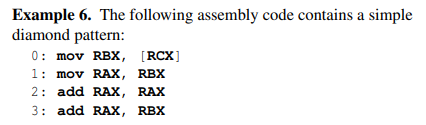
  
  最后一条指令含有两个源寄存器RAX和RBX，但因为前面产生的谓词包含
  
  ```
  reg_val(2, RAX, 0, RBX, 2, 0)  这个谓词应该是由1和2得出
  reg_val(0, RBX, 0, RBX, 1, 0)
  ```
  
  因此最后可以生成谓词
  
  ```
  reg_val(3, RAX, 0, RBX, 3, 0)
  ```

#### Data Access Pattern Analysis

##### 原理

该分析基于Register Def-Use Analysis和Register Value Analysis的结果，对实际的访问地址进行计算

生成的谓词如下：

```
data_acccess_pattern(A:A, Size:Z64, Mult:Z64, From:A)
```

* 表示地址A被位于地址From处的指令读写，读写的长度为Size。此外该访问在计算内存地址时若包含了乘数则记录在Mult中

这里给出了一个假设：若某个地址的访问方式是基址x+某个乘数m与下标的乘积，如x+m，x+2m，那么与该数据相关的内存访问都倾向于采用这种形式

为了表示上面的情况，额外定义了谓词

```
propagated_data_access(A:A, Size:Z64, Mult:Z64, From:A)
```

* 表示一系列有相似的 `base + n*Mult` 形式的读写

传播时，由于并没有数据结构的上下界信息，直接将DAP传播直到遇到下一个对同一块地址进行操作的DAP，或遇到使用了不同Mult进行访问的情况

采用这种传播方式的依据是：我们无法获知每个数据结构的大小，而一般来说代码中的数据结构是相邻的，因此直接认为下个数据结构的起始就是上一个数据结构的末尾。因此这里通过数据的不同访问方式来区分数据结构，从而进一步确定数据结构的大小

##### 实例

同样是这段代码


* data_access_pattern
  
  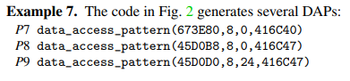
  
  如图，P7与P8由第一遍迭代得到，而P9则是跳转后得到的，因为这里RBX的值发生了改变（这个地方就依赖register value analysis结果）

* propagated_data_access
  
  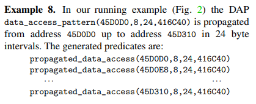
  
  如图为416C47处（图中写作416C40，疑似有误）循环访问产生的谓词

#### Discussion

本文使用的register value analysis和DAP analysis与Ramblr之类的工作存在一些区别

* register value analysis可以使用A1地址的R1寄存器来表示另一个在A2地址的R2寄存器的值，这与传统的VSA（value set analysis）和VSA中的affine-relations analysis不一样（后者是用来计算同一个地址的寄存器值间的关系）
  
  谓词reg_val表示了一种数据依赖的关系，因此可以用来分析一些数据间的抽象依赖关系
  
  如这个例子中
  
  
  
  reg_val谓词可以分析出在地址3处RAX=3*RBX的关系，而不需要有具体的数据信息。而VSA只有在可以推断出0地址处对RCX访问地址，并得到相关的具体值的情况下才能推断RAX的值

* DAP分析也与Ramblr的方式不同。Ramblr只能识别某个元数据或元数据数组，而DAP可以提供额外信息，如下例
  
  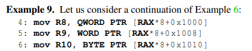
  
  DAP分析记录了访问的长度、基址以及乘数，因此可以进一步推断出0x1000存在一个对结构体的访问，且该结构体至少存在三个不同大小的field

### Symbolization

符号化过程即判断代码和数据中的常数是否为一个符号。一个直观的做法是将所有落在可执行文件地址空间内的数视为符号，但Ramblr这篇证明这种方法会导致很多的FP和FN

本文讨论了一系列方法来减少FP和FN

#### False Positives: Value Collisions

FP主要原因是常量与二进制所在的地址范围发生碰撞，下面介绍了一系列heuristic

##### Numbers in Data

对于数据段中的数字，首先将其分为下列几类作为备选

* Symbol  数值落在地址范围

* String  以0为结尾的可打印字符序列

* Symbol-Symbol  使用前面几种分析方法检测到的跳转表（具体方法见附录A）

* Other  使用前面的propagated_data_access计算得到的某些不是以8字节方式访问的地址

若上述几种备选类型出现了overlap的情况，则主要使用下列heuristic对其进行打分，+代表加分项，-则反之

* `+`  指向一条指令开头

* `+`  在代码中存在对该数据的正确访问（访问长度也符合）

* `+`  含有多个（至少3个）连续的Symbol备选项，则倾向于视为Symbol array

* `+`  被上述Symbol array指向的数据

* `+`  8字节对齐的Symbol

* `+`  String类型本身会获得更多的分，其中大于5字节的String分更高

* `-`  存在对某个Symbol中间地址的数据访问

* `-`  指向一些特殊段，如.eh_frame的Symbol

##### Numbers in Code

这里将代码中的立即数分为两种类型：

* 直接表示为立即数

* 表示为displacement

对于两种类型，都使用与前面相同的两条heuristic

* `+`  指向一条指令开头

* `-`  指向一些特殊段

此外对于立即数类型，还有下列额外的heuristic

* `+`  在前面的分析中用于计算内存地址操作数

* `-`  一些一般不会用在指针类型上的运算，如mul xor等

* `-`  该立即数与一个一定不是地址的立即数进行比较

#### False Negatives: Symbol+Constant

FN的主要原因是代码中存在 `Symbol + Constant` 的形式，使得无法将常数识别为地址

同样基于上面的三种分析方法来检测这种形式

这里将该形式出现的情况分为两种

##### Displacements in Indirect Operands

考虑 `R1+R2*M+D` 的寻址形式，D可能没有落在数据段中，但 `R1+R2*M+D` 落在数据段中

将其分为两种情况

* R1保存基址，则D不该被符号化

* D保存基址，则D作为立即数应该被符号化

下面讨论一些具体的符号化情况

* 若寻址形式为 `[R2*M+D]` M>1，则D大概率是基址，所以进行符号化

* 上面的形式较为简单，而这里可以通过reg_val谓词来找到那些有更复杂寄存器依赖关系的情况，如从形式上看可能寻址为 `[R1+D]` ，但根据寄存器关系实际上形如 `R2*M+D` 且M>1的寻址，则依然将D符号化

* 同样通过reg_val分析，若发现R2存放着可能是基址的内容，则不对D进行符号化

此外，这里不仅对displacement进行符号化，还对其访问的内存范围进行推断。若当前访问有对应的DAP谓词关系，则直接选用该谓词的目的地址作为推断的访问地址，否则直接将data段的边界作为访问的范围限制

##### Immediate Operands

这一步主要识别的是使用立即数作为循环的初始值和边界的情况

> 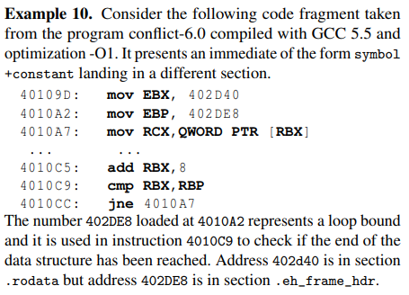
> 
> 如这个例子，402D40是起始地址，402DE8是结束地址，而前者在.rodata，后者则在.eh_frame_hdr

这种情况主要是出现在边界判断的时候，实际上循环中并没有操作402DE8这个地址，但其作为边界用来限制循环的执行

考虑到这种情况，这里首先检测了循环每次迭代增加（减少）的数量M，若对于边界si和sf，将其边界扩展到 $[s_i - M, s_f + M]$ 。若循环到的地址全部落在这段内存，则会将上述的循环中立即数视为符号

> 这边根据上述example，说明了这一步的具体处理方式
> 
> 首先通过register value analysis分析出迭代的步长为8
> 
> 然后将.rodata的大小从 [402720, 402DE8) 扩展到 [402718, 402DF0)
> 
> 最后分析，并将4010A2的指令符号化为
> 
> ```
> 4010A2: mov EBP,OFFSET .L_402D40+168
> ```

### Experimental Evaluation

* Benchmarks
  
  Coreutils 8.25   在Ramblr和Uroboros中使用，一共含106个bin
  
  DARPA Cyber Grand Challenge  共编译成功69个
  
  25个real world程序，列表在论文里有

* Compilation Settings
  
  7个编译器
  
  * GCC  5.5.0 7.1.0 9.2.1
  
  * Clang  3.8.0 6.0 9.0.1
  
  * ICC  19.0.5
  
  每个编译器采用6种flag，不使用PIC
  
  * -O0  -O1  -O2  -O3  -Os  -Ofast

#### Symbolization Experiments

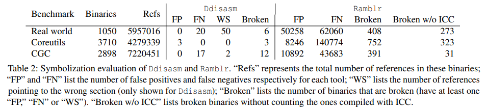

注意，这里ground truth是由 `-emit-relocs` 选项生成的

上表对比了Ddisasm与Ramblr对于符号化的结果

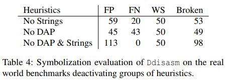

上表对比了使用不同heuristic时的结果，从而对比heuristic对于准确率的贡献

#### Functionality Experiments

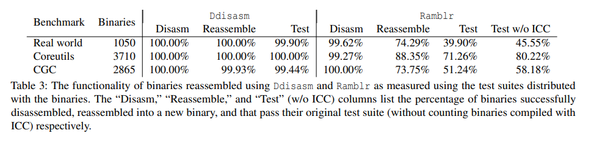

上表测试了两个工具reassemble的结果，并对reassemble的程序测试了原始的TestSuite

#### Performance Evaluation

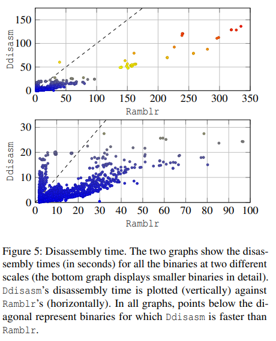

上图对比了两个工具的performance

### 附录A Symbol-Symbol Jump Tables

大多数GCC和Clang的跳转表都含绝对地址，但ICC编译后的不一样

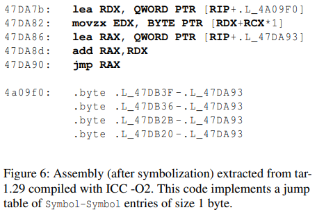

如图代码，edx保存了跳转偏移，而RAX保存了基址，最后跳转到 RAX+RDX

对于这种情况，定义了如下规则

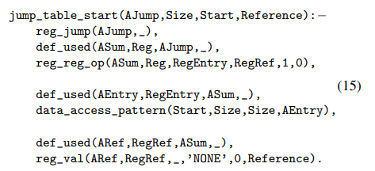

规则的具体解释见论文

使用datalog的优势在于不依赖于一些特定的指令模板，所以鲁棒性更好

### 附录B  Symbolization Failures

总结了Ddisasm遇到符号化错误的情况，具体看论文吧
