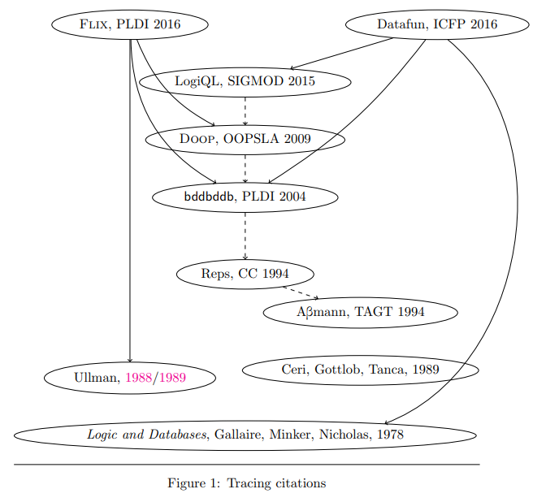
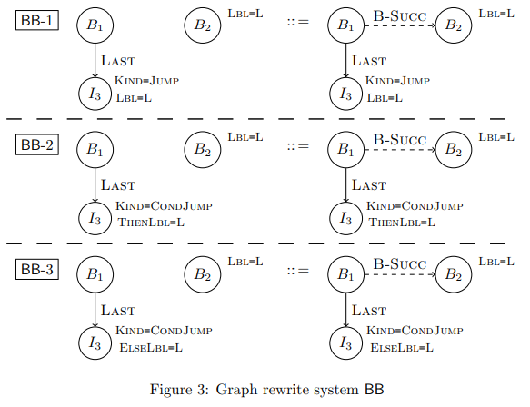
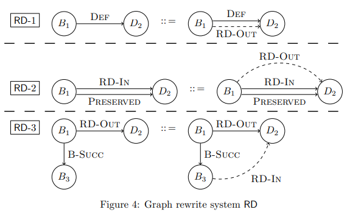
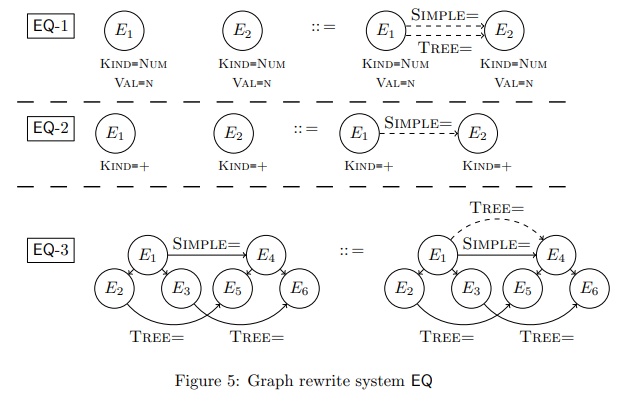
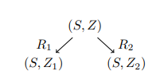
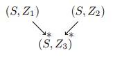
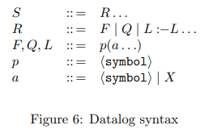
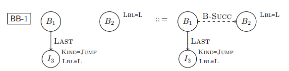
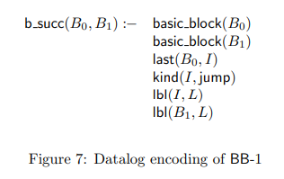
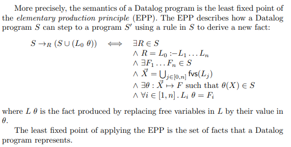

### Datalog for Static Analysis

如下是该技术发展中关键的几篇文章

### 3 Static Analysis Problems

#### Basic Block Ordering(BB)

描述的是从bbl建立CFG的问题

#### Reaching Definitions(RD)

描述的是在程序中将变量的定义与引用联系在一起的问题

ABmann为了简化问题，将bbl与变量定义的关系简化为下列两种

* DEF
  
  将基本块与变量定义相关联（原文写的是definitions that exit the block，意思应该是在退出基本块前的最后一个定义）
  
  之所以有 最后一个定义 的说法，是因为若一个基本块定义了一个变量两次，则只有最后一个定义与基本块有DEF关系

* PRESERVED
  
  将基本块与没有被overwrite过的定义相关联

#### Equivalence Classes / Value Numbering(EQ)

描述的是为基本块中的子表达式找到语法等价的表达式的问题

如 `x+y` 表达式出现两次，则两者同属于一个 equivalence class

### Uniform Representation

上述三个问题可以被统一描述为下列的图。其中图的左部表示一个子图，而右部为左部添加一条边的结果

要解决这三个问题，可以先将程序P转化为下列对应的图结构，并根据下面定义的规则对图进行rewrite，直到到达程序的不动点

#### BB

* BB-1  若B1的最后一条指令I3是直接跳转，则跳转目标B2直接是B1的successor

* BB-2/BB-3  若B1的最后一条指令I3是条件跳转，则then和else分别为B1的successor

#### RD

* RD-1  描述了B1定义了变量D2，且该定义一直维持到基本块末尾的情况

* RD-2  描述了一个定义 流入（flows into） 基本块B1，且没有被重定义，该定义 流出（flows out） B1的情况

* RD-3  描述了一个定义 流出 基本块B1，则其会 流入 B1的后续块B3的情况

#### EQ

这里的EQ关系有两种：

* SIMPLE=  表示值的等价

* TREE=  表示计算式对应树的等价

图中描述了部分规则，其中node E表示的都是某个赋值语句，或两数的加法

* EQ-1  描述了两个值相等的赋值语句是同时具有SIMPLE=和TREE=的

* EQ-2  描述了两个加法结果相同的节点具有SIMPLE=性质

* EQ-3  描述了当两个表达式E1和E4是SIMPLE=的，且E1的子树E2和E3与E4的子树E5和E6具有TREE=性质，则E1和E4同时有SIMPLE=和TREE=性质

### Termination and Strong Confluence

ABmann定义了一套 edge-addition rewrite system(EARS)

这里对该系统及其工作过程进行了形式化描述

#### EARS的形式化描述

其形式化描述如下

* EARS系统 ε(S,Z)，其中
  
  * Z  是一个图，图中含有带唯一标记的（labeled）节点，带唯一标记的边以及一个记录了节点属性的字典。
    
    Z的形式化定义 $Z = <N, E, \Sigma_N, \Sigma_E,  l_N, m_N, A_N>$ 如下
    
    * N是节点集合
    
    * E是边的集合，是一个三元组 $(N, N, \Sigma_E)$ 即相连的两个节点及其边
    
    * $\Sigma_N$  节点的label集合
    
    * $\Sigma_E$  边的label集合
    
    * $l_N : N \mapsto \Sigma_N$  节点与其label的映射
    
    * $m_N: E \mapsto \Sigma_E$  边与其label的映射
    
    * $A_N = \{ f | f:N \mapsto A_i , i \in N \}$  节点到其某个属性的映射
  
  * S  是一系列图的pair的集合，如对于一个pair $(G_L, G_R) \in S$ ，GL和GR包含的节点相同，且GL的边是GR的边的子集

直观来说，Z描述程序，而S描述图的rewrite规则

#### EARS的工作过程

EARS本质是一个非确定性的进程，在程序中查找符合条件的图，并根据对应的rewrite规则修改该图

定义 $(S, Z) \rightarrow {}_R (S, Z')$ 为对Z使用rewrite规则R，将图Z转换为Z'

ABmann提出了三条使用rewrite规则的条件，对于 $R = (G_L, G_R)$

* 存在一个图态射（graph morphism） $g_L : G_L \rightarrow Z$
  
  这个条件即当前图Z中含有符合规则的图GL

* gL保留了节点的属性
  
  这个条件应该只是为了形式化理论的完备性

* 没有一个图态射 $g_R : G_R \rightarrow Z$ 使得 $g_L(G_L) \subseteq g_R(G_R)$
  
  这个条件确保rewrite规则会给原图Z加上有且仅有一条边。换句话说，确保Z是Z'的子图

#### EARS的Termination and Strong Confluence

##### Termination

termination描述自动机的可停机性，即算法不会是一个无限循环

EARS显然是可停止的，因为每次应用rewrite规则时都会加上一条边，因此边的数量存在上限

##### Strong Confluence

Strong Confluence描述当以不同的顺序应用rewrite规则时，最终产生的结果相同

该性质的证明依赖于rule application的自反传递闭包性质（reflexive-transitive closure）

假设 (S, Z) 存在两种rewrite rule

则只需证明存在 (S, Z3)，满足

假设应用规则集合R1 R2后添加的边分别为E1 E2

* 若E1=E2，则Z1=Z2=Z3，不需要做任何操作

* 若 $E_1 \subset E_2$ ，即Z1是Z2的子图，则Z2=Z3，则执行 $(S, Z_1) \rightarrow {}_{R_2} (S, Z_3)$ ，反之Z2是Z1子图，情况类似

* 其他情况，则 $(S, Z_1) \rightarrow {}_{R_2} (S, Z_3) \ \ \ (S, Z_2) \rightarrow {}_{R_1} (S, Z_3)$

### Datalog

#### 形式化描述

datalog可以简单定义为没有函数符号或否定（nagation，这里不知道指什么）的prolog。或者可以定义为一个使用一阶霍恩子句扩展的数据库语法

上图表示了一些datalog语法的形式化描述：

* 程序S是一个由R组成的序列

* R包含fact F，rule L和query Q

* 对于一个rule，有： $L_0 : -L_1 ... L_n$ 由存在的一系列fact（L1...Ln）推导出新信息L0

* fact rule和query由一系列predicate symbol p和atoms a组成

* a是可以是一个符号，也可以是一个变量

该语言有两个语法限制

* 一个fact可能不包含变量

* 一个写在rule开头的自由变量必须出现在rule表达式中，形式化表达如下：
  
  令fvs(L)表示在rule L中出现的变量集合，则 $fvs(L_0) \subseteq \bigcup_{i \in [1, n]} fvs(L_i)$

#### 一个例子

如对于前面提到的BB-1

可以使用datalog描述为

式子即为一条rule，左边为新的关系b_succ(B0, B1)，右边则为需要满足的条件

#### datalog与一阶谓词逻辑

rule可以翻译（translation，用符号~表示）为

$$
L_0 : -L_1 ... L_n \sim \forall \vec X. (L_1 \wedge ... \wedge L_n) \Rightarrow L_0
\\
where \  \vec X = \bigcup_{j \in [0, n]} fvs(L_j)
$$

下面通过形式化描述解释了datalog程序是EPP的最小不动点，具体看不太懂，截图如下

### Context-sensitive Points-To Analysis (for Java)

下面的内容简单介绍了几个关于datalog在程序分析中解决point-to问题的工作。具体内容应该得看论文，这里只是个大体的介绍
