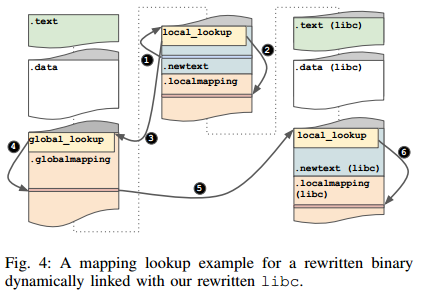

缩写

* CFT  Control Flow Transfer

* iCFT indirect Control Flow Transfer

## Superset Disassembly: Statically Rewriting x86 Binaries Without Heuristics

### Background and Overview

#### Scope and Assumptions

场景

* 架构 32位x86

* 平台 linux 主流编译器，如gcc llvm

不覆盖的几种场景

* 使用dlopen动态加载链接库

* smc和壳

* 使用JIT编译的代码

#### Challenges

这里使用了一个例子来说明binary rewrite中的常见问题


* 识别并重定位静态内存地址
  
  二进制代码中经常引用静态地址，常见于全局变量等。二进制代码转换需要处理这种情况。但往往很难识别这些常量，因为并没有一个算法可靠地区分一个常量是指针还是数值
  
  ```
  上图例子中如0x0804a03c存放着指向函数mode1和mode2的函数指针
  ```

* 处理动态计算的内存地址
  
  一个最常见的挑战就是确定某个运行时计算的间接跳转地址，它可能是由基址+偏移得到的，或是通过函数指针得到的；甚至可能经过了位运算、编码（如用哈希表）或被多重引用
  
  ```
  上图例子中main调用mode时是根据pid最后一位进行判断的，对应汇编0x08048681，这里先找到对应的函数指针，再通过间接跳转调用
  ```

* 区分数据与代码
  
  如现代编译器为了性能，可能会将静态数据和代码放到一起；或是遇到手写汇编的情况。且x86代码对内存对齐没有规定
  
  ```
  上图例子中如fstring.asm是手写汇编，其中msg1和msg2就混杂在代码中，也使得其反汇编结果存在错误（get_string函数的地址0x080485df）
  ```

* 处理函数指针参数
  
  函数指针作为参数常见于回调函数
  
  ```
  上图例子中调用qsort库函数时采用了函数指针作为回调函数，在mode1的0x080485fa处将gt函数的地址0x080485a0作为参数传入
  ```

* 处理PIC
  
  ```
  上图例子中的cmp.c是-fPIC编译的，因此gt函数中使用特殊的函数__i686.get_pc_thunk.bx将当前地址赋值给ebx，从而用于根据偏移计算地址
  ```

#### Key Insights

##### 保留原始数据

为了避免去识别各种**静态内存地址**，可以保留整个原始程序的地址空间的内容

##### 建立从旧的代码空间到重写的新代码空间的映射

这里主要针对**动态计算的内存地址**，思路是与其识别间接寻址中的基址和变址等，并将其写为新地址，不如将目光放到计算后的最终地址，忽略其计算过程

对于间接跳转地址，即使解引用需要一系列过程，最终得到的地址都会作为间接跳转指令的参数。因此我们只要将所有可能的旧的代码空间的目的地址全部映射为新代码空间的地址，最后将间接跳转指令的参数重写为新跳转地址即可解决该问题

##### 暴力破解所有可能的反汇编

这里提出了一个称为Superset Disassembly的技术，即对所有可能的offset都做一次反汇编，这样总会得到一个正确的反汇编指令序列

此后再通过上面的映射表对每段反汇编（这里应该是按bbl进行反汇编）将各个rewrite后的基本块连接为可执行的代码

##### 重写所有的用户态代码 包含库中的代码

对于前面所述的处理函数指针参数问题，之前的很多工作（包括STIR REINS SECONDWRITE）使用的方法是识别所有外部库中使用了函数指针参数的函数，并重写其地址。但这里采用了更简单的方法：可以将rewrite范围扩展到所有的库，再通过前面的代码映射保证函数指针的正确性

该方法还有一个好处，就是对于错误处理较友好，如C++的exception记录在`.eh_frames`段，其中包含exception handler的地址，通过重写跳转到错误处理程序的跳转可以正确处理这类程序

##### 重写所有的call以适配PIC

识别PIC程序本身是个比较困难的问题，但通过分析发现只有call指令（会将当前地址push到栈上）可以用来在PIC偏移计算中获取基地址（**问题：但是PIC的一堆偏移不都是在编译时算的么，不过这种情况似乎可以用上面的映射方法解决**）

所以将所有的call指令替换

```
call xxx
返回地址
=>
push 返回地址
jmp xxx的新地址
```

这样可以保证原来的计算流程不变，对于间接跳转，最后计算到的地址可以在间接跳转指令中被前面的映射方法转换；而对于数据访问，则不需要做任何转换，因为重写后保留了完整的重写前程序的地址空间

#### Overview


主要分为两部分

##### Mapping

这一步主要是处理superset disassembly。需要注意的一个特殊处理是：很多情况下对于不同偏移的反汇编会在某个地方与其他的反汇编结果对齐，使得之后的反汇编是完全相同的。若出现这种情况，则直接通过一个jmp跳转到先前已有的对应代码处

之后创建一个旧地址与新地址的映射，放入`.localmapping`段

##### Rewrite

这一步主要做几个事

* 首先将先前superset disassembly的结果写入`.newtext`段

* 再重新遍历并修正一遍反汇编，因为仅靠前面的一次遍历没法确定所有的重写地址

* 传给elf writer

### Mapping

#### Superset Disassembler

由于采用了地址映射方法，在组织superset disassembly结果时拥有了极大的自由度。因为可以将任何块通过非条件跳转拆分为多个块，并放在程序的任何位置。因此即使遇到了诸如短跳转指令也不需要进行额外的分析。甚至可以对这些块自由地进行shuffle。

另一个处理主要针对混淆代码。很多混淆代码通过不透明谓词进行跳转，而在永假分支塞入一些非法指令。消除这类无用指令的方法是：若某个指令序列含有非法代码，则可以从该序列的最后一个直接跳转开始，从后往前将直到非法指令的部分删掉


* 第一层循环，首先注意这里的offset是从0到指令bytes长度，处理每一个offset的反汇编
  
  * 第二层循环
    
    * 若当前的地址没被反汇编过，则保存其反汇编结果
    
    * 否则说明该偏移的反汇编到达了某个与先前结果对齐的点，于是直接采用一个jmp跳转到已有结果
    
    * 这里还有一个处理没标明：若指令非法，则直接break，处理下一个offset

#### Mapping Generation

在进行superset disassembly时会记录每条指令的长度，为之后生成mapping准备

所有的call jmp jcc和ret都会被rewrite。对于大多数jcc指令其偏移只有8位，而因为rewrite过程会插入我们自己的代码，可能导致偏移量不够。解决该问题的方法是使用`jmp near xxx; jcc yyy`

此后就可以建立最后的mapping，将指令长度转换为其在新的段中的偏移量。通过这种mapping，可以通过一些方式比较自由地组织代码块，如每当程序要到达一些rewrite前后保持一致的代码时可以使用一个jmp，或者是直接将其按照bbl划分。上述操作都仅需要改变分支指令的地址

#### Mapping Lookups



##### 静态地址

处理比较容易，在rewrite的时候直接静态映射

##### 动态地址

比较复杂，因为这些地址需要在运行时进行动态转换与解析，因此需要一个高效的数据结构来处理。

方法是生成一个拥有4Bytes偏移的表，对于每个旧的代码中拥有的地址，都可以在这个表中对应的offset找到映射（所以这个表是不是跟原来的代码段差不多大了）。若某个偏移本身不是一个可用的指令则将表项填为0xffffffff

再插入一个汇编片段来处理这种查询。具体技术是使用eax作为参数，此后采用call和pop指令来获取程序指针以计算PIC，从而计算偏移。若表项对应的偏移为0xffffffff则触发segfault；若计算出的地址在mapping范围外，则说明可能调用了一个库函数，则使用下文介绍的 [Global Mapping](#Global Mapping)

这部分的操作对应上图的1和2：

* 首先由`.newtext`的某条指令触发动态地址查找过程，则首先调用local_lookup函数

* 该函数会在`.localmapping`中查找对应的地址，若能找到对应地址，则直接作为指令的目的地址；若在mapping范围外则见下文的过程进行3 4 5 6

#### Global Mapping

由于该方法把库函数也rewrite了（注意这一点，所以每个库都有自己的local_lookup函数和对应的`.localmapping`段），每个库都有自己mapping后的代码段，而很多库是动态加载的，因此必须维护一个global mapping来记录我们生成的这一系列的库函数mapping

函数global_lookup在以页为粒度进行操作。当一个库被加载，它的代码段会被映射到一个或多个页面，而该函数的功能就是返回对应页面的库中包含的local_lookup函数的地址

因此代码中对一个动态库的调用整体的重定向过程如下

* 调用源程序中的local_lookup函数查找地址

* local_lookup函数发现是一个库函数的调用，所以调用global_lookup函数

* global_lookup函数通过在`.globalmapping`段中查找对应库的映射页面地址，并调用库函数自己的local_lookup函数

* 库函数通过自己的local_lookup函数找到正确的调用函数

### Rewriting

#### Rewriting direct CFT instructions (jcc/jmp/call)

* 所有的jcc都是直接的CFT，所以可以直接使用静态映射计算新的偏移

* jmp和call可能有立即数寻址，这种方式也可以使用静态映射来计算

* `jmp/jcc short`只有1Byte的偏移，在重写后可能面临偏移量不够的问题，所以将这类跳转改写为`jmp/jcc near`

#### Rewriting indirect jmp/call instructions

jmp和call指令都有间接跳转的形式，即跳转到操作数指向的地址

##### jmp

原指令

```
jmp [target]
```

改写后

```
mov [esp-32], eax
mov eax, target
call lookup
mov [esp-4], eax
mov eax, [esp-32]
jmp [esp-4]
```

这里把eax存在-32的位置是为了给lookup函数使用到的栈留下空间

##### call

原指令

```
call [target]
```

改写后

```
mov [esp-32], eax
mov eax, target
push old_return_address
call lookup
mov [esp-4], eax
mov eax, [esp-28]
jmp [esp-4]
```

这里额外压入了原本call的返回地址，以对PIC进行处理。注意这里使用了push导致之后的栈引用地址变化

#### Rewriting ret instructions

因为上面对call进行的处理压入了旧的返回地址，所以对应地需要在ret过程里动态映射该地址

原指令

```
ret pop_amount
```

改写为

```
mov [esp-28], eax
pop eax        ; 返回地址
call lookup
add esp, pop_amount
mov [esp-4], eax
mov eax, [esp-(32+pop_amount)]
jmp [esp-4]
```

这里注意对pop_amount的处理

### IMPLEMENTATION

这部分提到了几个需要注意的地方

* linux中使用了一种VDSO的机制，该机制不是以动态库形式加载的，更像是一个系统的热补丁，是为了解决一些诸如处理器支持`sysenter`还是`int 80`进行系统调用的问题。因此在rewrite时需要避免触及到调用VDSO的指令
  
  解决方式是在程序入口点加入解析VDSO相关的metadata的代码，并找到VDSO函数的地址从而避免映射

* linux中的lazy binding机制使得在系统加载动态库时，初始的GOT表都指向动态加载函数，之后才是对应的函数地址
  
  解决方式是关掉lazy binding（`LD_BIND_NOW=1`）

* global mapping机制使得我们需要知道动态库的地址范围
  
  解决方式是在`_start`中加入查询各个动态库地址的代码

* local mapping在每个可执行文件和动态库都会创建，但global mapping只在可执行文件中被创建。因为一些动态库可能也需要调用global_lookup，所以默认把该函数放在一个固定的地址（默认为0x7000000）


