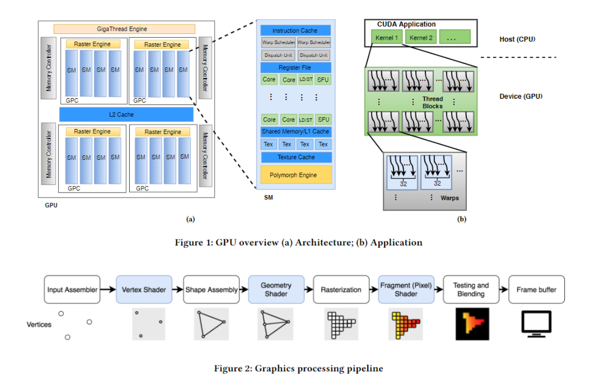
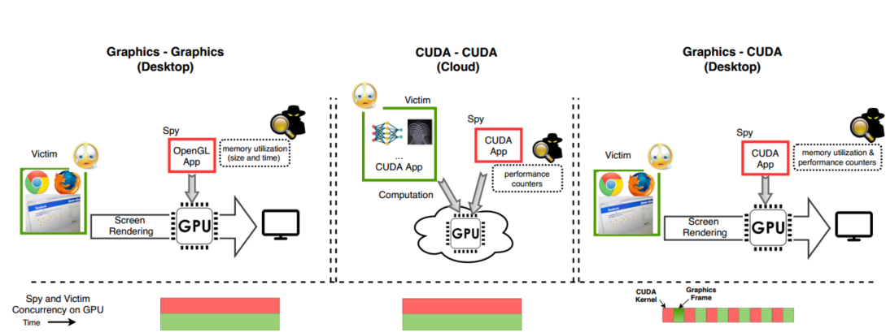
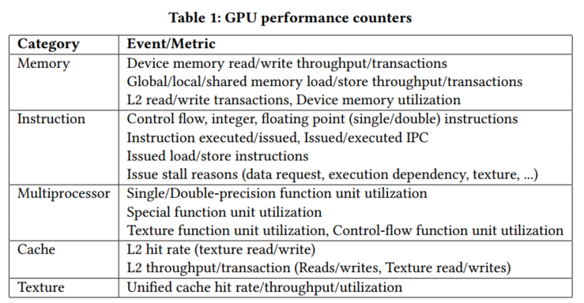
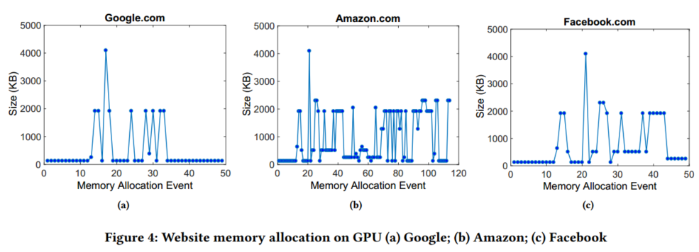
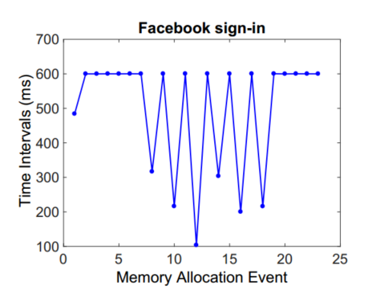
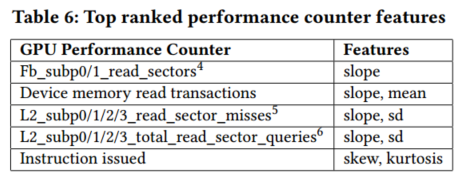

## GPU架构模型

[参考](http://hustcat.github.io/gpu-architecture/)



cuda和显卡模型见`gpu_basic_concept`

因为gpu频繁地切换warp，导致一般来说难以进行细粒度的侧信道泄露（如cache miss）

## 攻击场景及泄露源

### 攻击场景

#### Graphics spy on a Graphics victim

因为大多数应用程序都使用图形库，因此可以使用类似OpenGL/WebGL的通用图形库方便地获取图形程序的敏感信息

#### CUDA spy on a CUDA victim

大多用于云服务器的场景，当程序使用CUDA或OpenCL时

#### CUDA spy and Graphics victim

当CUDA库被安装时，使用CUDA泄露使用图形库的程序的敏感信息是可能的



### 泄露源

先前的研究表明，可以通过创建和衡量资源的竞争，包括cache、功能单元、内存单元等，来实现对两个同时运行的GPU kernel的侧信道攻击，但实际上还是面临着很多困难

* thread数量很大，而对应每个thread的cache不大，因此难以实现高精度的侧信道攻击
* SIMT计算模型限制了基于执行流的侧信道攻击的方式，因为SIMT在执行if else时只要warp中的一个thread执行了if中的语句，其他thread都会等待其执行（见gpu basic concept）
* 在GPU上很难真正地定位同时执行的程序

#### 内存分配API

可以获取GPU上可用的物理内存

#### GPU performance counter

#### 定时操作

### 实际使用的技术

#### 内存分配

频繁地监控内存分配也可以达到监控资源分配和释放时间的目的

##### OpenGL

```c
glGetIntegerv( GPU_MEMORY_INFO_CURRENT_AVAILABLE_VIDMEM_NVX );
```

##### CUDA

```c
cudaMenGetInfo();
```

##### OpenCL and OpenGL for AMD

```c
cl_amd_device_attribute_query();
ATI_meminfo();
```

#### performance counter

可以使用Nvidia profiling tools，下图为该工具检测的事件



虽然CUDA只允许程序监控自己使用的资源，但依然可以泄露被监视程序的信息，如被监控程序运行时覆盖了监控程序的cache，此时监控程序可以检测到cache miss

## 场景1

场景描述：使用OpenGL等库来监控另一个正在使用GPU的程序

### 两个同时运行的程序如何共享GPU

#### 实验

同时提交两个workload，通过timer寄存器获取两个workload的运行时间，通过SM-ID获取它们运行在哪个SM上

若时间重叠，则两个workload同时被执行

若时间和SM-ID都重叠，则两个workload共享一个SM且同时运行，这增加了两者资源冲突的几率

##### 使用的函数

获取ThreadID WarpID SM-ID和获取执行时间（这些函数只可以在shader端使用）

```c
NV_shader_thread_group();
ARB_shader_clock();
```

由于application端不能使用这些函数，因此将信息编码在像素的RGB通道中，再通过`glReadPixels`读取

##### 实验结果

* 当workload没有超出GPU资源的时候，GPU将使多个workload同时运行，而只有当一个workload耗尽所有资源时GPU才会让其他程序等待
* GPU的资源占用跟渲染的对象像素大小有直接的关系
* 即使渲染1920*1080也不会使一个workload耗尽所有资源
* 一个程序有可能与其他程序共享SM

### 攻击1：网站指纹

#### 浏览器对GPU的使用

主流浏览器均用到了GPU加速

Chrome为例，Chrome渲染程序分为三个部分：renderer process/ GPU process/ User Interface process

默认情况下，chrome不使用GPU光栅化图像而是用CPU。GPU则处理CPU光栅化后的图像

而对于使用了WebGL的网站，整个渲染过程都将使用GPU

#### 跟踪GPU内存分配

在浏览每个网页时，由于网页渲染的对象及对象的大小各不相同，因此每个网站都会有明显的指纹。使用机器学习的分类器对Alexa前200的网站渲染指纹进行分析发现，在不同情况下多次浏览相同网页及gpu的cache并不会影响内存分配的指纹。



#### 分类

一开始使用动态时间规整对时间序列进行分类，但复杂度较高。因此最后采用传统的机器学习算法对整个时间序列进行分类，也取得了较高精度

##### 特征

最大值 最小值 中位数 标准差 斜率 偏度 峰度

将采集的数据按时间分为3段分别计算，并加上总内存分配次数这一特征

##### 算法

* K Nearest Neighbor with 3 neighbors(KNN-3)
* Gaussian Naive Bayes(NB)
* Random Forest with 100 estimators(RF)

##### 指标

* precision  系统将不属于该类的情况判断为不属于该类
* recall  系统将属于该类的情况判断为该类
* F-measure  precison和recall的加权调和平均

##### 结果

RF准确率最高，FM能到90%

##### 对于不同的窗口大小

论文中的实验都是在全屏状态下进行的

窗口大小不同会导致分配的内存大小不同，但指纹类似，但值得注意的是有些窗口过小使得一些对象不会被渲染到，这导致了一些内存分配曲线的不同

### 攻击2：用户行为检测和击键检测

用户登录时会进入指定页面，这也为检测网页的用户登录行为提供了可能

**由于用户击键往往导致textbox或其他对象被刷新，因此可以用于检测用户是否进行击键**

更具体的，在内存分配的检测数据中包含了粒度为128KB的内存分配的长度信息，可以用于区分是用户名/密码输入框或是搜索框，因为搜索框一般内存分配较大

基于以上的情况，可以获取用户输入的用户名/密码长度，甚至根据输入时间判断具体的字符

#### 例子：facebook的登录

每次击键，字符的显示是由CPU光栅化的，但整个密码的textbox会由GPU渲染

当显示密码框时，显存会被占用1024KB（注册占得会更多）。

当等待用户输入时，画面600ms左右被渲染一次（因为光标闪烁）。输入时画面立即被重新渲染。

时间序列如下图所示，Y轴为两次渲染之间的时间间隔



其他的研究表明击键时间间隔可以泄露击键内容，因此这种攻击十分危险

## 场景2

云计算场景中，大多数GPU支持multi-process service（允许在同一个GPU上同时运行不同进程的程序）

### 攻击3：神经网络模型

在此场景中，需要构建

* 每个SM上至少有一个thread block以获取每个SM的performance counter
* 创建不同的thread以占用不同的资源（函数单元、cache、global memory）

以此来侧信道攻击其他虚拟机上运行的算法，如机器学习算法，可以得到如算法类型，输入层大小等多种信息

## 场景3

### OpenGL和CUDA执行顺序的实验

#### 实验1

CUDA实现了一个很长的有关内存操作的程序，并且保证每个SM都有至少一个thread，获取每个kernel和thread的开始结束时间并获取SM-ID

OpenGL实现了一个很长的程序并使用像素RGB获取执行时间和SM-ID

##### 结果

OpenGL和CUDA程序不会同时在一个SM上执行

#### 实验2

其他与实验1相同，CUDA实现了一堆很短的kernel

##### 结果

OpenGL与CUDA程序交错执行

### 攻击方式

启动一个调用很多很短的CUDA kernel的CUDA程序，这些kernel产生的thread会引用到不同的texture memory，从而影响到不同的texture cache，使所有的cache可以被并行地访问。

注意，这些很短的CUDA kernel执行时间被设计为与网页的平均渲染时间相同。

这样即使每个程序只能访问自己的performance counter，被监视程序依然会影响到这些程序的counter，如texture cache的hit/miss和global memory event

### 攻击4：使用CUDA performance counter 获取网站指纹

##### 特征

有关global memory和L2 cache的事件



##### 结果

准确率较高，且对于使用CPU光栅化而不是GPU的情况也有很高的识别率，因为在这种情况下GPU渲染时依旧会影响到texture cache

## 攻击缓解

### 限制API使用频率

现在每60us就能调用一次获取可用内存的API，以至于几乎每个对象内存的分配和释放都能被跟踪

### 限制API的精度

假设获取可用显存的API精度被限制到以4MB为单位，很多细粒度的信息就会丢失

## ref

http://hustcat.github.io/gpu-architecture/