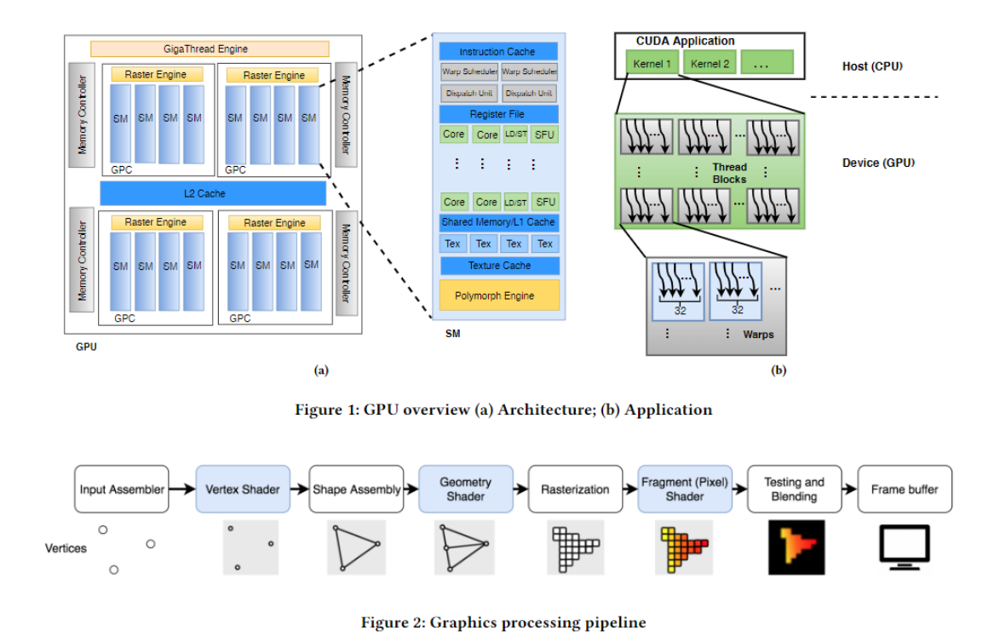

## GPU架构模型

[参考](http://hustcat.github.io/gpu-architecture/)

cuda程序由一系列并行计算kernel组成，每个kernel都被分解为线程块，每个线程块被分配给不同的SM。这些线程一般以32个为一组，使用单指令多线程（SIMT）处理数据。

## ref

http://hustcat.github.io/gpu-architecture/