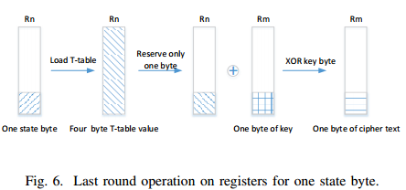

## AES基础

### 框架

主要有几种操作

* AddRoundKey（轮密钥加）
* SubBytes（字节代换）
* ShiftRows（行移位）
* MixColumns（列混合）

```go
// Encrypts a 16-bytes block src using AES encryption with
// extended key xk and for nr rounds.
// It returns the encrypted block.
func encrypt(src, xk []byte, nr int) []byte {
    state := make([]byte, 16)
    // Initialize the state with the plaintext block
    copy(state, src)

    // Add the first round key to the state
    AddRoundKey(xk[0:16], state)

    for i:= 1; i < nr; i++ {
        SubBytes(state)
        ShiftRows(state)
        MixColumns(state)
        AddRoundKey(xk[i*16:(i+1)*16], state)
    }

    SubBytes(state)
    ShiftRows(state)
    AddRoundKey(xk[nr*16:(nr+1)*16], state)

    return state
}
```

### 状态矩阵

分组长度为16字节，这16字节作为一个4*4的状态矩阵输入，作为初始值，并且每次操作都是针对状态矩阵进行的，最后的密文即为最后一轮加密后的状态矩阵

```
State:
+----+----+-----+-----+
| b0 | b4 | b8  | b12 |
+----+----+-----+-----+
| b1 | b5 | b9  | b13 |
+----+----+-----+-----+
| b2 | b6 | b10 | b14 |
+----+----+-----+-----+
| b3 | b7 | b11 | b15 |
+----+----+-----+-----+
```

### 字节代换

通过几个S盒对状态矩阵进行代换

```
+-------+-------+--------+--------+
| S[b0] | S[b4] | S[b8]  | S[b12] |
+-------+-------+--------+--------+
| S[b1] | S[b5] | S[b9]  | S[b13] |
+-------+-------+--------+--------+
| S[b2] | S[b6] | S[b10] | S[b14] |
+-------+-------+--------+--------+
| S[b3] | S[b7] | S[b11] | S[b15] |
+-------+-------+--------+--------+
```

### 行移位

第一行不变，第二行循环左移一字节，第三行两字节，第四行三字节（循环右移一字节）

```
+--------+--------+--------+--------+
| S[b0]  | S[b4]  | S[b8]  | S[b12] |
+--------+--------+--------+--------+
| S[b5]  | S[b9]  | S[b13] | S[b1]  |
+--------+--------+--------+--------+
| S[b10] | S[b14] | S[b2]  | S[b6]  |
+--------+--------+--------+--------+
| S[b15] | S[b3]  | S[b7]  | S[b11] |
+--------+--------+--------+--------+
```

### 列混合

```
初始状态
+--------+--------+--------+--------+
| S[b0]  | S[b4]  | S[b8]  | S[b12] |
+--------+--------+--------+--------+
| S[b5]  | S[b9]  | S[b13] | S[b1]  |
+--------+--------+--------+--------+
| S[b10] | S[b14] | S[b2]  | S[b6]  |
+--------+--------+--------+--------+
| S[b15] | S[b3]  | S[b7]  | S[b11] |
+--------+--------+--------+--------+

记为
+----+----+-----+-----+
| a0 | a4 | a8  | a12 |
+----+----+-----+-----+
| a1 | a5 | a9  | a13 |
+----+----+-----+-----+
| a2 | a6 | a10 | a14 |
+----+----+-----+-----+
| a3 | a7 | a11 | a15 |
+----+----+-----+-----+

则操作为
r0  = 2*a0 ^ 3*a1 ^ 1*a2 ^ 1*a3
r1  = 1*a0 ^ 2*a1 ^ 3*a2 ^ 1*a3
r2  = 1*a0 ^ 1*a1 ^ 2*a2 ^ 3*a3
r3  = 3*a0 ^ 1*a1 ^ 1*a2 ^ 2*a3

r4  = 2*a4 ^ 3*a5 ^ 1*a6 ^ 1*a7
r5  = 1*a4 ^ 2*a5 ^ 3*a6 ^ 1*a7
r6  = 1*a4 ^ 1*a5 ^ 2*a6 ^ 3*a7
r7  = 3*a4 ^ 1*a5 ^ 1*a6 ^ 2*a7

r8  = 2*a8 ^ 3*a9 ^ 1*a10 ^ 1*a11
r9  = 1*a8 ^ 2*a9 ^ 3*a10 ^ 1*a11
r10 = 1*a8 ^ 1*a9 ^ 2*a10 ^ 3*a11
r11 = 3*a8 ^ 1*a9 ^ 1*a10 ^ 2*a11

r12 = 2*a12 ^ 3*a13 ^ 1*a14 ^ 1*a15
r13 = 1*a12 ^ 2*a13 ^ 3*a14 ^ 1*a15
r14 = 1*a12 ^ 1*a13 ^ 2*a14 ^ 3*a15
r15 = 3*a12 ^ 1*a13 ^ 1*a14 ^ 2*a15

结果为
+----+----+-----+-----+
| r0 | r4 | r8  | r12 |
+----+----+-----+-----+
| r1 | r5 | r9  | r13 |
+----+----+-----+-----+
| r2 | r6 | r10 | r14 |
+----+----+-----+-----+
| r3 | r7 | r11 | r15 |
+----+----+-----+-----+
```

这里的*为GF2^8乘法，但因为只使用到了1、2、3的有限域乘法，因此可以用查找表实现。

### 轮密钥加

与子密钥异或

```
+----------+----------+------------+------------+
| r0^xk[0] | r4^xk[4] |  r8^xk[8]  | r12^xk[12] |
+----------+----------+------------+------------+
| r1^xk[1] | r5^xk[5] |  r9^xk[9]  | r13^xk[13] |
+----------+----------+------------+------------+
| r2^xk[2] | r6^xk[6] | r10^xk[10] | r14^xk[14] |
+----------+----------+------------+------------+
| r3^xk[3] | r7^xk[7] | r11^xk[11] | r15^xk[15] |
+----------+----------+------------+------------+
```

### go实现

```go
var sbox [256]byte = [256]byte{ /* ... */ }
var gmul2 [256]byte = [256]byte{ /* ... */ }
var gmul3 [256]byte = [256]byte{ /* ... */ }

// AddRoundKey XORs the round key xk with the state and puts the result in the state
func AddRoundKey(xk, state []uint32) {
    state[0] ^= xk[0]
    state[1] ^= xk[1]
    state[2] ^= xk[2]
    state[3] ^= xk[3]
}

// SubBytes replaces each byte of the state with its substitution in the S-box.
func SubBytes(state []uint32) {
    for i := 0; i < 4; i++ {
        state[i] = uint32(sbox[state[i]>>24])<<24 |
            uint32(sbox[state[i]>>16&0xff])<<16 |
            uint32(sbox[state[i]>>8&0xff])<<8 |
            uint32(sbox[state[i]&0xff])
    }
}

// ShiftRows modifies the state to shift rows to the left
// First row is left unchanged
// Second row is shifted by one cell
// Third row is shifted by two cells
// Fourth row is shifted by three cells
func ShiftRows(state []uint32) {
    var s0, s1, s2, s3 uint32
    s0 = state[0]&(0xff<<24) | state[1]&(0xff<<16) | state[2]&(0xff<<8) | state[3]&0xff
    s1 = state[1]&(0xff<<24) | state[2]&(0xff<<16) | state[3]&(0xff<<8) | state[0]&0xff
    s2 = state[2]&(0xff<<24) | state[3]&(0xff<<16) | state[0]&(0xff<<8) | state[1]&0xff
    s3 = state[3]&(0xff<<24) | state[0]&(0xff<<16) | state[1]&(0xff<<8) | state[2]&0xff
    state[0], state[1], state[2], state[3] = s0, s1, s2, s3
}

// MixColumns updates the state with the MixColumns operation of the AES. It uses
// two pre-computed tables that implement multiplication by 2 and by 3 in GF(256).
func MixColumns(state []uint32) {
    var b0, b1, b2, b3, d0, d1, d2, d3 byte

    for i := 0; i < 4; i++ {
        b0 = byte(state[i] >> 24)
        b1 = byte(state[i] >> 16)
        b2 = byte(state[i] >> 8)
        b3 = byte(state[i])

        d0 = gmul2[b0] ^ gmul3[b1] ^ b2 ^ b3
        d1 = gmul2[b1] ^ gmul3[b2] ^ b3 ^ b0
        d2 = gmul2[b2] ^ gmul3[b3] ^ b0 ^ b1
        d3 = gmul2[b3] ^ gmul3[b0] ^ b1 ^ b2

        state[i] = uint32(d0)<<24 | uint32(d1)<<16 | uint32(d2)<<8 | uint32(d3)

    }
}
```

gmul2和gmul3分别是GF2^8乘2和乘3的查找表

### T表优化

#### 列混合打表

```
设R0为4*4状态矩阵的第一列
R0 = r0 | r1 | r2 | r3
R0 = 2*a0 ^ 3*a1 ^ 1*a2 ^ 1*a3 |
    1*a0 ^ 2*a1 ^ 3*a2 ^ 1*a3 |
    1*a0 ^ 1*a1 ^ 2*a2 ^ 3*a3 |
    3*a0 ^ 1*a1 ^ 1*a2 ^ 2*a3
R0 = (2*a0 | 1*a0 | 1*a0 | 3*a0) ^
    (3*a1 | 2*a1 | 1*a1 | 1*a1) ^
    (1*a2 | 3*a2 | 2*a2 | 1*a2) ^
    (1*a3 | 1*a3 | 3*a3 | 2*a3)
```

因为这里的每个异或项都只与一个byte有关，因此可以打表

```
te0[i] = 2*i | 1*i | 1*i | 3*i
te1[i] = 3*i | 2*i | 1*i | 1*i
te2[i] = 1*i | 3*i | 2*i | 1*i
te3[i] = 1*i | 1*i | 3*i | 2*i

s = te0[a0] ^ te1[a1] ^ te2[a2] ^ te3[a3]
```

#### T表

状态矩阵的操作依次为：字节代换、行移位、列混合，行移位后结果为：

```
+--------+--------+--------+--------+
| S[b0]  | S[b4]  | S[b8]  | S[b12] |
+--------+--------+--------+--------+
| S[b5]  | S[b9]  | S[b13] | S[b1]  |
+--------+--------+--------+--------+
| S[b10] | S[b14] | S[b2]  | S[b6]  |
+--------+--------+--------+--------+
| S[b15] | S[b3]  | S[b7]  | S[b11] |
+--------+--------+--------+--------+
```

带入上面的列混合表，有

```
R0 = (2*S[b0]  | 1*S[b0]  | 1*S[b0]  | 3*S[b0])  ^
     (3*S[b5]  | 2*S[b5]  | 1*S[b5]  | 1*S[b5])  ^
     (1*S[b10] | 3*S[b10] | 2*S[b10] | 1*S[b10]) ^
     (1*S[b15] | 1*S[b15] | 3*S[b15] | 2*S[b15])

R1 = (2*S[b4]  | 1*S[b4]  | 1*S[b4]  | 3*S[b4])  ^
     (3*S[b9]  | 2*S[b9]  | 1*S[b9]  | 1*S[b9])  ^
     (1*S[b14] | 3*S[b14] | 2*S[b14] | 1*S[b14]) ^
     (1*S[b3]  | 1*S[b3]  | 3*S[b3]  | 2*S[b3])

R2 = (2*S[b8]  | 1*S[b8]  | 1*S[b8]  | 3*S[b8])  ^
     (3*S[b13] | 2*S[b13] | 1*S[b13] | 1*S[b13]) ^
     (1*S[b2]  | 3*S[b2]  | 2*S[b2]  | 1*S[b2])  ^
     (1*S[b7]  | 1*S[b7]  | 3*S[b7]  | 2*S[b7])

R3 = (2*S[b12] | 1*S[b12] | 1*S[b12] | 3*S[b12]) ^
     (3*S[b1]  | 2*S[b1]  | 1*S[b1]  | 1*S[b1])  ^
     (1*S[b6]  | 3*S[b6]  | 2*S[b6]  | 1*S[b6])  ^
     (1*S[b11] | 1*S[b11] | 3*S[b11] | 2*S[b11])
```

其中Rn为状态矩阵的第n列，因此依据上面列混合打表的结果，有

```
te0[i] = 2*S[i] | 1*S[i] | 1*S[i] | 3*S[i]
te1[i] = 3*S[i] | 2*S[i] | 1*S[i] | 1*S[i]
te2[i] = 1*S[i] | 3*S[i] | 2*S[i] | 1*S[i]
te3[i] = 1*S[i] | 1*S[i] | 3*S[i] | 2*S[i]

R0 = te0[b0]  ^ te1[b5]  ^ te2[b10] ^ te3[b15]
R1 = te0[b4]  ^ te1[b9]  ^ te2[b14] ^ te3[b3]
R2 = te0[b8]  ^ te1[b13] ^ te2[b2]  ^ te3[b7]
R3 = te0[b12] ^ te1[b1]  ^ te2[b6]  ^ te3[b11]
```

这样Rn可以以32位进行运算

解密也是通过相同的原理打表实现

## AES在CUDA上的实现


GPU寄存器长度32b，因此使用T-table的实现方式

AES128的分组长度为128，因此按照1byte分为4*4的状态矩阵，使用4个thread来处理一个矩阵。由于有shiftrow操作（需要调换矩阵内元素的顺序），因此矩阵被存在shared memory。由于thread会被自动分组为warp，因此不需要显式地同步这些thread。

T-table被放在constant memory中，轮密钥生成由CPU实现

## 攻击场景


### 信号的同步

由于GPU没有通过GPIO传送信号来表示一个加密过程的开始或结束，因此示波器只能通过能量追踪过程中的上升沿来判定加密开始。但因为能量跟踪存在各种噪声且上升沿和下降沿不一定明显，因此较容易失去同步。

### 难点

因为采用的是对ATX电源的功耗进行记录的方法，而电源在显卡内又会DCDC转换为不同的电压以满足显卡要求，这带来了以下的影响：

* 为了滤掉纹波，这些电源采用了电容，这可能使我们无法实时采集精确的功耗。
* DCDC采用开关电源的原理，会引入开关的纹波。
* ATX电源不是唯一的电源，PCIE接口也可以提供一部分的电源。
* GPU的调度器会在任何时间从一个warp切换到另一个warp，且这个过程不受程序控制


### 模型建立

模型基于以下的事实：CMOS电路在状态切换时（0变为1或1变为0）耗电最大，在这时电流需要给CMOS线路中的寄生电容充放电。而显卡中的寄存器因为连接了很多器件，因此寄生电容很大。而寄存器又是最频繁改变的器件。因此建立如下模型：

`W = aH + b`

W是某个时间点的瞬时耗电，H是被选择的寄存器中内容的**汉明距离**，a是一个开关电路单元的瞬时耗电，b是GPU其他单元的瞬时耗电，一般被当做一个符合高斯分布的随机值

### 攻击

我们选择AES最后一轮加密中使用的寄存器。因为最后一轮没有列混合（MixColumn）操作，因此在最后一轮操作中，每个字节是独立的，也就是说其对耗电量的影响也是独立的。

#### 最后一轮加密

接下来看看最后一轮加密的过程



one state byte是初始值，经过T-table查找到一块32位的值，此后将高位与0,得到最低位的1byte数据。此后xor最后一个轮密钥对应的字节，生成结果。

整个过程的伪代码如下

```
LOAD Rn [Rn]
AND Rn Rn 000000FFh
XOR Rm Rm Rn
```

其中load代表从T-table中查找对应值

对应的汉明距离可以计算如下：
$$
\begin{aligned} 
r_{n0} &= T(r_n)
\\
LOAD:\quad &HW(r_n \oplus r_{n0})
\\
AND:\quad  &HW(r_n[3:1])
\\
XOR:\quad  &HW(r_n[0])
\end{aligned}
$$

#### 已知密文

现在**假设我们知道加密后密文c，并假设密钥对应位为k**

对于单字节，假设密钥为k，则
$$
r_n[0] = c \oplus k
$$
此时已知Rn[0]，则可以通过下式找到T-table变换和and操作前的Rn
$$
r_{n0} = SBox^{-1}(c \oplus k)
\\
r_n = T(r_{n0})
$$

因此三个汉明距离都可以被计算。

接下来，通过相关系数来猜测密钥，相关系数最大的则说明对应猜测的密钥是正确的
$$
k_c = argmax(\rho_g)
\\
\rho_g = \frac{cov(W,H_g)}{\sigma_W \sigma_{H_g}} = \frac{a \sigma_{H_g}}{\sigma_W} = \frac{\sigma_{H_g}}{\sqrt{a^2 \sigma^2_{H_g} + \sigma^2_b}}
$$
$\sigma_{H_g}$ 当密钥猜测值为$k_g$时，被选择的寄存器的汉明距离的标准差

$\sigma_W$  与上面对应的瞬时耗电量

为了消除GPU并行计算的影响，这里对于$H_g$的选取将LOAD、AND、XOR得到的三种汉明距离相加

### 处理能量追踪的数据

#### 散热风扇的影响

在实验中发现，能量消耗在一开始较低，后面趋于稳定，这是因为散热风扇工作时也消耗能量。

为了消除影响，我们计算了每次实验的平均电压，并与第一次计算时的电压相对比


可以看出，在前1000点散热风扇的影响比其他时候大得多，因此这些点在处理时忽略不计。

#### 数据处理

GPU执行时，各个warp的thread不一定是同步的。这里假设有N个trace，每个trace有T个采样点。每个trace有Q个thread正在进行AES加密
$$
P_{thread\_i}(t) = h(t-L_i) * H_i + b_i(t)
$$
其中$1\leq t \leq T$是当前的采样点，$1\leq i \leq Q$是thread的id，$H_i$是thread的最后一轮加密时寄存器值的汉明距离。h(t)是从0开始计时的单位汉明距离的耗电量，因为每个thread执行的时间不一样，因此有$L_i$的偏移

整个能量模型如下
$$
\begin{aligned}
P_{trace}(t) &= \sum^Q_{i=1}P_{thread_i}(t)
\\
&= \sum^Q_{i=1}h(t-L_i) * H_i + B(t)
\end{aligned}
$$
虽然$L_i$是一个随机值，但我们可以计算耗电量的平均值如下
$$
W = \frac{\sum^T_{t=1}P_{trace}(t)}{T} = a*\sum^Q_{i=1}H_i+b
$$
其中a为h(t)的均值，b为B(t)的均值，当$H=\sum^Q_{i=1}H_i$时，与一开始我们提出的模型一致。

基于以上的分析，我们将所有得到的trace求一个均值，这也可以滤掉DCDC开关噪声

### 攻击结果

#### 一、明文块相同

为了简化计算，这里的被加密明文块采用同样的值，因此，每个thread最后一轮加密的寄存器值的汉明距离是一样的。则
$$
H = Q * H_i
\\
\sigma_H = Q * \sigma_{H_i}
$$
对于key的每个字节，我们尝试256种情况并根据模型计算其对应的汉明距离和对应的耗电量，最后与实际的trace计算相关系数


上图表示不同key的能量trace和汉明距离的相关度

这里的区分度不高是因为汉明距离是线性的

#### 二、明文块不同

假设明文块有S个内容不同的块，$H_{setk}$为第k个（$1\leq k \leq S$）thread的最后一轮汉明距离，假设其内容是独立的但**标准差相同**，则
$$
H = \frac{Q}{S}(\sum^S_{k=1}H_{setk})
\\
\sigma_H = \frac{Q}{S}\sqrt{S\sigma_{H_{setk}}} = \frac{Q}{\sqrt{S}}\sqrt{\sigma_{H_{setk}}}
$$
结果表明k越多则需要越多的trace来还原密钥

## ref

https://blog.tclaverie.eu/posts/understanding-golangs-aes-implementation-t-tables/