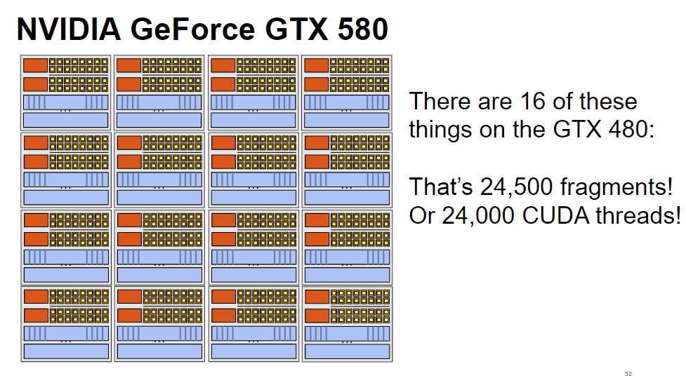

## 与cpu区别

cpu是低吞吐低延迟设计，cache大，便于处理分支，但ALU很小

gpu是高吞吐高延迟设计，有很多重复的ALU，但cache小，一般很少处理分支之类的语句

## 软件结构

### 概念

```
API -> kernel -> grid -> block -> thread
                               -> thread
                               ...
                      -> block -> thread
                               -> thread
                               ...
                      ...
                      -> block -> thread
                               -> thread
                               ...
```


##### thread

计算的最小单位

##### block

多个thread -> block

block中的多个thread可以通过shared memory通信

##### grid

多个block -> grid

##### kernel

grid -> kernel

## 硬件结构

### 设计思想

* 使用多个ALU来实现并行运算


* 将多个ALU通过共享指令流包装（省去了取指和解码的部件）

  一个context块对应一个指令流，context块中含有N个Ctx，对应N个ALU，用于记录每个ALU对应的执行上下文


* 有些指令的执行需要依赖于其他指令的完成，此时通过切换不同的执行流来防止等待

  这里引入了多个context块的机制，每个context块记录了当前的执行流的执行情况，当一个执行流阻塞时可以切换为其他执行流执行


* 分支


* 根据ALU指令的不同，可以划分不同大小的context以保存更多的context


### 实际结构

##### SM

stream multiprocessor

##### SP

 stream processor，也就是CUDA core，一个CUDA core可以理解为一个ALU

##### warp

线程束，一个warp固定拥有**32个thread（对于CUDA）**，这32个thread同时执行相同指令（single instruction multi thread)

因此**一个block中的thread数最好是32的倍数**

##### 结构

其实是上面概念的替换

- SM -> core
- SP/CUDA core -> ALU
- warp -> context块

### 硬件实例 GTX580


一个SM含有32个SP，每16个SP分为一组执行同样的指令

同一时间有两个warp执行（因为有两套指令存取/译码器），**这里似乎让一套指令存取/译码器对应32个SP更科学，因为一个warp是32个thread，不清楚为什么只对应了16个，不过显然可以把一个warp封装成两个同样的context执行，这样就能执行32个thread了**

一共有48个warp可以在同一个SM中被执行，也就是SM中一共可以保存48个context块，因此一个SM可以独立执行48*32 = 1536个CUDA thread



一张显卡有16个SM

### 硬件实例 HD6970


* SM -> SIMD-Engine
* warp -> wavefront

## 软件结构到物理结构映射

* grid -> 显卡
* block -> SM
* thread -> SP

一个thread被放到一个SP上执行，其中32个thread组成一个warp执行

一个或多个block被放到一个SM上执行，可以被调度，因此block数量不会被SM数量限制。当一个block处理完时才会选择新的block进来处理


## 内存模型


- 每个thread有local memory
- block内的thread共享shared memory
- grid内所有thread（包括不同block的）共享global memory /constant memory /texture memory

### 内存类型与生存周期


## ref

https://blog.csdn.net/efforever/article/details/70879699

http://hustcat.github.io/gpu-architecture/

https://zhuanlan.zhihu.com/p/53763285

http://haifux.org/lectures/267/Introduction-to-GPUs.pdf  推荐

https://www.cnblogs.com/dirge/p/7795193.html  编程相关