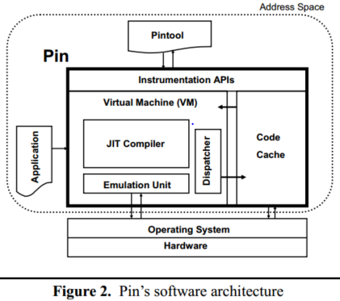
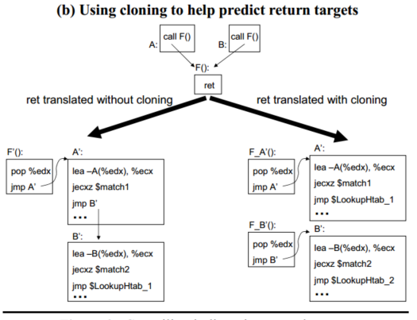
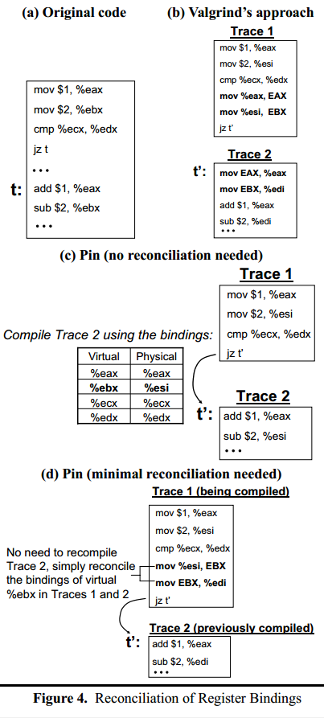

## PinTool基本原理

### 设计思想

pintools本身实现了一个JIT，它在执行时读入目标程序文件，此后从入口点开始执行JIT过程。值得注意的是这里的JIT不用于编译字节码，JIT的输入是目标程序的二进制，即也是机器码，但它会将用户插桩内容加入JIT的编译结果中。

此外，JIT每次只翻译一个基本块，当遇到跳转时pin一定可以重新获取控制权，因为跳转的目的地址代码还未被编译。遇到跳转后pin执行下一次JIT过程。编译过的代码会被保存，以加快程序运行速度

### 一个实例

```c
FILE *trace;

void RecordMemWrite(void *ip, void *addr, uint32_t size)
{
    fprintf(trace, "%p: W %p %d\n", ip, addr, size);
}

void Instruction(INS ins, void *v)
{
    if(INS_IsMemoryWrite(ins))
        	INS_InsertPredicatedCall(
        		ins, IPOINT_BEFORE, AFUNPTR(RecordMemWrite),
        		IARG_INST_PTR, IARG_MEMORYWRITE_EA,
        		IARG_MEMORYWRITE_SIZE, IARG_END);
}

int main(int argc, char *argv[])
{
    PIN_Init(argc, argv);
   	trace = fopen("atrace.out", "w");
    INS_AddInstrumentFunction(Instruction, 0);
    PIN_StartProgram();
    return 0;
}
```

这里加了一个回调函数Instruction

pin在JIT时，每翻译一条指令就会调用一次Instruction（注意这里是在JIT的过程中调用而不是执行的过程）。

* 在Instruction中判断当前翻译的指令是否是内存读取指令
  * 若是，则调用INS_InsertPredicatedCall，在当前指令前（IPOINT_BEFORE指定）插入RecordMemWrite函数，`IARG_INST_PTR, IARG_MEMORYWRITE_EA,IARG_MEMORYWRITE_SIZE`作为RecordMemWrite函数的参数传入

### 设计和实现

#### 架构



* VM组件由下面几个部分组成
  * JIT编译器  用于实时编译要运行的指令
  * 模拟组件  用于模拟诸如系统调用这类在VM中无法直接运行的指令
  * 分配器  用于将执行流交给编译后要执行的代码

整个架构中，程序分为三个部分，application目标程序，pintool插桩代码和pin执行引擎。为了保证程序间的独立，虽然三个程序会在pin的调用下共享同一地址空间，但三者的库是独立的。即，若目标程序、插桩代码和pin都调用了glibc，那么内存中将有三份不相关的glibc，以防止重入性问题

#### pin的注入

程序启动时，一个称作injector的程序将pin加载到目标程序的地址空间，injector使用unix的ptrace API。加载后把控制权转移给pin。pin加载pintool，pintool进行初始化并通知pin开始运行程序。使用ptrace使得pin可以从正在插桩的程序中detach下来

其他使用诸如LD_PRELOAD进行注入的程序有以下几个缺点

* LD_PRELOAD对于静态链接的程序不管用
* 使用LD_PRELOAD将使程序本身的加载地址变高
* 在linux的loader执行完前无法获取控制权

#### JIT

pin的JIT并不定义中间语言或字节码，而是保持原来的指令集

JIT每次编译一个trace的指令，trace是一段顺序的指令序列，直到遇到下列语句

* 所有无条件跳转（branch call return）
* 部分条件跳转
* 一些其他指令

每次JIT遇到上面几个指令时将停止编译，并将控制权转移给一个stub，这个stub将控制权交给VM，并且由VM决定接下来的跳转

下面是几个用到的JIT技术

##### trace linking

为了加快运行速度，将几个trace间的跳转连接起来，以绕过跳转到stub和vm的过程。

###### 直接跳转

对于直接跳转很简单，直接把当前trace的末尾跳转改成目标trace地址

###### 间接跳转

如call ret 条件跳转等


* JIT先将间接跳转`jmp [eax]`编译为`mov edx, [eax]; jmp xxx`，此时edx中存放着跳转的目的地址
* xxx地址存放着跳转目的地址的chain，使用`lea/jecxz`来比较edx和chain中对应的目的地址，这种方法可以防止对eflags的修改。注意这里的例子包含了JIT中存放着的地址和程序加载地址的区别（程序加载地址中，原jmp指令在0x40000000，而JIT编译后指令在0x70000000，第一个chain在0x70001000，但第一个chain判断的地址仍是目标程序对应的跳转地址，即0x40001000）
* 若chain中都找不到，则跳转到查找表查找对应的trace地址
  * 若找到了，说明目的地址被JIT处理过，则跳转，并将该地址加入跳转chain
  * 若没找到，说明没有被JIT过，跳转到VM

这里的实现pin与DynamoRIO类似，但有以下几点不同

* DynamoRIO只trace link一次，不能动态加chain，pin可以，因此pin也提供了运行中由插桩代码手动加入新的chain的可能
* DynamoRIO使用全局查找表，pin对每个间接跳转都建立一个局部查找表
* pin使用了一种叫function cloning的技术

**function cloning**



用于加速函数的return

如图，若没有function cloning技术，ret时会在chain中寻找跳转的目的地址。使用function cloning后，若返回地址与之前记录的不一样，则会将函数拷贝一份，如上图的F，因为返回地址不同被拷贝为了F_A和F_B，这样每个F就只有一个固定的跳转目的地址。

具体的实现方法为，将每个trace与其调用栈（更准确的说是static context，后文有讲）绑定，每个trace保存了最后四个调用该trace的地址（**问题**：是否意味着function cloning每个函数最多只有四个拷贝，且返回地址分别一定是最后四次调用的返回地址）

##### Register Re-allocation

为了动态分配寄存器，防止插桩代码重用目标程序寄存器导致上下文被修改，pin使用线性寄存器分配算法。pin面临的难点在于，对于其他JIT，如编译bytecode或者编译一个文件的JIT，程序的执行流是透明的。但pin一次只编译一个trace，需要实现增量编译

###### 寄存器生命周期分析

生命周期分析使pin可以知道每个寄存器的可用性。对于pin来说，因为要实现增量编译，因此在每个trace编译后都会保存一份寄存器存活情况的查找表。当函数跳转时将动态地分析和调整寄存器分配。若是一个静态跳转，则可以通过跳转的目的地址的寄存器使用状况来调整当前trace的寄存器分配

###### 寄存器重绑定

因为寄存器被重新分配，所以在一个trace的末尾需要保证进入下个trace时，当前trace与下个trace的寄存器绑定一致。

最简单的做法如Valgrind，在一个基本块的末尾，所有的寄存器将统一存入内存。如下图(b)，EAX EBX表示Valgrind在内存中给eax ebx寄存器分配的存储空间。在trace2中，原来trace1的eax还是eax，但ebx变为了edi



pin的做法是

* 如图(c)，若跳转目标t还未编译，则按照当前的寄存器绑定来编译t，使得两者绑定一致，从而可以直接跳转
* 如图(d)，若已经编译且绑定不一致，则只重绑定两者间不同的寄存器。图中trace1和trace2只有EBX的绑定不一致

一个设计的选择是，要把重绑定代码置于当前trace的跳转前，还是目标trace的开头。pin选择了前者，据说效果更好，因为这个方法可以让前一个trace适应目标trace的变化，而不是反过来

###### static context

因为在trace开头需要说明当前trace的寄存器绑定等信息，因此每个trace都有一个static context表明当前trace的属性。此外还有函数的调用栈，这个属性在function cloning中被使用

因此一个trace由下面一个元组定义`<entryIaddr, entrySct>`，分别表示entry instruction address和entry static context

JIT搜寻下一个目标trace的时候将通过这个二元组唯一地识别目标trace

###### 线程局部寄存器

pin对于每个线程，都会单独开辟一块空间存储寄存器内容，称为spilling area。

pin首先假定所有程序都是单线程的，并且以全局变量的形式访问spilling area。若pin发现程序是多线程的（pin拦截了所有多线程创建的系统调用），则开辟一块线程空间spilling area，并重新编译之前的程序，使用一个寄存器作为spill pointer指向该区域。如果发生线程切换，spill pointer将被更新。

##### 插桩程序优化

对于一些简单的插桩程序，比如简单的计数或者记录指令的程序会被inline。其他情况中，在调用插桩程序前会先调用一个称为bridge routine的程序，用于保存当前context寄存器，设置运行参数等。

inline时有多种优化，如简化掉bridge routine的跳转，允许使用register allocator对插桩程序进行优化等

对于x86架构的程序有一个额外优化，就是大多数插桩程序都会保存eflags，而这往往要通过切换栈帧等操作，因此pin会先对插桩程序进行分析，以判定其是否会修改eflags，若没有则会省去保存和恢复eflags的动作

此外还有一个优化，就是可以指定一个`IPOINT_ANYWHERE`标志，告诉pin插桩分析函数可以被放在一个trace或basic block的任何位置。这样pin可以自动进行一些优化