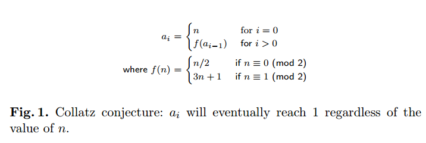
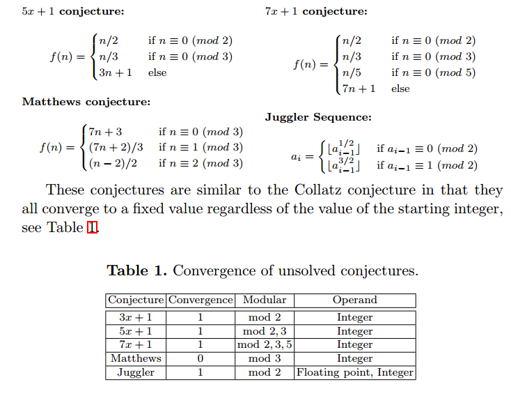
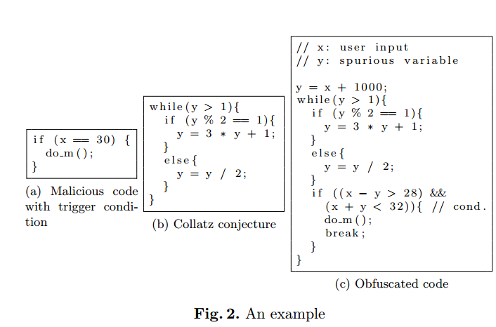
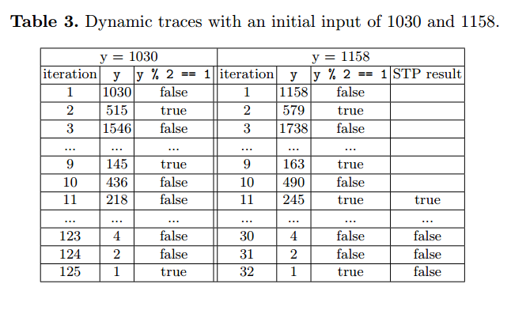
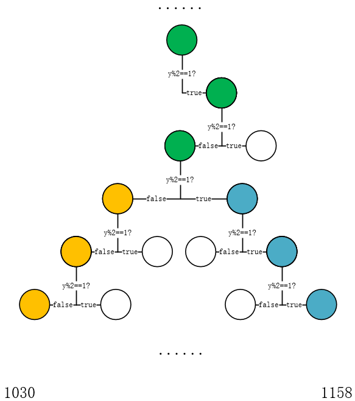
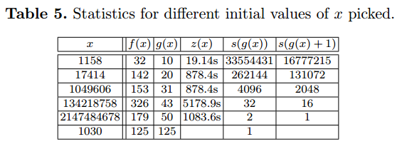
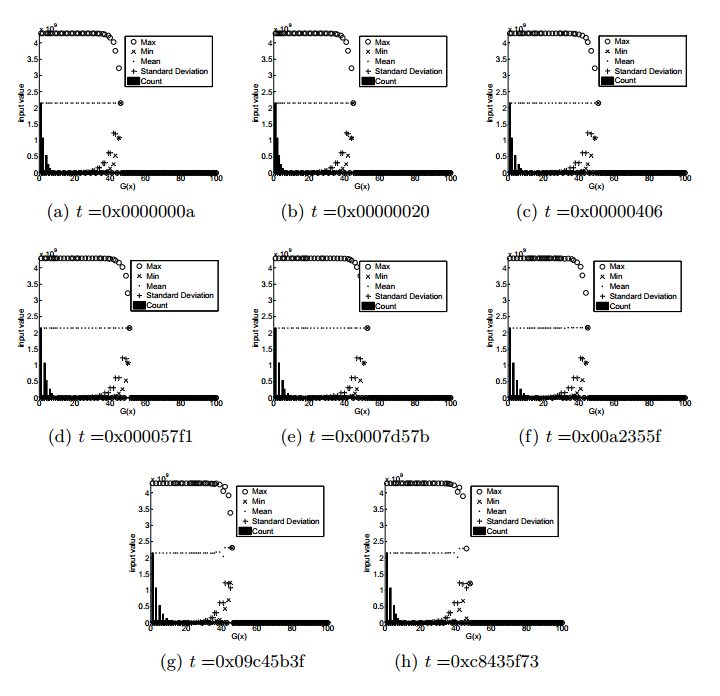

## Linear Obfusction to Combat Symbolic Execution

### 背景

Collatz conjecture

这里利用了一个称为3x+1的猜想，a是一个数列
$$
\begin{aligned}
a_0 &= n
\\
a_i &= f(a_{i-1})
\end{aligned}
$$
其中f()的定义为
$$
f(n) = \frac{n}{2} 当n为偶，f(n)=3n+1当n为奇
$$
这个数列有个性质，无论n取多少，经过有限次循环后必收敛到1

此外，类似的猜想还有

### Overview

下面是论文提出的混淆方式的一个最简单的例子

x为输入，y为混淆方式中提出的**伪输入**，因为无论y为多少，最后由于3x+1猜想都会收敛到1，于是可以将条件 `x==30` 转化为图中的条件 `(x-y>28) && (x+y<32)` 这样会将伪输入y引入符号执行的变量中，再通过3x+1猜想带来的不确定次数的循环引起的路径爆炸阻碍符号执行的分析

### 实现

#### 加入伪变量

如上面所描述，之所以称为伪变量是因为该变量最终不会影响执行结果，但会扰乱符号执行。

如何定义伪变量也是一个比较关键的问题，最简单的方式就是根据x生成y，如简单地加一个常量。但有一点需要注意，并不是说y和x的关系越复杂越好，因为符号执行引擎会忽略一些它认为无法符号化的变量，如指针操作、浮点数操作等。所以如果y过于复杂可能反而使符号执行引擎不把y当做一个符号量，而是当做一个具体值，从而破坏混淆。

#### 选择一个未解猜想

能被混淆器使用的未解猜想应该符合下列性质

* 收敛性  该猜想应该能收敛到一定范围的值
* 部分可判定  即使没有被理论证明，也需要保证猜想在一定范围内满足终止条件
* 机器可实现  就是这个算法必须是可以实现的
* Simple/Linear  算法应该简单且只有线性操作

显然，该方案无法对抗模式识别的反混淆方法，因此可以使用下面的方法为算法加入一些可变性

* 可以将停止条件设置成原来终止条件的前几轮运算，如对于3x+1，最终轮x==1，前一轮应该是x==2，再前一轮应该是x==4，因此可以将停止条件该为上述几种的条件
* 可以将循环的条件 x>1 改为其他条件，如对于1~2^31内的所有x，收敛的轮数都小于1000，所以可以改为 for(i=0; i<1000; i++)

### Evaluation

#### 程序分析者的策略

* 先以y0作为初始输入
* 动态监测以yi作为输入时程序的执行。若检测到恶意行为，**说明yi可以作为触发条件，于是被记录**
* 记录以yi为输入时程序的每个跳转条件，并且对最后一个跳转条件进行取反
* 使用STP检查是否有满足上述条件的输入，并测试其是否可以触发恶意行为。若可以触发则令新的输入作为yi+1，并重复进行步骤2。否则对上一个条件进行取反（即，第一次取反最后一个条件，若没有满足的输入则取反倒数第二个条件）

（上述策略应该来源于基于符号执行的fuzzer）

#### 实例

由上图的实例可以知道，因为触发条件为x==30，所以y=1030，而下图显示了y=1030和y=1158时奇偶性判断条件的真假

STP result这一列则显示了是否可以根据上述策略找到另一个符合条件的输出。可以看到STP从32轮反向迭代到翻转第11轮的条件才找到新的输入，接下来的策略就是根据新输入来重新建立这样一张表并继续寻找输入。而迭代的终止条件就是触发条件x==30被找到。

这里使用首先翻转最后一个条件的策略基于下述考虑：因为一般来说触发条件是上下文相关的，因此可以假设程序分析者在一开始就使用了一个与结果十分相近的输入。基于上述假设，程序分析者只需要考虑上一个猜测输入周边的输入，因此翻转最后一个条件以获得与上一个输入trace十分相近的trace，以此来一点点接近真正的触发条件。

#### 找到正确触发条件的可能性

这里假设**只有一个输入能触发条件**，因为符号执行的策略是：从最后一个条件开始进行翻转，若可以求解出新的输入，但新的输入无法触发恶意代码则翻转上一个条件。

假设cn代表第n轮循环时 `y%2==1` 的结果，那么我们假设正确的触发条件在第j轮被求解器找到，那么可以说明对于输入yi和正确触发条件x，$c_0 至 c_{j-1}$ 是相等的。

比如上面的表格所示，初始输入是1158，条件是1030，我理解的求解过程如下：

* 1158作为输入时一共循环了32轮，此时首先翻转最后一轮的条件true为false，代入STP进行求解。这里理论上是可以写出约束式的，因为已经确定了前32轮的奇偶性，因此前32个函数执行f(n)的哪个式子也可以确定

* 此后若约束式无法求解，则试图翻转上一个表达式（这里我的理解是若需要翻转上一个表达式，则传入求解器的约束会忽略后一个表达式，意思就是如这里输入1158迭代32轮，首先翻转第32个条件为false，若这32个约束式无法求解，则翻转第31个条件为true，并且忽略掉第32个约束式。因为理论上这种搜索方式有点类似于二叉树搜索，逐个表达式的翻转其实是在向二叉树空间的父节点求解，因此越靠近根节点条件应该更松弛，直到搜索到答案所在的父节点）

* 若可以求解则将新的输入代入，检测是否有恶意行为。根据上述二叉树空间搜索的原理，当搜索到答案所在的父节点时会停止向上回溯，因为在这个节点上求解器应该就能遍历到我们需要的答案。如图，黄色代表1030的各个表达式结果，蓝色代表1158的各个表达式结果。而当算法沿蓝色节点回溯到第一个绿色节点时（假设是第i个），则理论上1030和1158在0~i-1个节点的表达式结果是相同的。这可以理解为这一系列布尔表达式将整个搜索空间二分成了数个小空间，而当两个数同在某个小空间内时，则对于更大的空间划分，它们必属于一个子空间，这就意味着前几个布尔表达式结果是相同的

  

为了度量混淆的有效性，本文设计了下列几个指标

* t  能触发条件的输入

* x  分析者给出的输入

* f(x)  在x收敛到1前程序的迭代轮数

* g(x)  简单来说就是上图中绿色节点出现在第几轮。假设出现在第i轮，则0到i轮中，输入x与触发输入t的表达式结果相等

* s(n)  不同输入x的数量，其中满足g(x)=n。这个函数代表的就是某个子空间存在的输入的个数，这个子空间满足前n个条件式的结果一致

  因此也容易得到s(n)的一个性质  $s(n) = \sum_{i=n+1}^{g(t)} s(i)$ 该式子反映的事实应该就是一个子空间可以使用布尔表达式进行进一步划分

* z(x)  求解下一个输入x的时间

下图展示了对于部分输入，对应指标的数值

从f(x)与g(x)的对比可以看出x与t间是否接近（反映了两者在搜索空间上的距离），因此搜索下一个输入x的时间z(x)与f(x)-g(x)有很强的相关性

由于一个布尔表达式可以将空间划分为两份，因此随着n的增加，s(n)每次都会进一步均分为两份（若s(n)非零）
$$
Pr( \  g(x_{k+1}) = g(x_k)+n \  ) = \frac{1}{2^m}
$$
其中m表示 $g(x_k) 和 g(x_{k+1}) 间$ 非零 s(g(x)) 的数量

这段我觉得有点晦涩，主要是为了从理论上论述求解器很难直接通过上一个输入xk，使得求解出的xk+1直接就是满足触发条件的输入，而是会缓慢逼近这一数值。另外附录A的表格注意它的终止条件2147484678是32位有符号数的-1030

#### 初始输入的选择

这里主要是考察了对于某个t值而言，选择不同的初始x是否对求解效率产生影响，结果是分布基本保持一致，没有太多影响。也相当于消除了该混淆方式的一种可能存在的攻击。

### Limitation

* 常量  该混淆方法没有处理常量，相反可能引入常量
* 恶意行为  该混淆方法不会隐藏恶意行为代码，而只是将恶意行为执行的条件复杂化
* 模式匹配  该混淆方法可能被模式匹配所识别，因为其基于3x+1的算法本身没有太多的多样性。但也可以通过伪装成普通算法来隐藏自己
* 触发条件范围较广  evaluation部分仅证明了在单一触发值的情况下，符号执行会花费大量时间来求解，但对于范围更广的触发条件不一定成立
* 开销  该混淆方式会引入一定开销

### 感兴趣的文章

* Lagarias., J.C.: The 3x+1 problem and its generations. Amer. Math. Monthly 92 (1985) 3–23

  3x+1问题

* Saxena, P., Poosankam, P., McCamant, S., Song., D.: Loop-extended symbolic execution on binary programs. In: Proceedings of the 18th international symposium on Software testing and analysis. (2009)

  符号执行对抗循环中路径爆炸问题1

* Boonstoppel, P., Cadar, C., Engler., D.: Rwset: Attacking path explosion in constraint-based test generation. In: Proceedings of Tools and Algorithms for the Construction and Analysis of Systems (TACAS 2008). (2008)

  符号执行对抗循环中路径爆炸问题2

* Sharif, M., Lanzi, A., Giffin, J., Lee., W.: Impeding malware analysis using conditional code obfuscation. In: Proceedings of the 15th Annual Network and Distributed System Security Symposium (NDSS 2008). (2008)

  使用有条件的加密进行混淆

