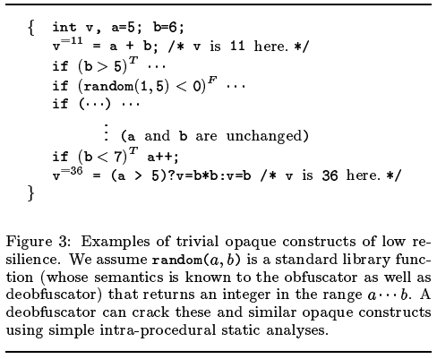
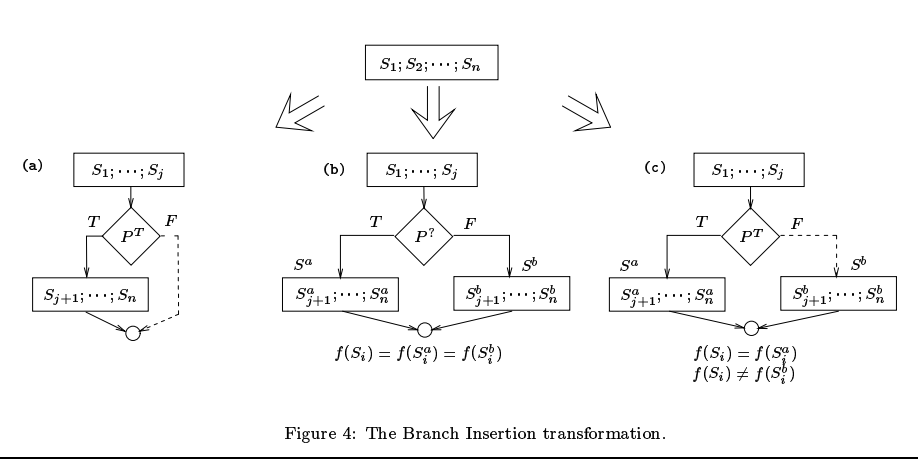
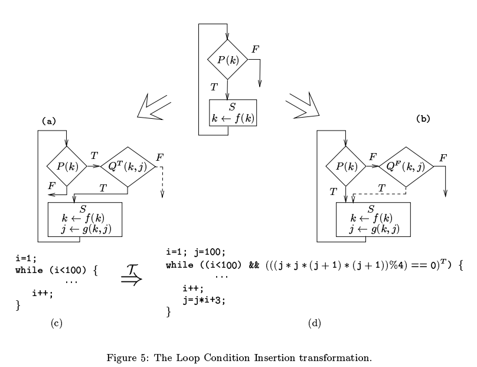
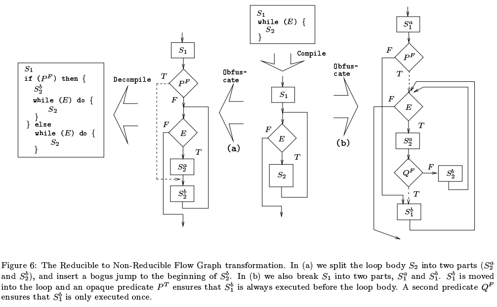

## Manufacturing_Cheap_Resilient_and_Stealthy_Opaque_Constructs

### Obfuscating Transformations

混淆转换的定义：

令 $P \stackrel{T}{\rightarrow} P'$ 是一个从源程序 P 到目标程序 P' 的转换

当P和P'表现出的行为相同（same observable behavior），则认为P'是P的一个混淆转换，准确地说，需要满足下列两个条件：

* 若P停机失败，或以某个错误停机，P'停机或不停机均可
* 否则，当P停机时，P'必须停机，且输出一致

其中，observable behavior的定义较不严格，其仅要求用户体验到的行为一致，如额外的创建文件、进行网络通信等是允许的

#### 混淆质量

论文提出以下指标

* potency  其向程序中加入了多少混淆
* resilience  使用一个自动化反混淆器来反混淆的难度
* stealth  混淆后的程序在整个程序中的隐蔽性
* cost  加入混淆后的额外开销

#### 对于potency的测量

使用软件复杂度的方式来测量，主要依据两种学说

* McCabe  复杂度随着程序随着谓词数量（number of predicates）的增加而增加
* Harrison  除上面所说，还与条件语句和循环相关

除此之外还有其他的学说

* 与数据结构相关
* 与基本块的变量依赖有关
* 与形式参数有关
* 与继承树深度有关

#### 对于resilience的测量

主要有两个指标

* 程序员的努力： 逆向人员要做出对抗混淆器的反混淆软件需要付出的努力
* 反混淆器开销： 反混淆器本身运行需要花费的时间和空间

#### 对于Stealth的测量

所谓隐蔽性难以衡量，因为其与上下文高度相关，可能同一段混淆在某个程序里是隐蔽的，但在另一个程序里就不是隐蔽的了

#### 对于cost的测量

混淆后程序在空间和时间上的开销。

一些混淆不会导致cost增加，例如一些源码级的混淆，如替换变量名等。此外有些混淆导致的开销也与上下文相关

### Control  Transformations

控制流混淆有三个主要的目的

* 将真实的控制流隐藏到一些对实际执行没有影响的语句中
* 在字节码层面（原文是object code level）引入一些语句，并且没有与这些语句相对应的高级语言结构
* 移除真实控制流或引入伪控制流

#### 不透明谓词

定义
$$
\begin{aligned}
不透明变量：&
\\
& 当变量V在程序的p点有被混淆器所知晓的属性q时，称变量V在程序的p点是不透明的，记为 V_p^q 或 V^q
\\
不透明谓词：&
\\
& 当谓词P在程序的p点有被混淆器所知晓的结果时，称为不透明谓词。分为永真谓词 P_p^T，永假谓词 P_p^F，和谓词 P_p^?
\end{aligned}
$$
下面是使用不透明谓词混淆的一个简单例子

#### 插入死代码和不相关代码

下面演示了三种使用不透明谓词和死代码/不相关代码混淆同一段程序的情况

* (a) 使用了一个永真谓词，而F分支可以插入任意不相关代码
* (b) 使用了一个谓词，但T和F分支的差别只是a和b分别是同一段代码的不同混淆形式，因此结果是一致的
* (c) 也使用了一个永真谓词，但在F分支隐藏了一个bug，但正常的执行流仍然只会走T分支

#### 扩展循环的条件

下面是一个例子

* (a) (b) 是对于上图条件循环的两种扩展形式
* (d)则是在(c)的基础上加上一个不透明谓词，因为 $x^2(x+1)^2 \equiv 0 (mod \ 4)$ 

#### 将可还原的控制流图变为不可还原的

主要就是将高级语言对应的结构变换为无法与高级语言一一对应的结构

如下图

* (a) 在普通的循环中引入一个永假谓词，使得原本的单循环结构被破坏
* (b) 主要应对的是可以识别永真永假谓词的反混淆器。这里采用更复杂的结构，将S1分为a b两部分。通过谓词P使得S1被先执行；此后Q保证S1b不会被再次执行。这种方法使得两个谓词P和Q都无法被反混淆器直接移除，因为控制流始终与其相关

