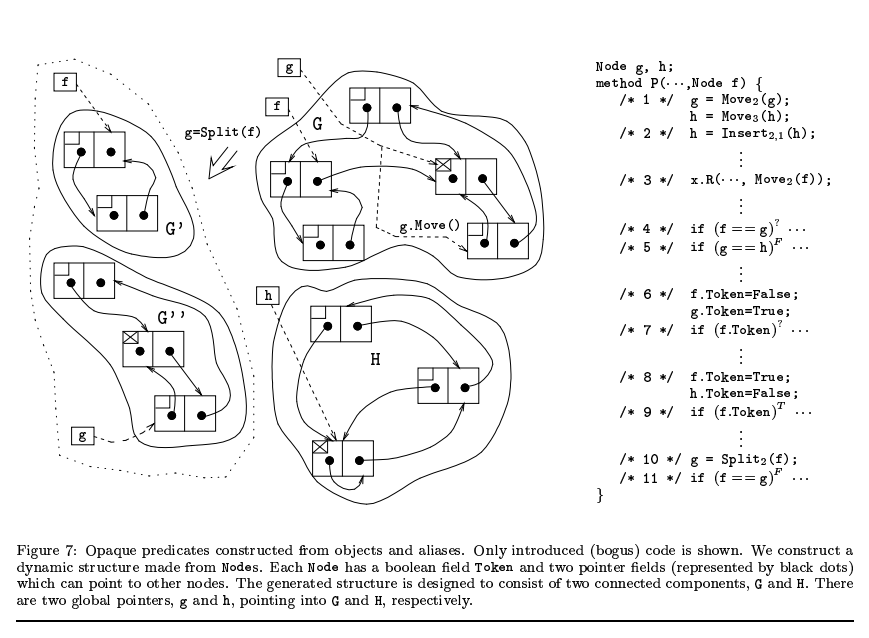
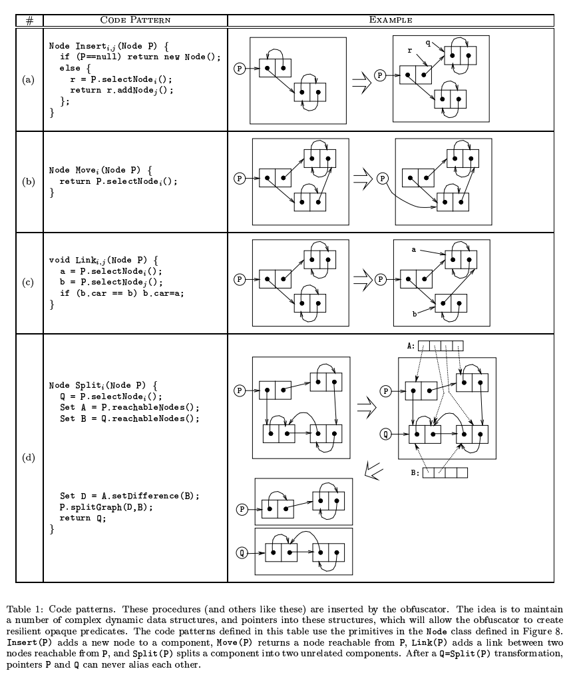
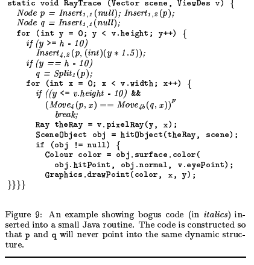
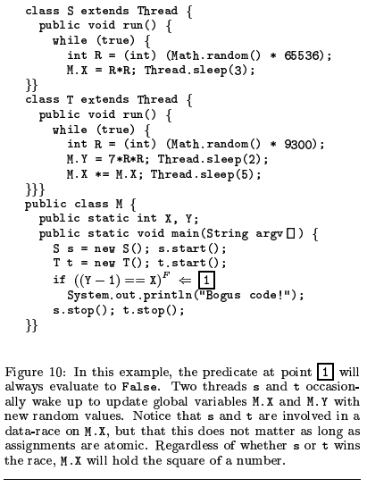
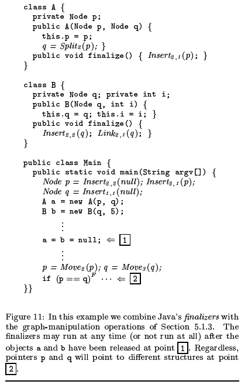
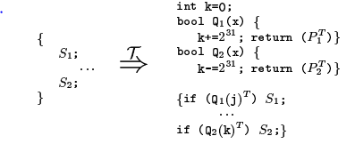

## Manufacturing_Cheap_Resilient_and_Stealthy_Opaque_Constructs

### Obfuscating Transformations

混淆转换的定义：

令 $P \stackrel{T}{\rightarrow} P'$ 是一个从源程序 P 到目标程序 P' 的转换

当P和P'表现出的行为相同（same observable behavior），则认为P'是P的一个混淆转换，准确地说，需要满足下列两个条件：

* 若P停机失败，或以某个错误停机，P'停机或不停机均可
* 否则，当P停机时，P'必须停机，且输出一致

其中，observable behavior的定义较不严格，其仅要求用户体验到的行为一致，如额外的创建文件、进行网络通信等是允许的

#### 混淆质量

论文提出以下指标

* potency  其向程序中加入了多少混淆
* resilience  使用一个自动化反混淆器来反混淆的难度
* stealth  混淆后的程序在整个程序中的隐蔽性
* cost  加入混淆后的额外开销

#### 对于potency的测量

使用软件复杂度的方式来测量，主要依据两种学说

* McCabe  复杂度随着程序随着谓词数量（number of predicates）的增加而增加
* Harrison  除上面所说，还与条件语句和循环相关

除此之外还有其他的学说

* 与数据结构相关
* 与基本块的变量依赖有关
* 与形式参数有关
* 与继承树深度有关

#### 对于resilience的测量

主要有两个指标

* 程序员的努力： 逆向人员要做出对抗混淆器的反混淆软件需要付出的努力
* 反混淆器开销： 反混淆器本身运行需要花费的时间和空间

#### 对于Stealth的测量

所谓隐蔽性难以衡量，因为其与上下文高度相关，可能同一段混淆在某个程序里是隐蔽的，但在另一个程序里就不是隐蔽的了

#### 对于cost的测量

混淆后程序在空间和时间上的开销。

一些混淆不会导致cost增加，例如一些源码级的混淆，如替换变量名等。此外有些混淆导致的开销也与上下文相关

### Control  Transformations

控制流混淆有三个主要的目的

* 将真实的控制流隐藏到一些对实际执行没有影响的语句中
* 在字节码层面（原文是object code level）引入一些语句，并且没有与这些语句相对应的高级语言结构
* 移除真实控制流或引入伪控制流

#### 不透明谓词

定义
$$
\begin{aligned}
不透明变量：&
\\
& 当变量V在程序的p点有被混淆器所知晓的属性q时，称变量V在程序的p点是不透明的，记为 V_p^q 或 V^q
\\
不透明谓词：&
\\
& 当谓词P在程序的p点有被混淆器所知晓的结果时，称为不透明谓词。分为永真谓词 P_p^T，永假谓词 P_p^F，和谓词 P_p^?
\end{aligned}
$$
下面是使用不透明谓词混淆的一个简单例子

#### 插入死代码和不相关代码

下面演示了三种使用不透明谓词和死代码/不相关代码混淆同一段程序的情况

* (a) 使用了一个永真谓词，而F分支可以插入任意不相关代码
* (b) 使用了一个谓词，但T和F分支的差别只是a和b分别是同一段代码的不同混淆形式，因此结果是一致的
* (c) 也使用了一个永真谓词，但在F分支隐藏了一个bug，但正常的执行流仍然只会走T分支

#### 扩展循环的条件

下面是一个例子

* (a) (b) 是对于上图条件循环的两种扩展形式
* (d)则是在(c)的基础上加上一个不透明谓词，因为 $x^2(x+1)^2 \equiv 0 (mod \ 4)$ 

#### 将可还原的控制流图变为不可还原的

主要就是将高级语言对应的结构变换为无法与高级语言一一对应的结构

如下图

* (a) 在普通的循环中引入一个永假谓词，使得原本的单循环结构被破坏
* (b) 主要应对的是可以识别永真永假谓词的反混淆器。这里采用更复杂的结构，将S1分为a b两部分。通过谓词P使得S1被先执行；此后Q保证S1b不会被再次执行。这种方法使得两个谓词P和Q都无法被反混淆器直接移除，因为控制流始终与其相关

### Manufacturing Opaque Constructs

#### 使用对象和别名

对于一个拥有动态分配、循环和判断语句的语言来说，精确的别名分析（alias analysis）在理论上是极为困难的。但仍有一些算法可以使用

这类算法我们比较感兴趣的是 shape/heap analysis，这类算法的目的是确定一个指针指向的结构是什么样的（一个树、DAG或循环图），或者两个指针是否指向同一个堆上的对象

不同的算法对于不同的动态结构效果不一致，但都无法准确预测。[3]提供的算法可以识别如树或树构成的数组，但无法识别一些对数据结构进行了修改的程序，[1]的算法也有类似问题；[4]无法处理循环结构，且其他一些算法也只能处理有限层次的嵌套数据结构。[2]的算法最强大，但实现复杂，效率低。

为了进行混淆，论文的目的是找到这些算法共同的缺点，并且利用其构造混淆结构。主要基本点如下

* 使用混淆后的程序构造复杂的动态结构 S1 S2 ...
* 在这些结构中加入一系列指针 p1 p2 ...
* 这些加入的混淆程序需要偶尔更新结构的内容（改变指针、添加节点、分开和合并结构等），但也需要保持一些不变量，如“p1不会指向p3指向的结构”等
* 使用这些不变量来构造不透明谓词

##### 一个简单例子

这个例子展示了一个由node构成的动态数据结构，node有三个域：token（布尔值）和两个指针。这里构造了两个结构G和H，并且有全局指针g和h分别指向两个结构。例子展示了基于此结构构造的不透明谓词混淆。被混淆的对象是方法P，方法P接收一个Node变量f作为参数，f指向G结构中的某个节点。

Move函数将传入的指针指向的节点更新为对应结构中的另一个节点。如图中g.Move()所示，g原本指向G中的某个节点，`g = Move(g)` 使其指向G的另一个节点。Insert则插入一个节点。Split则将参数指向的结构分为两块，如图中的Split(f)将G分为G'和G''

因此可以构造下列谓词：

* 第4行 f == g  该谓词结果不确定，因为f和g均指向G中的某个节点
* 第5行 g == h 该谓词结果确定，因为h和g分别指向G和H两个结构
* 第6 7行 f.Token 该谓词结果不确定，因为第6行的两句话可能修改同一个节点的数据。这里就引入了别名混淆
* 第8 9行 f.Token 该谓词结果确定，因为f和h指向的一定是不同节点
* 第10 11行 f == g 该谓词结果确定，因为Split将G一分为二，因此f和g肯定指向不同的节点

##### A Graph ADT

ADT(Abstract Data Type 抽象数据类型)

一个混淆器使用的图ADT应该满足下列三点要求

* 混淆器应该维护一个较大的变量较多的图结构，以使得混淆后的算法可以从中任意选择节点构造不透明谓词
* 对于该图原语的调动应该经过与用户代码相似的混淆，如内联，外联和名称修改
* 除了单独将该类型作为一个类使用，该类也应该支持整合入用户定义的类型，并且该类型创建的节点应该与平常用户代码创建的节点相类似（保证隐蔽性）

下表展示了该数据结构的基本操作

* Insert  插入一个节点
* Move  返回一个参数指向的图中另一个节点的指针
* Link  选择图中两个节点a b，若b的prev指针指向自身，则令其指向a
* Split  选择参数指向节点，并选择图中的另一个节点，获取二者的连通集A和B，并取A和B的差集D，将图分为D和B两个图

下面展示了一个真实的例子

这里创建了图p和q进行混淆，而p和q因为上述结构的特性，不可能指向对方的结构，因此 `Move(p, x) == Move(q, x)` 恒假

#### 在并行程序中使用不透明数据结构

这里的思路是使用上述的不透明结构引入的别名（alias）混淆，结合并行程序中的interleaving导致的data race等构造更加难以分析的不透明谓词

下面仅仅是简单给出了一个使用了多线程的不透明谓词的例子。这里使用了一个简单的数学定理： $ 7R^2 - 1 \neq X^2$ 

下图则给出了一个图结构和多线程的例子，并且使用析构函数来执行部分图的混淆

### 反混淆

对于反混淆，简单的不透明谓词可以通过数据流分析移除，如 7y^2-1 != x^2 这类谓词可以被theorem prover移除，此外静态切片技术也可以移除部分逻辑无关的代码

此外可以通过动态分析来记录trace，从而判断一些谓词是否可能是永真/永假。一种对抗动态分析的方法是混淆器在不透明谓词中引入一些副作用（side-effect），使得反混淆器在将这些谓词替换为True/False时导致一些错误，如

若反混淆器替换某个条件可能使得k产生溢出错误（不过这里用的java，并不检测溢出错误）

## 感兴趣的论文

### 结构分析

* [1] Analysis of pointers and structures
* [2] Interprocedural may-alias analysis for pointers: Beyond k-limiting
* [3] Is it a tree, a DAG, or a cyclic graph? A shape analysis for heap directed pointers in C
* [4] Parallelizing programs with recursive data structures