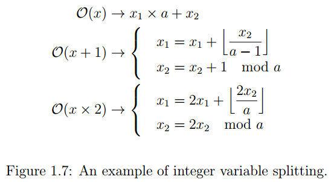
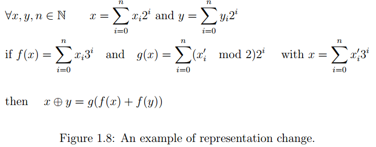

## Obfuscation with Mixed Boolean-Arithmetic Expressions Reconstruction, Analysis and Simplification Tools

### Theoretical Obfuscation and Practical Obfuscation

讨论理论上混淆的可行性，以及其与实际使用的混淆存在的差异

#### Cryptographic Obfuscation

讨论密码学意义上的混淆

提出了一种名为虚拟黑盒（Virtual Black Box）的概念，若混淆后的程序可以实现密码学意义上的安全则被称为虚拟黑盒，即满足下列特性

* 对于程序P，混淆后的程序O(P)，从O(P)中获得的知识与从构造P的输入输出中获得的知识相同

但在这篇文章中也证明了实际上不存在满足虚拟黑盒的混淆器。因此给出了一个较弱的定义 indistinguuishability obfuscation（不可区分混淆）：

```
若程序P1和P2大小相同，且用于实现相同的功能，则混淆后的程序 O(P1) 和 O(P2) 将不可区分
```

但上述定义无法保证混淆后的程序确实隐藏了信息，因此有了新的定义 best-possible obfuscation：

```
任何可以从O(P)中提取出来的信息，可以被其他功能等价且有着相似大小的函数所暴露出来
```

这篇文章还证明了对于一个有效的混淆器来说，上述两个定义等价


2013年，一篇文章提出了通用不可区分混淆，它基于三个组件：分支程序作为计算模型、全同态加密和多线性映射。它的实现在2014年的一篇文章中首次被提出，但开销过大

### Some Classical Obfuscation Techniques

#### Control Flow Obfuscations

控制流混淆技术

##### Inlining and Outlining

内联和外联

内联不解释，可以改变CFG和CG（call graph）

外联就是反过来，把原函数内的一部分代码独立出来变成一个函数来调用，同样改变CFG和CG

##### Opaque Predicate

不透明谓词一般就两个用法，一个是永真/永假谓词，其中一个分支是正确代码另一个是垃圾代码。另一个用法是不确定谓词，两个分支是同一段代码的不同混淆结果

##### Control Flow Flattening

控制流平坦化，不解释

#### Data Flow Obfuscation

##### Splitting Variables

使用更复杂的公式来表达原来的一个变量，如下例



将x表示为 $x_1 * a + x_2$ 的形式，则x+1和x*2两个式子可以表示成上面的公式

##### Changing Variables Representation



这里展示的一个例子原理是将原来计算机中以2为基底的数字表示法转化为以3为基，则原来x异或y可以表示为上面的函数g和f的复合函数形式

##### Encoding

以常见的编码或加密方式隐藏数据

#### White-Box

是密码学和软件混淆的一个交叉领域。白盒密码学的场景是在攻击者可以完全访问密码算法的执行环境，因此密钥本身是不安全的。白盒密码学的核心就是要在不泄露密钥的情况下依然能正确对加密内容进行解密。（这个场景可以用这样一个例子来说明，比如我正在使用AES128算法解密，但需要保证白盒安全，最简单的方法就是直接根据我的密钥生成一个查找表，一共2^128项，从而可以直接根据输入查找对应输出，这样也不会泄露密钥）

### Quality of an Obfuscation Technique

混淆技术的质量。这里介绍了如何评估一个混淆的强度

#### Complexity Metrics of a Program

这里把程序的复杂性归因于三个方面

* 指令数  操作符和操作数数量等
* 控制流  独立的线性执行路径数、嵌套层数等
* 数据流  指令的扇入扇出、数据流的复杂性（如基本块间的变量引用数）、数据结构的复杂性等

#### Metrics for Obfuscation

主要是collberg定义的三个方面

* potency
* resilience
* cost
* stealth

此外对于上述的定义也有一些不同的阐释，具体见文中

#### Attack Model from Abstract Interpretation


### 感兴趣的论文

