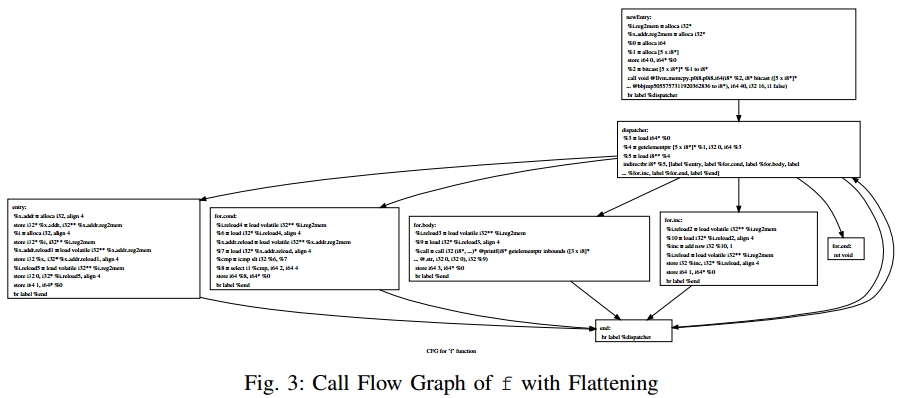

## Obfuscator LLVM Software Protection for the Mass

### Code Transformations

#### 指令替换

原理很简单，部分指令替换表如下。

这里需要注意的一点是指令替换的过程放在编译器优化之后

#### 插入虚假控制流

一个例子如下

f混淆前，注意这里的混淆是在IR上做的

f混淆后

#### 控制流平坦化和基本块切分

控制流平坦化的基本思想就是将一个简单的判断、循环结构变换成一个大的switch结构，并且通过一个routing variable作为switch的变量，从而确定下一次执行哪个基本块

基本块拆分则可以让平坦化后的switch结构拥有更多的基本块

此外，routing variable的更新对于平坦化的强度是至关重要的，若只是采用一个静态的值进行更新，则几乎无法对抗静态分析。而如果用一个动态的值更新，如采用一个 check() 函数的返回值来更新，则可以迫使逆向分析者采用动态分析

#### 代码防篡改

OLLVM将这块功能整合进了上述控制流平坦化的check函数中，这里防篡改的方式是对一段随机选取的段计算CRC32，并且将计算结果用于计算控制流平坦化的routing variable。也因此这部分的计算值需要在程序链接后才能确定。但由于CRC32在GF2上的线性运算，正在计算的BBL和已经计算过的BBL间的相互关系可以在IR层面被确定（这块我没太搞懂）

而对于篡改后的响应函数就比较简单，放在switch结构的default路径上即可

#### 过程合并 Procedures Merging

这一过程是将一个编译单元（比如一个.c文件）内的所有函数合并成一个大函数merged，使用switch包装，并且将所有对该编译单元的调用替换为一个简单的wrapper函数，用于传递要调用的函数和函数的参数给merged

wrapper函数的存在主要是为了不改变API的调用名（routine name），但之后可以在链接器层面上解决这个问题

此外，该技术对于对抗 code carving 有很好的效果

### Future Work

* OLLVM目前只在IR上做混淆，而没有涉及依赖于平台的对抗手段，如反调试等。未来可能可以通过设计一些特定IR，使得后端可以在对应位置插入一些与硬件/操作系统交互的代码来实现反调试
* 目前没有做对于常量和字符串的混淆
* 可以将代码多样性变换（code diversification）转化为code watermarking问题（因为对后者的研究更多），从而增加指令替换和不透明谓词的数量

### 问题

II F 代码防篡改（Code Tamper-Proofing）中关于CRC32在GF(2)上的线性使得基本块的相互依赖关系不会影响计算具体是指什么

