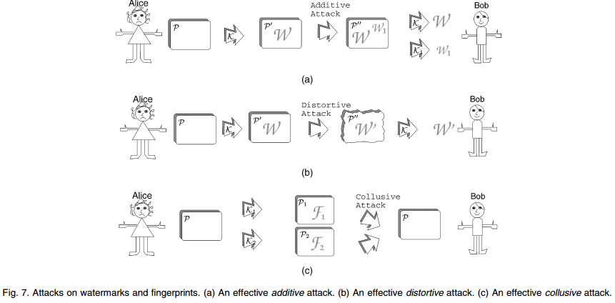
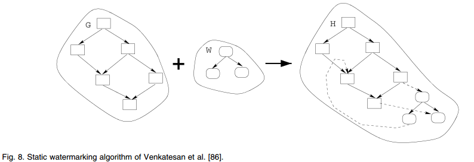
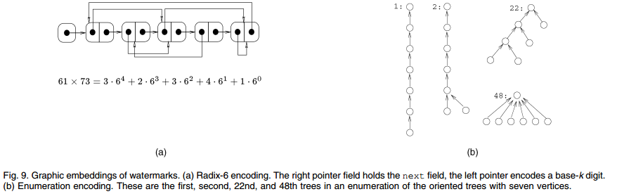

## Watermarking, Tamper-Proofing, and Obfuscation—Tools for Software Protection  
这篇主要内容有点类似一个综述

obfuscation方面引用的主要是作者的两篇文章

* Manufacturing Cheap Resilient and Stealthy Opaque Constructs  主要内容是构造不透明谓词
* Breaking Abstractions and Unstructuring Data Structures  主要内容是对数据进行混淆

水印方面主要综述了静态、动态水印和作者自己的动态图水印

* Software Watermarking: Models and Dynamic Embeddings  

### 水印

在程序P中放入水印W，需要满足的设计要求

* W应该可以方便地被P定位并且提取
* W应该足够大（有高数据率，原文the embedding has a high data rate），意思应该是包含足够的信息
* cheap  将W加入P不会影响P原本的表现
* stealthy  将W加入P不会影响P的统计特性
* W应该具备一些数学特性来满足水印的要求（原文的意思就是说W应该有些特性来说服大家这水印不是乱加的是有用的）

其中隐蔽性包括动态隐蔽性和静态隐蔽性，这是针对不同的逆向分析者而言的。

#### 威胁模型

Alice销售了一个带水印W和密钥K的程序P'给Bob，Bob打算把P'改造成P''卖给别人，但在这之前需要保证Alice没法证明P''上检测不到她的水印

* (a) additive attack  Bob直接用自己的水印覆盖Alice的水印。如果水印算法无法证明Alice的水印先于Bob的水印，则这种攻击有效
* (b) distortive attack  它通过对P'进行一系列保留语义（semantics-preserving）的转换，目的是达到以下要求
  * 被转换后的水印W'无法被识别
  * 被转换后的程序P''对于Bob来说尚可使用（即不会过大或过慢，并保留了功能）
* (c) collusive attack Bob购买了多份P'，且每份P'具有不同的指纹F，而Bob可以通过简单对比几份P'来移除F

#### 静态水印

静态水印即水印本身是静态地存放在程序中的，下面介绍了几篇文章的做法

* [1]  使用一种媒体水印算法（media watermarking algorithm）将水印信息嵌入在图像中，并存放在静态存储区

* [2]  将程序的控制流图的一系列基本块序列编码为指纹

* [3]  文章发表时最强大的算法，将源程序看作由基本块组成的控制流图，而水印本身也是一块控制流。加水印时将两者合并为一个新的控制流，如图。合并方式可以是通过不透明谓词等。检测水印时则经过下列算法

  * 重建加了水印的程序的控制流图
  * 检测哪些节点属于水印
  * 重建水印本身的控制流图

  这个方法很好地将水印隐藏进了程序中，但也有不足之处，即一个问题是如何标记水印对应的节点。原文采用简单的方法标记，但问题是一旦被获知了标记算法，水印就能被轻易去除。此外也可以通过一些简单的方法使得水印无法被识别，如通过一些代码优化方法（窥孔优化、寄存器重分配、指令重排等）打乱基本块的特征，因此这个方法无法对抗distortive attack

#### 动态水印

主要有三种技术，共性是在水印算法运行时会接受一串预定义好的输入串I

* Easter Egg Watermarks  这种水印的特点是输入这串内容后程序会有能让用户感知的反应，如显示一个copyright界面等。这种方式的缺点在于攻击者很容易定位到水印对应的程序
* Execution Trace Watermarks  这种水印不会有什么用户感知的反应，而是记录一个trace（地址或指令）作为输出。但这种水印也无法对抗distortive attack
* Data Structure Watermarks  这种水印不会有反应也不记录trace，而是在栈、堆或全局构造一系列数据，此后程序对这些数据进行验证。但这种水印依然无法对抗一些distortive attack，如对数据进行保留语义的混淆

#### 动态图水印

方法是动态构造一系列复杂的图结构，并且利用alias analysis的复杂性来隐藏水印代码。方法如下

* 选择一个n作为唯一的指纹，如令n=p*q，其中p q为素数
* 将n嵌入到一个拓扑图中
  * 如下图a将n嵌入到了被称为Radix-6的编码图中，其中每个node的右边都指向下一个node，构成一个循环图。左边则指向当前因子的对应序号的node。如下图的node（除最左的node）分别代表 6^4 6^3 6^2 6^1 6^0 的因子，而其表示因子x的方式是指向下x个node。如6^2的因子为3，则对应节点指向右数第二个节点（因为自身算1）；6^1的因子为4，则指向右数第3个节点（图中通过循环链表绕到前面了）
  * 如下图b则将n嵌入到了一棵7节点的有向树中

* 将构造上述图结构的代码作为水印W嵌入，当输入I正确时程序便会构造并验证该图结构，并提取出正确的n

### 防篡改

设计要求

* 需要能检测代码被篡改
* 当检测到程序被明显篡改时应退出

理想情况下，程序被检测到篡改时退出应该在程序运行的任意时间或空间，使得攻击者无法找到检测点

一般可以用下列方式防篡改

* 检测应用程序自身与原来有没有区别，如用MD5摘要算法对比
* 检测程序中间结果的可用性，这块技术被称为program checking
* 可以加密整个程序，使得攻击者在无法解密的情况下无法篡改内容（就是加个壳）

这里谈加壳的时候提到了一种方法 [3] [4]，作者都是Aucsmith，他的方法是将程序分段加密，每次只解密一个段，执行完后再加密回去。因此内存中任何时刻只会存在一个段的代码是明文。且这里用了一个好办法防篡改，有点类似对称加密CBC的原理，每次解密下个段时都跟上个段的密文有关，因此若攻击者只想修改某段代码，也会导致下一段代码的解密出错。除非他提取所有的代码并统一修改

### 一些与代码混淆理论上是否可以做到的论文

* On the (Im)possibility of Obfuscating Programs (Extended Abstract)  
* Zero-Knowledge and Code Obfuscation
* How to Copyright a Function?  

### 引用

[1] Method for Stega-Cipher Protection of Computer Code

[2] Method and System for Generating and Auditing a Signature for a Computer Program

[3] Tamper Resistant Software: An Implementation

[4] Tamper Resistant Methods and Apparatus