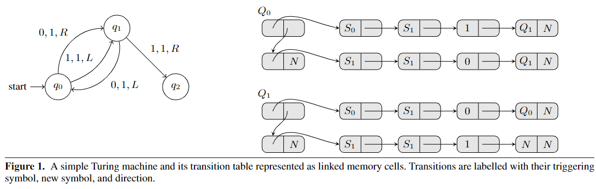

### 指令定义

* 寻址  按照word进行寻址

* 偏移量  因为按照word进行寻址，因此偏移量只可能为0或1

* 指令
  
  ```
  Load Imm
      mov Rd, C
  Load Indexed
      mov Rd, [Rs + Roff]
  Store Indexed
      mov [Rd + Roff], Rs
  ```

这里论文里说明了一下，因为看起来 `[addr+off]` 的寻址模式超出了mov的语义，但这里off只可能是0或1，因此可以简单地用or运算替代

### 图灵机

一个图灵机M由下列五元组表示（这里忽略了accept集合和reject集合）

$$
M = (Q, q_0, \Sigma, \sigma_0, \delta)
$$

* Q 为有限的状态集合，其中 q0 是起始状态集合

* $\Sigma$ 为有限的符号集合，其中 $\sigma_0$ 为空符号

* $\delta$  为状态转移函数的集合

其中状态转移函数一般类似如下形式

$$
(q, \sigma) = (q', \sigma', R/L)
$$

其中q为当前状态，σ为当前的符号，q'为转换后的状态，σ'为改写后的符号，R/L表示纸带的移动方向

### 模拟器

证明mov指令图灵完备的方法即：证明仅使用mov指令可以构造一个图灵机。因此论文接下来的部分即具体如何构造该图灵机

#### 图灵机的表示

下图为论文里的一个示例



其对应的图灵机表示即为

```
状态集Q:  q0 q1 q2
起始状态: q0
输入符号: 0 1
转移函数:
    (q0, 0) = (q1, 1, R)
    (q0, 1) = (q1, 1, L)
    (q1, 0) = (q0, 1, L)
    (q1, 1) = (q2, 1, R)
```

图的右边则刻画了转移函数在该图灵机中怎么被表示：

首先每个cell的第二个单元都为一个指针

* 第一个cell为链表头，第一个单元指向表项的内容，第二个单元指向下一个表项

* 下面为具体的表项，每个表项的第二个单元指向表项的下一个内容
  
  * 第一个项为输入的符号
  
  * 第二个项为改写后的符号
  
  * 第三个项为纸带方向，1为R，0为L
  
  * 第四个项为转换后的状态

此外，该图灵机中因为q2的出度为0，所以直接写为N（空列表）

#### 条件与比较原语

显然，mov指令没有提供条件比较和跳转的能力，但可以通过下列方法来模拟

##### 符号比较

假设Ri和Rj都指向一个符号，这里要测试Ri与Rj是否相等

```
mov [Ri], 0
mov [Rj], 1
mov Rk, [Ri]
```

显然，若Ri==Rj，则Rj=1

##### 常量比较

假设Ri指向一个符号，N为要比较的符号，X为任意一个寄存器，主要是用来恢复比较前的context

```
mov X, [Ri]    ; 保存Ri的内容
mov [N], 0
mov [Ri], 1
mov Rj, [N]    ; 显然，若Ri==N，则Rj=1
mov [Ri], X    ; 恢复Ri的内容
```

##### 选择

通过上面构造的原语，我们可以获得比较的结果（若为0则不相等，为1则相等）

此时我们可以使用该结果对一个2元素的查找表进行索引，从而实现选择的功能：

假设Rk保存了之前的比较结果

```
mov [N], Ri
mov [N+1], Rj
mov Rl, [N+Rk]
```

就可以实现对Rl的条件赋值

#### 模拟图灵机

##### 定义与初始化

首先定义几个索引寄存器

* T  当前正在测试的转移函数

* S  指向包含当前读取的符号

* L  当前纸带位置的左边一个单元

* R  当前纸带位置的右边一个单元

程序的起始状态如下：

* T  指向Q0，注意这里Q0是上面描述的转移函数表示法的头节点

* S  指向T1（Ti为纸带的第i个单元）

* L  指向N（空列表）

* R  指向T2

此外，定义一个N作为存放查找表的内存

其中，L和R的操作类似栈。当纸带右移时，对应的操作是将当前的单元push到L，并将R的单元pop到S

##### 符号比较

这一步用于比较当前输入的符号与当前指向的转移函数的输入符号是否相等

```
mov X, [T]    ; 当前转移函数
mov X, [X]    ; 当前转移函数的输入符号
mov Y, [S]    ; 当前输入符号
mov [Y], 0
mov [X], 1
mov M, [Y]    ; 比较结果保存到M寄存器
```

##### 符号改写

这一步执行的是根据上一步的判断结果来执行转移函数改写符号的一步，若上一步判断结果为真，则将指向的符号改写为新符号，否则保留原符号

```
mov X, [T]      ; 当前转移函数
mov X, [X+1]
mov X, [X]      ; 寻址转移函数的第二项（改写的符号）
mov Y, [S]
mov [N], Y      ; 保存旧符号
mov [N+1], X    ; 保存新符号，这里构造了一个2元素的查找表
mov Z, [N+M]    ; 若上面符号比较结果为真(M=1)，则Z为新符号，否则为旧符号
mov [S], Z
```

##### 纸带移动

这一步是根据比较结果移动纸带，这里的逻辑比较复杂，分为三步

* 第一步，计算了新的纸带位置，并对L和R寄存器进行初步更新
  
  ```
  mov D, [T]
  mov D, [D+1]
  mov D, [D+1]
  mov D, [D]    ; 这里读取了转移函数的第三项（纸带移动方向）
                ; 若D=1，为R，否则为L
  
  mov [N], R
  mov [N+1], L
  mov X, [N+D]  ; 这里X保存了L和R中被改写的寄存器的原始值，见下面的解释
  mov [S+1], X  ; 这里将S+1作为压栈操作
  
  ; 下面两步更新L和R寄存器
  mov [N], L
  mov [N+1], S
  mov L, [N+D]  ; 若为右移则更新为S，否则不变
  
  mov [N], S
  mov [N+1], R
  mov R, [N+D]  ; 若为左移则更新为S，否则不变
  ```
  
  注意，这一步执行完后，L与R的变化如下
  
  | 转移函数移动方向 | 左（0） | 右（1） |
  | -------- | ---- | ---- |
  | 寄存器L     | L    | S    |
  | 寄存器R     | S    | R    |
  
  这里需要注意，上述的操作实际上一定会更改L或R中其中一个寄存器，S作为栈顶指针，而X，即[S+1]保存的就是被更改的寄存器的原始值，被压栈。

* 第二步，根据前面的比较结果M获取下一步纸带移动的方向。若M==1，D不变，否则D=!D，以此回退上一步操作
  
  ```
  mov [N], 1
  mov [N+1], 0
  mov X, [N+D]    ; 这里相当于实现了 X=!D
  mov [N], X
  mov [N+1], D
  mov D, [N+M]    ; 若M=1，则D不变，否则D=!D，回退上一步操作
  ```

* 第三步，更新S L R三个寄存器的值
  
  ```
  mov [N], L
  mov [N+1], R
  mov S, [N+D]    ; 更新当前位置。
                  ; 注意，在第一步时更新了L和R值
                  ;   因此若第二步的结果为D=!D，则这里S会被赋值为原本的S
                  ;   否则赋值为对应的L或R
  
  mov X, [S+1]    ; 取出保存在栈中的L或R的初值
  
  ; 下面的两步是更新L和R的最终值
  mov [N], X
  mov [N+1], L
  mov L, [N+D]
  mov [N], R
  mov [N+1], X
  mov R, [N+D]
  ```

这里的做法比较绕，因为这里需要通过无条件跳转的逻辑来实现两个判断：

* 当前操作是否执行，由前面符号比较中得到的M决定

* 当前应该左移还是右移

列一个表格来总结各部分的操作

| 是否执行        | 是    |      | 否      |        |
| ----------- | ---- | ---- | ------ | ------ |
| 转移函数移动方向(D) | 左（0） | 右（1） | 左（0）   | 右（1）   |
| 第一步         |      |      |        |        |
| 寄存器L1       | L    | S    | L      | S      |
| 寄存器R1       | S    | R    | S      | R      |
| 栈[S+1]      | R    | L    | R      | L      |
| 第二步         |      |      |        |        |
| 寄存器M1       | 1    | 1    | 0      | 0      |
| 寄存器D1       | 0    | 1    | 1 (!D) | 0 (!D) |
| 第三步         |      |      |        |        |
| 寄存器X=[S+1]  | R    | L    | R      | L      |
| 寄存器S        | L1=L | R1=R | R1=S   | L1=S   |
| 寄存器L2       | X=R  | L1=S | L1=L   | X=L    |
| 寄存器R2       | R1=S | X=L  | X=R    | R1=R   |

**原文疑似有误**，见 [一些问题](#1)

此外我认为这里更新L和R存在一个问题，见 [一些问题](#2)

##### 进行下一个操作

这里有两种情况：

* 若M为0，即当前转移函数不符合条件，则尝试下一个转移函数

* 若M为1，则转移到下一个状态对应的转移函数链表

```
mov X, [T+1]    ; 获取当前状态的下一个转移函数
mov Y, [T]      ; 获取当前状态的转移函数
mov Y, [Y+1]    ; 跳过当前转移函数的输入符号
mov Y, [Y+1]    ; 跳过当前转移函数的改写符号
mov Y, [Y+1]    ; 跳过当前转移函数的方向
mov Y, [Y]      ; 获取转移到的状态
mov [N], X
mov [N+1], Y
mov T, [N+M]    ; 根据M的判断结果来选择跳转到下一个转移函数还是跳转到新的状态
```

这里需要处理的特殊情况是：下一个转移函数为空（N），或转移到的状态为空（其实本质上也是该状态对应的转移函数为空）。下面的程序用于判断新的转移函数

```
mov X, [T]
mov [N], 0
mov [T], 1
mov H, [N]
mov [T], X
```

##### 停机

若H为1，说明新的状态转移函数为空，到这里需要停机。这里使用的停机方式比较简单粗暴。。。直接访问0地址

```
mov [N], 0
mov [N+1], N
mov X, [N+H]
mov X, [X]
```

##### 重复执行

程序若到达这里，就完成了对一个转移函数的所有判断和处理，这里就需要跳回程序开头处理下一个转移函数，所以用了一条jmp指令

```
jmp start
```

### 一些问题

#### 1

纸带移动第三步的最后一个操作，更新L和R的代码如下

```
mov [N], X
mov [N+1], R
mov L, [N+D]
mov [N], R
mov [N+1], X
mov R, [N+D]
```

无法满足函数不执行时应保持上下文的要求

#### 2

同样是在纸带移动的位置，这里看 [纸带移动](#纸带移动) 列出的表格，可以看到当函数执行时，L和R的更新似乎有点问题。如当D=0（即左移）时，更新后的R确实变为了S，S变为了L，但L却又指向了R，照理应该取原本L的左边那个元素。右移时存在同样的问题
