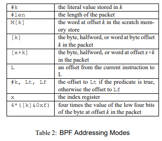

## The BSE Packet Filter A New Architecture for User-level Packet Capture

https://www.tcpdump.org/papers/bpf-usenix93.pdf 

这篇文章主要介绍了BPF一开始作为一个网络包过滤器，其内部的设计思路、原理以及与当时现有包过滤实现方案的对比

### The Network Tap

架构如下


* 当网络包进入时，首先被链路层驱动（link-level driver）接收

* 若BPF正在监听，则首先调用BPF
  
  * BPF将包分发给每个filter，这些自定义的filter决定是否保存该数据包，若需要保存则将内容复制到对应的buffer上

* 此后数据包正常转发给协议栈

因为一个进程可能需要捕获所有的数据包，而这些数据包可能间隔不过几ms，所以BPF提供了一个机制将多个数据包打包为一个单元，并为其加上了一个header来识别。

### Packet Filtering

BPFi将包过滤的过程放在了底层，如在网络接口的DMA传输时就进行了过滤，因此在减少了很多内存复制

作为对比，另一种包过滤器STREAMS对每个数据包都先复制后才进行过滤

### Tap Performance Measurements

这节对比了BPF和STREAMS的性能，主要针对两种极端情况：全部过滤和全部接收

全部接收：


全部过滤：


可以看到，对于全部接收的情况，因为两者都需要复制数据包到buffer，所以时间都随包的尺寸增长而增长

而对于全部过滤的情况，由于STREAMS还是会进行复制，其开销一样随包的尺寸增长而增长，但对于BPF来说开销不变

### The Filter Model

包过滤器实际上是个简单的布尔函数，一般的实现方案有两种模型

* 布尔表达式树

* 无环的控制流图

下图展示了一个简单的IP和ARP数据包的包过滤器对应两种模型的表达式


* 布尔表达式树
  
  每个节点表示一个布尔运算或包过滤条件，每条边表示一个包过滤条件与布尔运算的关系

* 控制流图
  
  每个节点表示一个包过滤条件，而边代表控制流转移

两者的表达能力是相同的，但实现方式差别很大。对于表达式树，一般采用基于栈的模型实现；而对于CFG，一般采用基于寄存器的模型实现。

#### The CSPF (Tree) Model

CSPF是一个采用布尔表达式树结构的包过滤器

其基于操作数栈，运行时包数据或一些常数被压入栈，支持的虚拟指令包括

* 压入常数或包数据

* 布尔运算

* 位扩展运算

每次运算都是对栈顶的数据进行操作

该模型从实现上看有两个主要的缺点

* 该模型需要模拟一个栈，这意味着需要频繁进行内存读写操作，这会降低效率

* 树模型会进行一些无用的计算，如上图所示的例子，若包为IP报文，CFG表达式只需要进行第一个判断，而树表达式需要将两个运算都执行。不过这个缺点可以通过加入“短路运算”的操作符来缓解（一个问题，上面的or运算不也存在短路机制么）。但此外还有一个难以解决的缺点，不论对于树表达式还是CFG，每个包过滤条件都需要对包头的某个字段进行解析。对于大多数数据包，其包头都是根据协议层进行一层层封装的，所以CFG在解析时可以简单地通过编译器的优化使得报文按照协议层一层层进行解析，但树表达式需要在一开始就解析整个报文的各层数据包。
  
  这里我的理解是这样的，如过滤条件是IP头的某个字段或TCP头的某个字段（条件是或），TCP报文一般是封装在IP报文内的，而对于CFG来说，条件可以先判断IP头的条件，若符合直接接收，不符合才继续判断TCP头，因此可以在需要的时候才解析TCP头；但对于树表达式，则需要一次性解析两个头。
  
  （这里其实我认为树表达式也可以通过如短路运算来做优化，如`ether.type=IP || ether.type=TCP`，当第一个条件符合的时候直接接收；应该可以通过类似原理构造与CFG方式类似的表达式树。但确实可能面临灵活性较低等问题）

此外，CSPF本身也有下列几个设计短板

* 因为CSPF没有设计如间接跳转类的指令，因此其无法处理变长的报文头，如被变长IP头封装的TCP头

* CSPF的指令集操作数都是16位的，因此带来了一些不便

虽然有上述缺点，但CSPF通过在内核引入一个类似虚拟机解释器的机制来描述过滤器提供了极大的灵活性，此外，CSPF只将数据包看作一个简单的数组，使得过滤器模型与协议无关

#### The BPF Model

##### CFG vs Trees

下面展示一个例子，用于过滤所有源地址和目的地址为foo的IP、ARP和RARP包

* CFG
  
  

* 树表达式
  
  

树表达式需要判断7个表达式，进行6个布尔运算才能遍历整棵树，但CFG最多只需要进行5次比较（一个问题，与上文相同，树表达式这里理论上也可以做优化，如将OR和AND变为短路运算，即当一个表达式为True时OR不需要运算另一个表达式；一个表达式为False时AND不需要运算另一个表达式）

##### Design of filter pseudo-machine

下面描述了几个设计原则

* 必须与协议无关，kernel不需要添加更多的协议支持

* 指令集必须足够通用，以应对之后可能的更多应用
  
  这意味这需要设计一个较通用的计算模型，包括控制流指令、ALU运算以及便利的寻址方式

* 对数据包中数据的引用必须最小化
  
  降低对包数据的读取次数，因为对包的读取和解析一般开销较大。
  
  * 例如过滤器需要匹配一系列的IP地址或TCP端口，我们最好将待匹配的数据暂存到寄存器中再进行比较
  
  * 再如字段被变长包头封装的情况，最好只解析一次就将字段暂存，避免多次解析该字段
  
  * 又如对于一些内存对齐严格的机器，当解析字段时可能需要进行开销较大的按字节读取的操作
  
  * 又或者对于存在mbufs中的包，每次读取一个字段可能需要便利mbuf链

* 对虚拟指令的解析必须能在一个C的switch语句中完成
  
  这说明指令集的设计应满足解码效率高的要求，并且抛弃一些较复杂的指令，如一些复杂的寻址方式

* 虚拟寄存器的值必须可以保存在实际的寄存器中
  
  同样出于性能的考虑，这说明虚拟寄存器的设计应与实际CPU的寄存器相对应

#### The BPF Pseudo-Machine

BPF虚拟机由下列组件组成

* 一个累加器

* 一个索引寄存器

* 一个暂存存储器

* 一个隐式的程序计数器

操作可以分为下列几类

* LOAD  将操作数的值赋给累加器或索引寄存器
  
  * 操作数：
    
    * 立即数
    
    * 在固定偏移的包数据
    
    * 在可变偏移的包数据
    
    * 暂存存储器

* STORE  将操作数的值赋给暂存存储器
  
  * 操作数
    
    * 累加器
    
    * 索引寄存器

* ALU指令  在累加器上进行逻辑或数值运算
  
  * 操作数
    
    * 常数
    
    * 索引寄存器

* 分支指令  比较 常数或索引寄存器 与 累加器

* RETURN  结束过滤并指示包应该保存在哪里。若返回0则过滤掉该包

* 杂项指令  目前主要是数据传输类指令

下图为指令格式的定义


* opcode  指令的opcode

* jt  只有跳转指令使用，指示条件为True时的跳转地址

* jf  只有跳转指令使用，指示条件为False时的跳转地址

* k  通用的域

下面展示了全部的指令及其支持的寻址方式


* LOAD
  
  * ldb | ldh | ld  将操作数载入累加器，载入大小分别为byte halfword和word
  
  * ldx  将操作数载入索引寄存器。
    
    注意，这条指令无法直接对包内数据进行寻址，所以要读取包内数据必须先读入累加器后才能传送到x寄存器。
    
    但这条指令可以使用最后一种寻址方式对包内数据进行寻址，该寻址方式一般用来处理变长的包数据

* STORE
  
  * st  将累加器的数放置到暂存存储器
  
  * stx  将索引寄存器的数放置到暂存寄存器

* 跳转指令
  
  * jmp  跳转到L标签

* 分支指令  将累加器内容与一个常数进行比较。此外由于jt和jf域只有8位，分支指令最多只能跳转256条指令
  
  * jeq
  
  * jgt
  
  * jge
  
  * jset  累加器内容与常数进行位与，有点类似intel汇编的test指令

* ALU指令  将累加器的内容与操作数进行运算，结果放回累加器。若有除0错误则过滤器终止
  
  * add
  
  * sub
  
  * mul
  
  * div
  
  * and
  
  * or
  
  * lsh
  
  * rsh

* RET指令  终止过滤器并返回需要接收几字节的包数据，若为0则不接收。
  
  * ret

* 数据传送指令
  
  * tax  将累加器内容传送给索引寄存器
  
  * txa  将索引寄存器内容传送给累加器

寻址方式



* `#k`  立即数

* `#len`  当前包的大小

* `M[k]`  暂存存储器偏移为k的内容（单位为word）

* `[k]`  包中偏移为k的内容（单位为byte、halfword、word）

* `[x+k]`  包中偏移为 x+k 的内容

* `L`  当前指令地址到标签L的偏移

* `#k, Lt, Lf`  若跳转为真，则为到Lt的偏移，否则为到Lf的偏移

* `x`  索引寄存器

* `4*([k] & 0xf)`  包内偏移为4乘k的第4位的内容

其他注意点

* 关于字节序： 字节序与主机使用的字节序一致，LOAD指令可以将网络传输的字节序转换到主机字节序

* 若引用的数据偏移大于数据包长度，则对于该包，过滤器返回0

#### Examples

如下过滤器接收所有IP包

```
    ldh  [12]
    jeq  #ETHERTYPE_IP, L1, L2
L1: ret  #TRUE
L2: ret  #0
```

如下过滤器接收所有源地址不为128.3.112.x或128.3.254.x的IP包

```
    ldh  [12]
    jeq  #ETHERTYPE_IP, L1, L4
L1: ld   [26]
    and  #0xffffff00
    jeq  #0x80037000, L4, L2
L2: jeq  #0x8003fe00, L4, L3
L3: ret  #TRUE
L4: ret  #0
```

#### Parsing Packet Headers

上面提供的例子都假设需要的数据在包的固定偏移，但实际上很多时候偏移是可变的，如被可变长IP头封装的TCP报文。

IP头的长度在IP报文的第一个字节的低4位被定义（Ethernet数据包的第14个字节），因此可以通过如下方式取得

```
ldb  [14]
and  #0xf
lsh  #2
```

* 左移2位是因为该长度是以word为单位的

注意，要求得TCP对应字段的偏移，应由三个部分组成：

* 链路层报文头的长度（对于Ethernet来说，为14字节）

* IP头的长度

* 字段相对TCP头的偏移

下面展示的例子用来确定TCP的目的端口是否为N

```
    ldb  [14]  ; 14是Ethernet头的长度
    and  #0xf
    lsh  #2    ; 获取IP头长度
    tax        ; 将IP头长度从累加器传到索引寄存器
    ldh  [x+16]; 目的端口字段位于TCP报文头的第二字节，因此偏移是 [14+x+2]
    jeq  #N, L1, L2
L1: ret  #TRUE
L2: ret  #0
```

注意，可以使用ldx指令的特殊寻址模式改写上述程序

```
    ldx  4*([14]&0xf)
    ldh  [x+16]
    jeq  #N, L1, L2
L1: ret  #TRUE
L2: ret  #0
```

但上述程序没有检测链路层字段以确定网络层是否为IP协议，也没有检测IP字段以确定传输层是否为TCP协议，下面的示例补充了这方面的内容

```
    ldh  [12]
    jeq  #ETHERPROTO_IP, L1, L5
L1: ldb  [23]
    jeq  #IPPROTO_TCP, L2, L5
L2: ldh  [20]
    jset  #0x1fff, L5, L3
L3: ldx  4*([14]&0xf)
    ldh  [x+16]
    jeq  #N, L4, L5
L4: ret  #TRUE
L5: ret  #0
```
