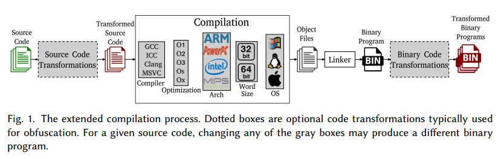
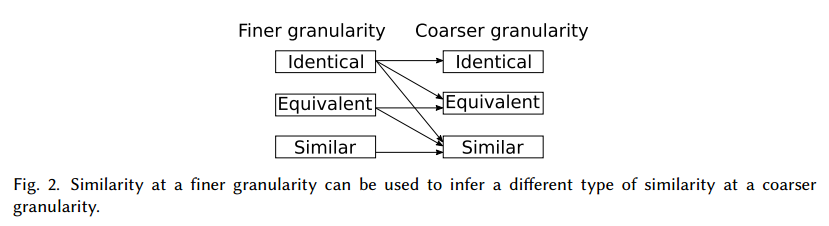
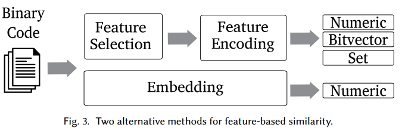

## overview

### 编译过程

两个灰色块表示的是混淆过程，前一个是源码级的混淆，后一个是二进制级的混淆

最后生成的binary的差距主要由这几个方面引入

* 源码级混淆
* 不同的编译器
* 不同的优化等级
* 不同的架构
* 不同的系统
* 二进制级混淆

### Binary Code Similarity Overview

下面从三个方面描述二进制代码相似性的比较方式

#### 比较类型

有三种比较的类型

* identical  若两段二进制代码的**语法（syntax）**相同，称为identical

  最直接的一种比较方式就是比较哈希，但这种方法极不准确，对于使用不同参数编译的程序通常都会失效

* equivalent  若两段二进制代码的**语义（semantics）**相同，称为equivalent

  显然，若两段二进制代码是identical的，则必然是equivalent的，但相反不一定。

  如mov %eax, $0与xor %eax, %eax是equivalent的，但不是identical的

  此外，equivalent的两段代码不一定是从同一份源码编译得到的，若是同一个函数的两种实现，仍可以称为equivalent。但这也使得判断两个函数是否equivalent是不可能的，因为这个问题可以归结为图灵停机问题。因此在实践中一般只比较小段的二进制代码

* similar  若两段二进制代码的**语法、结构、语义（syntax, structures, semantics）**类似，则称为similar，主要分为三个层面

  * Syntactic similarity  语法相似性主要比较代码层面的相似性，如clone detection比较一段二进制源程序是否是另一段二进制程序的clone
  * Structural similarity  结构相似性主要比较二进制代码的cfg层面的相似性。这种比较的合理性在于：二进制代码的控制流在某些程度上包含了一定的语义信息。此外，CFG也能较好地处理使用不同代码实现同一种功能的情况。但其局限性在于，可以很轻易地在保持函数语义相同的同时改变程序的CFG，如函数inline展开。
  * Semantic similarity  语义相似性主要比较代码的功能。如最简单的一种实现方式就是比较程序与环境的交互（API、系统调用等）。但使用同样API的函数可能实现的功能差距很大，因此可以进一步通过比较API调用方式。返回值等提供更细粒度的比较

上述几种比较类型，从上往下由粗略到准确，稳定性由差到好，开销由低到高。

* Syntactic similarity 对于二进制代码的微小变化都是敏感的，如寄存器重分配、指令重排、将指令替换为语义等价的指令等
* Structural similarity 稳定性居于中间，其对于一些等价的语义转换不敏感，但对于一些改变代码结构的转换敏感，如内联函数展开、去除无用的函数参数
* Semantic similarity 稳定性最佳，理论上对于所有语义不变的转换都适用，对于代码语法和结构都不敏感。但开销很大

#### 比较粒度

相似性比较可以用于不同的粒度（注意这里的粒度指的主要是输入代码相似性比较程序的大小），包括指令级、basic block级、函数级或是整个程序。为了实现粗粒度的比较，一些实现会使用多种方法进行细粒度比较，之后再将结果合并，如要比较两个程序的相似性则通过比较函数间的相似性。

因此，在下面的分析中作者细分了各个实现的比较粒度

注意，当我们合并细粒度比较的结果来实现粗粒度的比较时，需要遵循下图的原则。即，若对两个程序的细粒度比较说明两者是identical的，则可以说明粗粒度上，两个程序是identical equivalent和similar的；但若细粒度比较说明两者equivalent，则只能说明粗粒度上两个程序是equivalent similar的，而无法说明两者identical

#### 输入的数量

* one-to-one(OO)  一个source，一个target，比较两段二进制代码，大多数情况下可以用来比较同一个程序的不同版本。一般用于binary diffing，一般比较的粒度是函数级的，主要比较版本间哪些函数被添加（added functions），哪些被移除（removed functions），哪些被修改（modified functions）
* one-to-many(OM)  一段二进制代码作为source，多段二进制代码作为target，比较source的语义可能与target中的哪一段相同。一般用于binary code search
* many-to-many(MM)  不区分source和target，每段代码都互相比较，一般用于binary clustering，用于对相似的代码段进行分类

## 范围和论文的选择

### 讨论的范围

本文主要聚焦于二进制代码比较，因此有如下的几个限制

* 排除了需要源码才能进行比较的工作（source-to-source或source-to-binary）
* 排除了在字节码上进行比较的工作
* 排除了仅通过行为分析（如与系统调用或API交互）进行比较的工作
* 排除了仅仅将二进制代码视为二进制串进行比较的工作，如直接使用文件哈希（file hash）、fuzzy hash或一些基于签名的实现（signature-based）。即，文章中考察的实现必须是基于二进制反汇编后进行的比较

### 论文的选择

见论文第8页table1，这里根据上述的分类标准对各篇论文进行了分类

* Comparison  比较方式
  * Input Comparison  输入的数量，OO/OM/MM
  * Approach Comparison  比较的类型 Similar（S）  Identical（I）  Equivalent（E）
* Granularity  粒度，可以是指令级（I）  基本块（B）  函数（F）  trace（T）  程序（P）或上述几样的集合（I* B* F*等）
  * Input Granularity
  * Approach Granularity
* Similarity  比较的层面
  * Syntactical Similarity
  * Semantic Similarity
  * Structural Similarity  可以是CFG（C） ICFG（I） Callgraph（G）  其他类型的图（O）
* Feature Based
* Machine Learning  监督学习Supervised（S）  非监督学习Unsupervised（U）
* Locality Sensitive Hashing
* Cross-architecture
* Analysis  使用的分析方法
  * Static Analysis
  * Dynamic Analysis
  * Dataflow Analysis
* Normalization

## 应用

### bug search

因为代码复用，所以若一段代码出现bug，则复用这段代码、或者修改自这段代码的地方也会有bug。因此使用代码相似性来查找这一类bug。通常该类工具的输入为该段有bug的二进制代码，此后在程序中搜索相似片段。该问题可能还可以扩展为在其他架构的程序中搜索语义相同的二进制片段（即，考虑同一段有bug的代码编译为不同架构的程序）

### Malware detection

根据已有的病毒样本来检测恶意程序，若相似性很高则表示该程序可能是样本的变种

### Malware clustering

用于对多个恶意样本进行分类，从而区分各个病毒样本是否属于一个家族的变种

### Malware lineage

给定同一个家族的病毒样本，根据代码相似度来制作一个类似病毒谱系的图，主要用于分析病毒的演化过程等

### Patch generation and analysis

代码相似性的最早的应用，用于diff不同版本间的代码，从而发现新版本的代码进行了哪些修改，这种方法尤其适合供应商没有写明patch的细节。此外diff的结果可以用来高效地生成对于旧程序的patch，从而方便升级。此外可以用于检测程序是否打了一些安全相关的patch、分析安全相关的patch以及生成对于旧版本代码的exp

### Porting information

也是主要用于不同版本间的代码，因此可以通过代码相似性比较来移植一些对旧版本代码的分析数据，使其对新版本代码同样有效。如对旧版本代码的逆向工程结果、分析数据等

### Software theft detection

检测一些软件是否在未授权的情况下抄袭了其他项目的代码

## 二进制代码相似性的演变

### 起源

起源于解决patch生成的问题。因为早期的计算机性能较差，且网络带宽低，所以希望patch能捕获两个版本代码间的差距，从而能以一个小文件的形式进行传输。

最早期的diff工具主要是将指令当做字节流，基于其做diff，代表性工具有：RTPATCH BDIFF XDELTA

1999年诞生了第一款基于代码结构本身的diff工具EXEDIFF，其通过对指令反汇编后的结果进行比较，消除部分因为编译器优化导致的寄存器重分配等问题，或是因为某些指令替换导致的指针重定向问题，缩减了patch的大小。

同样在1999年，为了解决两个不同版本dll的profile问题，确定哪些函数是真正需要重新profile的，诞生了工具BMAT，其通过对比basic block来匹配对应的函数，其中BBL的比较是使用哈希算法比较的，这种哈希算法对于寄存器重分配等不敏感，但对于指令reorder敏感

### 第一个十年

* 2004年，出现了一款基于图的比较程序，其通过构建调用图来匹配两个函数，此外这个工作解决了指令reorder的问题

* 下一个工作同样比较BBL，引入了一种叫做Small Primes Product的哈希函数来比较BBL的相似性，这种哈希对于指令reorder不敏感

  上述两个工作是IDA插件BINDIFF的基础

* 2005年，出现一种基于图着色的技术，用于检测病毒变种。这也是第一款使用语义级相似性（semantic similarity）比较，且采用many-to-many方式的工具。其首先将汇编指令分类成14个类，每个类拥有相似的语义。此后，对程序的ICFG进行着色。这种方式可以对抗一些语法级的混淆，如垃圾指令、指令重排、指令替换等

* 2008年，BINHUNT是第一款比较代码等价性（equivlence）的工具。其使用符号执行和SMT来检测两个BBL是否具有相同的功能

* 2009，SMIT是one-to-many的二进制代码搜索工具，主要用于在一个病毒的sample中发现当前项目中类似的恶意代码。它将恶意代码的调用图存储在数据库中，并使用图编辑距离（graph edit distance） 来查找目标代码中是否存在相似的调用图。

### 第二个十年

出现了更多的二进制代码搜索工具，此外还出现了跨架构的实现和基于机器学习的实现。

* 2013年，RENDEZVOUS，使用相似的语法和结构来识别相似的代码片段，这个工具将原本SMIT的程序粒度的相似性比较转换为函数或代码片段等更细粒度的比较
* 大多数二进制代码搜索工具的目标都是搜索bug
  * 2012 第一款针对源码的搜索工具
  * 2014 TRACY，第一款针对bug搜索的二进制工具。它提出了一种名为tracelets的概念来进行相似性比较，即CFG上的一条指令路径
  * 2015 MULTI-MH，第一款跨架构的二进制搜索工具。它使用函数的输入输出语义来识别函数
  * 还有一系列通过神经网络来识别两个函数是否由同一段源码编译，见论文13页的引用

## 实现

这里介绍的主要是关于table1的各列内容，也即 [论文的选择](#论文的选择) 中提到的各个比较的方面

注意这里表中的input和approach的区别：input指的是该工具接受的输入类型，如Input comparison中接受OO的输入，即接受的输入为一个source一个target。approach则指的是该工具内部实现中使用的方法，如Approach comparison中的比较方式为similarity，说明内部实现使用该方式比较两个程序的相似度

### Comparison Type

#### Input comparison

如前所述，分为OO（27个实现），OM（32个实现），MM（11个实现）。

通常可以方便地使用OO来构造OM：只要比较n次，并根据相似度返回前k个结果即可，但效率较低

OM的通常实现有两种：

* 1
  * 对每个输入的代码片段做一次特征提取，并将提取出的特征向量保存。这种实现的优点在于，每个代码片段只需要做一次特征提取，因此适用于特征提取较为繁琐的算法。
  * 当特征向量被提取出来后，会对对应的两个特征向量运行一个相似度度量（similarity metric）或距离度量（distance metric）的算法，这个算法通常较为高效。
* 2
  * 对于提取出的特征向量的子集加入索引，此后同样使用相似度度量来检测输入的代码和目标代码的相似性，其可以通过这些被索引的子集来减少比较的次数

[问题1](#问题1)

#### Approach comparison

主要就是分别统计了一下多少工具使用了 similarity equivalence和identical比较

### Granularity

共发现了八种不同粒度的比较

* I  instruction
* I*  set of related instructions  一般是连续的指令，或是有同样属性的指令（如这些指令互相有数据依赖）
* B  basic block
* B*  set of related basic blocks  一般有同样的结构属性，或是在同一条执行路径上
* F  function
* F*  set of related functions  一般是用于实现某个功能或一个类的几个函数
* T  trace
* P  the whole program

### Similarity

#### Syntactic Similarity

主要捕获语法上的相似性，更具体地说，就是捕获一串指令是否具有相似性。一般来说在比较前会先对指令进行归一化（normalize），如只比较助记符、只比较opcode或者将操作数进行分类等，具体的归一化方法会在 [normalization](#normalization) 中详述

##### 片段的截取方式

截取的长度可以是变量，也可以是常量。截取方式有点类似于滑动窗口，每次截取某个长度的指令序列，然后滑动一段固定距离，再截取下一段

**n-gram**  当截取的长度为常量，且步长为1时，称为n-gram。如对于指令序列{mov push add}的2-gram为{mov push} {push add}。使用各种n-gram的项目及其具体的参数选择见论文15页引用

**n-perm**  是n-gram的升级，这种方式考虑到了指令重排的问题，实际上原理也很简单，对于指令序列{mov push}，截取的2-gram为{mov push}，而2-perm为{mov push}和{push mov}（即直接将两个指令重排了一下以应对二进制代码中可能存在的指令重排问题） [问题2](#问题2)

##### 片段的比较

* hashing  用于**固定长度**片段的比较，哈希算法的设计可能各不相同，但最终通过计算得到的哈希值来比较相似度，即若哈希相同，则相似度高
* embedding
* alignment  将两段指令序列对齐并建立映射，从而分析出哪些指令被插入、被删除或被修改

大多数算法通过定义一个阈值，尔后根据相似度的度量值来确定两段代码的相似性

还有一些其他的比较方式，如ILINE使用了一系列属性向量（该向量为布尔值），或如RENDEZVOUS将指令编码为字符串来比较

#### Semantic Similarity

语义相似性主要比较的是两段代码的功能，最直观的例子，如同一段代码使用不同优化等级或者不同的编译器来编译得到的结果，可能不是Syntactic Similar的，但应是Semantic Similar的。反过来，Syntactic Similar的代码可能不是Semantic Similar的，如一段a+b的代码和一段a*b的代码，语法很相似但语义完全不同。

语义相似性主要有如下几种实现方式

* Incorporating semantics  最基础的一种实现方式，在二进制代码中添加语义信息，如指令的类型、或调用API/系统调用等。文中列出了一系列文章使用的方式，主要有

  * 对比较的每条指令类型进行分类并染色
  * 捕获代码中对API/系统调用/库函数的调用序列

  这种实现可以清晰地区分两段语法和结构相似但语义完全不同的代码，但无法确定两段代码是否equivalent

* Symbolic formulas  就是符号执行的方式，将指令序列转换为公式，如 `add %eax, %ebx` 转换为 `EBX2 = EAX + EBX1` 。几个工具的主要区别就是符号执行的粒度以及使用的位置，主要有

  * 在basic block的粒度上构造符号表达式
  * 对函数的返回值构造符号表达式（XMATCH EXPOSE）
  * 由trace构建符号表达式，并从中解析每个系统调用的参数是如何构造的（BINSIM）

  构造符号表达式后，主要有三种比较的方式

  * Theorem prover  即使用SMT对两段代码生成的表达式是否等价进行验证。需要注意一个函数可能包含多个输入输出，可能是寄存器也可能是内存，因此对于所有的输入输出都需要构造并验证对应的符号表达式。该方法的主要局限性在于开销太大，对于复杂的约束来说SMT可能无法在所需时间内求解
  * Semantic hashes  另一种使用求解器的方式，即对所有的符号表达式进行归一化（如改变寄存器名字等）并化简后，直接计算哈希。若两段代码的符号表达式哈希相等，则说明两者是等价的。这种方式比SMT求解高效得多，但可能导致假阴性（false negtive），如指令重排可能导致公式的哈希不同。
  * Graph distance  将basic block的符号表达式构建成一棵树，并计算图编辑距离（graph edit distance），从而比较相似性。这种方法比哈希低效，但可以解决指令重排的问题

* Input-output pairs  一个比较直观的想法，两个函数等价的充要条件就是对于每一个输入，其输出值相同。这种方式就是生成一些输入，比对输出是否相同。但显然，若要证明函数完全等价就必须测试所有的输入输出对，但这是不现实的，因此该算法只能用于证明两段代码一定不是equivalent的（显然只要有一对输入输出不同两段代码就不equivalent），或证明两段代码是likely equivalent的。

  对于输入值的选取，可以是随机的也可以是基于一定规则的，如从程序的数据段选取

#### Structural Similarity

##### 图的表示

结构相似性计算的是二进制代码的图表示。主要有三种图表示

* CFG  control flow graph

* ICFG  intra-procedural control flow graph

  CFG和ICFG中，每个节点都是一个basic block，而不同节点间的边表示了一个控制流转移命令。每个函数都有一个CFG，而一个程序只会有一个ICFG

* CG  call graph

  每个节点是一个函数，而边表示调用者和被调用者的关系

一般来说，构建CG和ICFG时的输入粒度为一个程序，而构建CFG的输入粒度为一个函数。

不同工具应用的图表示主要有下列几种改进

* 在CG中使用带标签节点，从而获取一些关于函数CFG的信息
* 在CFG/ICFG中使用给basic block打上标签，从而获取一些关于basic block的语义信息，或embedding信息
* 为CFG/ICFG的边打上标签从而获取跳转指令的类型，或用于合并源节点和目的节点的语义标签

还有一些特殊的实现方式，如

* SIGMA使用了semantic integrated graph，这是一种结合了CFG CG和寄存器流图信息的图
* QSM2015和LIBV使用了execution dependence graph

##### 相似性的计算

下面讨论各篇论文计算图相似性的方法

###### (Sub)graph isomorphism

图同构算法。图同构的定义为：当两个图G和H存在一个双射函数f，使得对于G中的相邻节点u和v，在H中的f(u)和f(v)也为相邻节点

对于二进制代码相似性比较而言，图同构的要求过于苛刻，因此一般有下列方式来验证代码的相似性

* 子图同构
* 最大公共子图同构

上述两个算法都是NP-complete的问题，因此开销较大，优化思路即减少需要进行比较的图，或是减小需要被比较的图的长度

* DR2005的思路是减少需要比较的图，它通过先比较哈希的方式筛选掉可能完全相同的函数，再通过节点和边的数量是否差距很大筛选掉大概率不同的函数
* IBINHUNT的思路则是减小图的长度，其为每个basic block（即CFG中的node）打上污点标签，只有污点标签相同的节点会被考虑使用子图同构算法进行比较

相似性的计算主要有贪婪和回溯两种算法

* 贪婪法  算法开始的时候会先初始化一个集合，集合内是一开始已经识别到的匹配的节点。此后算法每次只比较这个节点集合的相邻节点，若也匹配就加入集合中，如此迭代。这种算法的缺点在于，若在算法运行前期存在匹配错误的情况，则这种错误会传播下去
* 回溯法  回溯法通过重新访问解决方案来解决错误匹配，如果新匹配没有改善整体匹配，则将其还原。回溯法可以避免局部最优匹配，但效率更低 [问题3](#问题3)

###### Optimization

将图相似性问题视为最优化问题。思路很简单，定义一个cost funtion，该cost function则是根据两段代码的相似性来定义的，若相似性越高，则cost function越大。由此便可将图相似性问题转换为最优化问题。

###### K-subgraph matching

KKMRV2005将图分割成k-子图，即每个子图只有k个相连的节点。此后对每个k-子图生成一个指纹信息。则图的相似性可以由k-子图的比较结果得出

###### Path similarity

将图相似性问题转换为路径相似性比较问题。首先从CFG中解析出一系列可能的执行路径，此后通过自定义的路径相似度度量函数来计算各条执行路径的相似度，最后将几条路径相似度的比较结果合并得到函数相似性计算结果

#### Feature-Based Similarity

##### 特征

将二进制代码通过特征提取、特征编码等转换为一系列**特征向量**或**特征集合**。此后通过相似性度量函数计算这些特征向量间的相似性。对于不同类型的特征向量，可能有不同的比较方式，常见的有如下几种

* 特征为离散值，如汇编的指令助记符这类非数值类型。一般会使用one-hot编码转换为布尔向量，或使用嵌入（embedding）编码为实值特征
* 特征为布尔值
* 特征为数值

常见的通用比较算法有下列几种

* 对于特征集合，常用Jaccard index算法
* 对于布尔特征向量，常用点积
* 对于数值向量，常用欧几里得距离

##### 编码

如上图，一般由二进制代码转换为特征向量或集合有两种方式

* 特征选择+特征编码  这种方式是人为的根据需求来设计特征选择算法
* embedding  这是一种常用于自然语言处理中的算法，它根据训练集可以自动生成一个将分类特征编码为实值的转换函数。这种方法相比one-hot编码降低了维数，并提高了信息密度，因此对于机器学习算法更加适用。但embedding方法的可解释性较差。

embedding方法近年来主要结合机器学习方法来识别函数相似性

* GENIUS VULSEEKER和GEMINI都为函数的ACFG（Annotate CFG，含有一些basic block特征作为节点注释的CFG）构造了embedding
  * GENIUS使用图编辑距离和聚类来计算embedding
  * VULSEEKER和GEMINI直接训练了一个神经网络计算embedding
* 接下来的工作更多地将二进制代码视作一个NLP问题。主要思想是将指令视作单词，而将basic block视为一个句子，此后计算各个执行路径上不同指令共同出现的概率（有点类似NLP里的n-gram）

机器学习算法主要在如下几个方面被使用

* 如上介绍的，构造embedding函数
* 使用非监督学习对相似的代码片段进行聚类
* 对从同一份源码编译得到的二进制代码进行分类

### Hashing

#### cryptographic hash

即常用的MD5等哈希函数，这种哈希函数主要用来比较函数是否identical，即两个函数必须完全相同才会输出相同的哈希

#### Locality-sensitive hashing

对于相似的输入，LSH会产生相似的输出。

这种技术主要用于提升代码搜索的效率，如在OM的工具中用于索引二进制代码片段从而提升二进制代码搜索的效率

文章下面讨论了一种常用的LSH：fuzzy hashing，并且说明了若使用fuzzy hashing比较代码相似性，对整个可执行文件计算hash比起只对.text段计算hash效果好，这可能是因为使用不同优化等级编译出的代码虽然会产生不同的二进制代码，但一般不会改变数据段的内容

#### Executable file hashes

这种哈希函数专门设计用于识别恶意软件的不同变种，它选取可执行文件的一些部分计算哈希，这些部分在经过简单的重打包、再签名等一般也不会有太大的变化。

本文中比较的70个工具中均没有使用到executable file hash，但这里列举了几个常用的算法

* peHash  对几个加壳或编译过程中很少修改的信息计算哈希，如初始的栈大小、堆大小等
* ImpHash  对导入表计算哈希。但这种方法对于那些会破坏原程序导入表的加壳器会误报假阳性
* Authentihash  忽略windows签名信息后计算哈希，可以比较出使用了不同签名的同一个程序

### Supported Architectures

跨平台的代码相似性比较一般只针对语义级别（语法级别由于不同架构采用不同指令集因此根本无法比较）。一般有两种实现

* 先将汇编转换为IR，再在IR层面上执行identical analysis
* 使用feature-based similarity算法，为不同的架构设计不同的模型，转换为特征后再进行比较

### Type of Analysis

一般分为三种，即动态分析、静态分析以及两者结合

* 动态分析  缺点是无法覆盖所有的代码；优点是分析简单，因为可以直接分析trace，所以不用像静态分析一样需要处理复杂的间接跳转、内存别名等问题，此外也可以简化对于代码混淆的处理。因此其主要适用于下面几个情景
  * 加壳恶意软件的相似性比较
  * 在trace粒度上进行比较
  * 需要获取运行时的值以提供语义信息
* 静态分析  与动态分析的优缺点互补

此外常用的还有数据流分析，其用途是追踪目标数据是如何在代码中传播的。一般用于下面几个场景

* 计算函数的间接跳转地址（BMM2006 BMM2007）
* 使用污点分析算法来提取漏洞和对应patch的pattern（SPAIN）
* 先使用污点分析提取用户输入相关的代码段，并为其打上污点标签，这样在比较CFG相似性时可以缩减前面所述的计算子图同构时需要计算的图的大小。此后使用符号表达式计算basic block的相似性（IBINHUNT）
* 使用反向污点分析从函数的解引用错误中推断函数的指针参数（IMF-SIM）

### normalization

语法相似性比较中通常需要归一化指令，一般来说，若两条指令归一化后相同，我们视为指令是等价的（即使可能实际上指令的操作数等不一样）

一般有下述三种归一化方法：

* 移除operand  这种归一化下，add %eax, %ebx与add [%ecx], %edx被视为相同的指令
* operand归一化  如将 add %eax, %ebx归一化为add reg, reg，将add [%ecx], %edx归一化为add mem, reg。此外可能额外对不同的段寄存器、不同的操作数长度单独处理
* 助记符归一化  将属于同种类型的不同指令归一化为相同的，如将je和jne视为同样的指令

另一种归一化的情况就是需要移除一些可能影响语法相似性比较的内容，如

* 很多时候编译器会用一些no-op的指令（即不影响语义的指令，如nop），来做padding一类的工作。这类指令不影响语义但影响语法
* 无法执行到的dead code，很多混淆可能会含有这种结构
* 函数的epilogue和prologue，可能会使得一些较短的函数看上去很相似
* 编译器自行加入的一些函数（估计是像libc_start_main这种）

## Evaluations

### 数据集

主要用到的数据集有

* Coreutils
* ReadyNAS和DD-WRT  作为固件分析的数据集

但大多数使用的是各篇论文自己提供的数据集

### 方法

#### 鲁棒性

本文是通过比较各个工具是否有测试使用不同编译器编译的代码（GCC ICC MSVC Clang），以及使用不同编译选项编译代码（同一份代码使用不同的优化、不同的架构、不同的编译器或加入混淆）来比较鲁棒性

#### 准确性评估和比较

关于准确性，有57篇文章采用了定量评估的方式，而有13篇只是通过案例研究进行了定性评估

关于比较，实际上较难比较各个实现，因为大多数实现没有开源，且使用的都是自己的数据集。即使有部分工作沿用了其他工作的数据集，但由于比较粒度、比较方法等的不同，或者是相似度度量函数的定义不同，也无法对各个工具的效果进行比较。

#### 性能

大多数论文都提供了算法性能的数据

## Discussion

目前面临的挑战和未来的发展方向

### Small pieces of binary code

小段的二进制代码在程序中普遍存在，如面向对象语言中对于一些对象的setter函数等。这些代码往往结构简单，甚至可能只由一个basic block组成，因此可能对于structural similarity分析不敏感。此外即使这些函数语义上不同，语法上可能类似，因此syntactic similarity可能同样不适用。甚至semantic similarity可能也无法准确地区别这些函数，如当Semantic similarity分析中没有区分不同的内存变量时，两个设置不同属性的setter函数可能会被认为具有相同语义。

一个可能的解决方案是考虑使用callgraph来匹配函数。另一个可能的方案是通过进一步合并如局部性信息（如程序结构中各段二进制代码的距离）和数据引用信息（如是否使用了等价的变量）等。

### Source-to-binary similarity

由于源码能提供比二进制代码多得多的语义信息，因此采用source-to-binary比较肯定比只做二进制代码的比较更为准确。此外还有一个可能的应用场景就是在获取了旧版本源码的前提下，通过比较新版本的二进制文件来确定新版本在代码上做出的改动

### Data similarity

前面的工作中都将注意力集中于代码的相似性上，但很多程序中数据的地位可能与代码等同。如对于一个机器学习程序，两个版本间的差异可能只存在于机器学习参数发生了改动。更进一步，程序中使用的数据结构可能可以揭示程序的功能，这种将注意力集中于数据结构的技术称为 **type inference techniques（类型推断技术）** 。该技术可能可以与二进制代码相似性技术结合来比较不同代码片段中对于数据结构的使用，或者比较两段二进制代码如何使用同样的数据结构。

### Semantic relationships

可能是未来的一个发展方向，用于揭示不同函数间在语义上的联系。如一个加密函数和一个解密函数在语义上是逆运算。

### Scalability

目前在评估阶段，GENIUS和GEMINI两个工作使用了最大的数据集进行测试，包含420M个从8126个固件中提取的函数。但这相对于目前现实生活中使用的固件数目是远远不够的

### Obfuscation

目前的工作对于使用加壳进行混淆的程序，由于脱壳器的限制，一般会丢失20%~60%的原始代码。而所有的工作目前都无法处理通过vmp混淆的代码。更进一步，由于对于代码混淆最好的比较方法是语义相似性，但对于一些混淆来说，它们可能会改变原始语义，但依然能准确实现原有的功能。

### Approach comparison

关于不同实现的比较问题，在 [准确性评估和比较](#准确性评估和比较) 中有所提及。由于各种原因难以对各个相似性算法进行直接比较，且由于缺乏统一且完善的benchmark，各个工具目前基本只在自己选取的样本上进行测试

### Applying recent advances on neural networks

近3年来出现了很多使用神经网络比较代码相似性的工作，今后可能会有更多相关的工作。此外此类神经网络模型的可解释性也是未来的一个重要方向

## 问题

### 问题1

说实话我并没有看懂他到底说的具体是一个什么样的技术

### 问题2

n-perm这种方法当n的选取较大时是不是有空间和时间指数级爆炸的问题，因为n的全排列是n!，而n-perm采样到的指令序列应该是n-gram的所有全排列的集合。但考虑到论文中提到的最好的n-gram是4-gram，这种问题可能并不明显

### 问题3

这里没看懂回溯法具体的流程，后期结合使用这种方法的论文看

## 感兴趣的论文

BINHUNT

BINSIM

