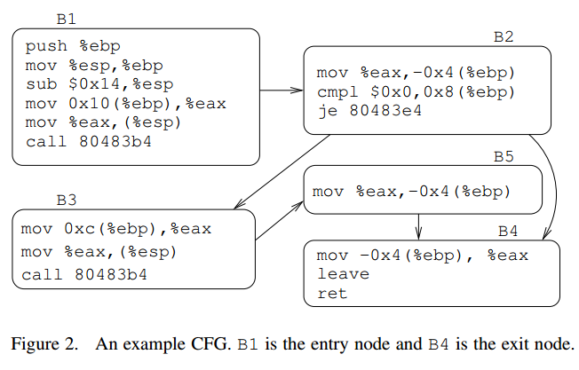

## Binary Function Clustering using Semantic Hashes

### Background

* EHASH  最简单的hash方法，对函数中每条指令的二进制串计算MD5
* PHASH  上述方法的改进，由于每次编译后地址不一定相同，因此PHASH直接将地址引用置0后再计算MD5

MinHash是一种对局部变化敏感的哈希算法，假设待比较的内容为集合A和B，MinHash即二者的Jaccard Index
$$
JI(A, B) = \frac{|A \cap B|}{|A \cup B|}
$$

### Approach

#### Semantic Hash

这里按照basic block切分指令后构造MinHash，构造方式如下

* 反汇编函数f，并构造CFG(f)

* 定义BB(f)为CFG(f)中的每个basic block，令 $\Phi(b)$ 表示将一个basic block哈希为一个字符串，而 $\Phi(f)= \{ \Phi(b) | b \in BB(f) \}$ 表示f中所有basic block的哈希集合，则函数f的哈希定义为
  $$
  H(f) = MinHash( \Phi(f) )
  $$

下面将设计 $\Phi(b)$ ，这里被称为BBHash，即计算basic block哈希的函数，设计要求如下

* 若b1 b2的**输入输出**（下面将详细讨论）是等价的，则有很高的概率有 $\Phi(b_1) = \Phi(b_2)$ 
* 若两个函数中有很多的basic block的BBHash相等，则两个函数相似度很高

#### Input-Output Behavior of Basic Blocks

由上可知，BBHash的设计是基于basic block的输入输出特性定义的。主要分为下面几个指标

* b执行后对于寄存器的影响
* b执行后对于内存的影响
* b的末尾若是call，其传入的参数
* b的末尾若是条件跳转，其依赖的条件

这里使用一个例子对几个指标进行解释

##### 对寄存器的影响

令regval(b,r)表示basic block b执行后对寄存器r的影响，则对于B1，有
$$
regval(b, esp) \triangleq esp - 24
\\
regval(b, ebp) \triangleq esp - 4
\\
regval(b, eax) \triangleq M[esp+12]
$$
注意这里等式右边的esp是进入b之前的esp，因此对esp的影响是esp=esp-24，因为 `push ebp; sub esp 0x14;` 两条指令影响了esp

##### 对内存的影响

令mem(b) = {(a1, v1), ... , (an, vn)} 表示一系列被b影响的地址和值，则对于B1，有
$$
mem(b) \triangleq \{ (esp-24, M[esp+12]) \}
$$

##### 函数调用

令p1(b) ... pk(b)表示各个函数参数，则对于B3，有
$$
p_1(b) \triangleq M[ebp+12]
$$

##### 条件跳转

令brcond(b)表示条件跳转的约束式，则对于B2，有
$$
brcond(b) \triangleq M[ebp+8] = 0
$$

#### Sampling-Based Basic Block Hash

