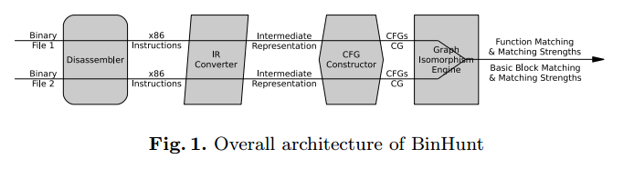

## BinHunt: Automatically Finding Semantic Differences in Binary Programs

### 系统架构



整个流程比较清晰，分为下面几个步骤

#### 反汇编器

不解释

#### 中间语言

先翻译为side-effect free的中间语言，有如下几个优点

* 使得basic block的比较更加简单可靠，且可以从一定程度上减少由汇编语言的多变性带来的差异，如两段功能相同，但使用不同x86指令实现的代码，翻译成IR后可能相似度会很高
* 使得控制流分析更简单也更具扩展性

#### 构造CFG和CG

由于CFG和CG对于一些编译器优化，如指令重排、寄存器重分配等不敏感，因此BinHunt基于CFG和CG来识别相似函数

#### CG和CFG的比较

由于CG和CFG都是图的结构，因此比较两个CFG和CG的相似性可以被归结为最大公共同构子图（maximum common subgraph isomorphism）的问题。若找到公共同构子图，则两个CFG的对应节点（即对应的basic block）将被配对。最大公共同构子图问题是一个NP完全的问题，因此下面会介绍一些优化的方法来提升效率

### Basic Block比较

basic block比较是比较重要的，因为

* 它提升了图同构算法的性能。因为对于图同构算法来说，若能先尝试最佳匹配的节点，则算法效率将更高。而basic block比较可以帮助算法更精确地找到等价的basic block（也即子图中等价的node）
* 可以借助比较算法找到匹配的函数在语义上的差别

#### 符号执行和定理证明

首先找到每个**basic block**的输入和输出寄存器、变量，并通过符号执行来找到输出与输入对应的表达式。由于这里只处理basic block，所以效率很高。此后使用STP对两个basic block中解析出的表达式的等价性进行证明。

这里还有一个小问题，即在比较两个basic block表达式时，因为输入输出的寄存器和变量可能不同，因此需要保证basic block A的每个输入输出对在被比较的basic block B上都有相应的输入输出对，这里解决的方法也很简单，直接尝试所有的排列。若存在完全对应的排列，则说明两个basic block是等价的。

这种方法也存在一个问题，即可能有些函数可能在basic block级别的语义不同，但两个函数的语义是相同的（比如使用不同算法来实现同一个功能，具体的例子可以见BinSim）

#### Matching Strength

对于两个basic block，匹配度可能有下面的值

* 1.0  两个basic block完全相同
* 0.9  两个basic block语义相同但不一定使用了相同的寄存器
* 其他情况会给出更小的值

对于寄存器的处理主要是因为很多时候basic block的语义可能相同，但上下文可能不同，而上下文的不同可能会影响basic block间整体的语义（具体的例子也可以见BinSim），因此应该给一个较小的匹配度

### 最大公共同构诱导子图 Maximum Common Induced Subgraph Isomorphism

公共子图同构的最佳算法基于关联图中的最大团检测。 然而，精确子图同构问题是公共子图同构的一种特殊情况，要求生成的公共子图与输入图之一重合，通过回溯算法可以更有效地解决。

在BinHunt的场景下，两个进行比对的程序通常是同一个程序的不同版本，因此大多数CFG和CG的子图是很类似的。因此这里使用了一个回溯算法来求解

#### 问题定义

$$
给定图 G=[V, E]，当且仅当图 H=[W, F] 满足 W \subseteq V 且 F = E \cap (W \times W)，则称H为G的诱导子图
\\
（这里诱导子图其实概念很简单，就是G去掉一些顶点和以这些顶点为端点的边即为诱导子图）
\\
（也就是说诱导子图实际是G保留部分顶点W以及这些顶点对应的边F构成的子图）
$$

下面定义最大公共同构诱导子图问题，即在G中找到一个最大诱导子图，其需要与H的一个诱导子图同构。

#### 回溯算法

假设要比较的图是G=(V, E)和H=(W, F)，则算法的输入D为要比较的节点对（初始为 $V \times W$ ），M则保存当前找到的局部公共诱导子图的节点对（初始为空）

```
Isomorphism(D, M)
	if Extendable(D, M) then			// 检查当前的诱导子图是否能继续扩展
		v = PickAny(D)					// 若能继续扩展，则从D中取出一个待扩展的节点对
		Z = GetPossibleMatching(v, D)	// 从D中取出所有可能的节点对（这里我的理解就是取出所有与v构成节点对的节点）
		for all w in Z do
			M' = M + [v, w]				// 试着将新的节点对 [v, w] 作为局部公共诱导子图加入
			D' = Refine(v, w, D)		// 将[v, w]和其余不可能作为新的诱导子图扩展节点的节点对移除
			Isomorphism(D', M')			// 对新的扩展后的诱导子图进行递归
		end for
		D' = Refine(v, null, D)			// 上面的操作是尝试找到包含节点v的最大公共诱导子图，而这里则是尝试寻找没有节点v时的最大公共诱导子图
		Isomorphism(D', M)
	end if
```

* Extendable  这里其实函数做了一个假设，即D中的所有unmatched的节点均可以被扩展。这是一种最优的假设（因为若所有unmatched的节点均能被扩展则当前的诱导子图将是最大的），若该最优假设不优于当前的最好结果（即之前找到的最大公共诱导子图），则返回false

* Refine  假设节点对 [v, w] 加入公共诱导子图的情况下更新D（即待扩展节点），主要的更新规则如下

  * [v, w]肯定要被移除

  * 在诱导子图加入 [v, w] 后，不可能继续加入诱导子图的节点对

    如图G中v'是v的一个相邻节点，图H中w'不是w的相邻节点，则[v', w']应该被从D中移除。这是因为按照公共诱导子图的定义，节点对[v', w']显然不是匹配的节点

#### 回溯算法的一些改进

##### Matching strength and subgraph measurement

一般上述回溯算法处理的是节点被染色后的图，只有具有相同颜色的节点才会被配对。而在处理CFG和CG时没有染色，因为图A的每个节点都可能与图B的一个节点匹配。

而为了区分哪些节点间的匹配程度更高

* 对于CFG而言，每个节点都是basic block，所以使用先前介绍过其使用的 [Matching Strength](#Matching Strength) 算法；
* 对于CG，每个节点都是一个函数，所以使用下述算法
  * 1.0  若两个函数在语法层面上都完全相同
  * 该函数对应的CFG中所有匹配节点的matching strength之和除以CFG的节点总数（这里取两个CFG图中节点较少的那个）

##### Customizations to improve efficiency

* Extendable函数  若算法能优先找到好的节点匹配，则该算法性能将极大地提升，因为若能在算法初期就找到一个较优解，Extendable将更多地返回false，这意味着可以探索更少的路径
* PickAny函数  如上所述，为了较早地达到较优解，PickAny将尽量返回匹配度高的节点，对于BinHunt来说即matching strength较高的节点；此外PickAny还会考虑节点的连接性，在matching strength相同的情况下，有较多连接的节点将被优先返回

##### Timeout and output of the backtracking algorithm  

即使上面改进了算法，在有些情况下匹配速度仍然过慢，因此引入了timeout机制。这种机制仅在处理CG时使用，当时间到了以后，CG的matching strength将被赋为一个默认值。

算法的返回值主要有几个部分

* 两个程序匹配的函数
* 匹配的函数中匹配的basic block
* 函数和basic block的matching strength