## BinSim: Trace-based Semantic Binary Diffing via System Call Sliced Segment Equivalence Checking

### Motivation and Overview

#### Motivation

这里列出了当前比较semantic similarity的binary diffing方法的几个局限性

##### 1

下面的这个例子针对的是只基于动态分析与行为检测进行比较的方法（如对比system call序列、对比数据依赖图等），因为如d所示，上述三段代码拥有相同的system call sequence和数据依赖。但实际上代码b有一个取绝对值的行为，这使得其在语义上与a和c不同。因此b与a c实际上是**条件等价（conditionally equivalent）**的，但难以被动态分析与行为检测的方法发现

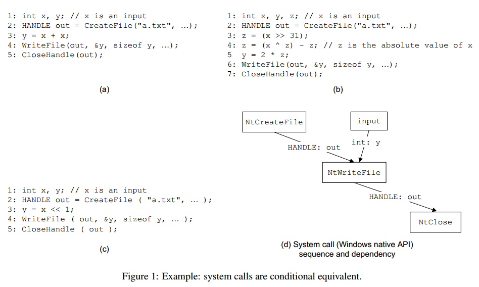

##### 2

另一种常用的检测语义相似性的方法是使用符号执行。目前使用符号执行方法比较语义相似性最常用的做法就是对两段代码的各个basic block的语义等价性进行匹配。这种方法对于只含有单条执行路径的basic block（只有一个入口和一个出口，不存在路径爆炸的问题）。但该方法对于更大范围的代码，如函数，存在两个挑战：

* 在一个去除符号表的二进制文件中区分函数的边界
* 即便对于较小规模的代码量仍存在性能问题

这种方法对于含有混淆的basic block是有效的，如下例所示，即使两段代码在语法上完全不同，但使用符号执行解析出的表达式可以使用STP证明其数学等价性。

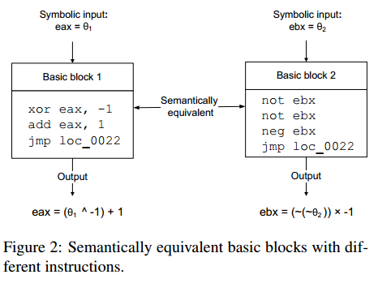

但目前使用符号执行验证等价性的做法通常不能处理跨basic block的情况，即目前的实现通常只在basic block的粒度上做等价性。不能处理如下例的情况。这里展示的三个函数都是用于计算输入n有几个位为1。下面展示了这三个函数编译出的CFG，由于目前大多数实现都是基于basic block匹配来验证语义等价性，因此无法验证下例三个函数是语义等价的

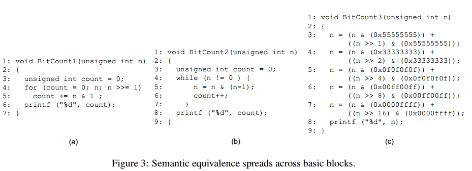

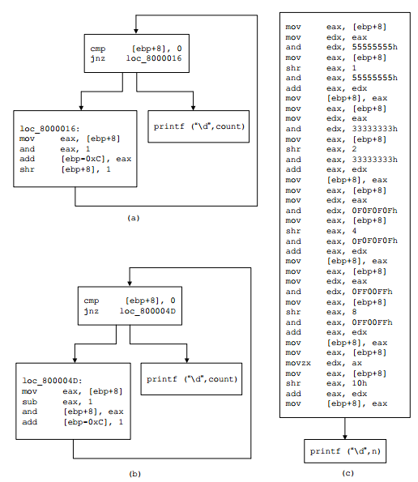

##### 3

上面的例子展现的是使用符号执行基于匹配basic block语义的方法无法识别等价函数的情况，下面的例子展现的则是两段语义不同的代码被该方法识别为等价的情况。同样是由于跨basic block导致的问题

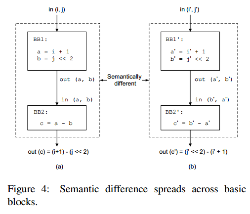

对于上述情况，匹配算法会认为BB1与BB1'语义相同，BB2与BB2'语义相同，这是因为这种匹配方式不考虑变量在basic block间的传播，因此导致c=a-b与c'=b'-a'被认为是等价的。

##### 总结

从上述几个例子来看，目前基于basic block识别语义等价性的方法存在下列几个问题

* 如 [3](#3) 所示，basic block间缺少上下文信息
* 一些编译器优化选项，如循环展开、函数内联，将改变basic block的形式
* 基于返回导向编程（ROP）的混淆会形成一系列小的basic block，因此这种混淆将轻易地使该方法失效
* covert computation（隐蔽计算）可以通过指令的副作用将指令的语义隐藏在一系列basic block中
* 如 [2](#2) 所示，无法处理同一个算法的不同实现
* 无法处理如不透明谓词、控制流平坦化等混淆
* 如vmp中的decode-dispatch循环生成了一系列basic block来模拟opcode，这种情况也会使该方法失效

#### Methodology

##### BinSim的工作流程

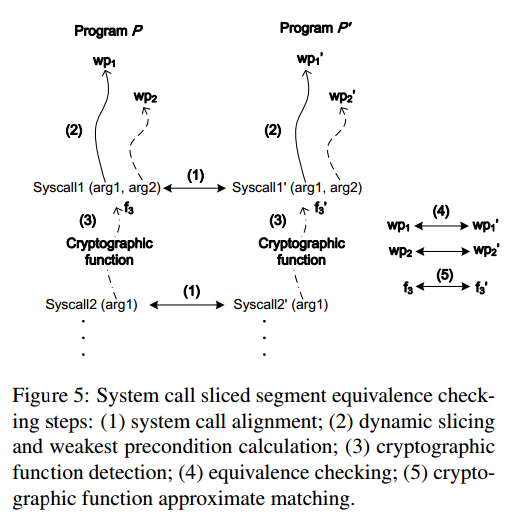

* 在同样的输入和环境下运行程序P和程序P'，并收集trace和系统调用序列。此后进行一次系统调用的对齐（alignment）来对两个程序执行相同系统调用的时机进行匹配。
* 在trace上对匹配到的系统调用的参数相关的指令进行反向切片，这里包括对参数有直接影响的（如数据流），也包括间接影响的（如控制流）。然后对切片计算weakest precondition（在后文提及）
* 这一步处理一种特殊情况：一些密码学相关的函数容易产生复杂的符号表达式，并且难以求解。因此这里需要识别密码学函数并且将其排除
* 使用STP求解两个系列的weakest precondition（WP）表达式是否等价
* 对所有匹配的系统调用的参数进行上述操作，最后计算相似度

##### BinSim对上述几个场景的应用

对于第一个例子


如果对系统调用NtWriteFile进行反向切片并计算参数y的WP，三个函数的计算结果如下

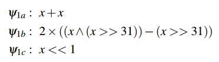

STP求解器将求解得到式1a和1c是等价的，而和1b不等价。因此我们可以得到1a和1c是匹配的，而1a和1b是条件等价的


对于第二和第三个例子，BinSim会使用相同的输入n来提取trace。因为使用了一个固定的输入来提取trace，所以实际上得到的trace更像一个循环展开的程序，因此使用WP提取表达式后可以获取到函数的语义

#### Architecture

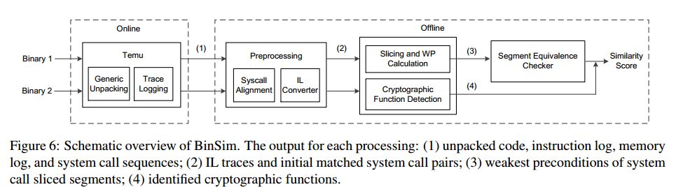

上述架构图描述的即 [Methodology](#Methodology) 中的工作流程

### On-demand Trace Logging

BinSim中使用Temu来记录trace，trace主要包含下列几个数据

* 执行过的每条指令和操作数的值
* 内存的读写地址
* 执行的system call和数据流依赖

trace数据并不是完全有用，如大多数符号执行程序都会做“function summary”优化，将一些易于识别的库函数的符号执行表达式直接优化成固定的表达式。此外，对于加壳的程序，这里使用了一个类似hidden code extractor（见感兴趣的文章第二项）的程序来记录解壳后的trace（这里应该是可以过滤掉解壳过程本身的trace）


一种针对BinSim方法的攻击就是故意加入无关的system call从而污染system call序列。因此BinSim使用了Temu的multi-tag taint tracking来跟踪system call间的数据流依赖。因为system call的参数主要来源于下面三种

* 前一个system call的输出
* 初始化过的数据段
* 立即数

因此除立即数外，BinSim为前两者打上了污点标签，以此来过滤掉不存在数据依赖的system call，而被打上污点的system call参数将作为后续反向切片算法的起点


此外BinSim还考虑了参数的语义，如NtClose函数的参数应该是一个打开的文件句柄，因此如 `xor eax, eax; NtClose(eax);` 的程序会被过滤。

BinSim可能面临的另一个挑战是，恶意软件可能会通过多个不同的系统调用来实现与某个系统调用相同的功能，被称为 replacement attack。可能的缓解措施将在 [Discussion](#Discussion) 中讨论

### Offline Analysis

#### Preprocessing

在预处理时，BinSim将汇编转换为Vine IL，这种IL的好处在于其没有副作用，因此指令对于如eflags的修改都是显式的，这可以方便ROP代码的处理。

系统调用对齐的算法在引文[34 76 65]中已经被详细讨论过了。BinSim中使用的系统调用对齐算法扩展自[34] MalGene算法，并扩展了关键系统调用的范围。这是因为原始的MalGene针对的场景是采集同一个程序在不同运行环境下的系统调用，对于这种场景来说，关键系统调用主要指进程和线程操作相关的函数。而BinSim针对的是识别恶意软件的变种，因此将关键系统调用扩展到了一些重要的系统相关操作等。

下图列出了部分重要的系统调用

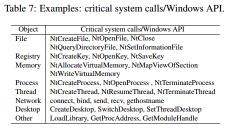

#### Dynamic Slicing Binary Code

反向切片算法的起点主要是以下几种

* 先前其他系统调用的返回值
* 常量
* 从数据段读取的值

标准的动态切片算法基于program dependence graph（PDG），这种切片算法既追踪数据流，也追踪控制流。但在混淆的代码中，由于使用了大量间接跳转，加上一些如vmp的混淆包含了decode-dispatch循环，这将极大地污染切片结果，使得切片算法追踪到大量无关指令

因此BinSim将数据依赖与控制依赖分离，并将算法分为以下三步

* 只考虑数据流的index based和value based切片算法
* 跟踪控制依赖
* 将由虚拟化混淆引入的fake control dependencies去除

##### Index and Value Based Slicing

这部分跟踪数据流依赖

首先使用"use-def chain(ud-chain)"来记录数据依赖的trace。但使用传统的ud-chain方法处理间接跳转时可能存在精度损失。有两种在间接跳转时追踪ud-chain的方法

* index based  对于形如 `mov edx, [eax*4+4]` 的指令，会将影响index的寄存器eax加入跟踪
* value based  对于形如 `mov edx, [eax*4+4]` 的指令，会将 `[eax*4+4]` 对应的实际内存地址加入跟踪

index based切片算法有一个技术细节需要注意：当间接内存访问的内容是一个jump table中的地址时，由于jump table肯定不会被写入，因此不需要被追踪。识别被访问内容为jump table的方法是：一般jump table存储在只读数据段或代码段


下面是两者对于同一段代码产生的不同切片

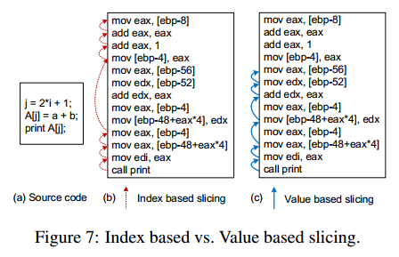

对于b的反向切片，以mov edi, eax作为第一条，下面描述污点传播的路径

```
edi -> eax				{ eax }
eax -> [ebp-48+eax*4]	 { eax }
eax -> [ebp-4]			{ [ebp-4] }
[ebp-4] -> eax			{ eax }
eax -> eax				{ eax }		// add eax, 1
eax -> eax				{ eax }		// add eax, eax
eax -> [ebp-8]			{ [ebp-8] }
```

由上面的例子可以得到index based切片算法的几个要点（这些是根据上例推测出的）

* 应该只有寻址时作为index的通用寄存器会被打上污点，因此在 `mov eax, [ebp-48+eax*4]` 中，应该只有eax被打上污点

* index based切片算法对于内存的处理中，应该只有在使用通用寄存器作为index寻址时才会与value based方法产生区别

  而处理类似 `mov eax, [ebp-4]` 的指令时，`[ebp-4]` 同样会被加入污点列表中


对于c的反向切片，如下

```
edi -> eax				{ eax }
eax -> [ebp-48+eax*4]	 { [ebp-48+eax*4] }
[ebp-48+eax*4] -> edx	 { edx }
edx -> eax				{ edx, eax }  // add edx, eax
edx -> [ebp-52]			{ [ebp-52], eax }
eax -> [ebp-56]			{ [ebp-52], [ebp-56] }
```

* 与index based方法相比，差别就在于处理形如 `ebp-48+eax*4` 的寻址时，value based将地址 `ebp-48+eax*4` 本身加入污点列表，而index based将index寄存器 `eax` 加入污点列表


由汇编可以看出，index based算法追踪了 `j = 2*i+1; print A[j]` 两条语句（这里也体现了index based的含义，其追踪了内存寻址的下标），而value based算法追踪了 `A[j] = a+b; print A[j]` 两条语句（这里也体现了value based的含义，其追踪了A[j]的值是如何被计算的）

[问题1](#问题1)

##### Tracking Control Dependency

这部分跟踪控制流依赖

除了正常的条件跳转语句，混淆后的程序常使用将条件跳转编码为间接跳转来实现，一般使用间接跳转实现条件跳转的原理是将一个跳转操作拆分成多个，如先修改eflags寄存器，再根据结果计算间接跳转地址。因此BinSim通过跟踪对eflags有修改的语句来实现对这类型跳转的追踪。

此外还有一些x86指令本身包含条件跳转的语义，如 `cmovne ebx, edx` ，以及不依据eflags的条件跳转，如 `jecxz` 等。类似指令如下表，BinSim对这些指令做了特殊处理

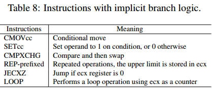

##### Dispatcher Identification

这部分去除trace中与decode-dispatch loop相关的内容

这里主要通过下列特征识别

* 由一系列内存操作构成，最后是一个间接跳转
* 有一个输入寄存器作为获取下一个字节码的虚拟程序指针（VPC），如VMP使用esi，CV使用al
* 最后的间接跳转会指向一个字节码handler的表，且这个表的索引与VPC存在数据依赖

BinSim先按照上述规则对反向切片的trace中可能的decode-dispatch loop进行识别。对于每段以间接跳转结尾的指令序列，将其输入寄存器标记为a1 a2 ... an，并将输出寄存器标记为 b1 b2 ... bn。此后使用下列启发式算法进行检查

* bi 是否被 `ptr[aj]` 地址处的值污染
* 最后的间接跳转地址是否为 `[bi * (table stride) + table base]`

#### Handling Cryptographic Functions

首先做一个stitched symbolic execution（文中说这里参考了[感兴趣的文章](#感兴趣的文章)5的做法）。先对切片的部分做一个前向符号执行来在两个system call间识别可能的密码学函数，其中识别算法见[感兴趣的文章](#感兴趣的文章)4。若识别到了则不会生成符号表达式

#### Weakest Precondition Calculation

假设我们获取的切片为S，其中包含一系列指令 [I1, I2, ..., In]

该算法以S为输入，先验条件P为：当一个API被调用时，程序的执行状态。那么就可以通过P和In计算程序的上一个执行状态P(n-1)，即
$$
\begin{aligned}
wp(i_n, P) &= P_{n-1}
\\
wp(i_{n-1}, P_{n-1}) &= P_{n-2}
\\
...
\\
wp(i_1, P_1) &= P_0
\end{aligned}
$$
因此，weakest precondition定义为 $wp(S, P) = P_0$ ，含义为程序从起始状态P0出发，经过与S相同的指令后，可以到达一个满足P的状态

因此得到的条件表达式即为上述各个谓词累积的集合，即
$$
WP = F_1 \land F_2 \land ... \land F_k
$$
一个例外情况是使用Opaque predicate混淆的控制流，可能导致WP的公式十分的长。这里使用了opaque混淆的识别方法来消除这个问题

#### Segment Equivalence Checking

这里通过比较参数的Weakest Precondition（WP）是否等价来判定两个system call是否等价。

测试BinSim性能的两个主要指标

* 精度  衡量BinSim识别不同样本的效率
* 召回率  衡量BinSim识别同一个样本使用不同混淆方法时的效率

##### similarity score

该指标应同时反映精度和召回率

对于每个对齐的system call，根据不同的等价性有下面三种相似度分数

* 1.0  表示两个程序对齐的system call的各个参数都是等价的，BinSim认为两个程序语义相同
* 0.7  表示两个程序对齐的system call的各个参数对应了相同的密码学函数，因此采用一个较低的分数表示两者近似等价
* 0.5  表示两个程序对齐的system call的各个参数不满足上述两个条件，且是不等价的或是条件等价的

假设从程序a和b中收集到的system call序列分别为Ta和Tb，且对齐的system call个数为n，定义相似度分数如下
$$
Sim(a, b) = \frac{ \sum_{i=1}^n Similarity \ Score }{Avg\{ |T_a|, |T_b| \}}
$$
其中Similarity Score即每个system call对应的相似度分数

### Experimental Evaluation

#### Comparative Evaluation Results

这里BinSim与各个其他相似性检测工具做了横向对比来测试不同工具对于代码混淆的适应性，但由于各个工具计算相似性分数的算法并不相同，因此BinSim采用了一个比较巧妙的对比方法：

这种对比方式基于一个思想，相似性分数对于相同的代码（right pair）和不同代码（wrong pair）应该具有一定的区分度，即二者的差别应该较大

* 首先得到各个工具对于混淆前代码的相似性分数
  * 测试各个工具对于完全相同的代码所输出的分数的平均值，即输入两个完全相同的二进制进行对比
  * 测试各个工具对于完全不同的代码所输出的分数的平均值，即输入两个不同的样本进行对比
* 再得到各个工具对于混淆后代码的相似度分数
  * 测试各个工具对于混淆后的代码相对混淆前的代码输出的分数的平均值

这样对于每个工具就可以得到两组对比数据：

* right pair  VS  wrong pair
* right pair  VS  obfuscation pair

因此可以通过对比这两组数据的大小来证明工具是否将混淆后的程序视为wrong pair


对于table3，主要可以看最后两行，倒数第一行代表 right pair 和 wrong pair 的分差，倒数第二行代表 right pair 和 obfuscation pair 的分差。分差越大说明区分度越大，因此若 right pair 和 obfuscation pair 的分差足够大，说明该工具不能处理这种混淆，因为其认为混淆前与混淆后的程序相似度很低

### Discussion

BinSim首先面临的问题与大多数动态分析工具一样

* 路径覆盖率的问题
* 可以检测沙箱环境的恶意软件

此外还有几个可能面临的问题

* BinSim使用的通用脱壳器可能无法应对如并行加壳、多层次加壳等高级的加壳方法
* 近来的一种称为 replacement attacks 的可以在不改变语义的前提下改变系统调用的序列，从而影响BinSim的识别准确度

可能的解决方案

* 使用自动输入生成的技术提高路径覆盖率
* 使用如VM-Ray的透明沙箱
* 对通用脱壳器进行进一步改进以适应更高级的加壳方法
* 在BinSim前加入一个中间层来识别这种使用 replacement attacks 的方法


### 问题

#### 问题1

[Index and Value Based Slicing](#Index and Value Based Slicing) 中对两者区别的理解是否正确


### 感兴趣的文章

* 使用一系列指令隐藏一些指令的副作用

   SCHRITTWIESER, S., KATZENBEISSER, S., KIESEBERG, P., HUBER, M., LEITHNER, M., MULAZZANI, M., AND WEIPPL, E. Covert Computation: Hiding code in code for obfuscation purposes. In Proceedings of the 8th ACM SIGSAC Symposium on Information, Computer and Communications Security (ASIACCS’13) (2013).

* 与BinSim采用类似的trace方法

  KANG, M. G., POOSANKAM, P., AND YIN, H. Renovo: A hidden code extractor for packed executables. In Proceedings of the 2007 ACM Workshop on Recurring Malcode (WORM ’07) (2007)  

* deobfuscator

  COOGAN, K., LU, G., AND DEBRAY, S. Deobfuscation of virtualization-obfuscated software. In Proceedings of the 18th ACM Conference on Computer and Communications Security (CCS’11) (2011)  

* 密码学函数识别

  GROBERT ¨ , F., WILLEMS, C., AND HOLZ, T. Automated identification of cryptographic primitives in binary programs. In Proceedings of the 14th International Conference on Recent Advances in Intrusion Detection (RAID’11) (2011)

* 用在BinSim中处理密码学函数相关时的符号执行方法中

  CABALLERO, J., POOSANKAM, P., MCCAMANT, S., BABI C´ , D., AND SONG, D. Input generation via decomposition and re-stitching: Finding bugs in malware. In Proceedings of the 17th ACM Conference on Computer and Communications Security (CCS’10) (2010).

* iBinHunt

  MING, J., PAN, M., AND GAO, D. iBinHunt: Binary hunting with inter-procedural control flow. In Proceedings of the 15th Annual International Conference on Information Security and Cryptology (ICISC’12) (2012)

* CoP

  LUO, L., MING, J., WU, D., LIU, P., AND ZHU, S. Semanticsbased obfuscation-resilient binary code similarity comparison with applications to software plagiarism detection. In Proceedings of the 22nd ACM SIGSOFT International Symposium on Foundations of Software Engineering (FSE’14) (2014)

* Opaque predicate  一种控制流混淆方式

  COLLBERG, C., THOMBORSON, C., AND LOW, D. A taxonomy of obfuscating transformations. Tech. rep., The University
  of Auckland, 1997  

* Opaque识别的方法

  MING, J., XU, D., WANG, L., AND WU, D. LOOP: Logicoriented opaque predicates detection in obfuscated binary code.
  In Proceedings of the 22nd ACM Conference on Computer and Communications Securit (CCS’15) (2015).

* Weakest Precondition提出

   DIJKSTRA, E. W. A Discipline of Programming, 1st ed. Prentice Hall PTR, 1997

* 与BinSim类似使用动态切片和WP比较

  BRUMLEY, D., CABALLERO, J., LIANG, Z., NEWSOME, J., AND SONG, D. Towards automatic discovery of deviations in binary implementations with applications to error detection and fingerprint generation. In Proceedings of the 16th USENIX Security Symposium (2007)

### 一些可以注意的点

BinSim的测试集包含一个通用的benchmark

*  YADEGARI, B., JOHANNESMEYER, B., WHITELY, B., AND DEBRAY, S. A generic approach to automatic deobfuscation of executable code. In Proceedings of the 36th IEEE Symposium on Security and Privacy (S&P’15) (2015).