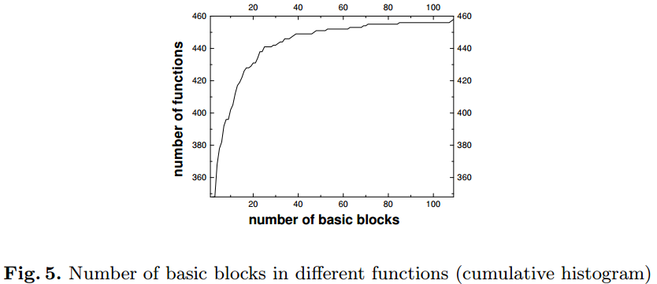
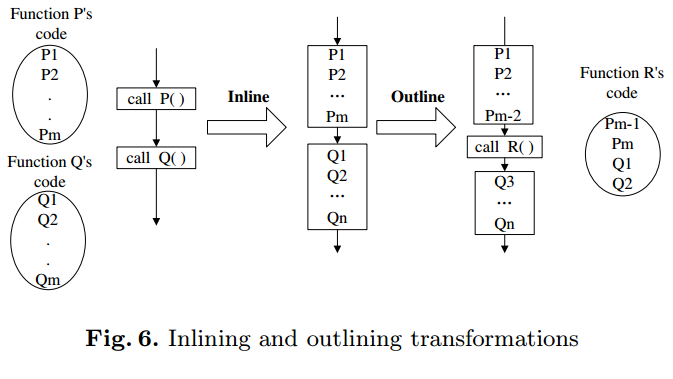
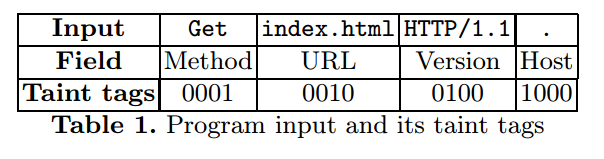
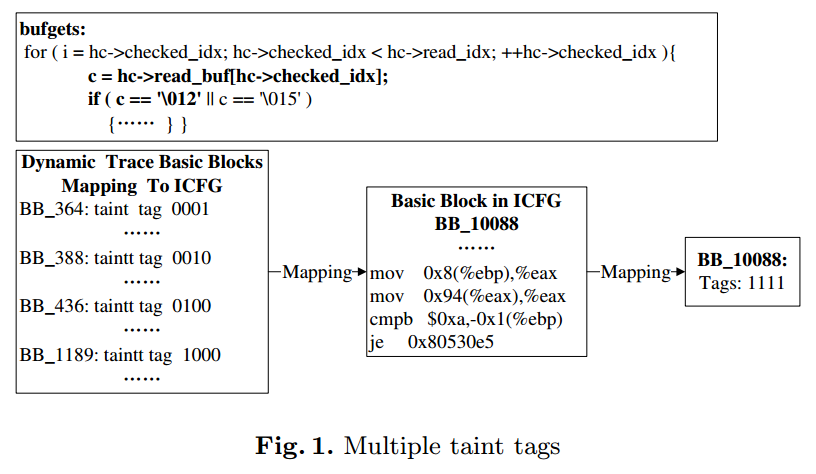
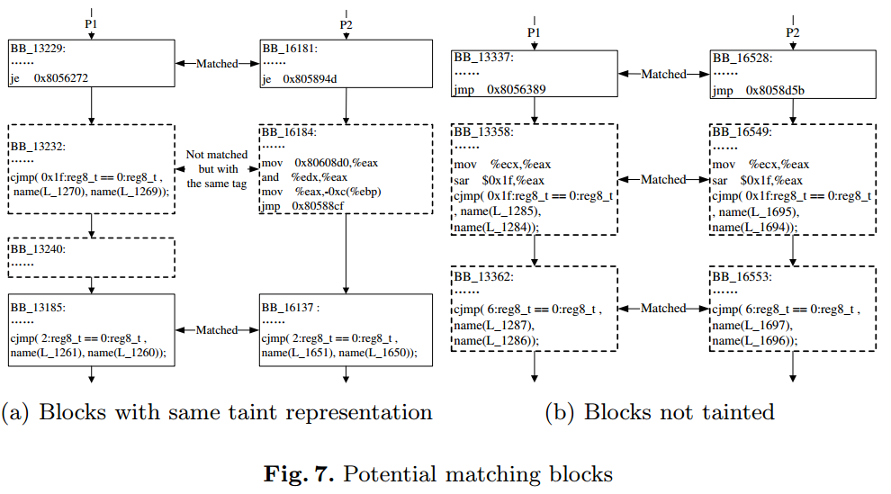
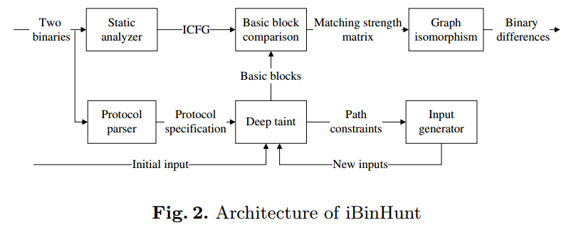
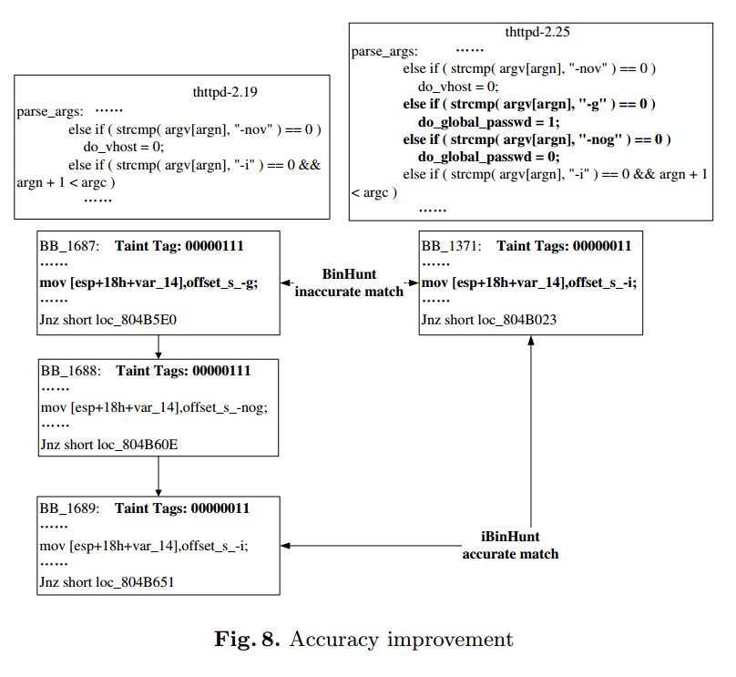

## iBinHunt: Binary Hunting with Inter-Procedural Control Flow

### Existing binary diffing tools and function obfuscation 

#### Function obfuscation



这里讨论了基于basic block的同构子图算法的有效性。因为该算法是NP完全的，所以理论上只对于规模较小的图是可行的。而图中展示了thttpd各个函数的basic block数目，可以看到大多数函数的basic block数目都在40个以下，因此上述算法在实际使用中可行

但很多时候函数边界的信息可能被各种函数混淆技术打乱，如

* Inlining functions  内联函数，将函数展开
* Outlining functions  与内联相反，将一系列指令打包成一个函数，然后调用该函数
* Cloning functions  将同一个函数克隆并赋予不同名字，使其看起来像是不同的函数
* Interleaving functions  将多个函数体混合成一个函数f，所有对这些函数的调用都会被改变为直接调用f

其中function inlining和outlining对于同构子图算法影响最大，如下图所示，这两个混淆技术会极大地影响混淆前后的basic block内的内容



### Diffing binary programs with inter-procedural control-flow graphs 
解决上述问题的一个最简单的思路就是将函数间的调用也视为简单的控制流转移，这样整个程序可以做成一张控制流图，被称为ICFG（Inter-procedural control-flow graph）

但上述解决方式存在几个问题，首先因为是对整个程序的所有basic block进行比较，所以可能basic block会匹配到多个来自其他不匹配函数的basic block，而因为这种方法不使用函数信息，因此这些匹配不好被区分。此外，ICFG会使得图的节点比CFG多得多，这将导致同构子图算法的执行效率很低

#### Overview of iBinHunt

为了减少上述ICFG方法的basic block数，iBinHunt引入了deep taint算法。先使用相同的输入运行两个程序，得到trace，并使用污点分析的方法分析受输入影响的basic block，以此减少待比较的basic block数。此外为了提高路径覆盖率，这里使用了自动输入生成的技术

##### Deep taint for basic block comparison

###### Deep taint

普通的污点分析算法一般把污点源视为一个流，因此会将所有的输入打上同一个污点tag。

deep taint算法进行了进一步改进，其对各个不同的输入部分打了tag，在进行污点分析时会根据追踪的污点的tag来给新的污点分配tag。而两个程序中只有被打上同样tag的basic block会被进行比较。

论文中给出了一个deep taint算法在追踪http请求时的例子 [问题1](#问题1)



每个输入部分的taint tag使用1位表示，因此同一条指令可以被多个污点源污染

下面展示了同一条指令被多个污点源污染的例子



在trace中，这里的循环实际上是被展开的，图中展示了四次循环，分别对应左图的四个BB。因为checked_idx每次都会自增1，因此每次循环影响的taint tag都不一样。而循环对应的实际BB_10088最终的taint tag即为1111（即表示四个污点源都传播到了这个basic block）

###### basic block comparison

basic block比较方面，iBinHunt使用了与BinHunt一样的算法（即使用符号执行对比basic block的语义，再使用最大同构子图算法匹配对应的节点）。由于使用了污点分析，因此可以达到比较高的效率

此外，iBinHunt还注意到两种块

* 语法上不相似，但在污点分析结果（taint representation）中相似。这种块可能就是两个版本的程序中patch的地方
* 没有被打上污点，但在trace中的指令块。虽然没被打污点，但因为在同一个输入的trace中因此匹配的概率也很高。这种块没被打污点的可能性有很多，如污点传播规则中为了防止污点过多使用了一些限制，或是因为程序输入不是被直接处理的（如通过signal处理）。

这里的一个例子如下，是thttpd的两个版本



a的例子展示了语法不相似但污点分析结果相似，这里确实对应了两个版本的改动之处

b的例子展示了3个没有被打上污点但应该匹配的basic block，这里是因为该函数（tmr_create，看上去是创建timer）做了一些简单是时间相关的操作因此没有被打上污点

###### Matching strength

Binhunt中定义了一个matching strength，并根据阈值来确定两个basic block是否相似。但在iBinHunt中使用了另一种方式，原因为

* iBinHunt更强调使用basic block中的控制流结构信息来比较，而非其中的指令（[问题2](#问题2)）
* 这里的阈值很难确定

因此iBinHunt使用下列规则来比较两个basic block是否等价

* 前提：两个basic block的污点分析结果（taint representation）相同（这里也可能是两个块都没有被打上污点）
* 下面三个条件是或的关系
  * 两个块语义等价
  * 两个块的前驱块是匹配的
  * 两个块的后继块是匹配的

##### Automatic generation of program inputs

这里使用了二进制的White-box exploration技术（应该主要是fuzz相关的技术）。

首先收集对于一种输入的trace，然后通过对trace进行符号执行来获取每个条件跳转的约束式，此后对其中的一个约束式取非（这使得下次执行可以走到该条件跳转的另一条路径），再通过STP来求解新的约束式以得到相应输入，再进行下一轮的循环

一条执行路径中可能有很多的分支，可以通过计算某个未执行分支下面可能执行到的未覆盖的basic block数量，来选择要取反的表达式。若该未执行分支下未覆盖的basic block数量最大，则选择该条件分支的对应表达式取反，从而使下次执行能覆盖更多的basic block

### Implementation and evaluation

#### Implementation of iBinHunt



##### Static analyzer

静态分析器与BinHunt相同（IDA），使用的IR也相同（BitBlaze的IR）

##### Protocol analyzer

这里假设protocol是已知的所以并不需要Protocol analyzer，但如果需要可以使用引文中的自动化协议分析方法（所以我觉得我在[问题1](#问题1)里的猜测是正确的。。。）

##### Deep taint

使用TEMU和QEMU实现，在TEMU中使用shadow memory来存放污点状态

##### Basic block comparison

如前面所述，首先对于同一个输入，被比较的basic block的taint representation相同或是都在trace中（这里原文是 `comparison of two basic blocks from the two binary programs is carried out if they have the same taint representation and are on dynamic traces recorded given the same program input.  ` ，但根据前文的描述我觉得这个and应该是or）

比较的方法类似BinHunt，但不同之处在于BinHunt不考虑basic block间的上下文，因此即使两个basic block间语义相同但对于前驱节点传来的数据的使用顺序不同也会被认为匹配（这种例子在BinSim中有展示，下面也展示了一个最基本的例子，A和B的两个basic block语义是相同的，但整体的语义不同）。

iBinHunt由于是基于trace的，且比较的是ICFG，所以每个basic block的前驱和后继节点是确定的，这使得跨basic block的上下文关系得以保留

```c
Program A:
a = 10;
b = 20;
if(c)
    return a-b;

Program B:
a = 10;
b = 20;
if(c)
    return b-a
```

##### Graph isomorphism

与BinHunt相同

##### Difference from BinHunt

主要差别就是BinHunt基于静态分析而iBinHunt基于deep taint处理后的trace

##### Input generator

使用BitBlaze中的appreplay来收集路径约束表达式，并使用STP求解

### Evaluation

注意这张图表的各个轴，左边的纵轴是block的数量，右边的纵轴是处理的时间，下面的横轴是trace的个数，注意这里一个trace对应了1个输入，所以横轴最大为100表示input generation生成了100个输入

所以这里初看可能有点奇怪，为什么右边纵轴的起点总是不一样，原因是这个起点应该代表了处理第一次输入时探索到的block总数。而图表中阴影部分的block数量的度量应该也是以左边的纵轴来看的，如Fig3a的matched basic block，在大概73的时候到达了2342，因此matched basic block的总数应该是2342-1942=400

[问题3](#问题3)

关于iBinHunt相比BinHunt的一个优点，附录有这样一个例子



这里BinHunt无法区别BB1687和BB1689，因为在静态分析中二者的指令是一致的。但iBinHunt基于自动生成输入的动态污点分析，因此1687和1689的taint tag不一样，因此可以识别到正确的匹配

### Discussions

不足

* basic block覆盖率不能达到100%
* 污点分析面临的一些问题也被代入iBinHunt中，如control dependence（控制流依赖）  pointer indirection（间接指针）  implicit information flow evasions


### 问题

#### 问题1

这里按http协议的字段直接给不同的字段一个taint tag，但是论文中解释如何分配每个taint tag时只是提到可以使用自动化的协议分析方法来分析（并给出了几篇引文）。但这里的方法可以通用化么，对于其他如读入字符串的程序又应如何划分taint tag？

* 个人认为从下面的例子（即这里的Fig.1）来看，从实现上ibinhunt最终采用的方法可能是直接对输入的每个字节划分一个taint tag
* 此外我也想到了一个可能的实现方案来对taint tag进行合并，所谓合并，因为对于类似上述的解析HTTP协议字段，第一个字段是Method（如GET），第二个字段是URL，长度都是不固定且大于1字节的。方法如下：
  * 这个思路是基于打了同一个taint tag的数据应该是经过了同样的处理得到的，因此只需要先以每个字节为一个taint tag执行污点传播算法，再对分析后的taint tag进行对比，若出现如每条含有taint tag1的指令必然含有taint tag2的情况，则说明这两个taint tag可以被合并

#### 问题2

感觉这里的表述也不准确，因为binhunt也是主要使用每个basic block的符号语义来匹配的，虽然确实也使用了指令的信息（BinHunt中定义的matching strength为：若两个basic block语法上完全相同则为1.0，若只是语义相同则为0.9）

#### 问题3

这里说Matched basic blocks with the same taint representation的概率分别是34%以上（thttpd）和67%以上（gzip）。。。首先按前面说的流程不是只有taint representation相同的basic block才会被比较么，所以这里的matched basic block为什么会比有相同taint representation的还多？

可能的一个原因是，[Matching strength](#Matching strength) 提到了若两个basic block在trace中且都没有被打上污点（non-taint），也会被拿来比较。但也是按照 [Matching strength](#Matching strength) 的说法这里要是匹配了，应该也算在图中三条阴影里。

所以最后一个可能的解释就是：这里先使用binhunt的算法来计算Matched basic block，然后再去比较iBinHunt的结果得出这个概率（但感觉这个结果反而说明deep taint算法准确率并不高。。。


### 感兴趣的文章

*   文中提到的limitations of taint analysis to avoid taint explosion

  L. Cavallaro, P. Saxena, and R. Sekar. On the limits of information flow techniques for malware analysis and containment. In Proceedings of  the GI International Conference on Detection of Intrusions & Malware, and Vulnerability Assessment (DIMVA), 2008.  

* BitBlaze

  BitBlaze: A new approach to computer security via binary analysis  
