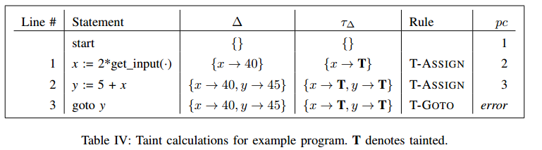
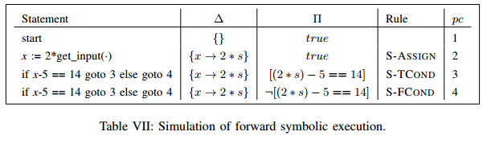

**All You Ever Wanted to Know About Dynamic Taint Analysis and Forward Symbolic Execution (but might have been afraid to ask)**

（标题太长了不直接写）

这篇是概述性的论文，首先用形式化的语言描述了符号执行和动态污点分析，然后介绍了几种实现方案

### 形式化描述语言

#### 语句描述

* program
  * stmt*
* stmt s
  * var := exp
  * store(exp, exp)
  * goto exp
  * assert exp
  * if exp then goto exp else goto exp
* exp e
  * load(exp)
  * exp $◇_b$ exp
  * $◇_u$ exp
  * var
  * get_input(src)
  * v
* $◇_b$  表示二元运算
* $◇_u$  表示一元运算
* v   表示一个32位无符号整数

##### 上下文描述

执行的上下文可以通过下列几个符号描述

* Σ   表示程序语句的集合
* µ   表示当前内存状态
* ∆   表示当前变量状态
* pc  程序计数器
* $ι$     当前指令

##### 一些语法表示

* ∆[x]  在context ∆中变量x的值
* ∆[x  ← 10]  给context ∆中的变量x赋值10
* $µ, ∆ \vdash e ⇓ v$  在context µ, ∆中，将表达式e的值赋给v

#### 使用SimpIL表示操作

下面使用SimpIL定义一些常用语句

格式为
$$
\frac{ 实际操作 }{ 影响的context \vdash 操作名 ⇓ 影响的变量 }
$$

$$
\frac{实际操作}{<当前context>, stmt \ \leadsto \  <执行后的context>,stmt'}
$$

下面的规则其实不难，横线上方表示该表达式具体的操作，横线下方表示该表达式对于context的影响


例如
$$
\frac{µ, ∆ \vdash e_1 ⇓ v_1 \ \ µ, ∆ \vdash e_2 ⇓ v_2 \ \  v' = v_1 ◇_b v_2}{µ, ∆ \vdash e_1 ◇_b e_2 ⇓ v'}
$$
上方µ ∆代表当前的内存和变量状态，所以一般都会有；e1 ⇓ v1 和 e2 ⇓ v2 表示，将表达式e1和e2分别赋值给v1和v2，最后将v1 op v2赋值给v'（这里先赋值给临时变量v1 v2主要是因为在语法规定里不能直接用表达式作为操作数，这应该主要是为了简化）。

下方µ ∆含义相同，e1 op e2是该操作的名字（也就是说，该操作显示出来是e1 op e2，中间变量v1和v2只是在具体操作中使用的）


另一种表示方法例如
$$
\frac{\mu,\Delta \vdash e \Downarrow v_1 \ \ \iota = \Sigma[v_1]}{\Sigma,\mu,\Delta,pc,goto \ e \leadsto \Sigma,\mu,\Delta,v_1,\iota}
$$
这种表示方法更为完整，记录下了所有context的变换，一般用于跳转语句等改变如pc等的表示

上方µ ∆含义相同，v1作为临时变量接受表达式e的值，并以其来访问Σ（程序语句的集合）。

下方µ ∆含义相同，左边的状态转换到右边状态的过程中，唯有pc发生了改变。

#### 各个语句的定义

##### INPUT

$$
\frac{v \ is \ input \ from \ src}{ µ, ∆ \vdash get\_input(src) ⇓ v }
$$

##### LOAD

load，从内存v1处加载一个值
$$
\frac{µ, ∆ \vdash e ⇓ v_1  \ \   v = \mu [v_1]}{ µ, ∆ \vdash load \ e ⇓ v }
$$

##### VAR

var，表示变量声明
$$
\frac{  }{ µ, ∆ \vdash var ⇓ \Delta[var] }
$$

##### UNOP

表示一元运算
$$
\frac{µ, ∆ \vdash e ⇓ v \ \ v' = ◇_uv}{µ, ∆ \vdash ◇_ue ⇓ v'}
$$

##### BINOP

表示二元运算
$$
\frac{µ, ∆ \vdash e_1 ⇓ v_1 \ \ µ, ∆ \vdash e_2 ⇓ v_2 \ \  v' = v_1 ◇_b v_2}{µ, ∆ \vdash e_1 ◇_b e_2 ⇓ v'}
$$

##### CONST

表示定义常量
$$
\frac{}{µ, ∆ \vdash v ⇓ v}
$$

##### ASSIGN

表示赋值
$$
\frac{µ, ∆ \vdash e ⇓ v \ \ \Delta^{'} = \Delta[ var \leftarrow v ] \ \ \iota = \Sigma[pc+1] }{\Sigma,\mu,\Delta,pc,var := e \leadsto \Sigma,\mu,\Delta^{'},pc+1,\iota}
$$

##### GOTO

$$
\frac{\mu,\Delta \vdash e \Downarrow v_1 \ \ \iota = \Sigma[v_1]}{\Sigma,\mu,\Delta,pc,goto \ e \leadsto \Sigma,\mu,\Delta,v_1,\iota}
$$

##### TCOND

$$
\frac{µ, ∆ \vdash e ⇓ 1 \ \ \ ∆ \vdash e_1 ⇓ v_1 \ \ \iota = \Sigma[v_1]}{\Sigma,\mu,\Delta,pc, if \ e \ then \ goto \ e_1 \ else \ goto \ e_2 \leadsto \Sigma,\mu,\Delta,v_1,\iota}
$$

##### FCOND

$$
\frac{µ, ∆ \vdash e ⇓ 0 \ \ \ ∆ \vdash e_2 ⇓ v_2 \ \ \iota = \Sigma[v_2]}{\Sigma,\mu,\Delta,pc, if \ e \ then \ goto \ e_1 \ else \ goto \ e_2 \leadsto \Sigma,\mu,\Delta,v_2,\iota}
$$

##### STORE

$$
\frac{µ, ∆ \vdash e_1 ⇓ v_1 \ \ \ µ, ∆ \vdash e_2 ⇓ v_2 \ \ \iota = \Sigma[pc+1] \ \ \ \mu^{'} = \mu[v_1 \leftarrow v_2]}{\Sigma,\mu,\Delta,pc, store(e_1, e_2) \leadsto \Sigma,\mu',\Delta,pc+1,\iota}
$$

##### ASSERT

$$
\frac{µ, ∆ \vdash e ⇓ 1 \ \ \ \iota = \Sigma[pc+1]}{\Sigma,\mu,\Delta,pc, assert(e) \leadsto \Sigma,\mu',\Delta,pc+1,\iota}
$$

#### 示例

##### 简单例子

```
x := 2 * get_input(.)
```

下面展示当get_input的输入为20时的SimpIL
$$
\frac{\frac{\frac{}{\mu,\Delta \vdash 2 \Downarrow 2} CONST \ \ \frac{20 \ is \ input}{\mu, \Delta \vdash get\_input() \Downarrow 20 } \ \  INPUT \ \ v' = 2*20}{\mu, \Delta \vdash 2*get\_input() \Downarrow 40} BINOP \ \  \Delta' = \Delta[x \leftarrow 40] \ \ \iota = \Sigma[pc+1]}{\Sigma, \mu, \Delta, pc, x := 2 * get\_input() \leadsto \Sigma, \mu, \Delta', pc+1, \iota}
$$

注意这里上方是三个IL的嵌套，分别为CONST（定义一个常量2），INPUT（接受输入），BINOP（乘法）


#### 语言的讨论

为了简化语言，这里没有考虑一些高级语言的结构，如函数和作用域等。但要为其添加对这些结构的支持是可行的，如可以有下述方案

* 可以使用编译器将高级语言的结构编译为SIMPIL的语言，如BAP BitBlaze等工具实际上已经使用了多种SIMPIL来辅助分析
* 在SIMPIL中加入高级语言结构的描述。下面的例子说明了如何扩展SIMPIL以使其支持动态的CALL RET以及SMC（self-modify-code）

##### 将SimpIL用于复杂的调用

这里通过手动压栈和加载栈上的地址实现跳转

```
esp := esp + 4
store(esp, 6)
goto 9

6: halt
9: ...    ; func
goto load(esp)
```

为了分析这种情况，需要加入新的符号

* λ    栈的状态
* ζ    函数局部变量
* φ   函数地址

$$
\frac{\mu, \Delta \vdash e_1 \Downarrow v_1 ... \mu, \Delta \vdash e_i \Downarrow v_i \ \ \Delta' = \Delta[x_1 \leftarrow v_1, ... , x_i \leftarrow v_i] \ \ pc'=\phi[f] \ \ \iota = \Sigma[pc']}{\lambda,\Sigma,\phi,\mu,\Delta,\zeta,pc,\ \ call \ f(e_1,...e_i) \leadsto (pc+1)::\lambda,\Sigma,\phi,\mu,\Delta',\Delta::\zeta,pc',\iota} \ CALL

\\
~
\\
\frac{\iota = \Sigma[pc']}{pc'::\lambda',\Sigma,\phi,\mu,\Delta,\Delta'::\zeta,pc,\ \ return \leadsto \lambda',\Sigma,\phi,\mu,\Delta',\zeta',pc',\iota} \ RET
\\
~
\\
\frac{\mu, \Delta \vdash e \Downarrow v \ \ v \notin dom(\Sigma) \ \ s = disassemble(\mu[v]) \ \ \Sigma' = \Sigma[v \leftarrow s] \ \ \iota = \Sigma'[v]}{\Sigma,\mu,\Delta,pc,\ \ jmp \ e \leadsto \Sigma',\mu,\Delta,v,\iota} \ GENCODE
$$

### 动态污点分析

* undertaint  污点跟踪的传播规则没有正确标记到需要标记的污点
* overtaint  污点跟踪的传播规则错误标记了不需要标记的污点

#### 动态污点分析语法

为了使得SIMPIL可以描述动态污点分析的传播规则，对其修改如下
$$
\begin{aligned}
taint \ \ t &= T | F
\\
value &= <v, t>
\\
~
\\
\tau_{\Delta} &= Maps \ variables \ to \ taint \ status
\\
\tau_{\mu} &= Maps \ addresses \ to \ taint \ status
\end{aligned}
$$
这里为了记录污点的状态，引入了两个记号， $\tau_{\Delta}$ 用于记录当前变量的污点状态， $\tau_{\mu}$ 一个用于记录内存的污点状态


下面的污点传播规则由两部分组成，一部分与先前SIMPIL中的规则基本相同（即被<>框起来的第一部分），一部分为污点传播规则（即被<>框起来的第二部分）

下列形式化描述语言中，P是由不同的污点传播规则指定的。这里为了方便理解，使用下文的tainted jump policy来对语言进行解释

##### T-INPUT

$$
\frac{v \ is \ input \ from \ src}{ \tau_{\Delta}, \tau_{\mu}, µ, ∆ \vdash get\_input(src) ⇓ \langle v, P_{input}(src) \rangle }
$$

污点传播规则为 P_input 因此对应的应为v打上污点

##### T-CONST

$$
\frac{}{ \tau_{\Delta}, \tau_{\mu}, µ, ∆ \vdash v ⇓ \langle v, P_{const}() \rangle }
$$

污点传播规则为P_const 因此没有什么被打上污点

##### T-VAR

$$
\frac{}{ \tau_{\Delta}, \tau_{\mu}, µ, ∆ \vdash var ⇓ \langle \Delta[var], \tau_{\Delta}[var] \rangle }
$$

为 $\Delta \ \ \tau_{\Delta}$ 加上新的变量

##### T-LOAD

$$
\frac{\tau_{\Delta}, \tau_{\mu}, µ, ∆ \vdash e ⇓ \langle v, t \rangle}{ \tau_{\Delta}, \tau_{\mu}, µ, ∆ \vdash load \ e ⇓ \langle \mu[v], P_{mem}(t, \tau_{\mu}[v]) \rangle }
$$

污点传播规则为P_mem 因此应为 µ[v] 打上污点

##### T-UNOP

$$
\frac{\tau_{\Delta}, \tau_{\mu}, µ, ∆ \vdash e ⇓ \langle v, t \rangle}{ \tau_{\Delta}, \tau_{\mu}, µ, ∆ \vdash ◇_u e ⇓ \langle ◇_uv, P_{unop}(t) \rangle }
$$

污点传播规则为P_unop 因此v的污点状态与t相同

##### T-BINOP

$$
\frac{\tau_{\Delta}, \tau_{\mu}, µ, ∆ \vdash e_1 ⇓ \langle v_1, t_1 \rangle \ \ \tau_{\Delta}, \tau_{\mu}, µ, ∆ \vdash e_2 ⇓ \langle v_2, t_2 \rangle \ \ P_{bincheck}(t_1, t_2, v_1, v_2, ◇_b)=T }{ \tau_{\Delta}, \tau_{\mu}, µ, ∆ \vdash e_1 ◇_b e_2 ⇓ \langle v_1 ◇_b v_2, P_{binop}(t_1, t_2) \rangle }
$$

污点传播规则为P_binop 因此若t1或t2有污点，则v将被打上污点。此外这里进行了P_bincheck，若check失败则程序将产生exception

##### T-ASSIGN

$$
\frac{\tau_{\Delta}, \tau_{\mu}, µ, ∆ \vdash e ⇓ \langle v, t \rangle \ \  \Delta'=\Delta[var \leftarrow v] \ \  \tau_{\Delta}' = \tau_{\Delta}[var \leftarrow P_{assign}(t)] \ \ ι=\Sigma[pc+1] }{ \tau_{\Delta}, \tau_{\mu}, \Sigma, µ, ∆, pc, var:=e \leadsto \tau_{\Delta}', \tau_{\mu}, \Sigma, µ, ∆', pc+1, ι}
$$

污点传播规则为P_assign 因此若t为污点，则var也为污点

##### T-STORE

$$
ι=\Sigma[pc+1] \ \  P_{memcheck}(t_1, t_2) = T
\\
\frac{\tau_{\Delta}, \tau_{\mu}, µ, ∆ \vdash e_1 ⇓ \langle v_1, t_1 \rangle \ \ \  \tau_{\Delta}, \tau_{\mu}, µ, ∆ \vdash e_2 ⇓ \langle v_2, t_2 \rangle \ \ \ \mu' = \mu[v_1 \leftarrow v_2] \ \ \ \tau_{\mu}' = \tau_{\mu}[v_1 \leftarrow P_{mem}(t_1, t_2)] }{ \tau_{\Delta}, \tau_{\mu}, \Sigma, µ, ∆, pc, store(e_1, e_2) \leadsto \tau_{\Delta}, \tau_{\mu}', \Sigma, µ', ∆, pc+1, ι}
$$

污点传播规则为P_mem 因此若µ[t2]为污点，则µ[t1]也为污点

##### T-ASSERT

$$
\frac{\tau_{\Delta}, \tau_{\mu}, µ, ∆ \vdash e ⇓ \langle 1, t \rangle \ \ \ ι = \Sigma[pc+1] }{ \tau_{\Delta}, \tau_{\mu}, \Sigma, µ, ∆, pc, assert(e) \leadsto \tau_{\Delta}, \tau_{\mu}, \Sigma, \mu, \Delta, pc+1, ι }
$$

这里有e==1，没有什么被打上污点

##### T_TCOND

$$
\frac{\tau_{\Delta}, \tau_{\mu}, µ, ∆ \vdash e ⇓ \langle 1, t_1 \rangle \ \ \  \tau_{\Delta}, \tau_{\mu}, µ, ∆ \vdash e_1 ⇓ \langle v_1, t_2 \rangle \ \ \ P_{condcheck}(t_1, t_2) = T \ \ \ ι = \Sigma[v_1] }{ \tau_{\Delta}, \tau_{\mu}, \Sigma, µ, ∆, pc, if \ e \ then \ goto \ e_1 \ else \ goto \ e_2  \leadsto \tau_{\Delta}, \tau_{\mu}, \Sigma, µ, ∆, v_1, ι}
$$

污点传播规则为P_condcheck，因此会判断跳转地址是否合法。此外该传播规则为 $\neg t_2$ （[疑问](#疑问1)）

##### T_FCOND

$$
\frac{\tau_{\Delta}, \tau_{\mu}, µ, ∆ \vdash e ⇓ \langle 0, t_1 \rangle \ \ \  \tau_{\Delta}, \tau_{\mu}, µ, ∆ \vdash e_2 ⇓ \langle v_2, t_2 \rangle \ \ \ P_{condcheck}(t_1, t_2) = T \ \ \ ι = \Sigma[v_2] }{ \tau_{\Delta}, \tau_{\mu}, \Sigma, µ, ∆, pc, if \ e \ then \ goto \ e_1 \ else \ goto \ e_2  \leadsto \tau_{\Delta}, \tau_{\mu}, \Sigma, µ, ∆, v_2, ι}
$$

与上述情况类似

##### T-GOTO

$$
\frac{\tau_{\Delta}, \tau_{\mu}, µ, ∆ \vdash e ⇓ \langle v_1, t \rangle \ \ \ P_{gotocheck}(t) = T \ \ \ ι = \Sigma[v_1] }{ \tau_{\Delta}, \tau_{\mu}, \Sigma, µ, ∆, pc, goto \ e \leadsto \tau_{\Delta}, \tau_{\mu}, \Sigma, \mu, \Delta, v_1, ι }
$$

污点传播规则为P_gotocheck，因此必须满足跳转地址合法的条件。此外传播规则为 $\neg t$ （[疑问](#疑问1)）

#### 动态污点规则

##### Taint Introduction

定义了污点如何被引入系统。首先在程序开始的时候，所有的变量和内存都被标记为untainted。

在SIMPIL中，输入的来源仅有get_input一条语句，对应到实际实现中，get_input的输入源可以是系统调用或者库函数的返回值。此外污点规则应该适应不同的输入源，如一个网络程序通信的输入一般都会产生污点，但对于一个从可信的配置文件读取的配置可能就不应产生污点。

此外，一些输入源也可以根据情况来使用上述语言追踪，如 $\tau_{\Delta}$ 不仅可以用来表示污点状态，还能用来追踪污点源

##### Taint Propagation

定义了各个操作的污点传播规则。由于污点值是一个布尔量，所以一般可以用命题逻辑来描述传播规则

##### Taint Checking

污点状态可以用来确定程序的运行状态，因此可以用来进行一些如入侵检测的工作

因此在SIMPIL中，加入了一些规则来描述此类check的语法。如 $P_{gotocheck}(t)$ 规则，用于检查跳转的目的地址，若返回T则说明：当目的地址被打上污点时，跳转操作仍是安全的。而若返回了F，程序可能会因为不满足条件而异常退出。

#### 典型的污点规则

下表展示了一个典型的入侵检测系统的动态污点规则，被称为 **tainted jump policy**

| Component                                                    | Policy Check   |
| ------------------------------------------------------------ | -------------- |
| $P_{input} (\cdot) ,\ P_{bincheck}(\cdot) ,\  P_{memcheck}(\cdot) $ | T              |
| $P_{const}()$                                                | F              |
| $P_{unop}(t), \ P_{assign}(t)$                               | t              |
| $P_{binop}(t_1, t_2)$                                        | $t_1 \vee t_2$ |
| $P_{mem}(t_a, t_v)$                                          | $t_v$          |
| $P_{condcheck}(t_e, t_a)$                                    | $\neg t_a$     |
| $P_{gotocheck}(t_a)$                                         | $\neg t_a$     |

该系列规则的目的在于防止程序受到控制流劫持的攻击，原理就是跟踪是否有输入的值会覆盖到控制流的值，如返回地址或函数指针

上表的动作含义如下：

如 $P_{input}$ 作为T-INPUT的污点传播规则，Policy Check为T的意思即无论输入为什么，都会为其打上污点。又如 $P_{binop}$ 作为T-BINOP的传播规则，Policy Check为 t1 或 t2，即若t1和t2有一个有污点，就会为该运算结果打上污点

##### 例子

```
x := 2 * get_input(.)
y := 5 + x
goto y
```



##### 不同的应用需要不同的传播规则

上述污点规则并不适用于所有的应用，比如P_mem规则没有考虑到给指示内存地址的变量打上污点，因此可能错过一些可能的攻击行为

####  动态污点分析的挑战和机遇

使用动态污点分析时主要有下列几个挑战

* Tainted Addresses  对于不同的应用，是否需要区分内存地址和内存的内容
* Undertainting  少打了污点。动态污点分析错误地处理了一些类型的信息流
* Overtainting   多打了污点。一般来说，何时删除污点比何时引入污点更加难以抉择
* Time of Detection / Time of Attack  当使用动态污点分析检测攻击时，从攻击开始到其检测到攻击存在一定时间差

下面具体分析其中的几个挑战

##### Tainted Addresses

内存操作引入了两个变量，一个是内存地址，另一个是该内存地址的值。上述的tainted jump policy中，只跟踪了该内存地址的值

###### 例子

考虑下列程序

```
x := get_input()
y := load(z + x)
goto y
```

这里的跳转地址y是由输入x决定的，而x为用户输入。虽然在输入时x打上了污点，但在tainted jump policy中，内存地址和其指向的内容被分别打污点，因此只要load(z+x)读取了一个未被打污点的值，则y不会被打上污点

###### 解决方案

一个解决方案是使用下面的规则

| Policy            | Substitutions                                                |
| ----------------- | ------------------------------------------------------------ |
| Tainted Value     | $P_{mem}(t_a, t_v) \equiv t_v$                               |
| Tainted Addresses | $P_{mem}(t_a, t_v) \equiv t_a \lor t_v$                      |
| Control Dependent | Not possible                                                 |
| Tainted Overflow  | $P_{bincheck}(t_1, t_2, v_1, v_2, ◇_b) \equiv (t_1, \lor t_2) \Rightarrow \neg  overflows(v_1 ◇_b v_2)$ |

* 这里对于内存操作的污点规则分为两部分，Tainted Value与先前一样，根据目的地址的值来确定是否需要打上污点。Tainted Addresses则只要目的地址和该地址的值有一个为污点就会为v打上污点

  但这种方案同样有问题，如tcpdump中，一个网络包根据第一个字节确定该包的类型，并以此为index来确定调用的函数。因此若使用了上述污点传播规则，则所有类似的程序都会被Overtaint，或是被入侵检测程序误报。类似的情况还有switch结构

  因此上述方案的选择，若跟踪内存地址可能带来overtaint，不跟踪则可能带来undertaint

* 这里关于Control Dependent的扩展是不可实现的，原因见 [Control-flow taint](#Control-flow taint) 

* 最后一个扩展是解决如整数溢出的问题的，其对计算后是否产生了溢出进行了判断


##### Control-flow taint

大多数动态污点分析追踪数据流，但也有一些信息可以通过控制流追踪

一般来说，我们称一条语句s2是control-dependent的，当语句s2是否执行取决于语句s1的结果


**例子**

```
x := get_input()
if x = 1 then goto 3 else goto 4
	y := 1
z := 42
```

如上例，称变量y是control-dependent on line 2的，而z不是control-dependent的


对于动态污点分析来说，若不计算control dependencies（控制流依赖），就无法确定control-flow based taint（基于控制流的污点），即整个污点分析可能是undertaint的。但不幸的是，单纯的动态污点分析并不能计算控制流依赖，因为每次程序运行的时候只会走一个分支，自然无法直接计算出走不同分支时的污点。

因此如上述的例子中，任何一次单独的运行都无法使动态污点分析区分y和z哪个是control dependent的

有下列几个可能的方案来使得动态污点分析支持计算控制流依赖

* 使用静态分析辅助动态分析。静态分析可以对整个程序使用，也可以对部分动态分析的结果使用
* 使用一些heuristics（启发式算法），根据使用场景决定污点策略

##### Sanitization

上面描述的动态污点分析算法只会增加污点，而不会删除，这会导致taint spread：即随着程序运行，越来越多的地方被打上污点，从而导致污点分析越来越不精确。

我们称识别何时删除污点的问题为 taint sanitization problem。

一个最简单的例子，如常在x86汇编中用于清零寄存器的语句 $b = a \oplus a$ 。若污点分析引擎没有做特殊处理，该语句会根据a来为b打上污点。还有更复杂的情况，如一个哈希函数，其输出可以被输入影响，但输入无法完全控制输出，因此对于这种函数可以不打污点（因为理论上很难通过哈希函数构造攻击）。

此外还有一些情况取决于应用程序本身，如程序自身进行了像数组越界检查，则可以考虑将index的污点取消掉（因为程序本身进行了越界检查，则恶意输入不太可能利用其进行攻击）

##### Time of Detection vs Time of Attack

动态污点分析存在着攻击的时间点和检测的时间点间存在时间差的问题。

如对于返回地址覆盖的攻击，动态污点分析直到函数要返回时才能检测到攻击，因此在函数返回前的部分仍然会正常运行，可能产生一些副作用。还有个例子即整数溢出的问题。tainted jump policy并不能处理这种情况，因此在上一张表列出的污点规则改进中增加了一条规则来处理溢出的情况

当前的动态污点分析工具针对该问题，会展示两者的时间间隔，并提供了一套事后（post hoc）分析的工具

### 前向符号执行

#### 前向符号执行的语法

因为符号执行的值可能是个符号，而非一个具体值，因此需要对最初的SIMPIL（这里基于的是最早的那版，并非根据污点分析修改的版本）进行修改

##### 新增的符号

$$
\begin{aligned}
& value \ v \ &&::=  32-bit \ unsigned \ integer \ | \ exp
\\
& \Pi && ::=  Contains \ the  \ current \ constrains \ on \ symbolic \ variables \ due \  to \ path \ choices 
\end{aligned}
$$

前者表示一个32位无符号整型的符号值，后者描述当前环境下的公式约束

##### 语法

部分语法（主要是涉及分支的部分）如下，其他如运算的语法因为加入的符号表达式很直观就能得到，因此不赘述

###### S-INPUT

$$
\frac{v \ is \ a \ fresh \ symbol}{\mu , \Delta \vdash get\_input(\cdot) \Downarrow v}
$$

###### S-ASSERT

$$
\frac{\mu, \Delta \vdash e \Downarrow e' \ \ \Pi' = \Pi \land e' \ \iota=\Sigma[pc+1]}{\Pi, \Sigma, \mu, \Delta, pc, assert(e) \leadsto \Pi', \Sigma, \mu, \Delta, pc+1, \iota}
$$

这里将assert条件表达式e'加入公式约束中

###### S-TCOND

$$
\frac{\mu, \Delta \vdash e \Downarrow e' \ \ \Delta \vdash e_1 \Downarrow v_1 \ \  \Pi' = \Pi \land (e'=1) \ \ \iota=\Sigma[v_1]}{\Pi, \Sigma, \mu, \Delta, pc, if \ e \ then \ goto \ e_1 \ else \ goto \ e_2 \leadsto \Pi', \Sigma, \mu, \Delta, v_1, \iota}
$$

这里将if条件表达式e'=1加入公式约束中

###### S-FCOND

$$
\frac{\mu, \Delta \vdash e \Downarrow e' \ \ \Delta \vdash e_2 \Downarrow v_2 \ \  \Pi' = \Pi \land (e'=0) \ \ \iota=\Sigma[v_2]}{\Pi, \Sigma, \mu, \Delta, pc, if \ e \ then \ goto \ e_1 \ else \ goto \ e_2 \leadsto \Pi', \Sigma, \mu, \Delta, v_2, \iota}
$$

这里将if条件表达式e'=0加入公式约束中

#### 例子

```
x := 2*get_input() + 1
if x-5 == 14 then goto 3 else goto 4
// catastrophic failure
// normal behavior
```



#### 前向符号执行的挑战和机遇

* Symbolic Memory  当内存寻址是一个符号值时，应该如何处理
* System Calls  符号执行应该怎么处理系统调用一类的函数
* Path Selection  当遇到分支语句时，应该如何选择执行哪个分支

##### Symbolic Memory Addresses

当一个被访问的内存地址是跟用户输入相关的表达式时，称其为Symbolic Memory Addresses

当程序从一个符号表达式load时，我们认为其可以从任何符合符号表达式的地址load。store类似

符号内存地址可能存在别名问题，即两个符号地址实际上引用的是同一个地址，如


```
store(addr1, v)
z = load(addr2)
```

若addr1==addr2，则v会被加载入z；若不等，则不会。最坏情况是两者有时相等有时不等


有几种解决方法

* 基于一个不准确的假设，将所有的符号地址移除，换为标量。如Vine会将上例改写为

  ```
  mem_addr1 = v
  z = mem_addr2
  ```

* 将其交给SMT处理。这里需要注意：使用SMT解决该问题时，每次内存发生改变时都应视为不同的状态（公式中应采取不同的命名）。如上例会被转换为
  $$
  mem_1 = (mem_0 \ with \ mem_0[addr_1] = v) \land z = mem_1[addr_2]
  $$
  注意这里mem0因为进行了一次赋值，所以结果需要用mem1表示，因为内存状态发生了改变

* 进行别名分析  别名分析采用静态分析技术。但对于前向符号执行常用的几个领域：test-case generation, fuzzing, malware analysis等，前向符号执行的优势在于它可以在运行时（runtime）执行，因此加入静态分析并不明智

目前已知的工作中，KLEE交给SMT处理，DART和CUTE只对线性的符号地址进行别名分析

##### Path Selection

一个带有分支的程序的上下文（包括程序的Π, Σ, µ, ∆, pc, ι 等）类似一棵树，入口点的上下文是树的根节点。每当遇到一个分支语句，因为选择不同的分支将导致上下文的不同，因此会分成两个子节点。每个子节点都会将其父节点的上下文fork一次，并基于其进行下一步的符号执行。

###### 循环问题

因此这里有一个问题：对于循环语句应该如何处理。因为一个条件为符号表达式的循环可能不会终止，因此若前向符号执行时始终选择执行循环分支，则可能导致符号执行无法探索其他路径。

如该程序

```
while(3^n + 4^n == 5^n) {n++; ...}
```

我们知道只有当n=2时才满足，但符号执行引擎不知道，所以会在第一次循环加入 3^n + 4^n == 5^n，第二次循环加入 3^(n+1) + 4^(n+1) == 5^(n+1)


因此一般符号执行引擎会指定一个循环次数的上界，若到达该上界则选择另一条路径

###### Path Selection Problem的解决方案

* 深度优先搜索  即在上述的程序状态树中执行深度优先搜索，这种方法的缺点如上所述，若不指定最大循环次数则会卡在循环中

* Concolic Testing  这种方式是动态执行和前向符号执行混合的方式，其先记录一个实际执行的trace，此后符号执行沿着该trace执行。此外，分析器会选择性地根据各个分支的条件，生成执行其他路径的输入。

  此外，因为前向符号执行太慢，因此Concolic Testing的一个变形使用单一符号执行（single symbolic execution）来产生输入值。这种方法被称为generational search

* Random Path  随机地探索路径。其中未被探索过的路径会被赋以更高的权重，防止符号执行卡死

* Heuristics  一些启发式算法可以帮助探索未覆盖的路径，如记录当前正在执行的指令与一条未探索指令的距离，或最近一次到达未探索指令距今多久

##### Symbolic Jumps

一个跳转地址为符号表达式，如switch语句采用的跳转表就可能存在该问题

下列是几个常见的解决方案

* 使用Concolic analysis（动态执行+符号执行，如CUTE）来发现间接跳转的指令。符号执行只跟踪那些在动态执行中跳转到的地址。缺点是覆盖率不够

* 使用SMT求解，如当前的跳转地址表达式为e，此时的符号约束式集合为Π，则使用SMT求解 $\Pi \land e$ 。求解得到的答案n即其中一个跳转的目的地址。若要发现其他路径，可以使用SMT求解 $\Pi \land e \land \neg n$ 。

  虽然理论上来说这种方法是最好的方案，但从效率上来看较低，且SMT无法像静态分析一样从程序结构本身获取信息。

* 使用静态分析  源码级静态分析使用指针分析来寻找可能的跳转地址，二进制级的静态分析则是推断哪些地址可能被跳转的表达式引用（如通过解析switch结构的跳转表等）

  ```
  bytes := get_input()
  p := load(functable+bytes)
  goto p
  ```

  因为functable可以在静态分析中得到，且该跳转表的大小固定，由此可以得到各个跳转地址

##### Handling System and Library Calls

系统调用和库调用可能会作为程序的输入源，此外一般类似函数除了返回值以外还有别的副作用（side effect），如read会改变文件指针。因此需要特殊处理，常见解决方案如下：

* 为这些调用建立模型描述其副作用，优点是其将复杂的系统调用抽象为一些只跟应用程序相关的模型，缺点是这些模型必须手动建立
* 使用concolic exection的方法，直接使用动态执行时系统调用的返回值来进行符号执行。即，若调用一个函数sys_call()在动态执行中的返回值为10，则接下来进行符号执行时将所有相同sys_call函数的返回值都当做10。这个方法优点在于简单，规避了程序和环境交互的问题，缺点在于覆盖率低且可能是不准确的，如gettimeofday这种函数每次返回的值可能不一样

##### Performance

前向符号执行可能遇到的性能问题主要有

* 当程序分支多时，运行时间指数级增长   因为分析器在每个分支都会fork一条路径

* 约束式数量指数级增长  原因同上

* 即使在同一条程序路径上，一条约束式的长度可能因为变量替换而指数级增长。这是因为在构造约束式的时候，构造器会将其中间变量展开，见下例

  考虑下述程序

  ```
  x := get_input()
  x := x + x
  x := x + x
  x := x + x
  if e then s1 else s2
  if e2 then s3 else s4
  if e3 then s5 else s6
  assert(x < 10)
  ```

因为变量展开，因此假设输入为s，则最终得到的约束式为 `x = s+s+s+s+s+s+s+s` ，这里就存在约束式长度指数级增长的问题

此外，因为这里有3条分支语句，所以最终会产生8条可能的执行路径


解决方法如下：

* 提升算力，路径探索和约束式求解的过程可以并行化，因此可以加快求解速度

* 约束式长度增长的问题可以通过添加多个中间表达式的方法来解决，如上例的约束式可以写成

  $x_1 = x_0 + x_0 \ \land \  x_2 = x_1 + x_1 \ \land \ x_3 = x_2 + x_2$

* 识别公式间的冗余，并化简。如上例，3个分支语句fork出的8个context中，都会包括前四条语句产生的公式。可以通过启发式算法来识别出一些通用的公式，或通过post hoc分析来优化公式，从而减小公式长度

* 识别独立的子表达式。这种技术即提取一系列表达式中共有的表达式，这样可以通过缓存这些子表达式的计算结果来加速符号执行速度

  如上例中，对x的计算与分支条件无关，因此KLEE只会求解一次该表达式，并将其返回值用在8个fork出来的路径上。

* 使用最弱前提假设来计算公式，在这种假设下产生的公式只需要最多O(n^2)的时间和O(n^2)的空间。该假设下计算表达式是由后往前的。具体可以看引文提到的论文

##### 混合执行

对于不同类型的程序，可能有些输入应该被视为符号表达式而有些不需要。如网络程序的服务器配置一般不需要视为表达式，因为攻击者一般无法修改配置文件，因此可以直接视为具体值。而网络程序接收到的包则应该视为符号表达式。这种执行方式因为将一些输入作为具体值执行，因此效率较高


### 疑问

#### 疑问1

为什么这里的污点传播规则为 $\neg t$ ，意思是如果goto的目的地址有污点则在跳转后取消污点么，但反过来是什么意思（原来goto的目的地址没有污点，则跳转后要打上污点么？有点怪）


### 一些可能感兴趣的引文

* 污点分析工具TEMU  符号执行工具Vine

  BitBlaze binary analysis project  http://bitblaze.cs.berkeley.edu, 2007

* 污点分析工具TaintCheck 

  James Newsome and Dawn Song. Dynamic taint analysis for automatic detection, analysis, and signature generation of exploits on commodity software. In Proceedings of the Network and Distributed System Security Symposium, February 2005  

* 如何识别用户输入对一个函数的输出会有多大的影响。这里是在讨论污点分析在遇到如哈希函数一类，输入会影响输出但并不能控制输出的情况应该如何识别

  James Newsome, Stephen McCamant, and Dawn Song. Measuring channel capacity to distinguish undue influence. In Proceedings of the ACM Workshop on Programming Languages and Analysis for Security, 2009
  
* KLEE

  Cristian Cadar, Vijay Ganesh, Peter Pawlowski, David Dill, and Dawson Engler. EXE: A system for automatically generating inputs of death using symbolic execution. In Proceedings of the ACM Conference on Computer and Communications Security, October 2006.  
  
  Cristian Cadar, Daniel Dunbar, and Dawson Engler. Klee: Unassisted and automatic generation of high-coverage tests for complex systems programs. In Proceedings of the USENIX Symposium on Operating System Design and Implementation, 2008  
  
* DART

  Patrice Godefroid, Nils Klarlund, and Koushik Sen. DART: Directed automated random testing. In Proceedings of the ACM Conference on Programming Language Design and Implementation, 2005  
  
* CUTE

  K. Sen, D. Marinov, and G. Agha. CUTE: A concolic unit testing engine for C. In Proceedings of the joint meeting of the European Software Engineering Conference and the ACM Symposium on the Foundations of Software Engineering, \2005.  
  
* Generational search

  Patrice Godefroid, Michael Levin, and David Molnar. Automated whitebox fuzz testing. In Proceedings of the Network and Distributed System Security Symposium, February 2008  
  
* 似乎是关于二进制静态分析如何定位间接跳转地址的

  Gogul Balakrishnan. WYSINWYX: What You See Is Not What You eXecute. PhD thesis, Computer Science Department, University of Wisconsin at Madison, August 2007.  
  
* weakest precondition

  E.W. Dijkstra. A Discipline of Programming. Prentice Hall, Englewood Cliffs, NJ, 1976

  Ivan Jager and David Brumley. Efficient directionless weakest preconditions. Technical Report CMU-CyLab-10-002, Carnegie Mellon University CyLab, February 2010.  
