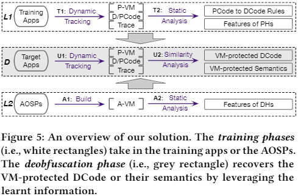
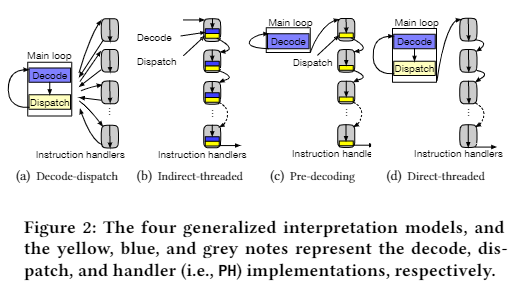
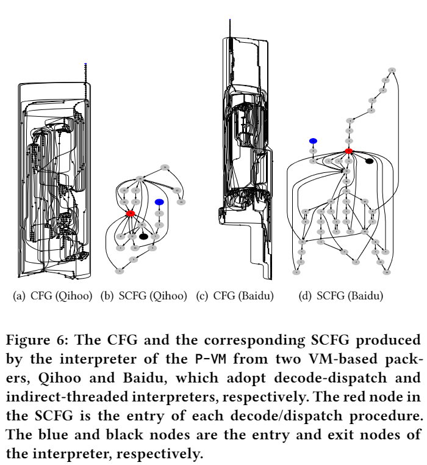
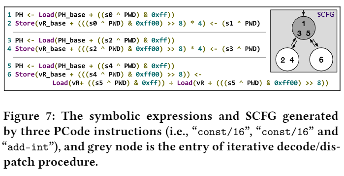

### 概念解释

* DCode  加壳前的Dalvik bytecode
* PCode  VM的字节码
* A-VM  安卓虚拟机，用于执行DCode
* P-VM  用于保护的VM，用于执行PCode
* PH  PCode Handler
* DH  DCode Handler
* PAM  PCode Addressing Mechanism，被P-VM用来定位PCode
* P2PH  PCode到PHandler的映射
* PH2D  PHandler到DCode的映射
* SCFG  Symbolic Control Flow Graph，与CFG不同的是，SCFG含有一些语法信息
* $O_{ph} / S_{ph}$  PH的offset/semantics features
* $O_{dh} / S_{dh}$  DH的offset/semantics features


此外一些翻译

* app-specific parameters  用户参数（其实好像应该是用户特定参数）
* differential symbolic analysis  差分符号分析

### INTRODUCTION

* D-1  尝试通过training apps逆向工程从DCode到PCode的翻译规则。若该翻译规则可逆，则说明被虚拟化保护的app可以通过翻译规则来还原出DCode
* D-2  通过对training app的分析，使用符号表达式构造了所有PH的语法特性。此后使用它们来还原被加壳程序的PCode，从而进行解壳
* D-3  通过开源的安卓虚拟机，构造了所有DH的语法特性，此后通过对PH和DH的相似性比较来从PH还原DH

Contribution

* 从D-1 D-2 D-3三个方面对VM-based的安卓壳进行了分析，并揭示了这种壳的内部构造和其保护安卓程序的能力
* 为了辅助分析，开发了一个名为Parema的框架，使用基于语法的方案从三种场景对VM-protected的程序进行解壳
* 在对7个流行的声称使用了VM技术的商用壳的14个版本进行分析后，发现只有2个厂商的4种壳使用了VM技术，且都可以被parema还原

### OVERVIEW



#### Learning Phase

* 使用customized app来获取关于packer的必要信息（如PCode/DCode的翻译规则和PH的语法性质）
* 从A-VM（如AOSP）中提取DCode的语义，然后通过语义相似性分析来获取DH和PH的关系

#### 假设和场景



* D-1  假设packer是accessible的
* D-2  假设packer是accessible的
* D-3  因为AOSP是开源的，因此不假设packer是accessible的

此外，假设P-VM的构造属于上述的四种VM模型，且是基于寄存器的VM。一种类型的DCode可能会被翻译成有限种形式的PCode

#### 挑战

* 定位PCode和PH： 因为PCode一般是在运行中释放到内存的，且如上图所示，dispatch过程有好几种实现方式，使得PH难以定位。作者通过**SCFG**来统一decode/dispatch过程的模型
* 确定PH的decode/dispatch规则： P-VM可能加入一些应用程序特定的因素（app-specific factors）来增加混淆强度。为了解决这个问题，我们在逆向decode/dispatch结构时使用了差分符号表达式分析（differential symbolic expression analysis）
* 识别被VM保护的DCode的语义： 因为PCode是P-VM自定义的，且一般app是在网站上在线打包的，因此我们对于P-VM没有什么前置知识。为了解决这个问题，我们使用training app学习PH，使用AOSP学习DH，此后用他们来推测DCode的语义

#### 流程

* D-1  出于安全考虑，一般的packer是线上加壳程序的。因此论文中使用training app来逆向PAM和P2PH，从而构建PH2D。D1中主要的流程是：定位PCode - 判断PCode对应的PH - 从PH根据之前学习的数据来还原DCode
* D-2  由于DCode是根据PAM P2PH和PH2D还原的，因此training app跟要脱壳的app必须是一个版本的。但由于保护壳更新比较快，因此作者也尝试了使用某个版本获取的知识来对不同版本的程序进行脱壳。主要方式是在learning时使用符号分析构造PH的语法特性，此后对要脱壳的程序进行语法相似性分析来识别目标app的PCode
* D-3  此外，作者还尝试了当无法构建training app时是否可以还原PCode。因此作者针对多个A-VM的DH使用符号分析构建了语法特性，此后使用语法相似性分析识别目标app翻译后的PCode

### INVESTIGATION

#### Learning with Training Apps

##### Dynamic Tracking

第一步是使用Valgrind动态插桩记录trace

关于提取的数据：

* 有可执行权限的内存数据，且不是从系统库载入的
* 出于安全考虑，一般来说packer会动态地将被传统方法保护的DCode和PCode相关的数据载入内存。

因此作者dump了被customized native code（可以指代很多代码，如packer的代码）动态写入内存的数据，将其作为可能的DCode和PCode以便后续分析。

注意，在不packing的情况下，DCode相关的数据被保存在Dex文件中，这些数据在app启动的时候被A-VM装载入内存

##### Static Analysis

这里主要引入了SCFG的机制，用于解决不同虚拟机结构中dispatch过程的不同带来的问题。

因为常见虚拟机结构如Figure 2所示，有多种翻译和dispatch方式，其中形如b c d的方式中，可能存在多个块实现同一个PH的情况。若使用CFG来表示代码结构，会导致即使两个块实现的功能一致，其也会被当做两个node

SCFG的构造方式：

* 使用符号执行为每个basic block构建符号表达式
* 如basic block表达式相似，则可以认为是同一个node



##### Locating PCode and PHs

* 确定候选PCode  选择从内存中加载的数据作为候选的PCode，因为P-VM在运行时就是从内存中获取PCode

* 产生符号表达式  将每个候选PCode的输入作为一个符号，并对trace的IR语句进行符号执行。这样所有与候选PCode相关的变量都可以被包含符号输入的符号表达式表示。当下列情况出现时，该符号表达式将被emit

  * 一个Store操作，且其目的地址可以被包含候选PCode的符号表达式表示。在这种情形下，目的地址与PCode存在关系。
  * 当一个JNI反射函数被插入，且其参数可以被符号表达式表示。JNI反射函数是对安卓runtime的引用，当P-VM在执行方法调用的指令时需要调用这些函数，从而调用目标方法
  * 当一个条件跳转或间接跳转被调用，且条件或目的地址可以被符号表达式表示。在这种情况下，P-VM根据PCode来dispatch合适的PH

* 使用SCFG来表示控制流，从而易于识别decode/dispatch过程和对应PCode和PH的输入输出。SCFG在三个方面优于CFG

  * SCFG的所有节点都与PCode有潜在的联系，因为这些符号表达式是从候选PCode中生成的
  * 相比CFG，包含更丰富的语法信息
  * 可以使得figure 2所述的几种不同的VM结构在SCFG下无法直接掩盖如decode/dispatch过程

* 识别decode/dispatch过程，在SCFG上使用循环识别算法来实现。此外使用了一个heuristic来过滤掉无关的循环：

  * 由于decode/dispatch过程由从内存中取PCode开始，因此循环的所有entry node的符号输入都应该是一个新的PCode
  * 由于decode/dispatch过程的输出取决于输入，因此exit node（指的应该就是decode/dispatch过程是否结束）的跳转结果取决于符号输入

  在这一步中，若有多个循环被找到，则需要一些人工分析。一般每种packer只需要分析一次即可

* 在识别了decode/dispatch过程，及其entry node和exit node后，需要识别PCode对应的opcode。

  由于P-VM在entry node加载opcode，因此将在entry node中初始化的符号输入作为PCode的opcode，如下图中的s0 s2 s4。
  
  此外，由于这些PCode opcode应该连续存放在PCode区域，且区域内通常包含opcode和operands，因此可以以此为依据识别PCode Region
  
  最后还有一点，decode/dispatch loop的跳转地址就是对应处理当前PCode的PH



##### Abstracting Decode/Dispatch Procedure(P2PH)

对于不同app，可能会由于packer用户参数（app-specific parameters）的不同导致app的decode/dispatch实现方式的不同。因此再对该过程进行抽象，从而通过差分符号分析（differential symbolic analysis）来实现对类似用户参数的识别

首先对不同training app的decode/dispatch过程产生的符号表达式进行检查。具体而言，作者比较了不同 VM 保护应用程序的decode/dispatch过程生成的符号表达式的具体值，并将未固定的具体值视为应用程序特定参数

由于用户参数的存在，对于同一个app使用同一个packer的加壳结果都可能有所不同。P2PH考虑到了这种情况，且每个从training app学习的符号表达式都是以用户参数和PCode两种变量作为输入的，而符号表达式的输出为对应的PH。

##### Identifying Deobfuscation Rules(PH2D)

为了还原出DCode，作者设计了两种feature：

* Oph  offset  表示PH的地址偏移

* Sph  symbolic/semantic  表示PH的符号表达式，且该表达式以PCode作为输入（这里的PCode指代的应该主要是参数）

  ```
  举例：当要表示invoke时，因为invoke的实现是通过JNI反射函数来调用目标方法的，因此该invoke的符号表达式将会包含这种JNI反射函数
  ```

对所有的PH构造了这两种feature后，


### 问题


