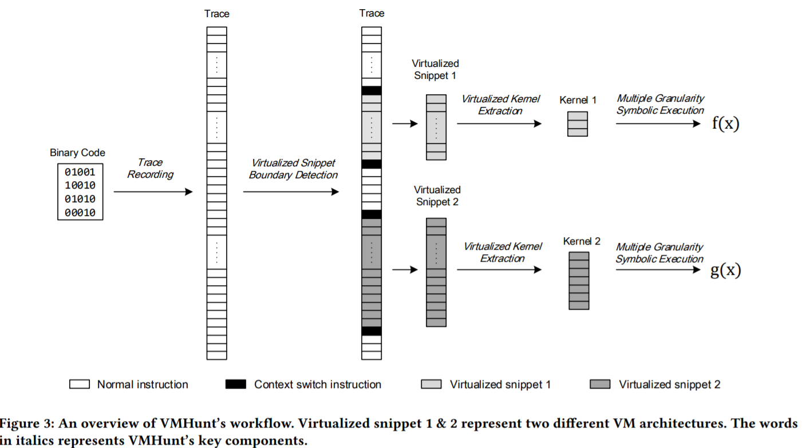
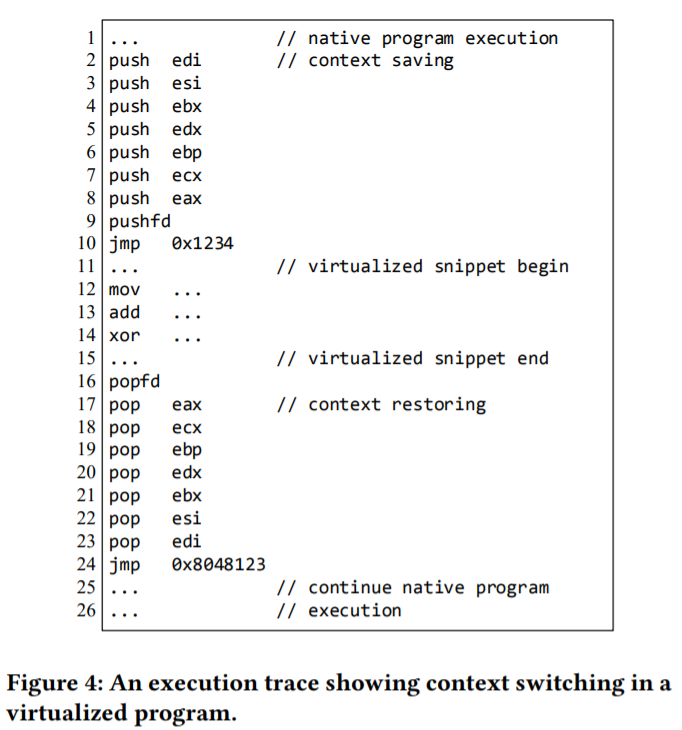
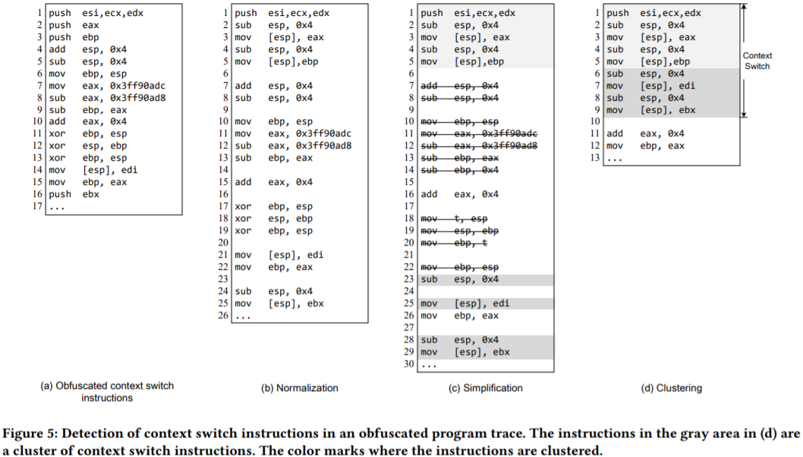
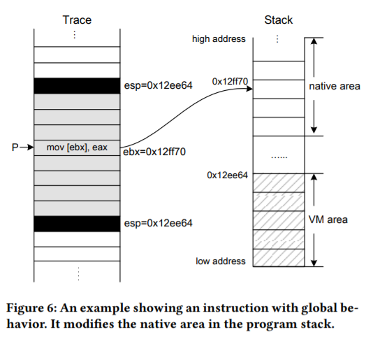
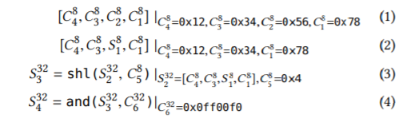
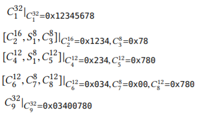

## 关于vmp的解释器

在商用vmp中， Code Virtualizer 和 Themida 可以采用threaded interpretation代替常见的解释器，基本原理就是解释器在另一个线程创建，从而降低因嵌入程序式的解释器分支太多导致的效率下降，也加强了vmp的强度。一般这种形式的解释器还会加上一个fake decode dispatch loop来迷惑那些基于识别解释器循环的脱壳器（Virtual Deobfuscator  VMAttack）

## vmhunt架构



## 边界检测

###trace

使用pintools

### 栈虚拟机与寄存器虚拟机

两种虚拟机的实现模型，一般vmp两种都提供

### 上下文切换指令

无论是栈型还是寄存器型vmp，都必须有一个上下文切换的指令，用于保存native模式切换到虚拟机模式时的上下文，及返回native模式的上下文



一般来说这些指令序列比较好识别，但一般vmp都使用了混淆的方式。因此使用下面三步来检测

#### Normalization

将所有的数据转移指令（push pop xchg等）转换为mov

#### Simplification

包括两种优化方式

##### peephole optimizer

使用规则匹配优化一些冗余指令，如在同一地址赋值后取值

##### data flow analyzer
constant propagation（不知道是什么）和消除dead code

#### Clustering

分类出那些将指令装载到寄存器且不产生副作用的指令。若一组指令包含了将所有寄存器写入内存或将内存中的数据写入所有寄存器，这组指令将被看做是上下文切换



peephole optimizer删除7 8行的无用指令，且将(b)的17~19行的交换数据替换为mov

data flow analyzer简化了10~14行的结果，将18~20行替换为22~23。22行因为后面的指令没有用到这块的结果而被删除

最后从输入clustering的结果可以发现这段就是上下文切换代码

#### 检测上下文恢复指令

* 栈指针与进入时相同
* 恢复后是个跳转

## 提取vm的核心语句

因为一般说来，所有的虚拟机保护都有自己专用的栈，与未加壳程序的栈空间区分，而vm必须与native代码段交互才能实现功能，因此可以通过这些交互语句反向查找出vm的核心语句。交互方式主要有直接和间接两种

* 直接  直接修改native栈空间的内容
* 间接  修改上下文切换时保存在内存中的寄存器的值



## 多粒度符号执行

因为vm在虚拟化代码时会把变量混淆得与原来位数不同，这对符号执行产生了很大的影响，因为符号执行不能正确化简多个符号变量位数不一的情况，这会使得化简出来的表达式有很多冗余变量。

一个解决方法是把一个n位变量的定义为n个长度为1bit的符号，但这显然会导致变量数量增加为原来的几倍

### 多粒度符号执行原理

* 在符号执行期间维护寄存器运行时状态，包括符号大小和位置及每个寄存器中的具体值
* 解释每条指令的效果，如shr/shl，多粒度符号执行更新寄存器中保存的内容而不是直接将指令翻译为一个左/右移公式
* 若某条指令执行后是一个确定值，这条指令创建的符号将被移除，如and sym, 0x00，若sym是8位的符号，则将有确定值0

多粒度符号执行的一个核心就是允许创建一个一半为符号另一半为定值的变量，如下面例子

### 一个例子

```
mov eax, 0x12345678
mov ah, mem[0x14ff23]
shl eax, 4
and eax, 0x0ff00ff0
```

每条指令创建的对应符号（前面为高位）

```
12   34   56   78
12   34   sym1 78
23   4 sym1 7  80
03   40   07   80
```

#### 单粒度符号执行过程

一般粒度为8bit



#### 多粒度符号执行过程



