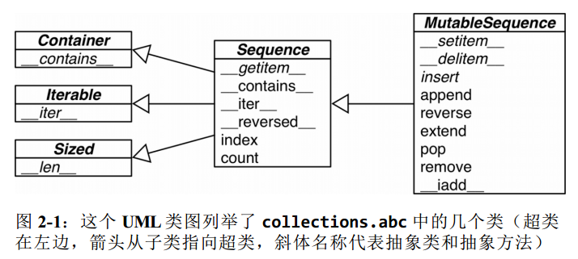

## Chap01 python数据类型

#### python风格的纸牌

```python
import collections
Card = collections.namedtuple('Card',['rank','suit'])  #定义一个简单的类

class FrenchDeck:
    ranks = [str(n) for n in range(2,11)] + list('JQKA')    #牌的数字
    suits = 'spades diamonds clubs hearts'.split()  #牌的花色

    def __init__(self):
        self._cards = [Card(rank,suit) for rank in self.ranks for suit in self.suits]

    def __len__(self):
        return len(self._cards)

    def __getitem__(self,position):
        return self._cards[position]
```

当实现了\_\_len\_\_()和\_\_getitem\_\_()就可以用迭代器的方法对纸牌进行遍历，也可以用**random.choice()**进行随机选择

#### 模拟数值类型

二维向量

* \+ 相加
* abs() 绝对值（模）
* \* 标量乘（数乘）

```python
class vector:
    def __init__(self,x=0,y=0):
        self.x = x
        self.y = y
    def __repr__(self):
        return "Vector(%r,%r)"%(self.x,self.y)
    def __str__(self):
        return "Vector(%r,%r)"%(self.x,self.y)  #使用%r调用对应变量的__repr__
    def __abs__(self):
        return math.sqrt(self.x**2 + self.y**2)
    def __add__(self,obj):
        x = self.x + obj.x
        y = self.y + obj.y
        return vector(x,y)
    def __bool__(self):
        return bool(abs(self))
    def __mul__(self,num):
        x = self.x * num
        y = self.y * num
        return vector(x,y)

```

## Chap02 序列构成的数组

### 内置序列类型

分类

#### 按存储类型

##### 容器序列

可以用于存储不同类型的数据

* list
* tuple
* collections.deque

##### 扁平序列

只能存储一种类型

* str
* bytes
* bytearray
* memoryview
* array.array

#### 按数据是否可变

##### 可变序列

* list
* bytearray
* array.array
* collections.deque
* memoryview

##### 不可变序列

* tuple
* str
* bytes



### 列表推导和生成器表达式

#### 列表推导

列表推导和map/filter效率对比

[示例代码](https://github.com/fluentpython/example-code )

##### 列表推导计算笛卡尔积

```python
colors = ['black','white']
sizes = ['S','M','L']
tshirts = [ (color,size) for color in colors for size in sizes ]  #color相同的排序在前
tshirts = [ (color,size) for size in sizes for color in colors ]  #size相同的排序在前
```

#### 生成器表达式

生成器是一个迭代器，不生成列表

##### 语法差别

```python
[ord(word) for word in words]  #列表推导
(ord(word) for word in words)  #生成器表达式
```

