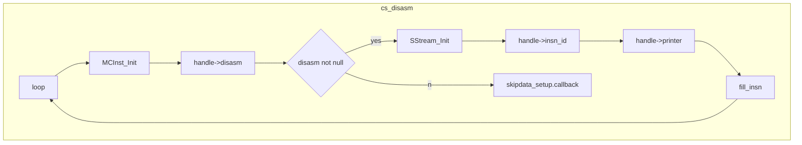

### 注意

#### X86

* X86与X86 reduce指令集差别仅在于是否有XOP8 XOP9 XOPA和3DNOW指令集

### cs.c

顶层接口

#### 结构体

##### cs_struct

```c
struct cs_struct {
	cs_arch arch;
	cs_mode mode;
	Printer_t printer;	// asm printer
	void *printer_info; // aux info for printer
	Disasm_t disasm;	// disassembler
	void *getinsn_info; // auxiliary info for printer
	GetName_t reg_name;
	GetName_t insn_name;
	GetName_t group_name;
	GetID_t insn_id;
	PostPrinter_t post_printer;
	cs_err errnum;
	ARM_ITStatus ITBlock;	// for Arm only
	cs_opt_value detail, imm_unsigned;
	int syntax;	// asm syntax for simple printer such as ARM, Mips & PPC
	bool doing_mem;	// handling memory operand in InstPrinter code
	unsigned short *insn_cache;	// index caching for mapping.c
	GetRegisterName_t get_regname;
	bool skipdata;	// set this to True if we skip data when disassembling
	uint8_t skipdata_size;	// how many bytes to skip
	cs_opt_skipdata skipdata_setup;	// user-defined skipdata setup
	const uint8_t *regsize_map;	// map to register size (x86-only for now)
	GetRegisterAccess_t reg_access;
	struct insn_mnem *mnem_list;	// linked list of customized instruction mnemonic
};
```

#### X86中的设置

##### cs_struct

X86Module.c: X86_global_init

```c
printer = X86_Intel_printInst;
syntax = CS_OPT_SYNTAX_INTEL;	//设置指令格式
printer_info = mri;				//X86_init中设置的MCRegisterInfo
disasm = X86_getInstruction;
reg_name = X86_reg_name;
insn_id = X86_get_insn_id;
insn_name = X86_insn_name;
group_name = X86_group_name;
post_printer = NULL;;

#ifndef CAPSTONE_DIET
reg_access = X86_reg_access;
#endif

if (mode == CS_MODE_64)
    regsize_map = regsize_map_64;
else
    regsize_map = regsize_map_32;
```

#### 函数

##### cs_open

初始化一个反编译的context

```c
CAPSTONE_EXPORT cs_err CAPSTONE_API cs_open(cs_arch arch, cs_mode mode, csh *handle);
```

* cs_mem_calloc一个cs_struct结构体
* 填充arch mode等字段
* 调用cs_arch_init对应的初始化函数（比如x86调用x86_global_init）

##### cs_close

清除cs_open建立的context

##### skipdata_size

根据当前context的架构返回需要对齐的字节数

##### cs_option

修改属性

* CS_OPT_MEM 内存分配函数
* CS_OPT_UNSIGNED imm_unsigned字段
* CS_OPT_DETAIL detail字段
* CS_OPT_SKIPDATA skipdata字段，指定对齐长度
* CS_OPT_SKIPDATA_SETUP skipdata_setup字段，指定用户自定义的skipdata，反汇编器在遇到这些字段时会跳过用户定义函数返回的字节数
* CS_OPT_MNEMONIC 增加、修改或删除某个助记符
* CS_OPT_MODE 检查一些架构相关属性是否启用

##### cs_disasm

```c
size_t CAPSTONE_API cs_disasm(csh ud, const uint8_t *buffer, size_t size, uint64_t offset, size_t count, cs_insn **insn);
```

`handle = (cs_struct*)ud`

* 分配insn_cache空间，大小为`sizeof(cs_insn) * INSN_CACHE_SIZE`（默认为32或8）
* 初始化MCinst结构体
* 调用handle->disasm 获取反汇编（对于x86为X86_getInstruction）
* 如果获取到
  * 调用handle->insn_id 获取opcode对应的指令id
  * 调用handle->printer 将指令输出到缓冲区
  * 调用fill_insn
* 否则
  * 若用户定义了skipdata_setup.callback，则调用
  * 否则使用默认的handle->skipdata_size
* 若已经到了需要反汇编的指令数则break，返回insn_cache
* 若cache满了则重新分配大小为当前大小的1.6倍的cache




##### skipdata_opstr

按照十六进制打印skipdata

### X86Module.c

#### 结构体

##### MCRegisterInfo

```c
typedef struct MCRegisterInfo {
	const MCRegisterDesc *Desc;                 // Pointer to the descriptor array
	unsigned NumRegs;                           // Number of entries in the array
	unsigned RAReg;                             // Return address register
	unsigned PCReg;                             // Program counter register
	const MCRegisterClass *Classes;             // Pointer to the regclass array
	unsigned NumClasses;                        // Number of entries in the array
	unsigned NumRegUnits;                       // Number of regunits.
	uint16_t (*RegUnitRoots)[2];          // Pointer to regunit root table.
	const MCPhysReg *DiffLists;                 // Pointer to the difflists array
	const char *RegStrings;                     // Pointer to the string table.
	const uint16_t *SubRegIndices;              // Pointer to the subreg lookup
	// array.
	unsigned NumSubRegIndices;                  // Number of subreg indices.
	const uint16_t *RegEncodingTable;           // Pointer to array of register
	// encodings.
} MCRegisterInfo;
```

#### 函数

##### X86_global_init

```c
cs_err X86_global_init(cs_struct *ud);
```


### 寄存器相关

#### 结构体

其中有几个宏

```c
typedef uint16_t MCPhysReg;
typedef const MCPhysReg* iterator;
```

##### MCRegisterInfo

一个总的描述符，用于描述一个架构的寄存器信息

```c
typedef struct MCRegisterInfo {
	const MCRegisterDesc *Desc;                 // Pointer to the descriptor array
	unsigned NumRegs;                           // Number of entries in the array
	unsigned RAReg;                             // Return address register
	unsigned PCReg;                             // Program counter register
	const MCRegisterClass *Classes;             // Pointer to the regclass array
	unsigned NumClasses;                        // Number of entries in the array
	unsigned NumRegUnits;                       // Number of regunits.
	uint16_t (*RegUnitRoots)[2];          // Pointer to regunit root table.
	const MCPhysReg *DiffLists;                 // Pointer to the difflists array
	const char *RegStrings;                     // Pointer to the string table.
	const uint16_t *SubRegIndices;              // Pointer to the subreg lookup
	// array.
	unsigned NumSubRegIndices;                  // Number of subreg indices.
	const uint16_t *RegEncodingTable;           // Pointer to array of register
	// encodings.
} MCRegisterInfo;
```

##### MCRegisterDesc

```c
typedef struct MCRegisterDesc {
	uint32_t Name;      // Printable name for the reg (for debugging)
	uint32_t SubRegs;   // Sub-register set, described above
	uint32_t SuperRegs; // Super-register set, described above

	// Offset into MCRI::SubRegIndices of a list of sub-register indices for each
	// sub-register in SubRegs.
	uint32_t SubRegIndices;

	// RegUnits - Points to the list of register units. The low 4 bits holds the
	// Scale, the high bits hold an offset into DiffLists. See MCRegUnitIterator.
	uint32_t RegUnits;

	/// Index into list with lane mask sequences. The sequence contains a lanemask
	/// for every register unit.
	uint16_t RegUnitLaneMasks;
} MCRegisterDesc;
```

##### MCRegisterClass

```c
typedef struct MCRegisterClass {
	iterator RegsBegin;
	const uint8_t *RegSet;
	uint32_t NameIdx;
	uint16_t RegsSize;
	uint16_t RegSetSize;
	uint16_t ID;
	uint16_t RegSize, Alignment; // Size & Alignment of register in bytes
	int8_t CopyCost;
	bool Allocatable;
} MCRegisterClass;
```

#### X86中的设置

##### MCRegisterInfo

X86Disassembler.c: X86_init

```c
Desc = X86RegDesc;
NumRegs = 234;
RAReg = 0;
PCReg = 0;
Classes = X86MCRegisterClasses;
NumClasses = 79;
RegUnitRoots = 0;
NumRegUnits = 0;
DiffLists = X86RegDiffLists;
RegStrings = 0;
SubRegIndices = X86SubRegIdxLists;
NumSubRegIndices = 7;
RegEncodingTable = 0;
```

### 指令相关

#### 结构体

##### InternalInstruction

X86DisassemblerDecoder.h

用于X86Disassembler.c和X86DisassemblerDecoder.c等内部函数

```c
typedef struct InternalInstruction {
  // from here, all members must be initialized to ZERO to work properly
  uint8_t operandSize;
  uint8_t prefix0, prefix1, prefix2, prefix3;
  /* true if the prefix byte corresponding to the entry is present; false if not */
  bool isPrefix26;
  bool isPrefix2e;
  bool isPrefix36;
  bool isPrefix3e;
  bool isPrefix64;
  bool isPrefix65;
  bool isPrefix66;
  bool isPrefix67;
  bool isPrefixf0;
  bool isPrefixf2;
  bool isPrefixf3;
  /* contains the location (for use with the reader) of the prefix byte */
  uint64_t prefix26;
  uint64_t prefix2e;
  uint64_t prefix36;
  uint64_t prefix3e;
  uint64_t prefix64;
  uint64_t prefix65;
  uint64_t prefix66;
  uint64_t prefix67;
  uint64_t prefixf0;
  uint64_t prefixf2;
  uint64_t prefixf3;
  /* The value of the REX prefix, if present */
  uint8_t rexPrefix;
  /* The segment override type */
  SegmentOverride segmentOverride;
  bool                          consumedModRM;
  uint8_t                       orgModRM;  // save original modRM because we will modify modRM
  /* The SIB byte, used for more complex 32- or 64-bit memory operands */
  bool                          consumedSIB;
  uint8_t                       sib;
  /* The displacement, used for memory operands */
  bool                          consumedDisplacement;
  int64_t                       displacement;
  /* The value of the two-byte escape prefix (usually 0x0f) */
  uint8_t twoByteEscape;
  /* The value of the three-byte escape prefix (usually 0x38 or 0x3a) */
  uint8_t threeByteEscape;
  /* SIB state */
  SIBIndex                      sibIndex;
  uint8_t                       sibScale;
  SIBBase                       sibBase;
  uint8_t                       numImmediatesConsumed;
  /* true if the prefix byte, 0xf2 or 0xf3 is xacquire or xrelease */
  bool xAcquireRelease;

  /* The value of the vector extension prefix(EVEX/VEX/XOP), if present */
  uint8_t vectorExtensionPrefix[4];

  /* Offsets from the start of the instruction to the pieces of data, which is
     needed to find relocation entries for adding symbolic operands */
  uint8_t displacementOffset;
  uint8_t immediateOffset;
  uint8_t modRMOffset;

  // end-of-zero-members

  /* Reader interface (C) */
  byteReader_t reader;

  /* Opaque value passed to the reader */
  const void* readerArg;
  /* The address of the next byte to read via the reader */
  uint64_t readerCursor;

  /* Logger interface (C) */
  dlog_t dlog;
  /* Opaque value passed to the logger */
  void* dlogArg;

  /* General instruction information */

  /* The mode to disassemble for (64-bit, protected, real) */
  DisassemblerMode mode;
  /* The start of the instruction, usable with the reader */
  uint64_t startLocation;
  /* The length of the instruction, in bytes */
  size_t length;

  /* Prefix state */

  /* The type of the vector extension prefix */
  VectorExtensionType vectorExtensionType;

  /* The location where a mandatory prefix would have to be (i.e., right before
	 the opcode, or right before the REX prefix if one is present) */
  uint64_t necessaryPrefixLocation;

  /* Sizes of various critical pieces of data, in bytes */
  uint8_t registerSize;
  uint8_t addressSize;
  uint8_t displacementSize;
  uint8_t immediateSize;

  uint8_t immSize;	// immediate size for X86_OP_IMM operand

  /* opcode state */

  /* The last byte of the opcode, not counting any ModR/M extension */
  uint8_t opcode;

  /* decode state */

  /* The type of opcode, used for indexing into the array of decode tables */
  OpcodeType opcodeType;
  /* The instruction ID, extracted from the decode table */
  uint16_t instructionID;
  /* The specifier for the instruction, from the instruction info table */
  const struct InstructionSpecifier *spec;

  /* state for additional bytes, consumed during operand decode.  Pattern:
     consumed___ indicates that the byte was already consumed and does not
     need to be consumed again */

  /* The VEX.vvvv field, which contains a third register operand for some AVX
     instructions */
  Reg                           vvvv;

  /* The writemask for AVX-512 instructions which is contained in EVEX.aaa */
  Reg                           writemask;

  /* The ModR/M byte, which contains most register operands and some portion of
     all memory operands */
  uint8_t                       modRM;

  // special data to handle MOVcr, MOVdr, MOVrc, MOVrd
  uint8_t                       firstByte;     // save the first byte in stream

  /* Immediates.  There can be two in some cases */
  uint8_t                       numImmediatesTranslated;
  uint64_t                      immediates[2];

  /* A register or immediate operand encoded into the opcode */
  Reg                           opcodeRegister;

  /* Portions of the ModR/M byte */

  /* These fields determine the allowable values for the ModR/M fields, which
     depend on operand and address widths */
  EABase                        eaBaseBase;
  EABase                        eaRegBase;
  Reg                           regBase;

  /* The Mod and R/M fields can encode a base for an effective address, or a
     register.  These are separated into two fields here */
  EABase                        eaBase;
  EADisplacement                eaDisplacement;
  /* The reg field always encodes a register */
  Reg                           reg;

  const struct OperandSpecifier *operands;
} InternalInstruction;
```

##### MCInst

```c
/// MCInst - Instances of this class represent a single low-level machine
/// instruction.
struct MCInst {
	unsigned OpcodePub;
	uint8_t size;	// number of operands
	bool has_imm;	// indicate this instruction has an X86_OP_IMM operand - used for ATT syntax
	uint8_t op1_size; // size of 1st operand - for X86 Intel syntax
	unsigned Opcode;
	MCOperand Operands[48];
	cs_insn *flat_insn;	// insn to be exposed to public
	uint64_t address;	// address of this insn
	cs_struct *csh;	// save the main csh
	uint8_t x86opsize;	// opsize for [mem] operand

	// (Optional) instruction prefix, which can be up to 4 bytes.
	// A prefix byte gets value 0 when irrelevant.
	// This is copied from cs_x86 struct
	uint8_t x86_prefix[4];
	uint8_t imm_size;	// immediate size for X86_OP_IMM operand
	bool writeback;	// writeback for ARM
	// operand access index for list of registers sharing the same access right (for ARM)
	uint8_t ac_idx;
	uint8_t popcode_adjust;   // Pseudo X86 instruction adjust
	char assembly[8];	// for special instruction, so that we dont need printer
	unsigned char evm_data[32];	// for EVM PUSH operand
};
```

##### MCOperand

```c
/// MCOperand - Instances of this class represent operands of the MCInst class.
/// This is a simple discriminated union.
struct MCOperand {
	enum {
		kInvalid = 0,                 ///< Uninitialized.
		kRegister,                ///< Register operand.
		kImmediate,               ///< Immediate operand.
		kFPImmediate,             ///< Floating-point immediate operand.
	} MachineOperandType;
	unsigned char Kind;

	union {
		unsigned RegVal;
		int64_t ImmVal;
		double FPImmVal;
	};
};
```

##### cs_insn

```c
/// Detail information of disassembled instruction
typedef struct cs_insn {
	/// Instruction ID (basically a numeric ID for the instruction mnemonic)
	/// Find the instruction id in the '[ARCH]_insn' enum in the header file
	/// of corresponding architecture, such as 'arm_insn' in arm.h for ARM,
	/// 'x86_insn' in x86.h for X86, etc...
	/// This information is available even when CS_OPT_DETAIL = CS_OPT_OFF
	/// NOTE: in Skipdata mode, "data" instruction has 0 for this id field.
	unsigned int id;

	/// Address (EIP) of this instruction
	/// This information is available even when CS_OPT_DETAIL = CS_OPT_OFF
	uint64_t address;

	/// Size of this instruction
	/// This information is available even when CS_OPT_DETAIL = CS_OPT_OFF
	uint16_t size;

	/// Machine bytes of this instruction, with number of bytes indicated by @size above
	/// This information is available even when CS_OPT_DETAIL = CS_OPT_OFF
	uint8_t bytes[24];

	/// Ascii text of instruction mnemonic
	/// This information is available even when CS_OPT_DETAIL = CS_OPT_OFF
	char mnemonic[CS_MNEMONIC_SIZE];

	/// Ascii text of instruction operands
	/// This information is available even when CS_OPT_DETAIL = CS_OPT_OFF
	char op_str[160];

	/// Pointer to cs_detail.
	/// NOTE: detail pointer is only valid when both requirements below are met:
	/// (1) CS_OP_DETAIL = CS_OPT_ON
	/// (2) Engine is not in Skipdata mode (CS_OP_SKIPDATA option set to CS_OPT_ON)
	///
	/// NOTE 2: when in Skipdata mode, or when detail mode is OFF, even if this pointer
	///     is not NULL, its content is still irrelevant.
	cs_detail *detail;
} cs_insn;
```

##### cs_detail

```c
typedef struct cs_detail {
	uint16_t regs_read[16]; ///< list of implicit registers read by this insn
	uint8_t regs_read_count; ///< number of implicit registers read by this insn

	uint16_t regs_write[20]; ///< list of implicit registers modified by this insn
	uint8_t regs_write_count; ///< number of implicit registers modified by this insn

	uint8_t groups[8]; ///< list of group this instruction belong to
	uint8_t groups_count; ///< number of groups this insn belongs to

	/// Architecture-specific instruction info
	union {
		cs_x86 x86;     ///< X86 architecture, including 16-bit, 32-bit & 64-bit mode
		cs_arm64 arm64; ///< ARM64 architecture (aka AArch64)
		cs_arm arm;     ///< ARM architecture (including Thumb/Thumb2)
		cs_m68k m68k;   ///< M68K architecture
		cs_mips mips;   ///< MIPS architecture
		cs_ppc ppc;	    ///< PowerPC architecture
		cs_sparc sparc; ///< Sparc architecture
		cs_sysz sysz;   ///< SystemZ architecture
		cs_xcore xcore; ///< XCore architecture
		cs_tms320c64x tms320c64x;  ///< TMS320C64x architecture
		cs_m680x m680x; ///< M680X architecture
		cs_evm evm;	    ///< Ethereum architecture
		cs_mos65xx mos65xx;	///< MOS65XX architecture (including MOS6502)
	};
} cs_detail;
```


### 助记符

#### 结构体

##### insn_mnem

助记符链表节点

```c
struct insn_mnem {
	struct customized_mnem insn;
	struct insn_mnem *next;	// linked list of customized mnemonics
};
```

##### customized_mnem

助记符结构体

```c
struct customized_mnem {
	// ID of instruction to be customized.
	unsigned int id;
	// Customized instruction mnemonic.
	char mnemonic[CS_MNEMONIC_SIZE];
};
```

### X86Disassembler.c

#### 函数

##### X86_getInstruction

x86对应的disasm函数

```c
bool X86_getInstruction(csh ud, const uint8_t *code, size_t code_len,
		MCInst *instr, uint16_t *size, uint64_t address, void *_info);
```

* 用对应位数的参数调用decodeInstruction
* 若返回不为空
  * 判断ud0 endbr64等指令
* 否则
  * 调用translateInstruction
    * 若有返回值，填充结构体，若有detail选项调用update_pub_insn，否则直接把InternalInstruction结构体中的4个prefix拷贝给返回的MCInst结构

##### decodeInstruction

```c
int decodeInstruction(struct InternalInstruction *insn,
		byteReader_t reader,
		const void *readerArg,
		uint64_t startLoc,
		DisassemblerMode mode);
```

* readPrefixes
* readOpcode
* getID
* checkPrefix
* readOperands
* 若上述调用都成功，填充InternalInstruction结构体（

注意这句比较关键的代码`insn->operands = &x86OperandSets[insn->spec->operands][0]`，数组定义于X86GenDisassemblerTables.inc

##### readPrefixes

```c
static int readPrefixes(struct InternalInstruction *insn);
```

* 若为64bit模式

  * 判断当前指针是否指向一个prefix，方法为`(byte & 0xf0) == 0x40`，且对于前缀而言，若出现多个prefix连续出现的情况这里会一直读取到最后一个prefix，将其作为语句的prefix
  * 判断下一个字节是不是传统前缀（legacy prefix），若不是则该字节不是前缀

* 下面这段代码是64和32共有的，因此可以判断64位比32位多了一个可能的前缀字节，且`(byte & 0xf0) == 0x40`

* 几个case

  * 原子操作 

    | byte0       | byte1                                                        |                   |
    | ----------- | ------------------------------------------------------------ | ----------------- |
    | 0xf2  REPNE | 0xf0  LOCK                                                   |                   |
    | 0xf3  REP   | (nextByte & 0xfe) == 0x86 \|\| (nextByte & 0xf8) == 0x90)  XCHG | xacquire/xrelease |
    | ==========  | 以上两个前缀任意组合应翻译为xacquire/xrelease语句            | =============     |
    | 0xf3        | 0x88/0x89                                                    | mov mem, reg      |
    |             | 0xc6/0xc7                                                    | mov mem, imm      |
    | ==========  | 以上应翻译为xrelease而非rep                                  | =============     |

  * 传统前缀

    | byte0                         |                                    |
    | ----------------------------- | ---------------------------------- |
    | 0xf2/0xf3                     | REPNE/REP                          |
    | 0xf0                          | LOCK                               |
    | 0x2e/0x36/0x3e/0x26/0x64/0x65 | override CS/SS/DS/ES/FS/GS         |
    | 0x66/0x67                     | override Operand-size/Address-size |

  * EVEX

    | byte0 | byte1                                           | byte2              |                       |
    | ----- | ----------------------------------------------- | ------------------ | --------------------- |
    | 0x62  | (byte1 & 0xc0) == 0xc0 && (~byte1 & 0xc) == 0xc | byte2 & 0x4 == 0x4 | vectorExtension       |
    | 0x62  | 只要MODE_64BIT                                  | byte2 & 0x4 == 0x4 | 这里多处理了rexPrefix |

  * VEX

    | byte0 | byte1                |                       |
    | ----- | -------------------- | --------------------- |
    | 0xc4  | byte1 & 0xc0 == 0xc0 | VEX_2B                |
    | 0xc4  | MODE_64BIT           | 这里多处理了rexPrefix |
    | 0xc5  | byte1 & 0xc0 == 0xc0 | VEX_3B                |
    | 0xc5  | MODE_64BIT           | 这里多处理了rexPrefix |

  * XOP

    | byte0 | byte1               |      |
    | ----- | ------------------- | ---- |
    | 0x8f  | byte1 & 0x38 != 0x0 | XOP  |

    注意，该指令也有rexPrefix

  * rexPrefix

    若`byte & 0xf0 == 0x40`即有可能为rexPrefix

* 填充结构体的几个size参数

  * registerSize
  * addressSize
  * displacementSize
  * immediateSize
  * immSize

##### readOpcode

```c
static int readOpcode(struct InternalInstruction *insn);
```

* 解码几个case，主要是根据prefix确定指令占几字节
  * EVEX
  * VEX_3B
  * VEX_2B
  * XOP
* 处理上面几种case对应的escape字节
* 不在几种case里的情况，opcodeType为ONEBYTE

##### getID

```c
static int getID(struct InternalInstruction *insn);
```

* 单独处理上述几个case的前缀信息，置位对应标志
* 特殊处理16位模式下JCXZ/JECXZ指令（AdSize前缀与32位的相反）

##### getIDWithAttrMask

```c
static int getIDWithAttrMask(uint16_t *instructionID,
		struct InternalInstruction *insn,
		uint16_t attrMask);
```

* 处理3DNow指令
* 根据getID中据不同指令设置的Attr，在`x86DisassemblerContexts`数组中查找对应的指令类型
* 根据InternalInstruction的opcodeType查找

### 几个重要的表或枚举

#### enum

##### InstructionContext

在X86DisassemblerDecoderCommon.h中，用于定义


