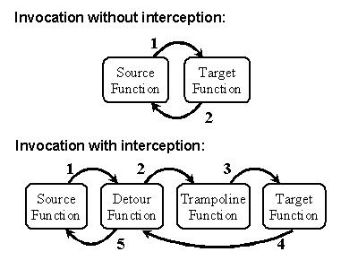
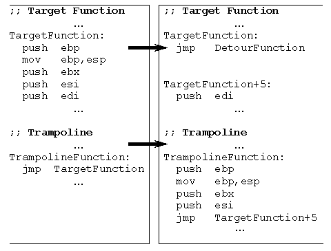

## 介绍

[Home · microsoft/Detours Wiki](https://github.com/microsoft/Detours/wiki)

Detour使用inline hook， 且会复制inline hook被替换的几条指令到hook函数执行，如下图



其中trampoline function包含inline hook覆盖的几条指令



## 结构

#### DETOUR_TRAMPOLINE

```cpp
struct _DETOUR_TRAMPOLINE
{
    // An X64 instuction can be 15 bytes long.
    // In practice 11 seems to be the limit.
    BYTE            rbCode[30];     // target code + jmp to pbRemain.
    BYTE            cbCode;         // size of moved target code.
    BYTE            cbCodeBreak;    // padding to make debugging easier.
    BYTE            rbRestore[30];  // original target code.
    BYTE            cbRestore;      // size of original target code.
    BYTE            cbRestoreBreak; // padding to make debugging easier.
    _DETOUR_ALIGN   rAlign[8];      // instruction alignment array.
    PBYTE           pbRemain;       // first instruction after moved code. [free list]
    PBYTE           pbDetour;       // first instruction of detour function.
    BYTE            rbCodeIn[8];    // jmp [pbDetour]
};
```

* rbCode  inline hook覆盖的原始代码，以及inline hook跳转

* cbCode  上述内容的长度

* cbCodeBreak  用于调试

* rbRestore  被覆盖的原始代码

* cbRestore  上述内容的长度

* lcbRestoreBreak  用于调试

* rAlign  对齐

* pbRemain

* pdDetour

* rbCodeIn

## 函数

### 顶层函数

#### hook装载

##### DetourAttach

```cpp
LONG WINAPI DetourAttach(_Inout_ PVOID *ppPointer,
                         _In_ PVOID pDetour)
```

直接调用DetourAttachEx

##### DetourAttachEx

```cpp
LONG WINAPI DetourAttachEx(_Inout_ PVOID *ppPointer,
                           _In_ PVOID pDetour,
                           _Out_opt_ PDETOUR_TRAMPOLINE *ppRealTrampoline,
                           _Out_opt_ PVOID *ppRealTarget,
                           _Out_opt_ PVOID *ppRealDetour)
```

* ppPointer  输入输出，指向source function

* pDetour  输入，指向detour function

* ppRealTrampoline  输出

* ppRealTarget  输出，返回实际的source function hook地址

* ppRealDetour  输出，返回实际的detour function插入地址（若detour function开头为跳转指令会进行一些修正）

流程如下：

* 检查参数，修正source function和detour function的地址，这里调用了detour_skip_jmp，若上述两个函数以跳转指令为开头则会进行修正
  
  * 修正策略（这里每个架构的细节有所不同，但大体策略一致）：
    
    * 若为import表的跳转，则跟踪该跳转，将函数地址改为import表跳向的地址
    
    * 若为普通跳转（或跟踪import跳转后仍为跳转），这里也会跟踪，并且根据架构不同做出不同的行为，这里以x64为例，普通跳转为eb短跳（jmp +imm8），判断其跳转目的地址的指令
      
      * 若为ff25长跳（jmp [+imm32]），则判断是否为import表，若是将其目的地址设置为目标，否则以eb短跳地址为目的
      
      * 若为e9长跳，且又跟了一个ff25相对跳转（jmp [rip+PAGE_SIZE-6]），则为系统的patch，以eb跳转地址为目的；否则以e9的跳转地址为目的

* 调用detour_alloc_trampoline分配trampoline空间，该函数首先会根据source function地址，以及跳转指令地址（若source function第一条为跳转指令）来分配trampoline空间，需要分配在上下2GB的空间中（因为imm32跳转偏移为+-2GB）；然后会检查region链表，若有符合条件的内存空间则取出，若无则分配新的trampoline空间

* 将占用了inline hook位置的指令逐条复制到trampoline空间，注意这里复制时有个判断：detour_does_code_end_function判断是否复制了无条件跳转指令，因为如果复制到无条件跳转指令则说明函数已经结束，不需要复制下面的内容
  
  在上述逻辑逐条复制指令后，还使用detour_is_code_filler判断指令是否为padding，若为padding则不复制

* 将复制到trampoline空间的指令保存到PDETOUR_TRAMPOLINE的rbRestore属性中
