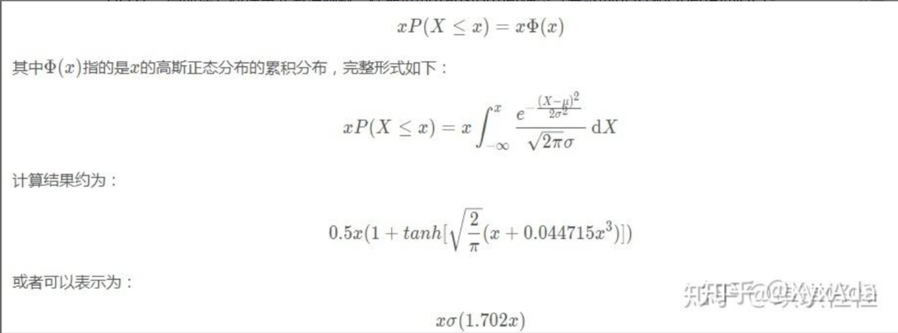

### gelu_forward.cu

实现了gelu激活函数




核心算法

```c
float xi = inp[i];
float cube = 0.044715f * xi * xi * xi;
out[i] = 0.5f * xi * (1.0f + tanhf(GELU_SCALING_FACTOR * (xi + cube)));
```

### matmul_forward


