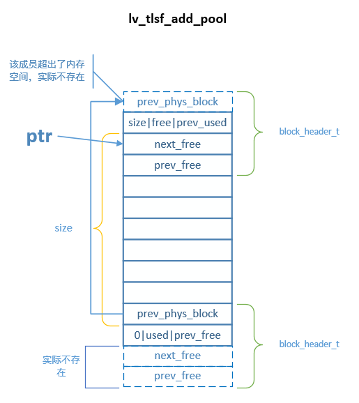
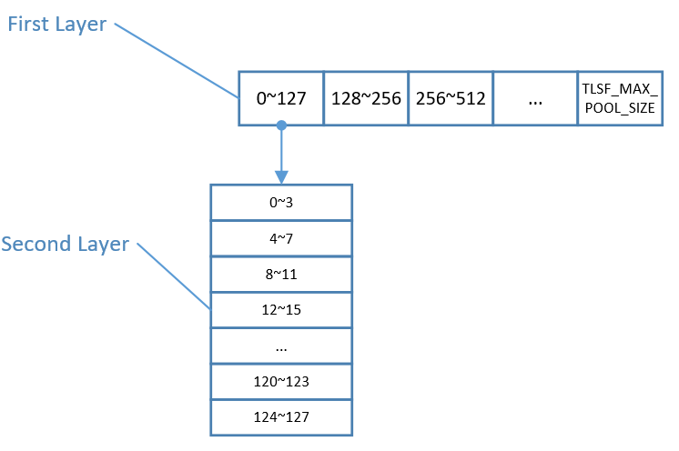
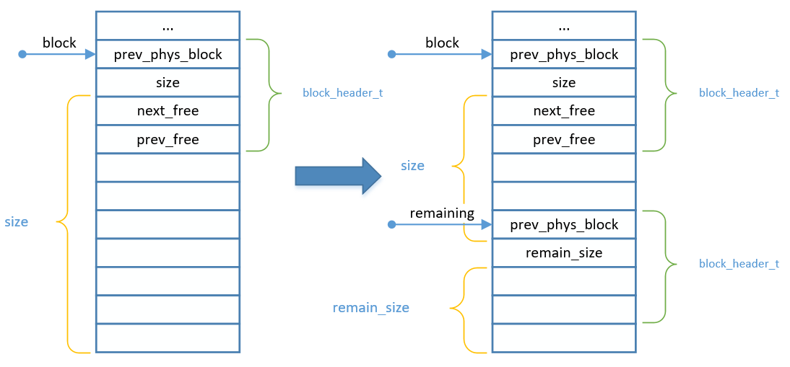

## misc

### lv_tlsf

一个内存分配器，Two Level Segregated Fit memory allocator

#### 流程

##### 初始化

* [lv_tlsf_create](#lv_tlsf_create) 或 [lv_tlsf_create_with_pool](#lv_tlsf_create_with_pool) 前者只初始化 [control_t](#control_t) 结构体，后者会初始化一个内存池

注意，这里初始化了两个block，第二个block的大小为0，作为pool的结束标记

内存池初始化后结构如下



##### 层的划分

TLSF算法将索引数组分为两层，第一层以log2划分内存范围，第二层则是对第一层中每段内存范围的均匀划分

* SL_INDEX_COUNT_LOG2  第二层划分的个数的log2，这里默认为5，即将第一层的每个内存范围都划分为2^5=32块

* ALIGN_SIZE_LOG2  内存对齐的字节数的log2，32位下默认为2，即内存对齐为2^2=4字节

* FL_INDEX_SHIFT  用于指定第一层的第一个内存范围是从多少开始的，由于每个内存范围都会被划分为 `2^SL_INDEX_COUNT_LOG2  ` 块，此外考虑内存对齐，因此

  ```
  FL_INDEX_SHIFT = (SL_INDEX_COUNT_LOG2 + ALIGN_SIZE_LOG2)
  ```

  对于上述默认值，FL_INDEX_SHIFT=7，即第一层的内存范围为 0~127 128~255 256~512 ...

* FL_INDEX_MAX  第一层的最大index

  ```
  TLSF_LOG2_CEIL(TLSF_MAX_POOL_SIZE)
  ```

  即第一层的最大一个index可以覆盖整个内存池的大小

* FL_INDEX_COUNT  第一层元素的个数

  ```
  FL_INDEX_COUNT = (FL_INDEX_MAX - FL_INDEX_SHIFT + 1)
  ```

* SL_INDEX_COUNT  第二层的元素个数

  ```
  SL_INDEX_COUNT = (1 << SL_INDEX_COUNT_LOG2)
  ```

* SMALL_BLOCK_SIZE  被定义为small block的大小，即第一层第一个元素的范围，因此为

  ```
  SMALL_BLOCK_SIZE = (1 << FL_INDEX_SHIFT)
  ```

##### 层的寻址



###### 原理

首先讨论first layer和second layer对空间的划分，由于除了第一二块外，按照log2划分，因此

* first layer

  这里取SMALL_BLOCK_SIZE为默认值128

  | 0      | 1      | 2      | 3      | 4      | ...  |
  | ------ | ------ | ------ | ------ | ------ | ---- |
  | 0x0000 | 0x0080 | 0x0100 | 0x0200 | 0x0400 | ...  |
  | 0x007F | 0x00FF | 0x01FF | 0x03FF | 0x07FF |      |

  因此除了第0块，第i个范围的起始都是 `1 << (i+offset)` 结束都是 `(1 << (i+offset+1)) - 1` 其中这里的 `offset=FL_INDEX_SHIFT-1` ，减一是因为该式不能用于第0块

  假设size应该对应第i块，则 `tlsf_fls(size) == i+offset` 下面即采用此式计算下标：

  ```
  fl_index = tlsf_fls(size) - (FL_INDEX_SHIFT - 1)
  ```

* second layer

  这个层是对每个范围的等分，因此对于第i块，范围为 `1 << (i+offset)` 到 `(1 << (i+offset+1)) - 1` ，大小为 `1 << (i+offset)`，所以对其进行2^m等分时，单位为 `1 << (i+offset-m)` ，代入上面的式子，则size对应的范围对应的单位为 `1 << (tlsf_fls(size) - m)` 

###### 实际代码

主要逻辑在 [mapping_insert](#mapping_insert) 函数中，其中fl表示first layer的下标，sl表示second layer的下标

* 若size小于 SMALL_BLOCK_SIZE

  * fl为0
  * sl为 `size / (SMALL_BLOCK_SIZE / SL_INDEX_COUNT)` 后面括号内即计算每个第二层每个块的范围

* 若size大于 SMALL_BLOCK_SIZE

  * fl为 `tlsf_fls(size) - (FL_INDEX_SHIFT - 1)` 前者计算出当前size属于哪个2^n的范围，后者减去第一个元素的偏移

  * sl为 `( size >> (tlsf_fls(size) - SL_INDEX_COUNT_LOG2) ) ^ (1 << SL_INDEX_COUNT_LOG2)`

    这个计算比较复杂（其实我觉得他应该有更不那么迷惑的写法），因为 `tlsf_fls(size)` 返回的是size的最高位，所以 `size >> tlsf_fls(size)` 的结果总是1，所以第二步的异或总是将最高位的1置为0。

    而因为由上面second layer的讨论可得，size对应的范围的单位为 `1 << (tlsf_fls(size) - SL_INDEX_COUNT_LOG2)` ，所以
    
    ```
    ( size >> (tlsf_fls(size) - SL_INDEX_COUNT_LOG2) )
    ```
    
    实际上就是size除以该单位

##### 块的切分

逻辑在 [block_split](#block_split) 之中



##### memalign

###### gap block

gap block存在的意义是：因为memalign函数是根据传入的align对齐的，若传入的align过大（大于 sizeof(block_header) ），首先可能导致浪费过多的内存，其次是因为在该算法中，对于下一个内存块的寻址算法是 `block_ptr + block.size` 。因此对于过大的align，若没有一个gap block，可能导致无法正确寻址下一块内存

###### memalign内存布局


#### 标志位

与malloc类似，这里也采用了使用size的低位作为标志位的方法，标志位主要如下

* free 第1位  指示当前块是空闲块
* prev_free 第2位  指示前一个块是空闲块

#### 指针转换

##### block_from_ptr

从给定的内存块头指针获取block头指针

```c
static block_header_t * block_from_ptr(const void * ptr)
{
    return tlsf_cast(block_header_t *,
                     tlsf_cast(unsigned char *, ptr) - block_start_offset);
}
```

与malloc类似，实际上内存块头指针是从 `block_header_t` 的next_free成员开始的，即这两个成员在内存块被分配时无法使用

##### block_to_ptr

与上述函数相反

```c
static void * block_to_ptr(const block_header_t * block)
{
    return tlsf_cast(void *,
                     tlsf_cast(unsigned char *, block) + block_start_offset);
}
```

##### offset_to_block

由当前内存块头指针和块大小获取下一个block（内存连续的下一个block）

```c
/* Return location of next block after block of given size. */
static block_header_t * offset_to_block(const void * ptr, size_t size)
{
    return tlsf_cast(block_header_t *, tlsf_cast(tlsfptr_t, ptr) + size);
}
```

##### block_prev

获取内存连续的上一个block，这里是使用`prev_phys_block`成员获取的，因此必须在上一个block为free时才能使用

```c
/* Return location of previous block. */
static block_header_t * block_prev(const block_header_t * block)
{
    tlsf_assert(block_is_prev_free(block) && "previous block must be free");
    return block->prev_phys_block;
}
```

##### block_next

获取下一个block头指针（内存连续的下一个block）

```c
/* Return location of next existing block. */
static block_header_t * block_next(const block_header_t * block)
{
    block_header_t * next = offset_to_block(block_to_ptr(block),
                                            block_size(block) - block_header_overhead);
    tlsf_assert(!block_is_last(block));
    return next;
}
```


#### 数据结构

##### block_header_t

```c
/*
** Block header structure.
**
** There are several implementation subtleties involved:
** - The prev_phys_block field is only valid if the previous block is free.
** - The prev_phys_block field is actually stored at the end of the
**   previous block. It appears at the beginning of this structure only to
**   simplify the implementation.
** - The next_free / prev_free fields are only valid if the block is free.
*/
typedef struct block_header_t {
    /* Points to the previous physical block. */
    struct block_header_t * prev_phys_block;

    /* The size of this block, excluding the block header. */
    size_t size;

    /* Next and previous free blocks. */
    struct block_header_t * next_free;
    struct block_header_t * prev_free;
} block_header_t;
```

这个结构体很类似ptmalloc的malloc_chunk，第一个元素prev_phys_block实际上放在了上一个内存块中

##### control_t

```c
/* The TLSF control structure. */
typedef struct control_t {
    /* Empty lists point at this block to indicate they are free. */
    block_header_t block_null;

    /* Bitmaps for free lists. */
    unsigned int fl_bitmap;
    unsigned int sl_bitmap[FL_INDEX_COUNT];

    /* Head of free lists. */
    block_header_t * blocks[FL_INDEX_COUNT][SL_INDEX_COUNT];
} control_t;
```

* block_null  该成员是用于代表一个空block的
* fl_bitmap  first layer的bitmap
* sl_bitmap  second layer的bitmap
* blocks  free链表

#### 外部函数

##### lv_tlsf_create

初始化tslf分配器

```c
lv_tlsf_t lv_tlsf_create(void * mem);
```

这里主要就做了以下内存对齐检查，此后调用 [control_constructor](#control_constructor) 初始化control_t

##### lv_tlsf_create_with_pool

```c
lv_tlsf_t lv_tlsf_create_with_pool(void * mem, size_t bytes);
```

* 调用 [lv_tlsf_create](#lv_tlsf_create) 初始化
* 调用 [lv_tlsf_add_pool](#lv_tlsf_add_pool) 添加内存池。这里添加的内存池位置即为mem指向的内存加上control_t结构体的偏移

##### lv_tlsf_add_pool

该函数执行后创建的内存池结构见 [初始化](#初始化) 

```c
lv_pool_t lv_tlsf_add_pool(lv_tlsf_t tlsf, void * mem, size_t bytes)
```

* 执行一些检查和计算，包括
  * 计算control_t与pool的overhead（默认为 `2*size_t`）
  * 计算pool的大小并对齐（`align_down(bytes-overhead)`）
  * 判断pool大小是否小于block_size_min或大于block_size_max（两者都不允许）
* 将mem初始化为第一个block
  * 设置block的size（为计算出的pool大小）
  * 设置free和prev_used属性
  * [block_insert](#block_insert) 插入到可分配内存中
* 创建一个长度为0的块，将其放在block之后

##### lv_tlsf_remove_pool

```c
void lv_tlsf_remove_pool(lv_tlsf_t tlsf, lv_pool_t pool);
```

* 检查pool是否符合要求，这里的pool实际上指向 [lv_tlsf_add_pool](#lv_tlsf_add_pool) 中的第一个block，主要需要符合下述要求

  * 该block是free的
  * 下一个block不是free的
  * 下一个block的大小为0

  所以这里基本就是要求当前内存池的状态与add_pool时的状态一致

* 调用 [mapping_insert](#mapping_insert) 获取下标，之后调用 [remove_free_block](#remove_free_block) 将block从free列表中移除

##### lv_tlsf_get_pool

```c
lv_pool_t lv_tlsf_get_pool(lv_tlsf_t tlsf);
```

简单地将tlsf指针指向的地址（就是[control_t](#control_t)结构的地址）转换为指向内存池的地址（就是第一个block的地址）

##### lv_tlsf_walk_pool

主要用于调试，遍历pool指向的内存池，并对每个block执行walker回调函数

```c
void lv_tlsf_walk_pool(lv_pool_t pool, lv_tlsf_walker walker, void * user);
```

##### lv_tlsf_malloc

```c
void * lv_tlsf_malloc(lv_tlsf_t tlsf, size_t size);
```

* 调用 [adjust_request_size](#adjust_request_size) 获取size对齐后的大小
* 调用 [block_locate_free](#block_locate_free) 获取合适的block
* 调用 [block_prepare_used](#block_prepare_used) 切分上述block以获取合适大小的block，返回block对应的内存空间

##### lv_tlsf_free

```c
void lv_tlsf_free(lv_tlsf_t tlsf, void * ptr);
```

* 修改block的free标志为1
* 调用 [block_merge_prev](#block_merge_prev) 试图合并前一个块
* 调用 [block_merge_next](#block_merge_next) 试图合并后一个块
* 调用 [block_insert](#block_insert) 将该块插入空闲数组

##### lv_tlsf_realloc

```c
void * lv_tlsf_realloc(lv_tlsf_t tlsf, void * ptr, size_t size);
```

* 若size为0，则等同于调用 [lv_tlsf_free](#lv_tlsf_free)
* 若ptr为NULL，则等同于调用 [lv_tlsf_malloc](#lv_tlsf_malloc)
* 若size大于原本的大小，且下一个block正在被使用，或下一个block加上当前block大小仍无法满足请求（注意，因为每次free时都会执行merge，因此不可能存在连续两个空闲块）
  * 这种情况下必须分配新的块
    * 试图调用 [lv_tlsf_malloc](#lv_tlsf_malloc) 分配新块
    * 若分配到
      * 将原块中的内容复制到新块中
      * 调用 [lv_tlsf_free](#lv_tlsf_free) 释放原块
  * 否则只需要调整旧的块
    * 若新的请求大于当前大小
      * 调用 [block_merge_next](#block_merge_next) 将当前块与下个块合并，并调用 [block_mark_as_free](#block_mark_as_free) 更新当前使用情况
    * 调用 [block_trim_used](#block_trim_used) 划分内存块并将多余的空间归还给内存池

##### lv_tlsf_memalign

```c
void * lv_tlsf_memalign(lv_tlsf_t tlsf, size_t align, size_t size);
```

* 首先需要根据align大小来判断是否加入一个[gap block](#gap block)。

  若调整后的block大小大于ALIGN_SIZE，则加入gap block

* 调用 [block_locate_free](#block_locate_free) 取得对应的空闲块链表

* 求gap，具体可见 [memalign内存布局](#memalign内存布局)

  * 若大于 `gap_minimum` ，则调用 [block_trim_free_leading](#block_trim_free_leading)

##### lv_tlsf_destroy

释放内存池，目前这个函数内没有任何操作

```c
void lv_tlsf_destroy(lv_tlsf_t tlsf);
```


#### 内部函数

##### control_constructor

```c
static void control_constructor(control_t * control);
```

初始化 [control_t](#control_t) 成员，主要是让头节点 block_null 的next和prev均指向自己，以及清零两个bitmap，并**将所有blocks指针指向block_null**

##### mapping_insert

```c
/*
** TLSF utility functions. In most cases, these are direct translations of
** the documentation found in the white paper.
*/
static void mapping_insert(size_t size, int * fli, int * sli);
```

根据传入的size来确定对应的first layer index和second layer index。查找方式见 [层的寻址](#层的寻址)

##### mapping_search

```c
/* This version rounds up to the next block size (for allocations) */
static void mapping_search(size_t size, int * fli, int * sli);
```

与 [mapping_insert](#mapping_insert) 的差别在于，这个函数将size进行了round up后才进行寻址，使其寻址得到的是下一个block的大小

##### search_suitable_block

```c
static block_header_t * search_suitable_block(control_t * control, int * fli, int * sli);
```

* 检查 `sl_bitmap[fl]` 中大于等于sl的部分有没有块
  * 若有，返回的second layer index为最接近sl的，含有空闲块的部分
  * 若无，则检查 `fl_bitmap` 大于fl的部分有没有块
    * 若无，说明两个层中都没有空闲块，返回0
    * 若有，取最接近fl的作为返回的first layer index，取最小的sl作为返回的second layer index

##### insert_free_block

```c
/* Insert a free block into the free block list. */
static void insert_free_block(control_t * control, block_header_t * block, int fl, int sl);
```

* 取出 `block[fl][sl]` 指向的块，用头插法将block插入 `block[fl][sl]`
* 置位 `fl_bitmap sl_bitmap`

##### remove_free_block

```c
/* Remove a free block from the free list.*/
static void remove_free_block(control_t * control, block_header_t * block, int fl, int sl);
```

* 将block从双链表中取出
* 若block是对应 `block[fl][sl]` 的头结点
  * 将该节点设置为block的下一个节点
  * 若block的下一个节点为空节点（即block_null），则清空对应的bitmap，具体分为两步
    * 将 `sl_bitmap[fl]` 的对应位置位
    * 若该位置位后， `sl_bitmap[fl]` 为0，则
      * 将 `fl_bitmap` 的对应位置位

##### block_link_next

```c
/* Link a new block with its physical neighbor, return the neighbor. */
static block_header_t * block_link_next(block_header_t * block);
```

将物理连续的下一个块的prev_phys_block成员设为block

##### block_mark_as_free

```c
static void block_mark_as_free(block_header_t * block);
```

分为两步

* 在下个块设置prev_free标志为1
* 设置当前块的free标志为1

##### block_mark_as_used

```c
static void block_mark_as_used(block_header_t * block);
```

与 [block_mark_as_free](#block_mark_as_free) 类似

##### block_insert

```c
/* Insert a given block into the free list. */
static void block_insert(control_t * control, block_header_t * block);
```

* 调用 [mapping_insert](#mapping_insert) 根据size找到block的对应位置
* 调用 [insert_free_block](#insert_free_block) 将该block插入

##### block_remove

```c
/* Remove a given block from the free list. */
static void block_remove(control_t * control, block_header_t * block)
```

* 调用 [mapping_insert](#mapping_insert) 根据size找到block的对应位置
* 调用 [remove_free_block](#remove_free_block) 将该block移除

##### block_locate_free

```c
static block_header_t * block_locate_free(control_t * control, size_t size);
```

* 先调用 [mapping_search](#mapping_search) 取得符合当前size的下一个block的下标
* 若fl小于最大first layer的下标
  * 调用 [search_suitable_block](#search_suitable_block) 获取对应的block
  * 调用 [remove_free_block](#remove_free_block) 将该内存块从链表中取出

##### block_can_split

```c
static int block_can_split(block_header_t * block, size_t size)
```

简单判断当前block大小是否大于 `sizeof(block_header_t) + size`

##### block_split

```c
/* Split a block into two, the second of which is free. */
static block_header_t * block_split(block_header_t * block, size_t size);
```

内存布局可见 [块的切分](#块的切分) ，注意这里只切分了块，并返回第二个块的指针

注意这里不对第一个block的使用情况做假设，因此**没有对块所在的空闲数组做任何修改**，此外也**没有将block链接到划分出的第二个块**（因为若block正在使用，prev_phys_block成员是不可用的）

##### block_absorb

用于将block合并到prev的块中

```c
/* Absorb a free block's storage into an adjacent previous free block. */
static block_header_t * block_absorb(block_header_t * prev, block_header_t * block);
```

* prev块的大小增加 `block->size + block_header_overhead`
* 调用 [block_link_next](#block_link_next) 将prev块链接到block的下一个块上

注意这里只把block从空闲数组取下，**没有修改prev在空闲数组的位置**

##### block_merge_prev

将当前块与前一个空闲块合并，注意该过程会将块从空闲数组上取出

```c
/* Merge a just-freed block with an adjacent previous free block. */
static block_header_t * block_merge_prev(control_t * control, block_header_t * block);
```

* 首先检查前一个块是否空闲（prev_free标志）
* 这里获取了前一个块的地址（prev_phys_block成员）并进行了多次检查来确认该块为空闲块
* 调用 [block_remove](#block_remove) 将prev块从空闲数组上取出
* 调用 [block_absorb](#block_absorb) 将prev块和block合并，最后返回新块的指针

##### block_merge_next

将当前块与后一个空闲块合并，注意该过程会将块从空闲数组上取出

```c
/* Merge a just-freed block with an adjacent free block. */
static block_header_t * block_merge_next(control_t * control, block_header_t * block);
```

除了多了对是否为最后一块的检查，其他流程与 [block_merge_prev](#block_merge_prev) 相同

##### block_trim_free

将一个空闲块分为两块

```c
/* Trim any trailing block space off the end of a block, return to pool. */
static void block_trim_free(control_t * control, block_header_t * block, size_t size);
```

* 判断 [block_can_split](#block_can_split)
  * 若可分，调用 [block_split](#block_split) 划分block
  * 调用 [block_link_next](#block_link_next) 将block与新块链接，并设置新块的prev_free标志为1
  * 调用 [block_insert](#block_insert) 将新块插入空闲数组

##### block_trim_used

将一个使用中的块分为两块，后一块作为空闲块还给内存池

```c
/* Trim any trailing block space off the end of a used block, return to pool. */
static void block_trim_used(control_t * control, block_header_t * block, size_t size);
```

* 判断 [block_can_split](#block_can_split)
  * 若可分，调用 [block_split](#block_split) 划分block
  * 设置新块的prev_free标志为0
  * 调用 [block_merge_next](#block_merge_next) 尝试与后面的空闲块合并
  * 调用 [block_insert](#block_insert) 将该空闲块插入空闲数组

##### block_trim_free_leading

将一个空闲划分为两块，前一块作为空闲块还给内存池

```c
static block_header_t * block_trim_free_leading(control_t * control, block_header_t * block, size_t size);
```

判断 [block_can_split](#block_can_split)

* 若可分，调用 [block_split](#block_split) 划分block，注意这里划分的大小是 `size - block_header_overhead`
* 设置新块的prev_free标志为1
* 调用 [block_link_next](#block_link_next) 将空闲块链接
* 调用 [block_insert](#block_insert) 将空闲块插入空闲数组

#####block_prepare_used

```c
static void * block_prepare_used(control_t * control, block_header_t * block, size_t size);
```

* 调用 [block_trim_free](#block_trim_free) 试图将拿到的block进行划分，以将多的空间归还给内存池
* 将block标记为使用中（标志free为0）
* 返回block对应的内存空间首地址

##### adjust_request_size

```c
/*
** Adjust an allocation size to be aligned to word size, and no smaller
** than internal minimum.
*/
static size_t adjust_request_size(size_t size, size_t align);
```

* 将size向上对齐到align
* 判断对齐后的size小于 block_size_max
  * 若小于，若对齐的size小于block_size_min，则返回block_size_min，否则返回对齐后的size）
  * 若大于，说明无法分配对应内存，直接返回0


#### 计算

##### FLS

Find The Last Bit Set 查找最后一个置位比特（这里的最后指的是最高位）

一些处理器有特殊指令计算，若无则采用下列代码

```c
#ifdef TLSF_64BIT
    #define TLSF_FLS(n) ((n) & 0xffffffff00000000ull ? 32 + TLSF_FLS32((size_t)(n) >> 32) : TLSF_FLS32(n))
#else
    #define TLSF_FLS(n) TLSF_FLS32(n)
#endif

#define TLSF_FLS32(n) ((n) & 0xffff0000 ? 16 + TLSF_FLS16((n) >> 16) : TLSF_FLS16(n))
#define TLSF_FLS16(n) ((n) & 0xff00     ?  8 + TLSF_FLS8 ((n) >>  8) : TLSF_FLS8 (n))
#define TLSF_FLS8(n)  ((n) & 0xf0       ?  4 + TLSF_FLS4 ((n) >>  4) : TLSF_FLS4 (n))
#define TLSF_FLS4(n)  ((n) & 0xc        ?  2 + TLSF_FLS2 ((n) >>  2) : TLSF_FLS2 (n))
#define TLSF_FLS2(n)  ((n) & 0x2        ?  1 + TLSF_FLS1 ((n) >>  1) : TLSF_FLS1 (n))
#define TLSF_FLS1(n)  ((n) & 0x1        ?  1 : 0)
```

这个算法的原理如下：

```
以8位数 00110111举例，使用TLSF_FLS8查找
因为 (0b00110111) & 0xf0为true，返回 4+TLSF_FLS4(n>>4) 即 4+TLSF_FLS4(0b00000011)
因为 (0b00000011) & 0xc 为true，返回 2+TLSF_FLS2(n>>2) 即 2+TLSF_FLS2(0b00000000)
因为 (0b00000000) & 0x2 为false，返回 TLSF_FLS1(n) 即 TLSF_FLS1(0b00000000)
因为 (0b00000000) & 0x1 为false，返回 0

所以最后为 0 + 2 + 4 = 6
```

实际上原理为二分法，对于n位输入，先检查高n/2位，若高n/2位不为0，说明First Bit至少在高n/2位，则先将结果+n/2，尔后对高n/2位继续采用二分法检测


最后，因为上述算法的返回值为0~32。对于输入0，返回为0。而一般希望输入0时返回-1，即函数返回的是-1~31，因此

```c
tlsf_decl int tlsf_fls(unsigned int word)
{
    return TLSF_FLS32(word) - 1;
}
```

##### FFS

Find The First Bit Set 查找第一个置位比特

```c
tlsf_decl int tlsf_ffs(unsigned int word)
{
    const unsigned int reverse = word & (~word + 1);
    return TLSF_FLS32(reverse) - 1;
}
```

这里用到了一个位运算技巧来取得最低的1，原理见 [取最低位](#取最低位)

##### LOG2_CEIL

返回n向上取2^m后的log2(n)值，即 `log2(round_up(n))`

```c
#define TLSF_LOG2_CEIL(n) ((n) & (n - 1) ? TLSF_FLS(n) : TLSF_FLS(n) - 1)
```

* 若 `n!=2^j` 则 `n & (n-1) != 0` ，返回 `TLSF_FLS(n)`
* 若 `n==2^j` 则返回 `TLSF_FLS(n)-1` ，返回 `TLSF_FLS(n)-1`

注意，这里使用的 `TLSF_FLS` 返回值为0~32，因此本身得到的结果就是 `tlsf_fls(n)+1`

举例说明

```
如
a = 0b00010000
b = 0b00010010

LOG2_CEIL(a) = LOG2_CEIL(0b00010000) = LOG2(0b00010000) = 4
LOG2_CEIL(b) = LOG2_CEIL(0b00010010) = LOG2(0b00100000) = 5
```


### lv_mem

这个库封装了一系列内存操作，此外，若定义了 `LV_MEM_CUSTOM` 宏，则会使用用户自定义的内存库函数

#### 重要的全局变量

##### zero_mem

若分配的大小为0，则返回的地址指向这个变量

#### 宏

##### LV_MEM_CUSTOM

用于指示当前使用默认的tlsf内存池还是用户引入的内存管理函数

##### LV_MEM_POOL_ALLOC

指向用户定义的alloc函数

##### LV_MEM_CUSTOM_FREE

指向用户定义的free函数

##### LV_MEM_CUSTOM_REALLOC

指向用户定义的realloc函数

#### 初始化函数

##### lv_mem_init

初始化内存池

```c
/**
 * Initialize the dyn_mem module (work memory and other variables)
 */
void lv_mem_init(void);
```

* 预编译条件：若定义了 `LV_MEM_POOL_ALLOC` 则使用该宏指向的函数作为内存池的分配函数。否则内存池使用一个大小为 `LV_MEM_SIZE` 的数组
* 调用 [lv_tlsf_create_with_pool](#lv_tlsf_create_with_pool) 创建一个内存池

##### lv_mem_deinit

清空并重新初始化内存池

```c
/**
 * Clean up the memory buffer which frees all the allocated memories.
 * @note It work only if `LV_MEM_CUSTOM == 0`
 */
void lv_mem_deinit(void);
```

* 调用 [lv_tlsf_destroy](#lv_tlsf_destroy) 释放内存池
* 调用 [lv_mem_init](#lv_mem_init) 重新初始化内存池


#### 分配/释放函数

##### lv_mem_alloc

```c
/**
 * Allocate a memory dynamically
 * @param size size of the memory to allocate in bytes
 * @return pointer to the allocated memory
 */
void * lv_mem_alloc(size_t size);
```

* 根据 [LV_MEM_CUSTOM](#LV_MEM_CUSTOM) 决定调用 [lv_tlsf_malloc](#lv_tlsf_malloc) 还是 [LV_MEM_CUSTOM_ALLOC](#LV_MEM_CUSTOM_ALLOC) 进行分配
* 根据 [LV_MEM_ADD_JUNK](#LV_MEM_ADD_JUNK) 决定是否调用 [lv_memset](#lv_memset) 将内存填充为0xaa

##### lv_mem_free

```c
/**
 * Free an allocated data
 * @param data pointer to an allocated memory
 */
void lv_mem_free(void * data);
```

* 根据 [LV_MEM_ADD_JUNK](#LV_MEM_ADD_JUNK) 决定是否调用 [lv_memset](#lv_memset) 先将内存填充为0xbb
* 根据 [LV_MEM_CUSTOM](#LV_MEM_CUSTOM) 决定调用 [lv_tlsf_free](#lv_tlsf_free) 还是 [LV_MEM_CUSTOM_FREE](#LV_MEM_CUSTOM_FREE) 进行分配

##### lv_mem_realloc

```c
void * lv_mem_realloc(void * data_p, size_t new_size);
```

* 若new_size为0,，则视为调用 [lv_mem_free](#lv_mem_free)
* 若data_p为 [zero_mem](#zero_mem) ，则视为调用 [lv_mem_alloc](#lv_mem_alloc)
* 根据 [LV_MEM_CUSTOM](#LV_MEM_CUSTOM) 决定调用 [lv_tlsf_realloc](#lv_tlsf_realloc) 还是 [LV_MEM_CUSTOM_REALLOC](#LV_MEM_CUSTOM_REALLOC) 进行分配

#### 应用函数

##### lv_memcpy

```c
/**
 * Same as `memcpy` but optimized for 4 byte operation.
 * @param dst pointer to the destination buffer
 * @param src pointer to the source buffer
 * @param len number of byte to copy
 */
LV_ATTRIBUTE_FAST_MEM void * lv_memcpy(void * dst, const void * src, size_t len);
```

这里根据两块内存的对齐进行了不同操作，主要是做了4字节操作的优化

* 若src和dst的对齐情况不一样（即 `src & ALIGN_MASK != dst & ALIGN_MASK`），则直接按1字节进行copy
* 若对齐情况一样，则先按1字节copy到对齐
* 剩余的空间，先按32字节copy，小于32字节时按4字节copy，最后按1字节copy

##### lv_memset

```c
/**
 * Same as `memset` but optimized for 4 byte operation.
 * @param dst pointer to the destination buffer
 * @param v value to set [0..255]
 * @param len number of byte to set
 */
LV_ATTRIBUTE_FAST_MEM void lv_memset(void * dst, uint8_t v, size_t len);
```

与一般memset的差别主要也是做了4字节优化

* 若不对齐，则先按1字节填充到对齐
* 若大于32字节，则先按32字节复制
* 若大于4字节则按4字节复制
* 剩余的按照1字节复制

##### lv_memset_ff

与 [lv_memset](#lv_memset) 流程一致

##### lv_memset_00

与 [lv_memset](#lv_memset) 流程一致

#### 调试函数


#### GC相关


### lv_ll

定义了链表结构

#### 数据结构

##### lv_ll_t

```c
/** Description of a linked list*/
typedef struct {
    uint32_t n_size;
    lv_ll_node_t * head;
    lv_ll_node_t * tail;
} lv_ll_t;
```

其中这里的 `lv_ll_node_t` 就是 `uint8_t`

#### 函数

##### _lv_ll_init

初始化一个链表，其中node_size为单个节点的大小，若处理器为64位则对齐到8字节，否则对齐到4字节

```c
void _lv_ll_init(lv_ll_t * ll_p, uint32_t node_size);
```

##### _lv_ll_ins_head

```c
void * _lv_ll_ins_head(lv_ll_t * ll_p);
```


## hal

#### 数据结构

##### lv_disp_draw_buf_t

显示缓冲区配置结构

主要成员都是缓冲区、屏幕刷新/渲染相关的

```c
/**
 * Structure for holding display buffer information.
 */
typedef struct _lv_disp_draw_buf_t {
    void * buf1; /**< First display buffer.*/
    void * buf2; /**< Second display buffer.*/

    /*Internal, used by the library*/
    void * buf_act;
    uint32_t size; /*In pixel count*/
    lv_area_t area;
    /*1: flushing is in progress. (It can't be a bit field because when it's cleared from IRQ Read-Modify-Write issue might occur)*/
    volatile int flushing;
    /*1: It was the last chunk to flush. (It can't be a bit field because when it's cleared from IRQ Read-Modify-Write issue might occur)*/
    volatile int flushing_last;
    volatile uint32_t last_area         : 1; /*1: the last area is being rendered*/
    volatile uint32_t last_part         : 1; /*1: the last part of the current area is being rendered*/
} lv_disp_draw_buf_t;
```

* buf1 buf2  双缓冲区的指针
* buf_act  当前可用的缓冲区
* size  缓冲区大小（以像素记）
* area
* flushing  正在刷新缓冲区，这里不用bit field按注释来看是因为当刷新完成后，中断回调函数可能会有一个Read-Modify-Write过程（但这个过程主要不是只对IO有影响么）
* flushing_last  正在刷新缓冲区的最后一块
* last_area  正在刷新最后一块area
* last_part  正在渲染当前area的最后一个部分

##### lv_disp_drv_t

显示驱动结构

主要成员是屏幕的大小、渲染区域、渲染的各个阶段的回调函数指针

注意，上面所述的显示缓冲区结构 `lv_disp_draw_buf_t` 也是该结构的一个成员

```c
/**
 * Display Driver structure to be registered by HAL.
 * Only its pointer will be saved in `lv_disp_t` so it should be declared as
 * `static lv_disp_drv_t my_drv` or allocated dynamically.
 */
typedef struct _lv_disp_drv_t {

    lv_coord_t hor_res;         /**< Horizontal resolution.*/
    lv_coord_t ver_res;         /**< Vertical resolution.*/

    lv_coord_t
    physical_hor_res;     /**< Horizontal resolution of the full / physical display. Set to -1 for fullscreen mode.*/
    lv_coord_t
    physical_ver_res;     /**< Vertical resolution of the full / physical display. Set to -1 for fullscreen mode.*/
    lv_coord_t
    offset_x;             /**< Horizontal offset from the full / physical display. Set to 0 for fullscreen mode.*/
    lv_coord_t offset_y;             /**< Vertical offset from the full / physical display. Set to 0 for fullscreen mode.*/

    /** Pointer to a buffer initialized with `lv_disp_draw_buf_init()`.
     * LVGL will use this buffer(s) to draw the screens contents*/
    lv_disp_draw_buf_t * draw_buf;

    uint32_t direct_mode : 1;        /**< 1: Use screen-sized buffers and draw to absolute coordinates*/
    uint32_t full_refresh : 1;       /**< 1: Always make the whole screen redrawn*/
    uint32_t sw_rotate : 1;          /**< 1: use software rotation (slower)*/
    uint32_t antialiasing : 1;       /**< 1: anti-aliasing is enabled on this display.*/
    uint32_t rotated : 2;            /**< 1: turn the display by 90 degree. @warning Does not update coordinates for you!*/
    uint32_t screen_transp : 1;      /**Handle if the screen doesn't have a solid (opa == LV_OPA_COVER) background.
                                       * Use only if required because it's slower.*/

    uint32_t dpi : 10;              /** DPI (dot per inch) of the display. Default value is `LV_DPI_DEF`.*/

    /** MANDATORY: Write the internal buffer (draw_buf) to the display. 'lv_disp_flush_ready()' has to be
     * called when finished*/
    void (*flush_cb)(struct _lv_disp_drv_t * disp_drv, const lv_area_t * area, lv_color_t * color_p);

    /** OPTIONAL: Extend the invalidated areas to match with the display drivers requirements
     * E.g. round `y` to, 8, 16 ..) on a monochrome display*/
    void (*rounder_cb)(struct _lv_disp_drv_t * disp_drv, lv_area_t * area);

    /** OPTIONAL: Set a pixel in a buffer according to the special requirements of the display
     * Can be used for color format not supported in LittelvGL. E.g. 2 bit -> 4 gray scales
     * @note Much slower then drawing with supported color formats.*/
    void (*set_px_cb)(struct _lv_disp_drv_t * disp_drv, uint8_t * buf, lv_coord_t buf_w, lv_coord_t x, lv_coord_t y,
                      lv_color_t color, lv_opa_t opa);

    /** OPTIONAL: Called after every refresh cycle to tell the rendering and flushing time + the
     * number of flushed pixels*/
    void (*monitor_cb)(struct _lv_disp_drv_t * disp_drv, uint32_t time, uint32_t px);

    /** OPTIONAL: Called periodically while lvgl waits for operation to be completed.
     * For example flushing or GPU
     * User can execute very simple tasks here or yield the task*/
    void (*wait_cb)(struct _lv_disp_drv_t * disp_drv);

    /** OPTIONAL: Called when lvgl needs any CPU cache that affects rendering to be cleaned*/
    void (*clean_dcache_cb)(struct _lv_disp_drv_t * disp_drv);

    /** OPTIONAL: called to wait while the gpu is working*/
    void (*gpu_wait_cb)(struct _lv_disp_drv_t * disp_drv);

    /** OPTIONAL: called when driver parameters are updated */
    void (*drv_update_cb)(struct _lv_disp_drv_t * disp_drv);

    /** OPTIONAL: Fill a memory with a color (GPU only)*/
    void (*gpu_fill_cb)(struct _lv_disp_drv_t * disp_drv, lv_color_t * dest_buf, lv_coord_t dest_width,
                        const lv_area_t * fill_area, lv_color_t color);

    /** On CHROMA_KEYED images this color will be transparent.
     * `LV_COLOR_CHROMA_KEY` by default. (lv_conf.h)*/
    lv_color_t color_chroma_key;

#if LV_USE_USER_DATA
    void * user_data; /**< Custom display driver user data*/
#endif

} lv_disp_drv_t;
```

##### lv_disp_t

定义一个显示结构

主要成员包括显示驱动结构、处理显示的定时器、还有为显示屏创建的最顶层的显示对象

注意，上面所述的显示驱动结构 `lv_disp_drv_t` 也是一个成员

```c
/**
 * Display structure.
 * @note `lv_disp_drv_t` should be the first member of the structure.
 */
typedef struct _lv_disp_t {
    /**< Driver to the display*/
    struct _lv_disp_drv_t * driver;

    /**< A timer which periodically checks the dirty areas and refreshes them*/
    lv_timer_t * refr_timer;

    /**< The theme assigned to the screen*/
    struct _lv_theme_t * theme;

    /** Screens of the display*/
    struct _lv_obj_t ** screens;    /**< Array of screen objects.*/
    struct _lv_obj_t * act_scr;     /**< Currently active screen on this display*/
    struct _lv_obj_t * prev_scr;    /**< Previous screen. Used during screen animations*/
    struct _lv_obj_t * scr_to_load; /**< The screen prepared to load in lv_scr_load_anim*/
    struct _lv_obj_t * top_layer;   /**< @see lv_disp_get_layer_top*/
    struct _lv_obj_t * sys_layer;   /**< @see lv_disp_get_layer_sys*/
    uint32_t screen_cnt;
uint8_t del_prev  :
    1;          /**< 1: Automatically delete the previous screen when the screen load animation is ready*/

    lv_opa_t bg_opa;                /**<Opacity of the background color or wallpaper*/
    lv_color_t bg_color;            /**< Default display color when screens are transparent*/
    const void * bg_img;            /**< An image source to display as wallpaper*/
    void (*bg_fn)(lv_area_t *); /**< A function to handle drawing*/

    /** Invalidated (marked to redraw) areas*/
    lv_area_t inv_areas[LV_INV_BUF_SIZE];
    uint8_t inv_area_joined[LV_INV_BUF_SIZE];
    uint16_t inv_p;

    /*Miscellaneous data*/
    uint32_t last_activity_time;        /**< Last time when there was activity on this display*/
} lv_disp_t;
```

#### 函数

##### lv_disp_draw_buf_init

初始化一个 `lv_disp_draw_buf_t` 结构，指定其缓冲区与缓冲区大小

```c
void lv_disp_draw_buf_init(lv_disp_draw_buf_t * draw_buf, void * buf1, void * buf2, uint32_t size_in_px_cnt);
```

##### lv_disp_drv_init

初始化一个 `lv_disp_drv_t` 结构，其中一些初始化的配置是从 `lv_conf_internal.h` 的宏定义而来，而这里的宏定义大多从menuconfig得到

```c
void lv_disp_drv_init(lv_disp_drv_t * driver);
```

##### lv_disp_drv_register

注册一个显示设备

```c
lv_disp_t * lv_disp_drv_register(lv_disp_drv_t * driver);
```


## 有趣的写法

### 算法

##### 取最低位

```
a & (~a+1)
```

使用这个运算可以取得a的最低为1的位

```
假设 a = 0010 0100
则结果为 0000 0100
```

原理如下

```
a & (~a + 1)
若a最低位是1，则结果相当于 a & 0x1，因为~a的最低位为0，+1则为1，不做进位，所以其他位因为与运算被置为0
a    = xxxx_xxx1
~a   = yyyy_yyy0   (y = ~x)
~a+1 = yyyy_yyy1
a & (~a+1) = xxxx_xxx1 & yyyy_yyy1 = 0000_0001

若a的低n位都为0，则 ~a+1的结果将会是低n位为0，第n+1位为1
a    = xxxx_1000
~a   = yyyy_0111
~a+1 = yyyy_1000
a & (~a+1) = xxxx_1000 & yyyy_1000 = 0000_1000

这里无论如何，得到的结果都是最低位的1，因此可以使用TLSF_FLS进行计算
```


##### 将最低位的1及以下清零

```
a & (a-1)
```

这个算法将最低位的1及以下的位清零，同时该算法作为判断条件，可以判断a是否为2的n次方

原理如下

``` 
假设a最低位为1
a   = xxxx_xxx1
a-1 = xxxx_xxx0
a & (a-1) = xxxx_xxx0

假设a最低n位为0
a   = xxxx_1000
a-1 = xxxx_0111
a & (a-1) = xxxx_0000
```

