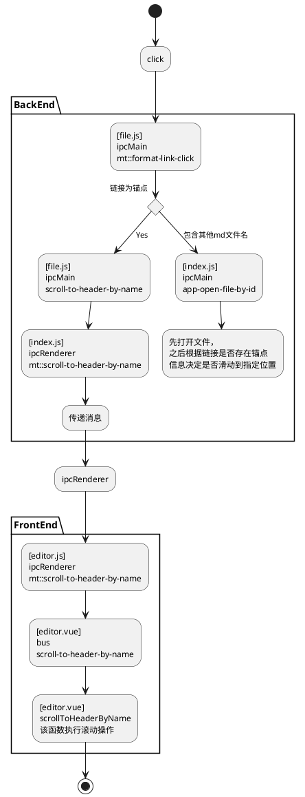

## 基本架构

### 文件结构

基本的架构是类似网页的前后端分离架构，主要分为几个文件夹

* render  前端，依赖于electron的渲染进程API

* main  主进程，这些源文件需要依赖electron的主进程API

* muya  后端，且只使用了原生JS、BOM和DOM的API

* common  一些只依赖于nodejs的API，这个文件夹内的源码可以被除了muya外的其他文件夹内代码直接引用

### 程序入口点

* `src/main/index.js`  主进程的入口点，且每个实例都只运行一次。当应用被初始化后，就可以安全地访问所有环境变量和单例，且`App`被启动（在`src/main/app/index.js`）。在`App::init()`后可以正常使用程序

* `src/renderer/main.js`  每个编辑器窗口的入口程序，在这里加载运行库、初始化窗口并挂载Vue组件

### 一个实例

打开一个markdown文件的过程

* 点击 `File -> Open File`，打开一个选择文件的对话框，选定文件后发送 `app-open-file-by-id`（这段逻辑主要在`src/main/menu/actions/file.js`中的`openFile`函数），对应的响应函数在 `src/main/app/index.js`的`_listenForIpcMain`中被注册，并调用 `_createEditorWindow` 或 `openTabsFromPaths` 创建窗口

* `openTabsFromPaths` 定义在 `src/main/windows/editor.js`中，它会调用相关函数加载markdown（`loadMarkdownFile`），并调用`_doOpenTab`

* `_doOpenTab` 通过ipcMain发出 `watcher-watch-file` 事件，会在watcher中注册对该文件的监控。此后向browserWindow发送`mt::open-new-tab`事件

* `src/renderer/store/editor.js` 文件中的函数 `LISTEN_FOR_NEW_TAB`（该函数在`src/renderer/pages/app.vue`中被dispatch） 定义了对 `mt::open-new-tab` 事件的响应函数，其根据当前是否已打开文件调用 `NEW_TAB_WITH_CONTENT` 或 `NEW_UNTITLED_TAB` 函数（这里也是使用dispatch）

* 以上两个函数最终都会触发 `UPDATE_CURRENT_FILE` action，该action会发出 `file-changed` 事件

* muya组件和source code editor组件都监听这一事件以此做出对应的解析渲染等操作

## 启动

两个进程 

### Main Process

* 入口点为 `src/main/index.js`，做一些命令行和环境变量的初始化后创建一个App类的实例，并调用init函数

* App类在 `src/main/app/index.js` 中定义，init函数中注册一系列electron事件。该类事件列表可以见 https://www.electronjs.org/zh/docs/latest/api/app 这里需要关注的应该是ready事件。该消息会在electron初始化后发出一次

* ready的末尾根据是否传入需要打开的文件，调用`_openFilesToOpen`（该函数先解析文件列表后也会调用后者）或`_createEditorWindow`

* `_createEditorWindow` 创建一个editor窗口，该组件在`src/main/windows/editor.js`被定义

## 事件的注册与传递

见 https://github.com/marktext/marktext/blob/develop/docs/dev/code/IPC.md

主要有两类

### IPC

main process与renderer process间的通信，分别对应 `ipcMain` 和 `ipcRenderer`

marktext还把事件类型分为两类

- 带`mt::`前缀，用于跨进程的IPC

- 不带前缀，直接传给本进程，用于不带event参数的事件

示例可见上述网页

### event

#### app.on

该方式主要是在electron主类中注册electron事件响应函数的方式

#### bus.on

a

## 各文件的主要功能

#### index.ejs

主页面的html文件

重点就是

```html
<div id="app"></div>
```

该元素即vue app的挂载点，在 [renderer/main.js](#main.js) 中被挂载

### main

#### index.js

main process的入口点，主要是做一些命令行和环境变量的初始化后创建一个 `App` 类的实例

#### app/index.js

定义了主类 `App` 并注册了一系列electron响应函数和ipc响应函数，主要是关于初始化、打开文件、打开设置、keybinding等

### renderer

#### main.js

创建Vue实例，包含Vue组件并mount到`#app`

## 功能

### 按键消息的传递

这里通过两个PR来推断

#### PR1

https://github.com/marktext/marktext/pull/3136/files

该PR是用来实现页内链接跳转的，按住ctrl点击链接或点击链接图标实现

##### 前端

大体流程是前端监听ipc，若收到消息则传到消息总线bus，再调用注册在消息总线上的对应回调

###### renderer/pages/app.vue

该文件主要做上层的处理，调用组件中注册监听函数处理main process传来的ipc消息

* 通过 `dispatch('LISTEN_SCROLL_TO_HEADER')` 调用 `EditorWithTabs` 组件的 `LISTEN_SCROLL_TO_HEADER` 函数注册监听

###### renderer/store/editor.js

该文件的 `LISTEN_SCROLL_TO_HEADER` 函数主要做消息分发，为ipc发来的消息（`ipcRenderer`变量）注册回调，直接调用

```
bus.$emit('scroll-to-header-by-name', slug)
```

来发送 `scroll-to-header-by-name` 消息

###### renderer/components/editorWithTabs/editor.vue

该文件中的相关内容主要定义了按键的监听和回调函数

* 事件注册： 在`created`中通过`bus.on`监听了 `scroll-to-header-by-name` 消息，回调设置为 `scrollToHeaderByName` 函数

* 事件注销： 在`beforeDestroy`中通过`bus.off`取消了对该消息的监听

* 事件回调： 主要逻辑是获取当前点击的标签名，并比较当前文件中的所有锚点，若有匹配的则调用 `scrollToHeader` 滚动到对应header

##### 后端

###### main/app/index.js

这里主要是注册和修改了ipcMain中对于两个消息的回调

* `scroll-to-header-by-name`  用于滚动到header处的功能：若接收到该消息则发送 `mt::scroll-to-header-by-name` 消息

* `app-open-file-by-id`  用于通过标签链接打开本地文件的功能。代码本身有从链接打开文件的功能，这里加上的逻辑是打开文件后滚动到对应的标签，一样是通过发送 `mt::scroll-to-header-by-name` 消息

###### main/menu/actions/file.js

主要修改了监听函数

* `mt::format-link-click`  该函数用于解析链接，这里加入了对链接是否是本地链接的解析。此后发送 `scroll-to-header-by-name` 消息



#### PR2

https://github.com/marktext/marktext/pull/3128

该PR是用于修复一个bug的。原本的代码中当输入时会跳回到光标处，这应是一个feature，但当按下某些控制键，如ctrl pageup等都会触发，因此该PR进行了修复

###### muya/lib/config/index.js

这里的改动主要是将

```
'Escape',
'Control',
'Alt',
'Shift',
'PageUp',
'PageDown'
```

这几个键注册为EVENT_KEYS

###### muya/lib/eventHandler/keyboard.js

`dispatchEditorState` 函数中通过attachDOMEvent注册了 click 和 keyup 事件的回调

回调中调用的selectionChange函数会分发一个事件 `dispatchSelectionChange` ，在editor.vue中被响应，后者会使页面滚动到光标处
