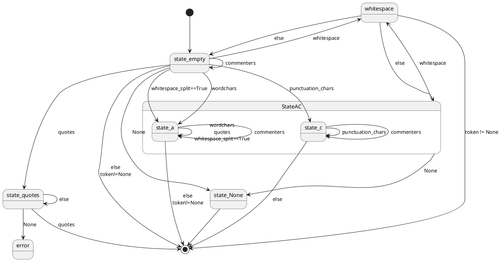
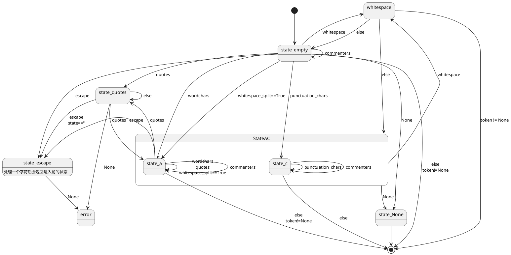

## 类

### shlex

#### 方法

##### 初始化

```python
def __init__(self, instream=None, infile=None, posix=False,
             punctuation_chars=False)
```

* 参数
  
  * instream  若为字符串，则定义为 StringIO类，若为None则直接使用stdin，否则直接赋值给instream属性，且将infile赋值给infile属性（infile属性只有在这种情况下使用）
  
  * posix  是否使用posix字符
  
  * punctuation_chars  自定义标点，若为False则为`''`，若为True则为`();<>|&`，否则使用传入的参数

* 其他初始化
  
  * 定义wordchars为大小写字母数字和下划线，若定义了posix增加一些特殊字符
  
  * 若punctuation_chars不为空
    
    * 查找wordchars中与punctuation_chars重复的内容，若存在则删除
    
    * 定义 `_pushback_chars` 为deque

* 一些重要属性
  
  * infile  当前读取的文件
  
  * instream  当前读取的流
  
  * lineno  当前读取的行号
  
  * pushback 定义为deque，用来存放
  - filestack 定义为deque，用于存放不同输入流和文件的状态
  
  - source  默认为None，该参数类似shell中的source关键字，若不是None则当解析到与source内容相同的词法单元时，会将下一给token作为文件名打开，作为输入流，直到eof恢复原来的输入流

* 预定义的一些特殊字符
  
  * commenters  注释符
  
  * whitespace  空白符
  
  * quote  引号
  
  * escape  转义符
  
  * escapedquotes  转义引号

* 状态变量
  
  * state
    
    * None  表示读取到文件末尾
    
    * `' '`  表示当前正在读入token的第一个字节，此前token为空
    
    * `'a'`  用于处理正常的输入（wordchars）
    
    * `'c'` 用于处理标点
    
    * 引号（quote）用于处理引号的匹配
    
    * 转义符（escape）转义状态，当遇到转义符时进入，只有定义了posix时才存在
  
  * escapestate  一个用于暂存状态的变量，暂存进入转义前的状态，以便转义后恢复
  
  * whitespace_split  若为True则只根据空白符拆分词法单元，原理就是让状态机不进入标点（punctuation_chars）的判断

* 暂存区  用于暂存已取出但需要留到下一轮解析的字符或token
  
  * `pushback`  暂存token，直接作为下一轮循环的token。可以由 [push_token](#push_token) 手动压入 。在 [read_token](#read_token) 只在 `'a'` 状态中，遇到未定义字符，或 `punctuation_chars` 为False时遇到标点时使用，此时直接将这些不在表中的字符作为一个token输出
  
  * `_pushback_chars`  暂存字符，作为下一轮循环的nextchar，主要用在几个场景中
    
    * `'a'` 状态中遇到标点
    
    * `'c'` 状态中遇到非标点/注释/空白符

##### push_source

```python
def push_source(self, newstream, newfile=None)
```

* 若newstream为str，则初始化为一个StringIO类

* 向filestack队列中压入原本读取的状态，包括 `infile` `instream`和`lineno`

* 令`infile` `instream`为传入的参数，`lineno`置为1

##### pop_source

```python
def pop_source(self)
```

* 关闭当前读取的流 `instream`

* 将 `filestack` 队列中保存的状态弹出

* 设置 `state` 为 `' '`

##### source_hook

临时加入一个source file，返回其绝对路径和句柄

```python
def sourcehook(self, newfile)
```

* 若newfile不是绝对地址，则使用 `self.infile` 的目录作为相对路径打开newfile

* 返回newfile绝对路径和句柄

##### push_token

```python
def push_token(self, tok)
```

* 向 `pushback` 队列中压入一个token

##### get_token

```python
def get_token(self)
```

* 若 `pushback` 队列非空，则从中取出一个token并**返回**

* 调用 [read_token](#read_token) 读入一个token

* 这里是一个循环。若token与 `source` 属性的内容相同，说明正在解析的文件中引用了source的文件。这里使用循环应该是为了处理嵌套source的情况
  
  * 调用 [source_hook](#source_hook) 打开对应文件作为新的输入流
  
  * 若打开成功调用 [push_source](#push_source) 将新的输入流压入 `file_stack`
  
  * 递归调用 [get_token](#get_token) ，直到新文件读取结束

* 这里也是一个循环，若token为文件末尾。这里使用循环应该是为了处理从多个嵌套的文件退出的情况
  
  * 若 `filestack` 为空
    
    * **返回eof**
  
  * 否则
    
    * 调用 [pop_source](#pop_source) 将当前读入的文件关闭，解析栈上的上一个文件
    
    * 递归调用 [get_token](#get_token)

* 返回获得的token

##### read_token

读取一个token

```python
def read_token(self)
```

* 主要是一个状态机循环
  
  * 读取下一字节nextchar
    
    * 若punctuation_chars不为空且_pushback_chars不为空
      
      * `nextchar = _pushback_chars.pop()`
    
    * 否则nextchar为instream读取1字节
  
  * 处理nextchar
    
    * 若为 '\n' 换行
      
      * `lineno+=1`
    
    * 判断 `self.state`
      
      * 若为None，说明到达文件末尾
        
        * `token = ''`
        
        * **跳出循环**
      
      * 若state为 `' '`
        
        * 若没有nextchar，说明到达文件末尾
          
          * **跳出循环**
        
        * 若nextchar为空白符
          
          * 若当前token非空，或定义了posix且`quoted`为True
            
            * **跳出循环**
          
          * 否则continue，继续下一轮循环
        
        * 若nextchar为注释符
          
          * 读取下一行内容，lineno加一
        
        * 若定义了posix，且nextchar为转义符
          
          * escapedstate置为`'a'`
          
          * state置为转义符
        
        * 若nextchar为正常输入字符（wordchars）
          
          * `token = nextchar`
          
          * state置为`'a'`
        
        * 若nextchar为标点（punctuation_chars）
          
          * `token = nextchar`
          
          * state置为`'c'`
        
        * 若nextchar为引号
          
          * 若未定义posix
            
            * `token = nextchar`
          
          * state置为引号
        
        * 若whitespace_split为True
          
          * `token = nextchar`
          
          * state置为`'a'`
        
        * 其他情况
          
          * `token = nextchar`
          
          * 若当前token非空，或定义了posix且`quoted`为True（这里好像token必非空，因为前面判断了nextchar不可能为空）
            
            * **跳出循环**
          - 否则continue，继续下一轮循环
      
      * 若state为引号（`quote`）
        
        * 变量 `quoted` 置为True
        
        * 此时若没有nextchar，则**报错**，因为此时正在匹配引号但文件已读到末尾
        
        * nextchar与state相同，即匹配了引号
          
          * 若没有定义posix
            
            * `token += nextchar`
            
            * state置为 `' '`
            
            * **跳出循环**
          
          * 若定义了posix
            
            * state置为 `'a'`
        
        * 若定义了posix，且nextchar为转义符，且state为`"`
          
          * `escapedstate = state` 暂存当前状态，跳到转义处理逻辑
          
          * state置为转义符
        
        * 其他情况
          
          * `token += nextchar`
      
      * 若state为转义符（`escape`）
        
        * 若nextchar为空，报错
        * 若escapestate为引号，且nextchar不为转义符，且nextchar与escapestate不等
          * `token += state`
        * `token += nextchar`
        * 将state置为`escapedstate`，恢复进入转义前的状态
      
      * 若state为`'a'`或`'c'`
        
        * 若nextchar为空，**跳出循环**
        
        * 若nextchar为空白符
          
          * state置为 `' '`
          - 若当前token非空，或定义了posix且`quoted`为True
            
            - **跳出循环**
          
          - 否则continue，继续下一轮循环
        
        * 若nextchar为注释符
          
          - 读取下一行内容，lineno加一
          - 若定义了posix
            * state置为 `' '`
            - 若当前token非空，或定义了posix且`quoted`为True
              - **跳出循环**
            - 否则continue，继续下一轮循环
        
        * 若state为`'c'`
          
          * 若nextchar为标点，`token += nextchar`
          * 否则
            * 若nextchar不为空白符，将nextchar压入`_pushback_chars` ，留给下一轮循环处理
            * state置为 `' '`
            * **跳出循环**
        
        * 若定义了posix，且nextchar为引号
          
          * `state = nextchar`
        
        * 若定义了posix，且nextchar为转义符
          
          * `escapedstate = 'a'` 暂存转义前的状态（即当前状态）
          * 将state置为转义符
        
        * 若nextchar为wordchars，或nextchar为引号，或whitespace_split为True
          
          * `token += nextchar`
        
        * 其他情况，这里实际上只剩下punctuation_chars或不在定义中的字符了
          
          * 若定义了`punctuation_chars`
            * nextchar压入 `_pushback_chars` ，留给下一轮循环处理
          * 否则nextchar压入 `pushback` ，直接作为下一个token
            * 若当前token非空，或定义了posix且`quoted`为True
              - **跳出循环**
            - 否则continue，继续下一轮循环

下列状态转移图表示了**posix为False**时的状态转移



下列状态转移图展示了posix为True的状态转移



###### 一些解释

在代码的退出循环的逻辑中，出现过很多次类似下述的逻辑

```python
if self.token or (self.posix and quoted):
    break   # emit current token
else:
    continue
```

在上面的代码解释中，解释为

- 若当前token非空，或定义了posix且`quoted`为True
  - **跳出循环**
- 否则continue，继续下一轮循环

第一个token非空的判断较好理解，而第二个判断是因为在posix中，`''` 或 `""` 也算一个词法单元

#### 特殊方法

##### 迭代器

* 调用 [get_token](#get_token)

* 若为eof，则抛出 StopIteration，否则返回token

## 函数

##### quote

用于发现一些不安全的参数，比如可能拼接执行的参数，为其加上`''`，且替换其中的单引号 `'` 为 `'"'"'`

比如，输入为 `$'b` 则会被转换为 `'$'"'"'b'` ，即 `'$' + "'" + 'b'`

```python
def quote(s)
```

* 过滤不安全参数的正则为 `[^\w@%+=:,./-]` ，即所有不是 `\w @ % + = : , . / -` 的字符

* 若输入为空，则返回 `''`

* 若正则匹配不到，则返回原字符串

* 否则将 `'` 替换为 `'"'"'`

##### split

```python
def split(s, comments=False, posix=True)
```

* 参数
  
  * s  待解析的字符串
  
  * comments  是否定义注释符
  
  * posix  是否定义posix

* 初始化一个 [shlex](#shlex) 类

* 将类的 `whitespace_split` 参数置为True

* 若 `comments` 参数为False，则将shlex的 `comments` 参数清空

* 返回token的list
